---
tags:
  - numerique/introduction
  - technologie/impact-societal
  - securite/donnees
  - environnements-numeriques
  - internet/web
  - services-numeriques
  - economie-numerique
aliases:
  - "Introduction au Monde Numérique et ses Défis"
  - "01-01 | Introduction au Monde Numérique et ses Défis"
archetype: cour
module: "IIC (Introduction à l'informatique et cybersécurité)"
cssclasses:
  - max
---

# 01-01 | Introduction au Monde Numérique et ses Défis

> [!goal] Objectifs Pédagogiques
> À la fin de cette fiche, je dois être capable de :
> 1. Comprendre les avantages et les inconvénients de la [[DigitalTechnology|technologie numérique]].
> 2. Identifier les principaux [[DigitalEnvironmentsEssentials|environnements numériques essentiels]].
> 3. Classer les **services en ligne** en fonction de leur type et de leurs **modèles économiques**.

## 📝 Synthèse du Cours

La technologie numérique a profondément transformé notre quotidien, nous connectant à travers les continents, offrant un accès instantané aux informations et stimulant l'innovation et la créativité. Des exemples concrets incluent la technologie *GPS* pour la navigation, la communication visuelle pour les familles éloignées, et la gestion simplifiée des finances en ligne.

### 1. Les Deux Faces de la Technologie Numérique

Malgré ses avantages indéniables, le [[WorldWideWeb|monde numérique]] présente également des défis importants qui nécessitent une attention particulière.

*   **Impact sur la Santé** : Un *temps d'écran excessif* est associé à des répercussions négatives sur la santé mentale et physique des individus. Il est crucial de trouver un équilibre pour un usage sain.
*   **Confidentialité et Sécurité des Données** : La [[Confidentiality|confidentialité]] et la [[DataSecurity|sécurité des données]] sont des préoccupations majeures. Toute information saisie en ligne peut potentiellement être utilisée de manière abusive, d'où l'importance de comprendre les risques et de se protéger.
*   **Le Fossé Numérique** : Ce terme désigne l'*inégalité d'accès* et d'utilisation des technologies numériques et de leurs avantages. Alors que certains bénéficient d'une connectivité et d'opportunités illimitées, d'autres en sont privés, créant des disparités sociales et économiques.

### 2. Environnements Numériques Essentiels

Avant de s'aventurer pleinement en ligne, il est essentiel de maîtriser les principaux environnements numériques qui constituent la base de notre interaction numérique.

*   **Les [[OperatingSystem|Systèmes d'Exploitation (OS)]]** : Des exemples comme *Windows* pour les ordinateurs personnels ou *Android* pour les smartphones sont la colonne vertébrale de nos appareils. Ils gèrent toutes les activités numériques et les logiciels, servant de fondation à l'environnement numérique.
*   **Les [[Browser|Navigateurs Web]]** : Des [[Application|applications]] telles que *Google Chrome*, *Safari* ou *Mozilla Firefox* sont notre porte d'entrée vers l'Internet. Toutes les interactions en ligne, de la lecture des actualités aux achats et communications sociales, passent par un navigateur web, qui nous mène directement aux sites web.
*   **Les Applications** : Outils spécialisés conçus pour des fonctions spécifiques. Anciennement appelées "programmes", leur désignation a évolué avec l'avènement des smartphones.
    *   **Avec équivalents concrets** : Elles remplacent des outils physiques (ex: *Evernote* ou *OneNote* pour la prise de notes numérique, *Photoshop* ou *Illustrator* pour l'art numérique).
    *   **Sans équivalents concrets** : Elles n'ont pas de contrepartie directe dans le monde réel (ex: applications de messagerie instantanée comme *WhatsApp*, *Signal* ou *Telegram* pour l'envoi de messages texte, vocaux, appels vidéo et partage de médias).

### 3. L'Évolution du Web et de la Connectivité Numérique

Le paysage du web a connu une transformation rapide, passant d'une simple ressource d'information à un écosystème interactif et interconnecté.

*   **Les Débuts du [[WorldWideWeb|World Wide Web]] (Années 1990)** : À son avènement, le Web était principalement *textuel* avec des débits de connexion lents. La navigation se faisait souvent par connexion à distance, et le chargement d'images était fastidieux.
*   **La Révolution Web 2.0** : Ce tournant a été marqué par l'augmentation des débits Internet et l'accent mis sur l'*interactivité*. Les sites web sont devenus *dynamiques*, capables de modifier leur contenu en fonction des interactions des utilisateurs. Des pionniers comme *Amazon* ont permis les achats en ligne, tandis que *YouTube* et *Facebook* ont introduit le partage de contenu vidéo et l'interaction sociale.
*   **L'[[InternetOfThings|Internet des Objets (IoT)]]** : L'*IoT* pousse la connectivité numérique encore plus loin en intégrant des objets du quotidien à Internet pour collecter et échanger des données. Cela inclut les thermostats intelligents ou les caméras de sécurité connectées, rendant l'interaction entre les mondes analogique et numérique de plus en plus fluide.

### 4. La Transformation des Services Traditionnels

La technologie numérique a radicalement modifié la manière dont nous accédons et utilisons les services qui étaient auparavant limités par des contraintes physiques.

*   **Services Bancaires en Ligne** : La gestion des comptes bancaires, le paiement des factures et les transferts d'argent peuvent désormais être accomplis via smartphone ou ordinateur, offrant une grande *commodité* et *flexibilité* par rapport aux visites physiques en agence.
*   **Plateformes Éducatives** : L'éducation, qui exigeait historiquement une présence physique, a également été transformée. Les plateformes pédagogiques en ligne permettent désormais aux étudiants d'assister à des cours, de participer à des discussions et de soumettre des travaux à distance, étendant l'accès à l'éducation au-delà des contraintes géographiques.

### 5. Les Services en Ligne : Types et Catégories

Les services en ligne peuvent être classés en trois types principaux, chacun répondant à des besoins distincts.

*   **[[ServicesPublics|Services Publics]]** : Comprennent les sites web gouvernementaux et les plateformes éducatives publiques. Ils offrent l'accès à des services administratifs (déclarations de revenus, demandes de passeport) et à des informations de santé publique. Beaucoup sont *gratuits*, mais nécessitent souvent la création d'un compte.
*   **[[PrivateServices|Services Privés]]** : Cette catégorie englobe les plateformes d'e-commerce (ex: *Amazon* ou *eBay* pour l'achat de produits), les services bancaires en ligne, et les services d'abonnement (ex: *Netflix* pour le streaming, *Adobe Creative Cloud* pour les logiciels), qui, moyennant un paiement, offrent l'accès à des divertissements ou des outils de travail.
*   **[[CommunityServices|Services Communautaires]]** : Incluent les [[SocialNetworks|réseaux sociaux]] (ex: *Facebook* ou *TikTok*) qui facilitent les échanges sociaux et le partage d'informations, et les [[InformationReferenceFrameworks|référentiels d'informations]] collaboratifs (ex: *Wikipédia*, *Projet Gutenberg*) où les utilisateurs créent et modifient du contenu ensemble.

### 6. Modèles Économiques des Services en Ligne

Les modèles économiques des services en ligne varient en fonction de leur nature et de leurs objectifs.

*   Référentiels d'Informations : Généralement *gratuits*, ils dépendent souvent des *dons* pour fonctionner et maintenir leurs ressources.
*   Réseaux Sociaux : Génèrent des revenus principalement via la *publicité ciblée* insérée dans le contenu. Certains proposent également des abonnements payants pour une expérience sans publicités.

En conclusion, les plateformes en ligne offrent une multitude d'options, gratuites ou payantes. Quelle que soit votre utilisation, il est primordial de vous familiariser avec leur fonctionnement pour garantir une expérience numérique agréable et surtout [[Cybersecurity|sécurisée]]. La *sensibilisation des utilisateurs* est une clé essentielle pour naviguer dans ce monde en constante évolution.

## 🧠 Carte Mentale / Schéma

```mermaid
graph TD
    A["Monde Numérique & Ses Défis"]
    A --> B["Avantages du Numérique"]
    A --> C["Défis du Numérique"]
    A --> D["Environnements Numériques Essentiels"]
    A --> E["Évolution du Web & Connectivité"]
    A --> F["Types & Modèles de Services en Ligne"]

    B --> B1["Connectivité Mondiale"]
    B --> B2["Accès Info Instantané"]
    B --> B3["Innovation & Créativité"]

    C --> C1["Impact Santé"]
    C --> C2["Confidentialité & Sécurité Données"]
    C --> C3["Fossé Numérique"]

    D --> D1["Systèmes d'Exploitation (OS)"]
    D --> D2["Navigateurs Web"]
    D --> D3["Applications"]

    E --> E1["Web 1.0 (Textuel, Lent)"]
    E --> E2["Web 2.0 (Interactivité, Dynamisme)"]
    E --> E3["Internet des Objets (IoT)"]

    F --> F1["Catégories de Services"]
    F --> F2["Modèles Économiques"]

    F1 --> F1a["Services Publics"]
    F1 --> F1b["Services Privés"]
    F1 --> F1c["Services Communautaires"]

    F2 --> F2a["Dons (Info)"]
    F2 --> F2b["Publicité (Réseaux Sociaux)"]
    F2 --> F2c["Abonnements (Streaming, Logiciels)"]
    F2 --> F2d["E-commerce (Achats)"]
```

## ❓ Quiz de Révision (Active Recall)
> [!question] Question 1
> Quels sont les trois principaux défis associés à l'utilisation de la technologie numérique mentionnés dans ce cours ?
> > [!success]- Réponse
> > Les trois principaux défis sont : l'*impact sur la santé* (notamment le temps d'écran excessif), les préoccupations concernant la confidentialité et la sécurité des données, et le *fossé numérique* (l'inégalité d'accès aux technologies).

> [!question] Question 2
> Citez deux types d'applications et donnez un exemple pour chacun, en expliquant leur différence.
> > [!success]- Réponse
> > 1.  **Applications avec équivalents concrets** : Elles remplacent des outils physiques (ex: *OneNote* ou *Evernote* qui remplacent le papier et le crayon pour la prise de notes).
> > 2.  **Applications sans équivalents concrets** : Elles n'ont pas de contrepartie directe dans le monde réel (ex: *WhatsApp*, *Signal* ou *Telegram* pour la messagerie instantanée et les appels vidéo, qui n'existaient pas sous cette forme auparavant).

> [!question] Question 3
> Comment la "Révolution Web 2.0" a-t-elle transformé l'expérience utilisateur par rapport aux débuts du World Wide Web ?
> > [!success]- Réponse
> > La Révolution Web 2.0 a marqué un tournant en mettant l'accent sur l'*interactivité*. Contrairement au Web 1.0, qui était principalement statique et textuel, le Web 2.0 a permis aux utilisateurs de contribuer au contenu, d'interagir dynamiquement avec les sites (ex: commentaires, partages) et de participer à des plateformes sociales.

## 🔗 Liens du Module
*   **Suivant** : [[IIC01-02_TechnologiesModernesEtConnectiviteInternet|01-02 | Technologies Modernes et Connectivité Internet]]
