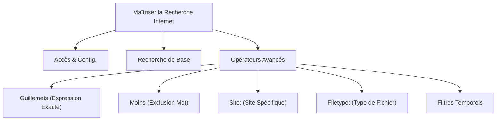

---
tags:
  - recherche/internet
  - moteur-de-recherche
  - operateurs-recherche
  - information/efficace
  - competences-numeriques
  - cours/iic
  - web/navigation
aliases:
  - Maîtriser la Recherche Sur Internet
  - 01-03 | Maîtriser la Recherche Sur Internet
archetype: cour
module: "IIC (Introduction à l'informatique et cybersécurité)"
cssclasses:
  - max
---

# 01-03 | Maîtriser la Recherche Sur Internet

> [!goal] Objectifs Pédagogiques
> À la fin de cette fiche, je dois être capable de :
> 1. Expliquer le fonctionnement de base et la configuration d'un moteur de recherche.
> 2. Appliquer les opérateurs de recherche avancée pour affiner mes requêtes.
> 3. Utiliser les filtres de recherche pour localiser précisément l'information souhaitée sur Internet.

## 📝 Synthèse du Cours

Chaque jour, des millions de recherches sont effectuées sur [[WorldWideWeb|Internet]]. Savoir formuler une requête efficacement est crucial pour trouver l'information pertinente sans être submergé. Cette leçon détaille les méthodes pour maîtriser la recherche sur Internet, des bases aux techniques avancées.

### 1. Accès et Configuration d'un Moteur de Recherche

Un **moteur de recherche** est une [[Application|application]] web qui permet aux utilisateurs de trouver des informations sur le [[WorldWideWeb]]. Il indexe des milliards de pages web et les classe en fonction de la pertinence de la requête.

Pour y accéder :
*   Ouvrez votre [[Browser|navigateur web]].
*   Si le moteur de recherche par défaut n'est pas affiché, saisissez son adresse (ex: `google.com`, `bing.com`) dans la barre d'adresse.

Vous pouvez modifier le moteur de recherche par défaut de votre navigateur pour optimiser votre expérience. Cette option se trouve généralement dans les *Paramètres* du navigateur, sous la section *Moteur de recherche*.

> [!note] Définition Clé
> **Moteur de recherche** : Un système logiciel conçu pour effectuer des recherches sur Internet, indexant des informations et fournissant des résultats pertinents à l'utilisateur.

### 2. Effectuer une Recherche de Base

Une fois sur la page du moteur de recherche :
*   Saisissez votre requête (mots-clés ou phrase) dans la barre de recherche.
*   Appuyez sur `Entrée` ou cliquez sur le bouton de recherche.

Le moteur de recherche affichera une *page de résultats* (SERP - Search Engine Results Page) listant des sites web qu'il juge pertinents. Ces résultats peuvent inclure des liens vers des pages web, mais aussi des images, des vidéos ou des résultats d'achat, selon la nature de votre recherche.

*Exemple de requête de base* : `best hard hat 2024`

### 3. Opérateurs de Recherche Avancée

Les opérateurs de recherche sont des caractères ou des mots spéciaux qui affinent vos requêtes et aident à trouver des informations très spécifiques.

#### 3.1. Recherche d'Expression Exacte (Guillemets `""`)

Placer une requête entre guillemets doubles `""` force le moteur de recherche à ne retourner que les pages contenant l'expression exacte, dans l'ordre spécifié. Cela est très utile pour des citations, des noms propres ou des titres.

*Exemple* : `"best red hard hat"`

#### 3.2. Exclusion de Mots Clés (Signe Moins `-`)

En plaçant un signe moins `-` juste devant un mot, vous indiquez au moteur de recherche d'exclure de ses résultats toutes les pages contenant ce mot. C'est parfait pour éliminer les informations non pertinentes ou ambiguës.

*Exemple* : `best -red hard hat 2024` (recherche de "best hard hat 2024" mais sans le mot "red")

#### 3.3. Recherche sur un Site Spécifique (`site:`)

L'opérateur `site:` permet de restreindre la recherche à un domaine ou un sous-domaine particulier. C'est inestimable pour trouver des informations sur un site de confiance ou pour la recherche universitaire.

*Syntaxe* : `site:[nom_du_site] [votre_requête]`

*Exemple* : `site:dursafety.com best red hard hat 2024`

#### 3.4. Recherche par Type de Fichier (`filetype:`)

L'opérateur `filetype:` permet de rechercher des fichiers d'un type spécifique (ex: PDF, PPT, DOC, XLS). Il est idéal pour trouver des documents téléchargeables, des présentations ou des rapports.

*Syntaxe* : `filetype:[extension_du_fichier] [votre_requête]`

*Exemple* : `filetype:pdf best hard hat 2024`

#### 3.5. Filtrage par Période

La plupart des moteurs de recherche permettent de filtrer les résultats par période (dernière heure, 24h, semaine, mois, année ou intervalle personnalisé). Cette fonction est accessible via le bouton *Outils* ou *Outils de recherche* généralement situé sous la barre de recherche après avoir effectué une première requête.

> [!note] Définition Clé
> **Opérateur de recherche** : Un mot-clé ou un symbole spécial utilisé dans une requête de moteur de recherche pour affiner et cibler les résultats.

## 🧠 Carte Mentale / Schéma

## ❓ Quiz de Révision (Active Recall)
> [!question] Question 1
> Quel opérateur de recherche utiliseriez-vous pour trouver des pages qui contiennent *exactement* la phrase "sécurité des données personnelles" ?
> > [!success]- Réponse
> > Il faut utiliser les guillemets doubles : `"sécurité des données personnelles"`.

> [!question] Question 2
> Vous recherchez des informations sur les "meilleures pratiques de cybersécurité" mais vous voulez exclure tout résultat lié à "Windows". Comment formuleriez-vous votre requête ?
> > [!success]- Réponse
> > `meilleures pratiques de cybersécurité -Windows`.

> [!question] Question 3
> Comment trouveriez-vous un document PDF traitant de "protocoles réseau" sur le site de l'ANSSI (`anssi.gouv.fr`) ?
> > [!success]- Réponse
> > `filetype:pdf site:anssi.gouv.fr "protocoles réseau"`.

## 🔗 Liens du Module
*   **Précédent** : [[IIC01-02_TechnologiesModernesEtConnectiviteInternet|01-02 | Technologies Modernes et Connectivité Internet]]
*   **Suivant** : [[IIC01-04_ComprendreLesLiensEtLesCookiesSurLeWeb|01-04 | Comprendre Les Liens et les Cookies sur le Web]]
*   **Ressource Externe** : [Google Search Operators Guide](https://support.google.com/websearch/answer/134479?hl=en)