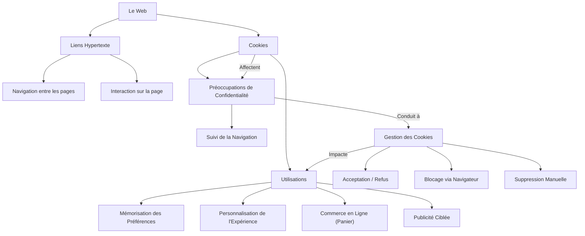

---
tags:
  - web/navigation
  - web/liens
  - donnees/cookies
  - confidentialite/vie-privee
  - gestion/cookies
  - publicite/ciblage
  - internet/fondamentaux
aliases:
  - Comprendre Les Liens et les Cookies sur le Web
  - 01-04 | Comprendre Les Liens et les Cookies sur le Web
archetype: cour
module: "IIC (Introduction à l'informatique et cybersécurité)"
cssclasses:
  - max
---

# 01-04 | Comprendre Les Liens et les Cookies sur le Web

> [!goal] Objectifs Pédagogiques
> À la fin de cette fiche, je dois être capable de :
> 1. Comprendre le fonctionnement des *[[Hyperlink|liens hypertexte]]* et leur rôle dans la navigation [[WorldWideWeb|Web]].
> 2. Expliquer ce que sont les *[[Cookies|cookies]]*, leurs diverses utilisations et leurs implications pour la [[Confidentiality|confidentialité]] en ligne.
> 3. Connaître les moyens de gérer et contrôler mes préférences en matière de *cookies*.

## 📝 Synthèse du Cours

Cette leçon introduit des concepts fondamentaux pour la navigation sur le Web et la gestion des données personnelles.

### 1. Les Liens Hypertexte

Les liens, souvent appelés liens hypertexte ou hyperliens, sont des éléments interactifs essentiels du Web. Ils permettent de naviguer entre différentes ressources en ligne.

*   **Apparence** : Souvent du texte souligné et coloré (historiquement bleu), ou tout autre élément stylisé pour indiquer son interactivité.
*   **Comportement** : Lorsque le pointeur de la souris survole un lien, il se transforme généralement en une main, signalant qu'il est cliquable.
*   **Fonctionnalité** : Un clic sur un lien peut :
    *   Déclencher une action sur la page (ouvrir un menu déroulant, afficher une image ou une vidéo).
    *   Recharger une autre page du même site Web.
    *   Rediriger vers un autre site Web entièrement.
*   **Navigation** : Les [[Browser|navigateurs Web]] disposent de boutons "Précédent" et "Suivant" pour faciliter la navigation entre les pages visitées. Le bouton "Précédent" permet de revenir à la page précédemment consultée.

> [!note] Définition Clé
> Un **Lien Hypertexte** : Un élément cliquable sur une page web qui, lorsqu'activé, redirige l'utilisateur vers une autre ressource (page web, fichier, ancre sur la même page, etc.).

### 2. Les Cookies

Les cookies sont de petits fichiers de données qu'un site Web envoie à votre [[ComputerPeripheral|terminal]] (ordinateur, smartphone, tablette) lorsque vous le visitez. Ils agissent comme des "notes" pour que le site Web puisse se souvenir de vous et de vos préférences lors de visites ultérieures.

#### 2.1. Importance et Utilisations des Cookies

Les cookies remplissent plusieurs fonctions cruciales :

*   **Mémorisation des préférences** : Ils enregistrent vos choix (langue, thème, état de connexion) afin que vous n'ayez pas à les ressaisir à chaque visite.
*   **Personnalisation de l'expérience** : Ils aident les sites à comprendre votre comportement de navigation pour vous suggérer du contenu pertinent.
*   **Commerce en ligne** : Ils sont indispensables pour conserver les articles dans votre *panier d'achat* lorsque vous naviguez sur une boutique en ligne. Sans eux, le panier serait vide à chaque changement de page.
*   **Publicité ciblée** : Les annonceurs utilisent les cookies pour suivre votre navigation et vous proposer des annonces personnalisées et potentiellement plus pertinentes.

> [!example] Exemple de Mémorisation des Préférences
> Si vous vous connectez à un site et cochez "Se souvenir de moi", un cookie est souvent utilisé pour maintenir votre session active et vous éviter de vous reconnecter lors de votre prochaine visite.

#### 2.2. Préoccupations en Matière de Confidentialité

Bien que très utiles, les cookies soulèvent des questions de confidentialité car ils peuvent suivre une grande partie de vos activités en ligne. Le suivi par des tiers (comme les agences de publicité) est une source majeure de préoccupation pour de nombreux utilisateurs.

#### 2.3. Contrôle des Cookies

Les [[Regulations|réglementations]] (comme le [[GeneralDataProtectionRegulation|RGPD]]) et les fonctionnalités des navigateurs modernes donnent aux utilisateurs un meilleur contrôle sur les cookies :

*   **Préférences lors de la première visite** : De nombreux sites vous demandent de définir vos préférences en matière de cookies lors de votre première visite.
*   **Blocage et suppression** : Vous pouvez bloquer ou supprimer les cookies via les paramètres de votre navigateur.
*   **Lecture des politiques de cookies** : Il est recommandé de lire la politique de cookies d'un site pour comprendre comment vos informations seront utilisées.
*   **Refus des cookies** : Vous avez souvent la possibilité de refuser les cookies. Cependant, certains sites peuvent limiter l'accès à leur contenu si vous n'acceptez pas certains types de cookies. La décision d'accepter ou de refuser dépend alors de l'importance que vous accordez à la consultation du site.

## 🧠 Carte Mentale / Schéma

## ❓ Quiz de Révision (Active Recall)
> [!question] Question 1
> Qu'est-ce qu'un lien hypertexte et quelle est sa fonction principale sur le Web ?
> > [!success]- Réponse
> > Un lien hypertexte est un élément cliquable (texte, image, etc.) sur une page web. Sa fonction principale est de permettre aux utilisateurs de naviguer d'une ressource (page, document, site) à une autre, ou de déclencher des actions spécifiques sur la page.

> [!question] Question 2
> Définissez ce qu'est un cookie et donnez deux exemples concrets de son utilité.
> > [!success]- Réponse
> > Un cookie est un petit fichier de données envoyé par un site web à votre terminal lors de votre visite. Il sert à ce que le site se souvienne de vous et de vos préférences.
> > 1.  **Mémorisation des préférences** : Garder en mémoire votre choix de langue ou votre état de connexion.
> > 2.  **Commerce en ligne** : Conserver les articles que vous avez ajoutés à votre panier d'achat.

> [!question] Question 3
> Pourquoi les cookies peuvent-ils soulever des préoccupations en matière de confidentialité ?
> > [!success]- Réponse
> > Les cookies peuvent soulever des préoccupations de confidentialité car ils sont utilisés pour suivre les activités de navigation des utilisateurs sur différents sites web. Ce suivi peut être utilisé par des annonceurs pour créer des profils détaillés et afficher de la publicité ciblée, ce qui est perçu par beaucoup comme une intrusion dans leur vie privée.

> [!question] Question 4
> Comment un utilisateur peut-il prendre le contrôle de ses cookies sur le Web ?
> > [!success]- Réponse
> > Un utilisateur peut contrôler ses cookies de plusieurs manières :
> > *   En choisissant ses préférences dans la bannière de consentement des cookies lors de sa première visite sur un site.
> > *   En utilisant les paramètres de son navigateur pour bloquer, supprimer ou gérer les cookies (autoriser uniquement les cookies nécessaires, par exemple).
> > *   En lisant les politiques de confidentialité et de cookies des sites web pour comprendre comment ses données sont utilisées.

## 🔗 Liens du Module
*   **Précédent** : [[IIC01-03_MaitriserLaRechercheSurInternet|01-03 | Maîtriser la Recherche Sur Internet]]
*   **Suivant** : [[IIC01-05_IntroALia|01-05 | Intro à l'ia]]
*   **Ressource Externe** : [CNIL - Cookies : outils pour les maîtriser](https://www.cnil.fr/fr/cookies-les-outils-pour-les-maitriser)