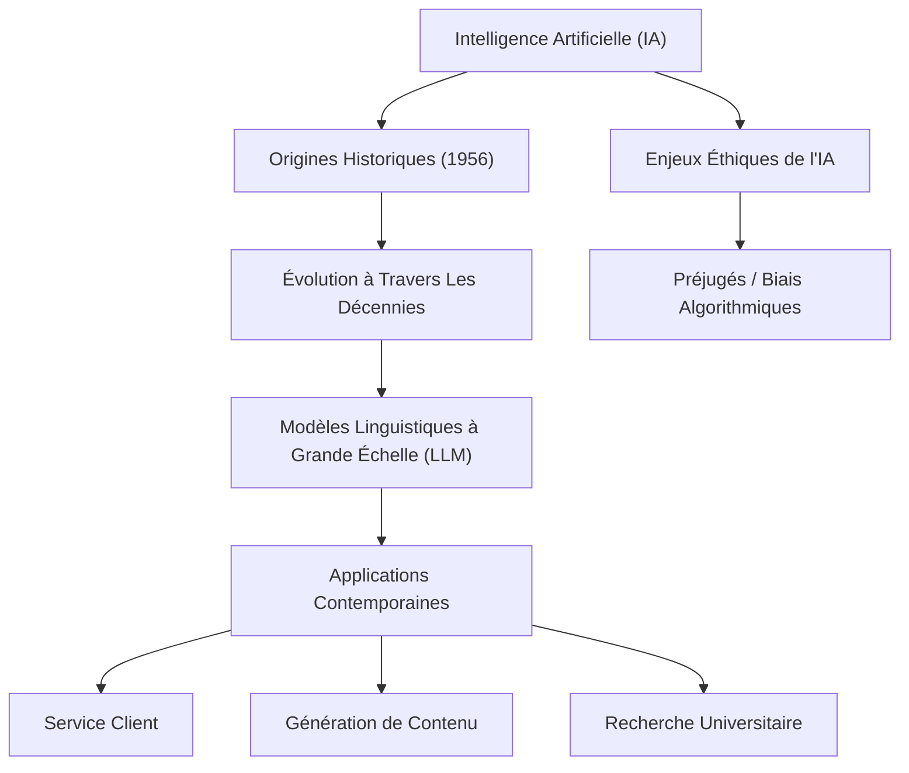

---
tags:
  - ia
  - intelligence-artificielle
  - llm
  - modele-langage
  - ethique/ia
  - histoire/ia
  - apprentissage-automatique
  - application/ia
aliases:
  - Intro à l'ia
  - "01-05 | Intro à l'ia"
archetype: cour
module: "IIC (Introduction à l'informatique et cybersécurité)"
cssclasses:
  - max
---

# 01-05 | Intro à l'ia

> [!goal] Objectifs Pédagogiques
> À la fin de cette fiche, je dois être capable de :
> 1. Définir l'[[ArtificialIntelligence|Intelligence Artificielle]] (IA) et comprendre ses capacités fondamentales.
> 2. Identifier les étapes clés de l'histoire de l'IA et son évolution.
> 3. Expliquer le concept des Modèles Linguistiques à Grande Échelle (LLM) et leurs applications.
> 4. Lister des exemples concrets d'applications contemporaines de l'IA.
> 5. Discuter des [[Ethics|enjeux éthiques]] liés au développement et à l'utilisation de l'IA.

## 📝 Synthèse du Cours

L'Intelligence Artificielle (IA) est passée du domaine de la science-fiction à une réalité omniprésente, intégrant notre quotidien via des services comme *ChatGPT* et *MidJourney*. Avant cette démocratisation, l'IA a trouvé des applications variées en science, robotique, médecine et transport. Comprendre l'IA implique d'explorer ses fondements, son histoire et ses implications.

### 1. Qu'est-ce Que l'Intelligence Artificielle ?

L'IA est une branche de l'[[DigitalTechnology|informatique]] qui se consacre à la création de machines et de [[Application|logiciels]] capables de reproduire des capacités cognitives humaines. Ces capacités incluent l'*apprentissage*, la *résolution de problèmes*, la *prise de décision* et la *perception*.

Tout comme les humains apprennent de leurs expériences, un système d'IA apprend et s'améliore à partir des [[DataSecurity|données]] qui lui sont fournies. Ce processus d'apprentissage permet aux systèmes d'IA de s'adapter et d'effectuer des tâches de manière autonome.

> [!note] Définition Clé
> **Intelligence Artificielle (IA)** : Domaine de l'informatique visant à créer des machines ou logiciels capables de simuler des capacités cognitives humaines telles que l'apprentissage, la résolution de problèmes, la reconnaissance de formes et la prise de décision.

### 2. Les Origines Historiques

L'idée de créer des êtres intelligents est un concept ancien, mais les avancées significatives ont eu lieu au 20ème siècle.

*   Les bases théoriques de l'IA ont été posées dans les années 1940 et 1950 avec des travaux sur les automates et la théorie de l'information.
*   Le terme "intelligence artificielle" a été officiellement introduit pour la première fois en **1956** lors d'un atelier d'été au *Dartmouth College*. Ce groupe de scientifiques explorait la possibilité que les machines puissent simuler tout aspect de l'apprentissage ou d'autres caractéristiques de l'intelligence.

### 3. L'Évolution à Travers Les Décennies

L'IA a connu plusieurs périodes de "printemps" et d'"hivers" depuis sa création, marquées par des avancées technologiques et des changements d'approche :

*   **Années 1970** : Développement des *systèmes experts*, des programmes basés sur des règles qui modélisaient le raisonnement de spécialistes humains dans des domaines spécifiques.
*   **Années 1980** : Émergence des *réseaux de neurones* et de l'apprentissage par connexions, inspirés par le fonctionnement du cerveau biologique.
*   **21e siècle** : Essor de l'*apprentissage automatique* (Machine Learning) et de l'*apprentissage profond* (Deep Learning), grâce à l'augmentation de la puissance de calcul et la disponibilité massive de données.

Aujourd'hui, l'IA est caractérisée par des algorithmes sophistiqués capables de tirer des enseignements de grandes quantités de données pour effectuer des tâches qui nécessitaient autrefois de l'intelligence humaine.

### 4. Les Modèles Linguistiques à Grande Échelle (LLM)

Au cours de la dernière décennie, les **Modèles Linguistiques à Grande Échelle (LLM)** représentent une avancée majeure dans le domaine de l'IA.

> [!note] Définition Clé
> **Modèle Linguistique à Grande Échelle (LLM)** : Système d'IA avancé, basé sur le *deep learning*, entraîné sur d'énormes quantités de données textuelles pour comprendre, générer, traduire et résumer du texte de manière fluide et contextuellement pertinente.

Les LLM sont capables d'effectuer une multitude de tâches complexes liées au langage :
*   **Traduction** : Traduction automatique de haute qualité entre différentes langues.
*   **Synthèse de texte** : Résumé automatique de documents longs ou de conversations.
*   **Réponse aux questions** : Analyse du contexte d'une question pour fournir des réponses précises et pertinentes.
*   **Reconnaissance des modèles** : Identification de structures complexes et de thèmes dans de grandes quantités de données textuelles.
*   **Classification du contenu** : Catégorisation automatique de textes selon des thèmes ou des sentiments.

### 5. Applications Contemporaines

Grâce à leur capacité à comprendre et à générer des réponses pertinentes sur le plan contextuel, les grands modèles linguistiques jouent un rôle de plus en plus essentiel dans diverses applications :

#### Service Client
*   **Chatbots intelligents** : Fournissent une assistance automatisée et des réponses personnalisées aux requêtes des utilisateurs.
*   **Support automatisé** : Gèrent les questions fréquentes, libérant les agents humains pour des problèmes plus complexes.

#### Génération De Contenu
*   **Création automatique de textes** : Rédaction d'articles, de résumés, de descriptions de produits, ou de scripts.
*   **Médias synthétiques** : Génération d'images, de vidéos ou de musiques à partir de descriptions textuelles.

#### Recherche Universitaire
*   **Analyse de données** : Traitement et interprétation de vastes corpus de textes scientifiques pour identifier des tendances et des corrélations.
*   **Découvertes scientifiques** : Accélération de la recherche en suggérant des hypothèses ou en synthétisant la littérature existante.

### 6. Les Enjeux Éthiques De l'IA

L'IA n'est intrinsèquement ni bonne ni mauvaise. Son impact dépend de sa conception, de son utilisation et des intentions de ses développeurs et utilisateurs. Bien que perçues comme neutres, les technologies sont façonnées par les visions du monde et les croyances de leurs créateurs.

> [!note] Problème éthique
> Des problèmes éthiques majeurs peuvent survenir lorsque des *préjugés humains* s'intègrent aux décisions automatisées ou s'infiltrent dans les jeux de données sur lesquels les systèmes d'IA sont entraînés.

Des facteurs tels que les choix de conception, les données d'entraînement et le contexte d'opération influencent les effets positifs ou négatifs d'un système d'IA sur la société. Les individus et les entreprises responsables de la création et du déploiement de l'IA, ainsi que les objectifs auxquels elle est destinée, jouent un rôle crucial dans la définition de son incidence éthique et sociale. Une attention particulière doit être portée à la *transparence*, à l'*équité* et à la *responsabilité* dans le développement de l'IA.

## 🧠 Carte Mentale / Schéma

## ❓ Quiz de Révision (Active Recall)
> [!question] Question 1
> En quelle année le terme "intelligence artificielle" a-t-il été utilisé pour la première fois ?
> > [!success]- Réponse
> > Le terme "intelligence artificielle" a été utilisé pour la première fois en **1956**.

> [!question] Question 2
> Citez au moins trois domaines d'application des Modèles Linguistiques à Grande Échelle (LLM).
> > [!success]- Réponse
> > Les LLM peuvent être appliqués à la **traduction automatique**, la **synthèse de texte**, la **réponse aux questions**, la **reconnaissance de modèles** ou la **classification de contenu**.

> [!question] Question 3
> Quel est l'un des principaux enjeux éthiques liés au développement et à l'utilisation des systèmes d'IA ?
> > [!success]- Réponse
> > Un enjeu éthique majeur est l'intégration de **préjugés** (biais) dans les décisions automatisées des systèmes d'IA, souvent dus aux données d'entraînement biaisées ou aux choix de conception.

## 🔗 Liens du Module
*   **Précédent** : [[IIC01-04_ComprendreLesLiensEtLesCookiesSurLeWeb|01-04 | Comprendre Les Liens et les Cookies sur le Web]]
*   **Suivant** : [[IIC01-06_LartDeBienSeComporterEnLigne|01-06 | L'Art De Bien Se Comporter En Ligne]]