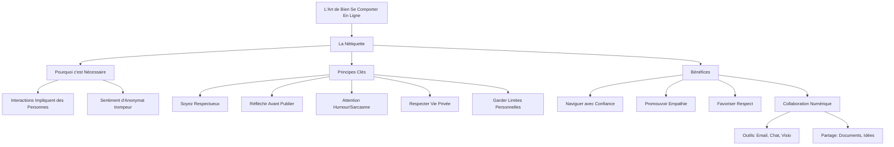

---
tags:
  - netiquette
  - ethique-numerique
  - comportement-en-ligne
  - communication/numerique
  - collaboration/digitale
  - vie-privee/protection
  - securite-en-ligne
  - regles-de-conduite
aliases:
  - L'Art De Bien Se Comporter En Ligne
  - 01-06 | L'Art De Bien Se Comporter En Ligne
archetype: cour
module: "IIC (Introduction à l'informatique et cybersécurité)"
cssclasses:
  - max
---

# 01-06 | L'Art De Bien Se Comporter En Ligne

> [!goal] Objectifs Pédagogiques
> À la fin de cette fiche, je dois être capable de :
> 1. Comprendre et définir le concept de la **nétiquette**.
> 2. Expliquer l'importance d'un comportement éthique en ligne.
> 3. Appliquer les principes fondamentaux de la nétiquette pour des interactions numériques respectueuses et sécurisées.
> 4. Identifier comment les outils numériques facilitent la collaboration en ligne.

## 📝 Synthèse du Cours

L'utilisation de la [[DigitalTechnology|technologie]] étant devenue une compétence sociale essentielle, il est primordial de connaître et d'appliquer les règles de la **[[Netiquette|nétiquette]]** pour naviguer dans les [[DigitalEnvironmentsEssentials|environnements numériques]] de manière appropriée.

### 1. Introduction à la Nétiquette

La [[Communication|communication]] en ligne, bien qu'elle puisse sembler impersonnelle, implique toujours de véritables personnes derrière les écrans. L'anonymat perçu peut parfois inciter à oublier les bonnes manières, rendant l'application de l'éthique encore plus cruciale dans le monde numérique.

> [!note] Définition Clé
> **Nétiquette** : L'étiquette, ou ensemble des règles de bonne conduite, à observer sur [[WorldWideWeb|Internet]]. Elle est l'application des bonnes manières aux interactions numériques.

### 2. Principes Fondamentaux de la Nétiquette

Pour améliorer les interactions sur les [[SocialNetworks|réseaux sociaux]] et dans tout environnement numérique, il est essentiel de suivre des règles simples qui favorisent un comportement respectueux et sécurisé.

*   **Soyez Respectueux** :
    *   Traitez les autres avec bienveillance et courtoisie, comme vous le feriez lors d'interactions en face à face.
*   **Réfléchissez Avant De Publier** :
    *   Prenez un instant pour considérer l'impact potentiel de vos paroles, images ou vidéos avant de les partager en ligne.
    *   Une fois publié sur Internet, le contenu est souvent permanent ("*une fois sur Internet, toujours sur Internet*").
*   **Attention à l'Humour et au Sarcasme** :
    *   La communication en ligne manque des nuances non verbales (ton, expressions faciales), ce qui peut facilement entraîner des malentendus. Soyez prudent avec l'humour ou le sarcasme.
*   **Respectez la [[Privacy|Vie Privée]] d'Autrui** :
    *   Abstenez-vous de partager des informations personnelles, des conversations privées, ou des photos et vidéos d'autres personnes sans leur consentement explicite.
*   **Maintenez des Limites Personnelles et de Communauté** :
    *   Préservez votre propre [[Confidentiality|confidentialité]] et bien-être. Réfléchissez aux informations que vous partagez sur vous-même et comment elles peuvent être perçues.

### 3. Favoriser des Interactions Positives et la Collaboration Numérique

En appliquant les principes de la nétiquette, vous pouvez naviguer dans le monde numérique avec confiance et favoriser des interactions significatives.

*   **Confiance** : Ayez l'assurance de vous exprimer et d'interagir de manière appropriée.
*   **Empathie** : Montrez de la compréhension et de la considération envers les expériences et les sentiments des autres utilisateurs.
*   **Respect** : Engagez-vous dans des échanges qui valorisent la dignité de chacun.

Internet est également un outil puissant pour la [[DigitalCollaboration|collaboration numérique]]. Des plateformes comme les courriels, la messagerie instantanée, la vidéoconférence et les [[Application|logiciels collaboratifs]] permettent d'échanger des idées, des documents et des commentaires en temps réel. Les solutions de stockage cloud facilitent l'accès et le travail d'équipe sur des fichiers partagés, renforçant ainsi la synergie à distance.

## 🧠 Carte Mentale / Schéma

## ❓ Quiz de Révision (Active Recall)
> [!question] Question 1
> Qu'est-ce que la **nétiquette** et pourquoi est-elle considérée comme une compétence sociale essentielle dans le monde numérique ?
> > [!success]- Réponse
> > La **nétiquette** est l'ensemble des règles de bonne conduite à observer sur Internet, l'application de l'étiquette aux interactions en ligne. Elle est essentielle car, malgré l'écran, les interactions numériques impliquent toujours de vraies personnes, et le sentiment d'anonymat peut inciter à oublier les bonnes manières. C'est une compétence sociale fondamentale pour garantir des échanges respectueux, éthiques et positifs.

> [!question] Question 2
> Citez au moins trois principes fondamentaux de la nétiquette et expliquez brièvement leur importance.
> > [!success]- Réponse
> > Voici trois principes fondamentaux et leur importance :
> > 1.  **Soyez Respectueux** : Traiter les autres avec courtoisie, comme en face à face, pour maintenir des relations harmonieuses.
> > 2.  **Réfléchir Avant De Publier** : Ponderer l'impact de son contenu, car ce qui est publié en ligne est souvent permanent, évitant ainsi des regrets ou des conséquences négatives.
> > 3.  **Respecter la Vie Privée d'Autrui** : Ne pas partager d'informations ou de contenus personnels sans consentement, protégeant ainsi l'intimité et la sécurité des individus.

> [!question] Question 3
> Comment la nétiquette contribue-t-elle à la **collaboration numérique** et quelles sont quelques technologies qui la facilitent ?
> > [!success]- Réponse
> > La nétiquette favorise une **collaboration numérique** efficace en instaurant un climat de confiance, d'empathie et de respect. En suivant ses principes, les participants peuvent échanger des idées et des documents de manière constructive et sans friction. Les technologies qui la facilitent incluent les courriels, la messagerie instantanée, la vidéoconférence, les logiciels de collaboration dédiés et les solutions de stockage cloud, qui permettent le partage et le travail d'équipe en temps réel.

## 🔗 Liens du Module
* **Précédent** : [[IIC01-05_IntroALia|01-05 | Intro à l'ia]]
* **Suivant** : [[IIC01-07_VotrePersonnaliteNumerique|01-07 | Votre Personnalité Numérique]]