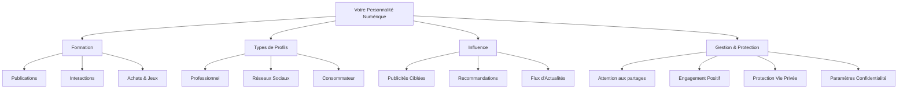

---
tags:
  - personnalite-numerique
  - identite-numerique/gestion
  - identite-numerique/protection
  - vie-privee/confidentialite
  - reseaux-sociaux/profil-en-ligne
  - environnement-numerique
  - cybersecurite/protection-donnees
aliases:
  - Votre Personnalité Numérique
  - 01-07 | Votre Personnalité Numérique
archetype: cour
module: "IIC (Introduction à l'informatique et cybersécurité)"
cssclasses:
  - max
---

# 01-07 | Votre Personnalité Numérique

> [!goal] Objectifs Pédagogiques
> À la fin de cette fiche, je dois être capable de :
> 1.  Comprendre la notion de **[[DigitalPersona|personnalité numérique]]** et les mécanismes de sa formation.
> 2.  Identifier les différents **types de profils numériques** et leur utilité.
> 3.  Appliquer les principes fondamentaux pour **gérer et protéger** efficacement ma personnalité numérique en ligne.

## 📝 Synthèse du Cours

Dans le [[DigitalEnvironmentsEssentials|monde numérique]], où une part significative de notre vie se déroule [[WorldWideWeb|en ligne]], chacun d'entre nous développe une personnalité numérique. C'est une représentation virtuelle de notre identité, construite à partir de nos interactions et de nos informations partagées sur internet.

### 1. La Personnalité Numérique : Définition et Formation

La personnalité numérique est la somme des informations et des comportements que nous manifestons en ligne. Chaque action, qu'il s'agisse d'une publication sur les [[SocialNetworks|réseaux sociaux]], d'un commentaire sur un blog, d'un achat en ligne ou d'une session de jeu vidéo, contribue à sculpter cette identité digitale.

> [!note] Définition Clé
> **Profil Numérique (ou Personnalité Numérique)** : Ensemble des données et des comportements qu'un individu génère et affiche dans l'environnement numérique. C'est l'empreinte digitale laissée par nos activités en ligne.

Ces "empreintes numériques" révèlent qui nous sommes dans le monde virtuel, de nos goûts à nos habitudes. Imaginez être dans une pièce remplie d'inconnus qui connaissent déjà vos préférences et vos intérêts ; c'est une analogie de ce qui se produit en ligne. Les sites web que vous visitez, les produits que vous consultez et le contenu qui vous captive concourent tous à former une image précise de votre identité numérique.

### 2. Influence et Types de Profils Numériques

Votre profil numérique a une influence directe sur votre expérience en ligne et au-delà :
*   Il détermine les **publicités ciblées** que vous recevez.
*   Il façonne les **recommandations** de contenu sur les plateformes de streaming ou d'e-commerce.
*   Il filtre les **flux d'actualités** qui apparaissent dans vos fils d'information.

Il existe différents types de profils numériques, chacun ayant une visée spécifique :

*   **Profil Professionnel** : Il s'agit de la manière dont vous vous présentez sur les réseaux professionnels (comme LinkedIn) et les sites d'emploi. Il met en avant vos compétences, votre expérience et vos objectifs de carrière.
*   **Profil sur les Réseaux Sociaux** : Ce profil reflète vos intérêts personnels, vos opinions et vos interactions sur des plateformes comme Facebook, Instagram ou X.
*   **Profil de Consommateur** : Créé à partir de vos habitudes et préférences d'achat en ligne, ce profil influence les produits, services et offres promotionnelles qui vous sont proposés.

### 3. Gérer et Protéger sa Personnalité Numérique

Construire et maintenir une **personnalité numérique positive** est crucial, car elle peut impacter divers aspects de votre vie, des opportunités d'emploi à vos relations personnelles. Une gestion proactive est essentielle et repose sur plusieurs piliers :

1.  **Faire attention à ce que l'on partage en ligne** : Réfléchir avant de publier et évaluer l'impact potentiel du contenu sur votre image.
2.  **S'engager positivement** : Contribuer de manière constructive et respectueuse aux discussions en ligne.
3.  **Protéger sa [[Privacy|vie privée]]** : Maîtriser les [[Confidentiality|informations personnelles]] accessibles et en limiter la diffusion.

Le contrôle de votre personnalité numérique passe notamment par l'utilisation des **paramètres de confidentialité** disponibles sur les plateformes et sites web. Ces outils vous permettent de définir qui peut voir vos activités et informations personnelles. Vérifier et ajuster régulièrement ces paramètres est une pratique indispensable pour s'assurer que votre image en ligne reflète fidèlement qui vous êtes et comment vous souhaitez être perçu.

## 🧠 Carte Mentale / Schéma

## ❓ Quiz de Révision (Active Recall)
> [!question] Question 1
> Qu'est-ce qu'une "personnalité numérique" et comment se forme-t-elle ?
> > [!success]- Réponse
> > Une personnalité numérique est l'ensemble des informations et comportements qu'un individu génère et affiche en ligne. Elle se forme à travers toutes les [[DigitalTechnology|activités numériques]] : publications sur les réseaux sociaux, commentaires, achats, jeux vidéo, etc., laissant ainsi une "empreinte numérique".

> [!question] Question 2
> Citez deux types de profils numériques et expliquez brièvement leur objectif.
> > [!success]- Réponse
> > 1.  **Profil Professionnel** : Il vise à présenter vos compétences, expérience et objectifs de carrière sur les plateformes professionnelles.
> > 2.  **Profil de Consommateur** : Il se base sur vos habitudes d'achat en ligne et influence les produits et offres qui vous sont proposés. (Alternative : Profil sur les Réseaux Sociaux, reflétant vos intérêts personnels et interactions sociales).

> [!question] Question 3
> Pourquoi est-il essentiel de gérer activement sa personnalité numérique et quels outils peuvent y contribuer ?
> > [!success]- Réponse
> > Il est essentiel de gérer sa personnalité numérique car elle peut affecter de nombreux aspects de la vie (opportunités d'emploi, relations personnelles). Les **paramètres de confidentialité** sur les plateformes et sites web sont des outils clés qui permettent de contrôler qui peut voir vos activités et informations, aidant ainsi à maintenir une image en ligne positive et maîtrisée.

## 🔗 Liens du Module
*   **Précédent** : [[IIC01-06_LartDeBienSeComporterEnLigne|01-06 | L'Art De Bien Se Comporter En Ligne]]
*   **Suivant** : [[IIC01-08_LaProprieteIntellectuelleALereNumerique|01-08 | La Propriété Intellectuelle à l'Ère Numérique]]
*   **Ressource Externe** : [Gérer sa réputation numérique - CNIL](https://www.cnil.fr/fr/gerer-sa-reputation-numerique)