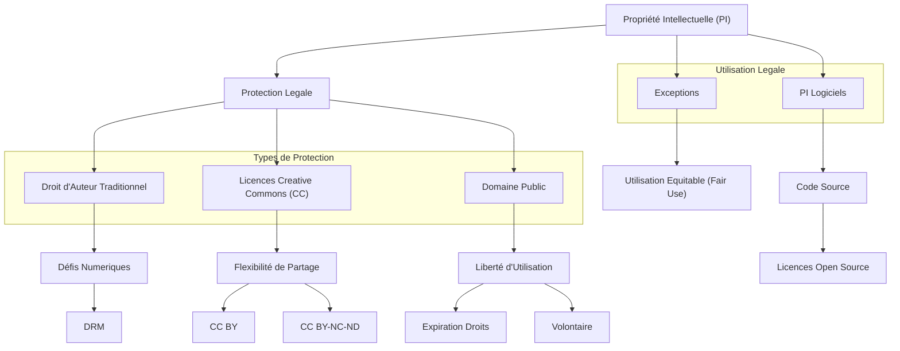

---
tags:
  - propriete-intellectuelle
  - droit-auteur
  - numerique
  - licence/creative-commons
  - domaine-public
  - droit-auteur/exception/utilisation-equitable
  - logiciel/licence/open-source
  - gestion-droits-numeriques
aliases:
  - La Propriété Intellectuelle à l'Ère Numérique
  - 01-08 | La Propriété Intellectuelle à l'Ère Numérique
  - Intellectual Property in the Digital Age
archetype: cour
module: IIC (Introduction à l'informatique et cybersécurité)
cssclasses:
  - max
---

# 01-08 | La Propriété Intellectuelle à l'Ère Numérique

> [!goal] Objectifs Pédagogiques
> À la fin de cette fiche, je dois être capable de :
> 1.  Comprendre la notion de **[[Copyright|propriété intellectuelle]]** et sa protection à l'ère numérique.
> 2.  Distinguer le **droit d'auteur traditionnel** des **[[CreativeCommonsLicenses|licences Creative Commons]]** et du **[[PublicDomain|domaine public]]**.
> 3.  Identifier les exceptions au droit d'auteur, telles que l'**[[CopyrightExceptionsEurope|utilisation équitable]]**.
> 4.  Appréhender la spécificité des **droits d'auteur sur les logiciels** et les **[[OpenSource|licences Open Source]]**.

## 📝 Synthèse du Cours

### 1. La Propriété Intellectuelle (PI)

La **Propriété Intellectuelle** (PI) désigne toute création de l'esprit (roman, tableau, chanson, recette). À l'instar d'un bien physique, elle appartient à son créateur qui en contrôle l'utilisation, que ce soit dans le monde numérique ou réel. Elle est protégée par des lois sur le droit d'auteur, dont les spécificités varient selon les pays, mais qui reconnaissent toutes cette propriété fondamentale.

> [!note] Définition Clé
> **Propriété Intellectuelle** : Ensemble des droits exclusifs accordés aux créateurs sur leurs œuvres de l'esprit, leur permettant de contrôler l'utilisation et la diffusion de leurs créations.

### 2. Le Droit d'auteur Traditionnel Face Au Numérique

Le droit d'auteur traditionnel protège automatiquement toute œuvre originale fixée sur un support (écrits, musique, films, etc.), conférant à son créateur des droits exclusifs. Cependant, l'environnement numérique facilite grandement la copie et la distribution non autorisées, ce qui contraste avec les difficultés rencontrées dans le monde physique (ex: prêt d'un livre vs. copie d'un e-book). Pour contrer ces pratiques, les titulaires de droits emploient des technologies de [[DigitalRightsManagement|gestion des droits numériques]] (DRM).

### 3. Les Licences Creative Commons : Une Alternative Flexible

Si le droit d'auteur traditionnel est optimal pour monétiser une œuvre, il peut être restrictif pour les créateurs souhaitant avant tout partager leur travail. Les licences Creative Commons (CC) proposent une alternative flexible, permettant aux créateurs de définir les conditions spécifiques d'utilisation, de partage et de modification de leurs œuvres.

*   **CC BY** : La licence la plus permissive, exigeant seulement l'attribution de l'œuvre à son auteur.
*   **CC BY-NC-ND** : La licence la plus restrictive, interdisant l'utilisation commerciale et toute modification de l'œuvre.

Ces licences facilitent le partage légal mais ne génèrent généralement pas de revenus directs pour le créateur.

### 4. Le Domaine Public : Liberté Totale d'Utilisation

Les œuvres du domaine public ne sont pas protégées par le droit d'auteur et peuvent être utilisées, copiées, distribuées et modifiées librement par tous. Cela inclut diverses catégories d'œuvres :

*   Celles dont les droits d'auteur ont expiré.
*   Celles créées par certains organismes publics (ex: le gouvernement fédéral américain).
*   Celles que les créateurs ont volontairement placées dans le domaine public.

> [!attention] Distinction Importante
> Un personnage (ex: Winnie l'ourson du livre original) peut être dans le domaine public, mais ses adaptations récentes (ex: la version Disney) peuvent encore être protégées. De même, une composition musicale (ex: Symphonie n°5 de Beethoven) peut être libre, mais un enregistrement spécifique de cette œuvre peut être soumis au droit d'auteur. Placer son travail dans le domaine public implique de renoncer à tout contrôle et à tout profit potentiel sur l'œuvre.

### 5. L'Utilisation Équitable : Une Exception Cruciale

L'utilisation équitable (ou "Fair Use" aux États-Unis) est une exception au droit d'auteur qui autorise une utilisation limitée d'œuvres protégées sans l'autorisation du titulaire, pour des fins spécifiques telles que la critique, l'enseignement, la recherche ou la parodie. Cette exception est fondamentale pour la **liberté d'expression**.

*   **Application contextuelle** : Son application est très contextuelle et peut générer des incertitudes juridiques, nécessitant une analyse au cas par cas.
*   **Règle générale** : Le contenu emprunté devrait généralement représenter moins de 10% de l'œuvre nouvelle dans laquelle il est intégré.
*   **Recommandation** : Une consultation juridique est fortement recommandée pour les projets à grande audience afin d'éviter les litiges.

### 6. Les Droits d'auteur Sur Les Logiciels

Les droits d'auteur sur les logiciels couvrent les programmes informatiques et, dans certains cas, leur code source. Les licences Open Source, un sous-ensemble notable, permettent l'utilisation, la modification et le partage du logiciel sous des conditions définies, favorisant ainsi l'innovation collaborative et le développement communautaire.

> [!caution] Interdiction de copie directe
> Il n'est pas permis de copier directement un code source protégé (ex: Microsoft Office) pour en faire son propre produit commercial, tout comme on ne peut pas copier un roman intégralement.

### Conclusion : Un Paysage Complexifié

[[Internet]] a profondément **complexifié le paysage du droit d'auteur**, remettant en question les notions classiques de propriété et de distribution. Bien que le droit d'auteur demeure une protection essentielle pour les créateurs, il a dû évoluer pour s'adapter aux nouvelles formes de création et de partage à l'ère numérique, nécessitant une compréhension nuancée de ses différentes facettes.

## 🧠 Carte Mentale / Schéma

## ❓ Quiz de Révision (Active Recall)
> [!question] Question 1
> Qu'est-ce que la Propriété Intellectuelle et comment est-elle protégée ?
> > [!success]- Réponse
> > La **Propriété Intellectuelle** désigne toute création de l'esprit. Elle est protégée par des lois sur le **droit d'auteur** qui confèrent au créateur des droits exclusifs sur son œuvre.

> [!question] Question 2
> Quelle est la principale différence entre le droit d'auteur traditionnel et les licences Creative Commons ?
> > [!success]- Réponse
> > Le **droit d'auteur traditionnel** accorde des droits exclusifs au créateur, souvent pour la monétisation. Les **licences Creative Commons** offrent une flexibilité permettant aux créateurs de spécifier des conditions d'utilisation, de partage et de modification de leurs œuvres, favorisant souvent le partage plutôt que la monétisation exclusive.

> [!question] Question 3
> Citez deux cas où une œuvre peut se trouver dans le domaine public.
> > [!success]- Réponse
> > Une œuvre peut être dans le domaine public lorsque ses droits d'auteur ont expiré ou lorsque son créateur l'a volontairement placée dans le domaine public.

> [!question] Question 4
> Qu'est-ce que l'Utilisation Équitable ("Fair Use") et pour quelles fins est-elle généralement appliquée ?
> > [!success]- Réponse
> > L'**Utilisation Équitable** est une exception au droit d'auteur qui autorise une utilisation limitée d'œuvres protégées sans autorisation. Elle est généralement appliquée pour des fins telles que la critique, l'enseignement, la recherche ou la parodie.

> [!question] Question 5
> Quelle est la particularité des droits d'auteur sur les logiciels, et quel rôle jouent les licences Open Source ?
> > [!success]- Réponse
> > Les **droits d'auteur sur les logiciels** couvrent les programmes et leur code source. Les **licences Open Source** permettent l'utilisation, la modification et le partage du logiciel sous des conditions définies, favorisant ainsi l'innovation collaborative et le développement communautaire, contrairement aux licences propriétaires qui restreignent ces actions.

## 🔗 Liens du Module
*   **Précédent** : [[IIC01-07_VotrePersonnaliteNumerique|01-07 | Votre Personnalité Numérique]]
*   **Suivant** : [[IIC02-01_LesFondamentauxDeLinformatique|02-01 | Les Fondamentaux De l'Informatique]]
