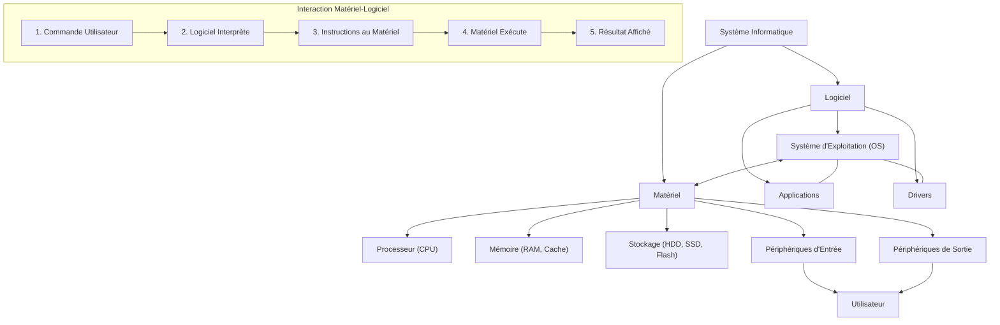

---
tags:
  - informatique/fondamentaux
  - materiel/composant
  - logiciel/systeme-exploitation
  - memoire/stockage
  - peripherique/entree-sortie
  - architecture/ordinateur
aliases:
  - Les Fondamentaux De l'Informatique
  - 02-01 | Les Fondamentaux De l'Informatique
archetype: cour
module: IIC (Introduction à l'informatique et cybersécurité)
cssclasses:
  - max
---

# 02-01 | Les Fondamentaux De l'Informatique

> [!goal] Objectifs Pédagogiques
> À la fin de cette fiche, je dois être capable de :
> 1.  Comprendre les concepts essentiels de l'informatique.
> 2.  Distinguer clairement le **matériel** du **logiciel** et comprendre leur synergie.
> 3.  Identifier les différents types de **mémoire** ([[RAM|RAM]], Cache) et de **stockage** (HDD, SSD, Flash, Cloud).
> 4.  Classer les [[ComputerPeripheral|périphériques]] en fonction de leur rôle (entrée ou sortie).
> 5.  Expliquer comment le matériel et le logiciel interagissent pour exécuter une tâche.

## 📝 Synthèse du Cours

Découvrons ensemble les concepts essentiels qui permettent aux ordinateurs de traiter, stocker et partager des informations au quotidien.

### 1. Matériel Et Logiciel : Les Deux Piliers

Les systèmes informatiques reposent sur deux composantes fondamentales travaillant en parfaite synergie : le matériel et le logiciel.

*   **Le Matériel (Hardware)**
    *   **Définition** : Il représente tous les composants physiques et tangibles de l'ordinateur.
    *   **Exemples** : Processeur, mémoire vive (RAM), disque dur, carte mère, clavier, souris, écran.
    *   **Rôle** : Fournit la base physique et la puissance de calcul nécessaire.

*   **Le Logiciel (Software)**
    *   **Définition** : C'est la partie intangible, composée des programmes, [[Application|applications]] et [[OperatingSystem|systèmes d'exploitation]].
    *   **Exemples** : Windows, macOS, Linux, Microsoft Word, Google Chrome, jeux vidéo.
    *   **Rôle** : Donne les instructions au matériel, lui indiquant quelles tâches accomplir et comment les exécuter.

> [!note] Définition Clé
> *   **Matériel** : L'ensemble des composants physiques et tangibles d'un ordinateur.
> *   **Logiciel** : L'ensemble des programmes, applications et systèmes d'exploitation qui donnent des instructions au matériel.

### 2. La Mémoire : Types Et Fonctions

La mémoire est cruciale pour le stockage temporaire ou permanent des données.

*   RAM (Random Access Memory) - Mémoire Vive
    *   C'est la mémoire à court terme de l'ordinateur, **volatile** et **ultra-rapide**.
    *   Elle stocke temporairement les données et instructions dont le processeur a besoin immédiatement (ex: programmes en cours d'exécution, données ouvertes).
    *   Les données sont **perdues** à l'extinction de l'appareil.

> [!note] Définition Clé
> RAM (Random Access Memory) : Mémoire volatile et ultra-rapide utilisée pour stocker temporairement les données et instructions dont le processeur a besoin immédiatement.

*   **Mémoire Cache**
    *   Un type de mémoire encore **plus rapide** et **plus petite** que la RAM, souvent intégrée au processeur.
    *   Elle stocke les données et instructions les plus fréquemment utilisées pour améliorer les performances en réduisant le temps d'accès.
    *   C'est comme avoir vos applications favorites prêtes à l'emploi dès que vous déverrouillez votre appareil.

> [!note] Définition Clé
> **Mémoire Cache** : Mémoire très rapide et de petite taille qui stocke les données et instructions fréquemment utilisées pour améliorer significativement les performances du système.

### 3. Solutions De Stockage

Le stockage permet de conserver les données de manière persistante.

*   **Disques Durs (HDD - Hard Disk Drive)**
    *   **Technologie** : Stockage mécanique traditionnel utilisant des plateaux rotatifs et des têtes de lecture/écriture.
    *   **Caractéristiques** : Plus lents que les SSD mais plus économiques pour de très gros volumes de stockage.

*   **Disques SSD (Solid State Drive)**
    *   **Technologie** : Stockage à état solide utilisant la mémoire flash, sans pièces mobiles.
    *   **Caractéristiques** : Beaucoup plus rapides que les HDD, ils accélèrent considérablement le démarrage du système et le chargement des applications.

*   **Mémoire Flash**
    *   **Technologie** : Support de stockage **non volatile** et durable qui conserve les données sans alimentation électrique.
    *   **Utilisations** : Présente dans les clés USB, cartes SD, smartphones, et est la technologie de base des SSD.

*   **Stockage Cloud**
    *   **Technologie** : Extension du stockage via des serveurs distants accessibles par [[Internet]].
    *   **Avantages** : Idéal pour la sauvegarde, la synchronisation et l'accès aux données depuis plusieurs appareils et lieux, offrant flexibilité et accessibilité accrues.

### 4. Périphériques d'Entrée Et De Sortie

Les périphériques sont les interfaces entre l'utilisateur et l'ordinateur.

*   **Périphériques d'Entrée**
    *   **Rôle** : Permettent aux utilisateurs de saisir des données et des instructions dans l'ordinateur.
    *   **Exemples** :
        *   _Clavier_ : Saisie de texte.
        *   _Souris_ : Navigation et interaction graphique.
        *   _Microphone_ : Saisie audio.
        *   _Caméra_ : Capture vidéo et photo.
        *   _Écran tactile_ : Entrée tactile.

> [!note] Définition Clé
> Périphérique d'entrée : Dispositif permettant à l'utilisateur de saisir des données ou des instructions dans l'ordinateur.

*   **Périphériques de Sortie**
    *   **Rôle** : Affichent ou transmettent les résultats et informations traitées par l'ordinateur.
    *   **Exemples** :
        *   _Moniteur/Écran_ : Affichage visuel des informations.
        *   _Haut-parleurs_ : Reproduction audio.
        *   _Imprimante_ : Production de documents physiques.
        *   _Casque_ : Audio personnel.
        *   _Projecteur_ : Affichage sur grand écran.

> [!note] Définition Clé
> **Périphérique de sortie** : Dispositif permettant à l'ordinateur d'afficher ou de transmettre les résultats du traitement des informations à l'utilisateur.

### 5. L'Interconnexion : Matériel Et Logiciel En Action

L'exemple simple de l'ajustement de la luminosité de l'écran illustre parfaitement la collaboration entre matériel et logiciel :

1.  **Interface Utilisateur (Logiciel)** : Le système d'exploitation présente une interface graphique permettant à l'utilisateur de modifier les paramètres de luminosité (ex: via un menu ou un raccourci clavier).
2.  **Traitement De la Demande (Logiciel)** : Le logiciel (le système d'exploitation ou le pilote d'affichage) interprète la commande de l'utilisateur et détermine les ajustements nécessaires à appliquer au matériel d'affichage.
3.  **Communication Avec Le Matériel** : Le logiciel transmet des instructions spécifiques au composant matériel (la carte graphique ou le contrôleur d'affichage de l'écran) responsable du contrôle de la luminosité.
4.  **Exécution Physique (Matériel)** : Le matériel reçoit les instructions et répond instantanément en ajustant physiquement la luminosité de l'écran selon les spécifications reçues, créant le changement visible.

Cette interaction démontre l'interconnexion fondamentale entre matériel et logiciel : l'un ne peut fonctionner sans l'autre pour créer l'expérience informatique moderne que nous connaissons.

## 🧠 Carte Mentale / Schéma

## ❓ Quiz de Révision (Active Recall)
> [!question] Question 1
> Quelle est la principale différence entre la RAM et un disque SSD en termes de persistance des données et de rôle dans le système ?
> > [!success]- Réponse
> > La RAM est une mémoire volatile et ultra-rapide qui stocke temporairement les données et instructions pour le processeur. Les données sont perdues à l'extinction. Un SSD est une solution de stockage non volatile qui conserve les données de manière permanente, même sans alimentation, et sert à stocker le système d'exploitation et les fichiers.

> [!question] Question 2
> Citez un exemple de périphérique d'entrée et un exemple de périphérique de sortie et expliquez brièvement leur fonction.
> > [!success]- Réponse
> > *   Périphérique d'entrée : Le *clavier* permet à l'utilisateur de saisir des caractères et des commandes dans l'ordinateur.
> > *   Périphérique de sortie : Le *moniteur* (écran) affiche visuellement les informations traitées par l'ordinateur à l'utilisateur.

> [!question] Question 3
> Le réglage de la luminosité d'un écran est un exemple d'interaction entre matériel et logiciel. Quel est le rôle principal du logiciel dans cette interaction ?
> > [!success]- Réponse
> > Le rôle principal du logiciel est d'interpréter la commande de l'utilisateur (via l'interface graphique) et de traduire cette intention en instructions spécifiques que le matériel (le contrôleur d'affichage de l'écran) peut comprendre et exécuter pour ajuster la luminosité.

## 🔗 Liens du Module
*   **Précédent** : [[IIC01-08_LaProprieteIntellectuelleALereNumerique|01-08 | La Propriété Intellectuelle à l'Ère Numérique]]
*   **Suivant** : [[IIC02-02_LesSystemesDexploitationPasserellesVersLeNumerique|02-02 | Les Systèmes d'Exploitation - Passerelles Vers Le Numérique]]
*   **Ressource Externe** : [Comment fonctionnent les ordinateurs ?](https://www.commentcamarche.net/informatique/ordinateur/27318-comment-fonctionne-un-ordinateur/)