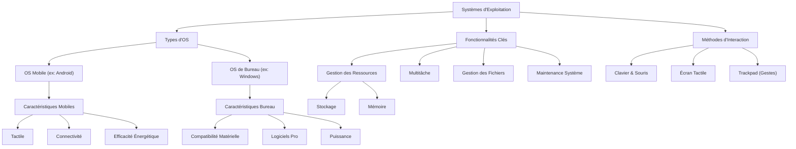

---
tags:
  - systeme-exploitation
  - os/mobile
  - os/bureau
  - gestion-ressources
  - maintenance-systeme
  - interaction-utilisateur
  - gestion-fichiers
  - informatique/fondamentaux
aliases:
  - Les Systèmes d'Exploitation - Passerelles Vers Le Numérique
  - 02-02 | Les Systèmes d'Exploitation - Passerelles Vers Le Numérique
archetype: cours
module: IIC (Introduction à l'informatique et cybersécurité)
cssclasses:
  - max
---

# 02-02 | Les Systèmes d'Exploitation : Passerelles Vers Le Numérique

> [!goal] Objectifs Pédagogiques
> À la fin de cette fiche, je dois être capable de :
> 1. Identifier les rôles et les caractéristiques des *systèmes d'exploitation mobiles et de bureau*.
> 2. Comprendre les différentes *méthodes d'interaction* avec ces systèmes.
> 3. Reconnaître l'importance de la *gestion des ressources* et de la *maintenance système* pour un fonctionnement optimal des appareils numériques.

## 📝 Synthèse du Cours

Les [[OperatingSystem|systèmes d'exploitation]] (OS) sont des logiciels fondamentaux qui permettent l'interaction entre l'utilisateur, le matériel et les [[Application|applications]]. Qu'il s'agisse de plateformes mobiles ou de bureau, ils orchestrent chaque interaction numérique, de la navigation simple aux tâches complexes.

### 1. Les Systèmes d'Exploitation Mobiles : L'Innovation Au Bout Des Doigts

Les systèmes d'exploitation mobiles sont conçus pour l'interactivité tactile, la [[Connectivity|connectivité]] permanente et l'efficacité énergétique, prolongeant ainsi l'autonomie des appareils. Ils sont optimisés pour les tâches simultanées et gèrent un vaste écosystème d'applications.

> [!note] Définition Clé
> **Système d'Exploitation Mobile** : Un logiciel système conçu pour les appareils mobiles (smartphones, tablettes), caractérisé par son interface tactile, sa connectivité optimisée et sa gestion de l'énergie.

#### Android : Le Géant Flexible
*   *[[Android|Android]]* domine le marché mobile grâce à sa capacité à gérer une multitude de tâches simultanément.
*   Il optimise les ressources des smartphones et tablettes pour la navigation web et les applications complexes.
*   Spécialement conçu pour l'interaction tactile, il exploite la connectivité mobile permanente.
*   Maximise l'efficacité énergétique pour prolonger l'autonomie.
*   Supporte un écosystème riche d'activités : courrier électronique, jeux immersifs, gestion d'appareils connectés.

### 2. Les Systèmes d'Exploitation de Bureau : Puissance et Polyvalence

Les systèmes d'exploitation de bureau sont optimisés pour la puissance de traitement et la polyvalence, répondant aux besoins informatiques les plus exigeants, qu'ils soient personnels ou professionnels.

> [!note] Définition Clé
> **Système d'Exploitation de Bureau** : Un logiciel système conçu pour les ordinateurs personnels (ordinateurs de bureau, ordinateurs portables), offrant une grande puissance de traitement, une compatibilité matérielle étendue et des capacités multitâches avancées.

*   **Compatibilité Matérielle** : Supporte une gamme étendue de [[ComputerPeripheral|périphériques]], des processeurs haute performance aux cartes graphiques spécialisées.
*   **Logiciels Professionnels** : Compatibilité avec des applications exigeantes comme le montage vidéo, le développement logiciel et la modélisation 3D.
*   **Multitâche Avancé** : Gestion simultanée de nombreuses applications avec allocation optimisée des ressources système.
*   Des systèmes comme [[WindowsOperatingSystem|Windows]] et ses concurrents offrent la puissance de traitement nécessaire pour les tâches professionnelles complexes.

### 3. Méthodes d'Interaction : Du Tactile Aux Gestes Avancés

Les systèmes d'exploitation offrent diverses méthodes d'interaction, adaptées aux contextes d'utilisation et aux préférences de l'utilisateur.

*   **Clavier & Souris** : Interaction traditionnelle fondamentale pour la productivité, offrant précision et rapidité pour la saisie de texte et la navigation complexe.
*   **Écrans Tactiles** : L'interaction directe révolutionne l'utilisation mobile et s'étend aux ordinateurs portables, offrant une expérience intuitive.
*   **Trackpad Intelligent** : Les gestes multi-doigts transforment la navigation (pincer pour zoomer, défilement à deux doigts, clic droit intuitif).

### 4. Gestion des Ressources : Stockage et Mémoire

Les systèmes d'exploitation fournissent des outils pour surveiller et gérer efficacement les ressources matérielles, assurant ainsi la performance des appareils.

*   **Surveillance Intelligente** : Outils sophistiqués pour visualiser la distribution du stockage et surveiller la consommation [[RAM|mémoire]] en temps réel.
    *   Analyseurs de stockage intégrés.
    *   Moniteurs de performance en temps réel.
    *   Alertes automatiques de saturation.
    *   Recommandations d'optimisation pour identifier les applications gourmandes ou les fichiers volumineux.

### 5. Maintenance Système : Nettoyage et Optimisation

La maintenance régulière est cruciale pour garantir un fonctionnement optimal et prolonger la durée de vie des appareils numériques.

*   **Vidage du Cache** : Suppression automatique des fichiers temporaires et données de cache pour libérer l'espace et améliorer les performances.
*   **Nettoyage Navigateur** : Optimisation de la navigation web en supprimant l'historique, les [[Cookies|cookies]] et les fichiers temporaires accumulés.
*   **Applications Streaming** : Résolution des problèmes de lecture en vidant le cache des services de streaming pour restaurer les performances.

### 6. Gestion des Fichiers : Organisation et Sécurité Numérique

Les systèmes d'exploitation facilitent l'organisation et la sécurité numérique des données numériques.

*   **Glisser-Déposer** : Gestes intuitifs pour organiser efficacement fichiers et dossiers avec la souris ou le trackpad.
*   **Corbeille Intelligente** : Système de sécurité pour les suppressions accidentelles avec possibilité de restauration.
*   **Organisation Optimale** : Maintien des performances et libération d'espace par une gestion rigoureuse des ressources.

## 🧠 Carte Mentale / Schéma

## ❓ Quiz de Révision (Active Recall)
> [!question] Question 1
> Quelles sont les trois caractéristiques principales qui distinguent un système d'exploitation mobile d'un système d'exploitation de bureau ?
> > [!success]- Réponse
> > Les systèmes d'exploitation mobiles sont caractérisés par leur interface *tactile*, leur connectivité mobile permanente optimisée et leur *efficacité énergétique* pour prolonger l'autonomie.

> [!question] Question 2
> Citez deux opérations de maintenance système courantes qui aident à améliorer les performances et à libérer de l'espace sur un appareil.
> > [!success]- Réponse
> > Deux opérations de maintenance courantes sont le *vidage du cache* (fichiers temporaires) et le *nettoyage du [[Browser|navigateur]]* (historique, cookies).

> [!question] Question 3
> Décrivez comment les systèmes d'exploitation facilitent la gestion des fichiers pour un utilisateur.
> > [!success]- Réponse
> > Les systèmes d'exploitation facilitent la gestion des fichiers via des interactions intuitives comme le *glisser-déposer* pour l'organisation, et la *corbeille intelligente* qui permet de restaurer les suppressions accidentelles, assurant ainsi une organisation optimale et la [[DataSecurity|sécurité des données]].

## 🔗 Liens du Module
*   **Précédent** : [[IIC02-01_LesFondamentauxDeLinformatique|02-01 | Les Fondamentaux De l'Informatique]]
*   **Suivant** : [[IIC02-03_LeTransfertEtLaSynchronisationDeFichiers|02-03 | Le Transfert et la Synchronisation de Fichiers]]
*   **Ressource Externe** : [Wikipédia - Système d'exploitation](https://fr.wikipedia.org/wiki/Syst%C3%A8me_d%27exploitation)