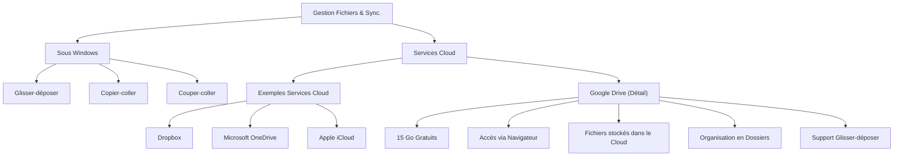

---
tags:
  - fichier/transfert
  - fichier/synchronisation
  - windows/gestion-fichier
  - cloud/stockage
  - google-drive
  - informatique/base
  - donnee/gestion
aliases:
  - Le Transfert et la Synchronisation de Fichiers
  - 02-03 | Le Transfert et la Synchronisation de Fichiers
archetype: cour
module: "IIC (Introduction à l'informatique et cybersécurité)"
cssclasses:
  - max
---

# 02-03 | Le Transfert et la Synchronisation de Fichiers

> [!goal] Objectifs Pédagogiques
> À la fin de cette fiche, je dois être capable de :
> 1. Décrire les méthodes courantes de transfert et de déplacement de fichiers sous [[WindowsOperatingSystem|Windows]].
> 2. Expliquer la différence fondamentale entre les opérations de *copier-coller* et de *couper-coller*.
> 3. Identifier les principaux services de *stockage cloud*.
> 4. Décrire les caractéristiques et le fonctionnement de base de *Google Drive* pour le stockage en ligne.

## 📝 Synthèse du Cours

Le transfert et la synchronisation de fichiers entre différents appareils et le *stockage en nuage* (cloud) sont devenus des aspects fondamentaux de [[IIC02-01_LesFondamentauxDeLinformatique|l'informatique]] moderne. Cette leçon explore les techniques pour déplacer des fichiers sous Windows, ainsi que l'utilisation des services de stockage cloud.

### 1. Méthodes de Gestion des Fichiers sous Windows

Sous le [[OperatingSystem|système d'exploitation]] Windows, le déplacement et la copie de fichiers peuvent être réalisés par diverses méthodes, principalement via l'*Explorateur de fichiers*.

*   **Glisser-déposer (Drag-and-Drop)** :
    *   Cette méthode consiste à sélectionner un fichier ou un dossier, puis à le faire glisser vers un nouvel emplacement.
    *   **Procédure** : Ouvrir l'*Explorateur de fichiers*, localiser l'élément source, ouvrir le dossier de destination dans une autre fenêtre, puis faire glisser l'élément de la source vers la destination.
    *   **Comportement** : Si la destination est sur le même lecteur, l'élément est **déplacé**. Si la destination est sur un lecteur différent, l'élément est **copié**.

*   **Copier-coller (Copy-Paste)** :
    *   Cette opération permet de dupliquer un fichier ou un dossier.
    *   **Procédure** : Dans l'*Explorateur de fichiers*, faire un clic droit sur l'élément source et sélectionner **Copier**. Ensuite, naviguer vers le dossier de destination, faire un clic droit dans un espace vide et sélectionner **Coller**.
    *   **Résultat** : Une **copie exacte** de l'élément est créée à la destination, l'original restant intact à son emplacement initial.

*   **Couper-coller (Cut-Paste)** :
    *   Cette opération sert à déplacer un fichier ou un dossier de son emplacement d'origine vers une nouvelle destination.
    *   **Procédure** : Dans l'*Explorateur de fichiers*, faire un clic droit sur l'élément source et sélectionner **Couper**. Ensuite, naviguer vers le dossier de destination, faire un clic droit dans un espace vide et sélectionner **Coller**.
    *   **Résultat** : L'élément est **déplacé** ; l'original est supprimé de son emplacement source pour n'exister qu'à la nouvelle destination.

> [!note] Définition Clé
> La **différence clé** entre **Copier-coller** et **Couper-coller** réside dans le nombre d'occurrences du fichier après l'opération : le *copier-coller* aboutit à **deux fichiers identiques** à des emplacements distincts, tandis que le *couper-coller* aboutit à **un seul fichier** déplacé vers un nouvel emplacement.

### 2. Les Services de Stockage Cloud

Les services de *stockage cloud* permettent de sauvegarder et d'accéder à des fichiers via [[Internet]], les données étant stockées sur des serveurs distants plutôt que sur un appareil local. Ils sont devenus un élément central de la gestion de fichiers moderne.

*   **Exemples de Services Populaires** :
    *   **Dropbox**
    *   **Microsoft OneDrive**
    *   **Apple iCloud**
    *   **Google Drive**

#### Google Drive : Un Exemple Détaillé

**Google Drive** est l'un des services de stockage cloud les plus répandus, souvent inclus avec un [[Account|compte Google]].

*   **Stockage Gratuit** : Chaque utilisateur bénéficie de **15 gigaoctets (Go)** de stockage gratuit, partagés entre Google Drive, Gmail et Google Photos. Des plans payants sont disponibles pour des besoins de stockage supérieurs.
*   **Accès** : L'accès principal et le plus simple à Google Drive se fait via un [[Browser|navigateur Web]]. Des [[Application|applications]] de bureau et mobiles (pour [[Android]] et [[iOS]]) existent également pour une synchronisation locale.
*   **Fonctionnement** :
    *   Les fichiers sont hébergés dans le *Cloud*, c'est-à-dire sur les multiples **fermes de serveurs** de Google, assurant accessibilité et [[Redundancy|redondance]].
    *   L'interface de Google Drive est intuitive et similaire à celle de l'*Explorateur de fichiers* de Windows, permettant la création de dossiers pour une organisation efficace.
    *   Il est possible de **glisser-déposer** des fichiers depuis l'Explorateur de fichiers de votre ordinateur directement dans l'interface web de Google Drive pour les téléverser.

## 🧠 Carte Mentale / Schéma

## ❓ Quiz de Révision (Active Recall)
> [!question] Question 1
> Expliquez la distinction fondamentale entre les opérations de *copier-coller* et de *couper-coller* sous Windows, en précisant le résultat final dans chaque cas.
> > [!success]- Réponse
> > L'opération de **copier-coller** crée une nouvelle instance du fichier à l'emplacement de destination, tout en conservant l'original à son emplacement initial. Il en résulte donc deux fichiers identiques mais distincts. L'opération de **couper-coller**, quant à elle, déplace le fichier de son emplacement d'origine vers la destination, supprimant l'original de sa source. Le résultat est un seul fichier, désormais à un nouvel emplacement.

> [!question] Question 2
> Citez au moins trois services populaires de stockage cloud. Décrivez la capacité de stockage gratuite de Google Drive et le moyen le plus simple d'y accéder.
> > [!success]- Réponse
> > Trois services populaires de stockage cloud sont **Google Drive**, **Microsoft OneDrive** et **Apple iCloud** (ou Dropbox). Google Drive offre 15 Go de stockage gratuit. Le moyen le plus simple d'y accéder est via un navigateur web.

## 🔗 Liens du Module
*   **Précédent** : [[IIC02-02_LesSystemesDexploitationPasserellesVersLeNumerique|02-02 | Les Systèmes d'Exploitation - Passerelles Vers Le Numérique]]
*   **Suivant** : [[IIC02-04_MethodesDeTransfertDeFichiersSurAndroid|02-04 | Méthodes De Transfert De Fichiers Sur Android]]
