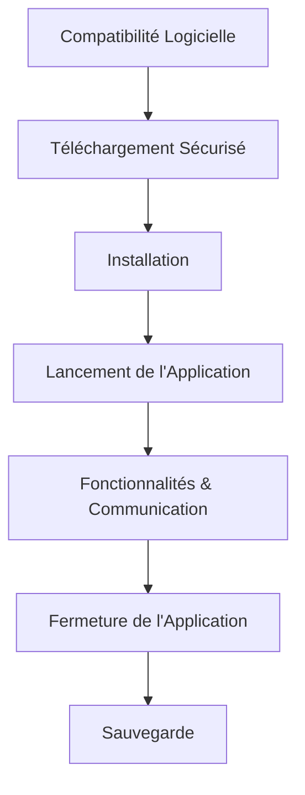

---
tags:
  - application-logicielle
  - compatibilite-logiciel
  - telechargement-securise
  - installation-logiciel
  - securite/logiciel-malveillant
  - fonctionnalite-application
  - systeme-exploitation
  - cybersecurite
aliases:
  - Le Monde des Applications Logicielles
  - 02-05 | Le Monde des Applications Logicielles
archetype: cour
module: "IIC (Introduction à l'informatique et cybersécurité)"
cssclasses:
  - max
---

# 02-05 | Le Monde des Applications Logicielles

> [!goal] Objectifs Pédagogiques
> À la fin de cette fiche, je dois être capable de :
> 1. Vérifier la **compatibilité** d'un logiciel avec mon appareil.
> 2. Télécharger et installer des [[Application|applications]] de manière **sécurisée**.
> 3. Comprendre les **fonctionnalités** et la [[Communication|communication]] entre l'utilisateur et l'application.
> 4. Effectuer une **fermeture** propre d'une application.

## 📝 Synthèse du Cours

### 1. Vérification de la Compatibilité Logicielle
Lors du téléchargement et de l'installation d'un logiciel, il est crucial de s'assurer de sa **compatibilité** avec votre ordinateur ou appareil.
*   **Recherche des spécifications requises** : Consultez le site web du logiciel ou sa page sur un App Store pour trouver la configuration système requise.
*   **Comparaison avec votre appareil** : Comparez ces exigences avec les spécifications de votre appareil (version du [[OperatingSystem|système d'exploitation]], CPU, [[RAM|RAM]]) que l'on trouve généralement dans la section "À propos" des paramètres de votre appareil.
*   **Confirmation de la compatibilité** : Assurez-vous que votre appareil satisfait ou dépasse ces exigences pour garantir une installation et un fonctionnement corrects.

> [!note] Information Importante
> Si votre appareil ne satisfait pas à la configuration requise, il est probable que vous ne puissiez pas installer ou utiliser le logiciel correctement.

### 2. Téléchargement et Installation Sécurisés
La première étape pour un téléchargement sécurisé est de visiter une **source fiable**.
*   **Sources Recommandées** : Privilégiez les magasins d'applications officiels (comme Google Play pour [[Android|Android]]) ou les sites web officiels du développeur du logiciel pour PC.
*   **Éviter les Risques** : Il est impératif d'éviter de télécharger des logiciels depuis des sites peu fiables, car cela peut introduire des [[Malware|logiciels malveillants]] sur votre appareil. Par exemple, le téléchargement d'un jeu depuis une publicité suspecte au lieu d'un magasin officiel peut compromettre gravement la [[Cybersecurity|sécurité]] et l'efficacité de votre appareil, ainsi que la [[Confidentiality|confidentialité]] de vos [[PersonalData|informations personnelles]].

> [!note] Définition Clé
> **Logiciel malveillant ([[Malware|Malware]])** : Tout programme conçu pour nuire à un [[OperatingSystem|système informatique]], voler des [[DataSecurity|données]], ou compromettre la sécurité et l'efficacité d'un appareil sans le consentement de l'utilisateur.

Une fois l'application trouvée, le processus d'installation commence :
*   **Téléchargement** : Appuyez sur le bouton de téléchargement.
*   **Installation** : Une fois le téléchargement terminé, cliquez sur le fichier d'installation (souvent avec l'extension `.exe` sur Windows ou `.apk` sur Android en dehors des magasins d'applications) et suivez les instructions.
*   **Lancement** : Pour commencer à utiliser l'application, cliquez sur son icône sur votre bureau ou retrouvez-la dans votre dossier d'applications. La plupart des applications affichent un **écran de démarrage** ou une page d'accueil lors de leur lancement.

> [!note] Définition Clé
> **Écran de démarrage (Splash Screen)** : Un graphique d'introduction qui s'affiche lors du lancement d'une application ou d'un programme, affichant souvent le logo, le nom ou d'autres éléments visuels associés au logiciel.

### 3. Fonctionnalités et Communication des Applications
Comprendre ce qu'une application peut et ne peut pas faire est essentiel.
*   **Fonctionnalités Spécifiques** : Les capacités d'une application sont définies par sa conception et les **autorisations** que vous lui accordez. Par exemple, une application de retouche photo peut modifier des images, mais ne gérera pas vos rendez-vous.
*   **Compétences Définies** : Chaque application possède un ensemble spécifique de compétences pour lesquelles elle a été créée.
*   **Entrée et Sortie de Données** : C'est la manière dont vous et votre application communiquez.
    *   **Entrée** : Lorsque vous fournissez des informations à l'application (ex: téléverser une photo à modifier).
    *   **Sortie** : Ce que l'application vous renvoie en retour (ex: la photo modifiée). C'est une interaction bidirectionnelle qui assure une [[Cooperation|collaboration]] harmonieuse.

### 4. Fermeture de l'Application
Lorsque vous avez terminé d'utiliser une application :
*   **Sauvegarder** : La première chose à retenir est de sauvegarder tout travail effectué.
*   **Quitter** : Fermer une application est généralement aussi simple que de fermer sa fenêtre sur un PC, ou de la quitter via le gestionnaire de tâches sur un appareil mobile.

## 🧠 Carte Mentale / Schéma

## ❓ Quiz de Révision (Active Recall)
> [!question] Question 1
> Quelles sont les deux principales informations à vérifier pour s'assurer de la compatibilité d'un logiciel avec votre appareil ?
> > [!success]- Réponse
> > Il faut rechercher la configuration système requise du logiciel (sur son site web ou App Store) et la comparer avec les spécifications de votre appareil (version du système d'exploitation, CPU, RAM, OS) dans les paramètres.

> [!question] Question 2
> Pourquoi est-il dangereux de télécharger un logiciel depuis une source non officielle ou suspecte ?
> > [!success]- Réponse
> > Le téléchargement depuis des sources non officielles peut introduire des logiciels malveillants (malware) sur votre appareil, compromettant sa sécurité, son efficacité et la confidentialité de vos informations personnelles.

> [!question] Question 3
> Qu'est-ce qu'un "écran de démarrage" (splash screen) dans le contexte d'une application ?
> > [!success]- Réponse
> > Un écran de démarrage est un graphique d'introduction qui s'affiche au lancement d'une application, présentant souvent le logo, le nom ou d'autres éléments visuels associés au logiciel.

> [!question] Question 4
> Donnez un exemple d'entrée et de sortie de données dans une application de messagerie instantanée.
> > [!success]- Réponse
> > **Entrée** : Taper et envoyer un message texte.
> > **Sortie** : Recevoir un message texte d'un autre utilisateur.

## 🔗 Liens du Module
*   **Précédent** : [[IIC02-04_MethodesDeTransfertDeFichiersSurAndroid|02-04 | Méthodes De Transfert De Fichiers Sur Android]]
*   **Suivant** : [[IIC02-06_LaProgrammationInformatiqueDonnerDesInstructionsAuxOrdinateurs|02-06 | La Programmation Informatique - Donner des Instructions aux Ordinateurs]]
