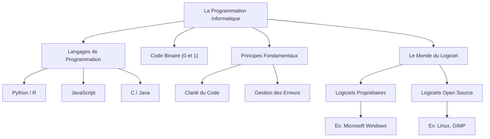

---
tags:
  - programmation
  - programmation/langage
  - code-binaire
  - logiciel
  - logiciel/proprietaire
  - logiciel/open-source
  - developpement
  - informatique/fondamentaux
aliases:
  - La Programmation Informatique - Donner des Instructions aux Ordinateurs
  - 02-06 | La Programmation Informatique - Donner des Instructions aux Ordinateurs
archetype: cour
module: IIC (Introduction à l'informatique et cybersécurité)
cssclasses:
  - max
---

# 02-06 | La Programmation Informatique - Donner des Instructions aux Ordinateurs

> [!goal] Objectifs Pédagogiques
> À la fin de cette fiche, je dois être capable de :
> 1. Expliquer ce qu'est la **programmation informatique** et son rôle.
> 2. Identifier les différents **langages de programmation** et leurs cas d'utilisation.
> 3. Distinguer les logiciels propriétaires des [[OpenSource|logiciels open source]].
> 4. Énoncer les principes fondamentaux qui guident la rédaction de programmes.

## 📝 Synthèse du Cours

La programmation informatique est l'art de concevoir des séquences d'instructions pour permettre à un ordinateur d'exécuter des tâches spécifiques. C'est le fondement de tous les [[Application|logiciels]] et applications qui constituent notre [[DigitalEnvironmentsEssentials|environnement numérique]].

### 1. Les Langages de Programmation : Les Outils du Développeur

Les langages de programmation sont des outils de communication intermédiaires qui permettent aux humains d'écrire des instructions compréhensibles par les ordinateurs.

*   **Nature des langages** : Chaque langage (comme Python, JavaScript, C, Java) possède sa propre syntaxe et est optimisé pour certains types d'applications.
*   **Communication binaire** : Les ordinateurs ne comprennent intrinsèquement que des **séquences de zéros et de uns**, également appelées [[BinaryCode|code binaire]]. Les langages de programmation traduisent les instructions humaines en ce format compréhensible par la machine.

> [!note] Définition Clé
> **Code Binaire** : Système numérique composé uniquement des chiffres 0 et 1, utilisé par les ordinateurs pour représenter et traiter l'information.

*   **Diversité des langages** : L'existence de nombreux langages s'explique par la nécessité de répondre à des objectifs distincts :
    *   **JavaScript** : Idéal pour les sites web interactifs et le développement *front-end*.
    *   **Python** et **R** : Préférés pour la **programmation analytique**, la **science des données** et le *Machine Learning*.
    *   **Java** et **C** : Souvent utilisés pour les [[OperatingSystem|systèmes d'exploitation]] ou les logiciels système.

### 2. Principes Fondamentaux de la Programmation

La programmation vise principalement à résoudre des problèmes et à automatiser des tâches. Pour cela, certains principes sont essentiels :

*   **Clarté du code** : Il est crucial d'écrire un code qui soit facile à lire et à comprendre. Cela facilite la maintenance, le débogage et la collaboration. Éviter la complexité inutile permet de réduire les erreurs et d'optimiser le temps de développement.
*   **Gestion des erreurs** : L'anticipation et la planification des problèmes potentiels sont fondamentales. Une bonne gestion des erreurs assure la robustesse et le bon fonctionnement du programme dans diverses situations.

### 3. Le Monde du Logiciel

Le terme logiciel est un concept large qui englobe l'ensemble des instructions et des données numériques utilisées par un ordinateur.

*   **Logiciel vs. Programme/Application** :
    *   Un logiciel est un terme général (ex: système d'exploitation, drivers, applications).
    *   Un programme ou une application est un type spécifique de logiciel conçu pour réaliser une tâche ou une fonction particulière pour l'utilisateur.
    *   En essence, tous les programmes et applications sont des logiciels, mais tous les logiciels ne sont pas nécessairement des programmes ou des applications.

#### Logiciels Propriétaires vs. Logiciels Open Source

Le paysage logiciel est majoritairement divisé en deux catégories distinctes :

*   **Logiciels Propriétaires** :
    *   **Définition** : Développés et vendus par une entreprise. Leur code source est fermé et strictement contrôlé.
    *   **Exemple** : Microsoft Windows.
    *   **Avantages** : Support client complet, mises à jour régulières, souvent plus aboutis commercialement.
    *   **Inconvénients** : Coût d'acquisition ou d'abonnement, flexibilité limitée, dépendance vis-à-vis du fournisseur.

> [!note] Définition Clé
> **Logiciel Propriétaire** : Logiciel dont le code source n'est pas librement accessible et dont l'utilisation est soumise à des conditions de licence restrictives.

*   **Logiciels Open Source** :
    *   **Définition** : Libres d'utilisation, de modification et de distribution. Leur code source est librement accessible, encourageant la collaboration et l'amélioration communautaire.
    *   **Exemple** : Le système d'exploitation [[Linux|Linux]].
    *   **Avantages** : Grande flexibilité, personnalisation, rentabilité (souvent gratuits), transparence, sécurité renforcée par la communauté.
    *   **Exemples comparatifs** :
        *   *Photoshop* (propriétaire) vs. *GIMP* (open source) pour la retouche photo.

> [!note] Définition Clé
> **Logiciel Open Source** : Logiciel dont le code source est mis à disposition du public, permettant à quiconque de l'utiliser, de le modifier et de le distribuer librement.

## 🧠 Carte Mentale / Schéma

## ❓ Quiz de Révision (Active Recall)
> [!question] Question 1
> Quel est le langage fondamental compris directement par un ordinateur ?
> > [!success]- Réponse
> > Le code binaire, composé de séquences de zéros et de uns.

> [!question] Question 2
> Citez deux des principaux avantages des logiciels open source.
> > [!success]- Réponse
> > Les principaux avantages sont la flexibilité, la personnalisation, la rentabilité (souvent gratuits) et la transparence du code source.

> [!question] Question 3
> Quels sont les deux principes fondamentaux à respecter lors de la rédaction de programmes informatiques ?
> > [!success]- Réponse
> > La clarté du code et la gestion des erreurs.

## 🔗 Liens du Module
*   **Précédent** : [[IIC02-05_LeMondeDesApplicationsLogicielles|02-05 | Le Monde des Applications Logicielles]]
*   **Suivant** : [[IIC02-07_LesReseauxInformatiquesComprendreLesConnexionsNumeriques|02-07 | Les Réseaux Informatiques - Comprendre Les Connexions Numériques]]
*   **Ressource Externe** : [Qu'est-ce que la programmation informatique ?](https://www.ibm.com/fr-fr/topics/programming)