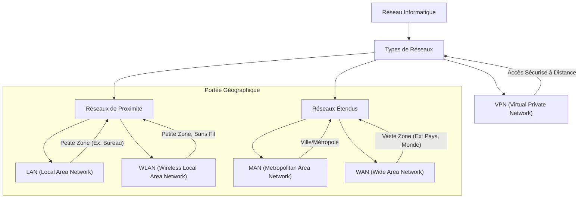

---
aliases:
  - Les Réseaux Informatiques - Comprendre Les Connexions Numériques
  - 02-07 | Les Réseaux Informatiques - Comprendre Les Connexions Numériques
archetype: cour
module: "IIC (Introduction à l'informatique et cybersécurité)"
cssclasses:
  - max
tags:
  - architecture/reseau
  - architecture/reseau/types
  - architecture/reseau/vpn
  - reseau/lan
  - reseau/wan
  - reseau/definition
---

# 02-07 | Les Réseaux Informatiques - Comprendre Les Connexions Numériques

> [!goal] Objectifs Pédagogiques
> À la fin de cette fiche, je dois être capable de :
> 1. Comprendre la définition fondamentale d'un réseau informatique et ses éléments clés.
> 2. Identifier et distinguer les principaux types de réseaux (LAN, WLAN, MAN, WAN, VPN) selon leur portée et leur usage.
> 3. Expliquer les caractéristiques et les technologies associées aux réseaux de proximité et étendus.
> 4. Saisir l'importance du concept de VPN pour la sécurité et l'accès à distance dans les communications numériques.

## 📝 Synthèse du Cours

Découvrez l'univers fascinant des [[IIC02-07_LesReseauxInformatiquesComprendreLesConnexionsNumeriques|réseaux informatiques]], ces systèmes invisibles qui connectent notre [[DigitalEnvironmentsEssentials|monde numérique]] et permettent l'échange d'informations à travers la planète.

### 1. Définition et Éléments Clés d'un Réseau Informatique
Un **[[IIC02-07_LesReseauxInformatiquesComprendreLesConnexionsNumeriques|réseau informatique]]** est un ensemble de [[ComputerPeripheral|périphériques]] et de [[OperatingSystem|systèmes]] interconnectés capables d'échanger des données et des ressources. Cette infrastructure invisible permet à nos appareils de [[Communication|communiquer]] entre eux.

Ces périphériques incluent :
*   Des *ordinateurs* et des *[[Server|serveurs]]*.
*   Des *[[Router|routeurs]]* et des *[[Switch|commutateurs]]*.
*   Des *imprimantes réseau*.
*   Des *[[Application|applications logicielles]]* et services.
*   Des *protocoles de communication* qui facilitent le partage d'informations.

> [!note] Définition Clé
> **Réseau Informatique** : Un ensemble de [[ComputerPeripheral|périphériques]] et de [[OperatingSystem|systèmes]] interconnectés capables d'échanger des données et des ressources pour permettre la [[Communication|communication]] et le partage d'informations.

### 2. Vue d'Ensemble des Types de Réseaux
Il existe plusieurs types de réseaux, chacun conçu pour servir des finalités et des environnements différents. Comprendre ces distinctions est essentiel pour maîtriser l'architecture réseau moderne.
*   **[[LocalAreaNetwork|LAN]]** (*Local Area Network*) : [[LocalAreaNetwork|Réseau Local]], petite zone géographique.
*   **[[VirtualPrivateNetwork|VPN]]** (*Virtual Private Network*) : [[VirtualPrivateNetwork|Réseau Privé Virtuel]], connexion sécurisée.
*   **[[MetropolitanAreaNetwork|MAN]]** (*Metropolitan Area Network*) : [[MetropolitanAreaNetwork|Réseau Métropolitain]], zone urbaine.
*   **[[WideAreaNetwork|WAN]]** (*Wide Area Network*) : [[WideAreaNetwork|Réseau Étendu]], vaste zone géographique.
*   **[[WirelessLocalAreaNetwork|WLAN]]** (*Wireless Local Area Network*) : [[WirelessLocalAreaNetwork|Réseau Sans Fil]], communication [[WiFi|Wi-Fi]].

### 3. Réseaux de Proximité : LAN et WLAN

#### Réseau Local (LAN)
Un **[[LocalAreaNetwork|LAN]]** couvre une petite zone géographique, généralement au sein d'un seul bâtiment ou campus. Couramment utilisés dans les maisons, bureaux, écoles et petites entreprises.
*   Connexion via câbles *[[EthernetCable|Ethernet]]*.
*   [[Communication|Communication]] à haut débit.
*   Partage de ressources locales ([[Server|serveurs]], imprimantes partagés).

#### Réseau Sans Fil (WLAN)
Un **[[WirelessLocalAreaNetwork|WLAN]]** utilise des technologies sans fil comme le *[[WiFi|Wi-Fi]]* pour connecter les appareils sans câbles physiques. Idéal pour la mobilité et la flexibilité.
*   Utilise des points d'accès [[WiFi|Wi-Fi]] pour émettre des signaux radio.
*   Offre une zone de couverture flexible.
*   Permet un accès mobile aux ressources.

### 4. Réseaux Étendus : WAN et MAN

#### Réseau Étendu (WAN)
Un **[[WideAreaNetwork|WAN]]** couvre une vaste zone géographique (ville, pays ou planète entière). Ces réseaux connectent plusieurs [[LocalAreaNetwork|LAN]] sur de longues distances grâce aux infrastructures de télécommunications.
Technologies Utilisées :
*   Câbles à *[[FiberOpticCable|fibres optiques]]*.
*   Liaisons *satellitaires*.
*   Lignes louées privées.
*   Infrastructures de télécommunications.

[[Internet]] est le plus grand [[WideAreaNetwork|WAN]] mondial, connectant des millions de réseaux et d'appareils, permettant une [[Communication|communication]] planétaire.

#### Réseau Métropolitain (MAN)
Un **[[MetropolitanAreaNetwork|MAN]]** couvre une zone plus vaste qu'un [[LocalAreaNetwork|LAN]] mais plus petite qu'un [[WideAreaNetwork|WAN]], généralement une ville ou zone métropolitaine. Utilisé par les grandes organisations, universités et agences gouvernementales.

### 5. VPN : Sécurité et Accès à Distance

#### Connexion Sécurisée
Un **VPN** (Virtual Private Network) est un réseau sécurisé permettant aux utilisateurs de se connecter à un réseau privé via un réseau public comme [[Internet]].

#### Chiffrement des Données
Les VPN chiffrent toutes les données transmises sur le réseau public, garantissant la [[Confidentiality|confidentialité]] et la [[DataSecurity|sécurité des informations]] sensibles.

#### Accès à Distance
Couramment utilisés par les télétravailleurs et entreprises pour accéder aux réseaux d'entreprise en toute sécurité depuis n'importe quel endroit.

> [!info] Avantage Clé
> Les VPN permettent un accès sécurisé aux ressources d'entreprise depuis n'importe où dans le monde, facilitant le travail à distance tout en maintenant la [[DataSecurity|sécurité des données]].

### 6. Récapitulatif : Choisir Le Bon Réseau
Chaque type de réseau répond à des besoins spécifiques selon la portée géographique, les exigences de sécurité et les ressources disponibles.
*   **100m** : [[LocalAreaNetwork|LAN]] (Portée typique d'un réseau local)
*   **50km** : [[MetropolitanAreaNetwork|MAN]] (Couverture métropolitaine moyenne)
*   **∞** : [[WideAreaNetwork|WAN]] (Connexion mondiale illimitée)

Points Clés à Retenir :
*   **Adaptabilité** : Choisissez le type de réseau selon vos besoins géographiques et organisationnels.
*   **Sécurité** : Les VPN offrent une couche de protection essentielle pour les connexions à distance.
*   **Évolution** : Les réseaux continuent d'évoluer avec les nouvelles technologies et besoins.

## 🧠 Carte Mentale / Schéma

## ❓ Quiz de Révision (Active Recall)
> [!question] Question 1
> Qu'est-ce qu'un réseau informatique et quels sont ses éléments clés ?
> > [!success]- Réponse
> > Un **réseau informatique** est un ensemble de périphériques et de systèmes interconnectés permettant d'échanger des données et des ressources. Ses éléments clés incluent ordinateurs, serveurs, routeurs, commutateurs, imprimantes réseau, applications logicielles et protocoles de communication.

> [!question] Question 2
> Quelle est la principale différence de portée géographique entre un LAN et un WAN ?
> > [!success]- Réponse
> > Un **LAN** (Local Area Network) couvre une petite zone géographique (ex: un bâtiment ou un campus), tandis qu'un **WAN** (Wide Area Network) couvre une très vaste zone géographique (ex: une ville, un pays ou le monde entier).

> [!question] Question 3
> Quel est l'objectif principal d'un VPN et comment contribue-t-il à la sécurité ?
> > [!success]- Réponse
> > L'objectif principal d'un **VPN** (Virtual Private Network) est de permettre une connexion sécurisée à un réseau privé via un réseau public (comme Internet). Il contribue à la sécurité en *chiffrant* toutes les données transmises, garantissant ainsi la confidentialité et l'intégrité des informations sensibles, notamment pour l'accès à distance.

## 🔗 Liens du Module
*   **Précédent** : [[IIC02-06_LaProgrammationInformatiqueDonnerDesInstructionsAuxOrdinateurs|02-06 | La Programmation Informatique - Donner des Instructions aux Ordinateurs]]
*   **Suivant** : [[IIC02-08_LesIndicateursDeConnexion|02-08 | Les Indicateurs De Connexion]]
*   **Ressource Externe** : [Réseaux Informatiques sur Wikipedia](https://fr.wikipedia.org/wiki/R%C3%A9seau_informatique)
