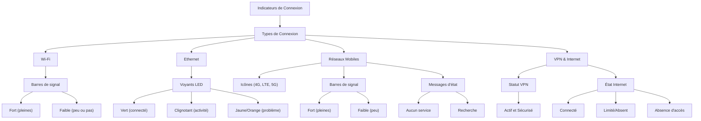

---
aliases:
  - Les Indicateurs De Connexion
  - 02-08 | Les Indicateurs De Connexion
  - Connection Indicators
archetype: cour
module: "IIC (Introduction à l'informatique et cybersécurité)"
cssclasses:
  - max
tags:
  - réseau/connexion/indicateurs
  - réseau/diagnostique/état
  - wi-fi/signal
  - ethernet/voyants-led
  - mobile/couverture
  - vpn/état-connexion
---

# 02-08 | Les Indicateurs De Connexion

> [!goal] Objectifs Pédagogiques
> À la fin de cette fiche, je dois être capable de :
> 1. Identifier les principaux types d'indicateurs de connexion réseau.
> 2. Interpréter la signification des indicateurs visuels (barres de signal, voyants LED) pour différents types de connexions (Wi-Fi, [[Ethernet]], mobile).
> 3. Comprendre l'importance des indicateurs pour évaluer l'état et la qualité d'une connexion.

## 📝 Synthèse du Cours

### 1. Introduction aux Indicateurs de Connexion
Les *indicateurs de connexion* sont des indices *visuels* ou *auditifs* qui fournissent des informations sur l'état d'une connexion réseau. Ils sont essentiels pour aider les utilisateurs à déterminer rapidement :
*   Si un appareil est *connecté* à un réseau.
*   La *force* et la *qualité* de la [[Connectivity|connexion]].
*   Si les données sont *transmises* avec succès.

> [!note] Définition Clé
> **Indicateur de connexion** : Un signal (visuel ou auditif) qui transmet des informations sur l'état, la force, la qualité et l'activité d'une connexion réseau ou [[Internet]].

### 2. Typologie des Indicateurs de Connexion
Plusieurs technologies de connexion possèdent leurs propres indicateurs spécifiques.

#### 2.1. Indicateurs Wi-Fi
Les indicateurs de connexion [[WiFi|Wi-Fi]] sont généralement représentés par des *barres de signal* ou des icônes affichées sur l'écran d'un appareil.
*   **Signal fort** : Des barres pleines indiquent un signal Wi-Fi robuste, garantissant une excellente connectivité.
*   **Signal faible** : Peu de barres (ou aucune) signalent un signal Wi-Fi faible, ce qui peut entraîner une connexion lente ou peu fiable.

#### 2.2. Indicateurs Ethernet
Les indicateurs [[EthernetCable|Ethernet]] se manifestent par des *voyants LED* sur les [[ComputerPeripheral|périphériques]] réseau ([[Router|routeurs]], [[Switch|commutateurs]], cartes d'interface réseau) ou par des messages d'état dans les paramètres [[OperatingSystem|système]].
*   **Voyant vert** : Indique généralement une connexion réussie au réseau.
*   **Voyant clignotant** : Souvent, il signale une activité de transmission ou de réception de données.
*   **Voyant jaune/orange** : Peut indiquer un problème de connexion, une connectivité limitée ou une vitesse de lien inférieure.

#### 2.3. Indicateurs de Réseaux Mobiles
Les appareils mobiles affichent des icônes (par exemple, 4G, LTE, 5G) et des *barres de signal* pour indiquer l'état du réseau cellulaire.
*   **Barres de signal pleines** : Indiquent une forte couverture du réseau mobile.
*   **Une ou deux barres** : Signifient une faible intensité du signal, pouvant résulter en un ralentissement des vitesses de données ou des interruptions d'appels.
*   **"Aucun service" ou "Recherche"** : Indique que l'appareil est incapable de se connecter au réseau mobile.

#### 2.4. Indicateurs de Connexion VPN et État d'Internet
*   **Connexions VPN** : Les [[IIC02-05_LeMondeDesApplicationsLogicielles|logiciels]] [[VirtualPrivateNetwork|VPN]] fournissent des indicateurs pour confirmer si la connexion VPN est *active* et [[Cybersecurity|sécurisée]].
*   **État de la Connectivité Internet** : Les périphériques peuvent afficher des indicateurs distincts pour l'accès à Internet :
    *   **Icône "Connecté"** : Signale que l'appareil a un accès fonctionnel à Internet.
    *   **Point d'exclamation ou symbole d'avertissement** : Indique une connectivité Internet limitée ou inexistante.
    *   **Message "Absence d'accès à Internet"** : L'appareil est connecté à un [[LocalAreaNetwork|réseau local]], mais ne peut pas accéder à Internet.

## 🧠 Carte Mentale / Schéma

## ❓ Quiz de Révision (Active Recall)
> [!question] Question 1
> Que signifie un voyant LED jaune ou orange sur un port Ethernet d'un routeur ?
> > [!success]- Réponse
> > Cela indique généralement un problème de connexion réseau ou une connectivité limitée, voire une vitesse de liaison inférieure.

> [!question] Question 2
> Lorsque votre appareil mobile affiche "Aucun service" ou "Recherche", qu'est-ce que cela implique pour votre capacité à utiliser le réseau cellulaire ?
> > [!success]- Réponse
> > Cela signifie que l'appareil ne peut pas se connecter au réseau mobile et, par conséquent, ne peut ni passer d'appels, ni utiliser les données mobiles.

> [!question] Question 3
> Quel est l'objectif principal des indicateurs de connexion pour un utilisateur ?
> > [!success]- Réponse
> > L'objectif principal est de fournir un diagnostic rapide et visuel de l'état (connecté/déconnecté), de la qualité (force du signal), et de l'activité (transmission de données) de la connexion, permettant à l'utilisateur de comprendre rapidement l'état de son réseau.

## 🔗 Liens du Module
* **Précédent** : [[IIC02-07_LesReseauxInformatiquesComprendreLesConnexionsNumeriques|02-07 | Les Réseaux Informatiques - Comprendre Les Connexions Numériques]]
* **Suivant** : [[IIC03-01_LaCybersecuriteProtegerNotreMondeNumerique|03-01 | La Cybersécurité - Protéger Notre Monde Numérique]]
