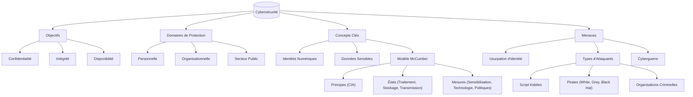

---
aliases:
  - "La Cybersécurité - Protéger Notre Monde Numérique"
  - "03-01 | La Cybersécurité - Protéger Notre Monde Numérique"
archetype: cour
module: "IIC (Introduction à l'informatique et cybersécurité)"
cssclasses:
  - max
tags:
  - cybersécurité
  - cybersécurité/introduction
  - definition
  - modele/mccumber-cube
  - cybersécurité/principes/cia-triad
  - identite-numerique
  - identite/en-ligne
  - identite/hors-ligne
  - identite-numerique/empreinte-numerique
  - donnees/personnelles
  - donnees/sensibles
  - protection/donnees-personnelles
  - cybersecurite/menaces/usurpation-identite
  - acteur-de-menace/cybercriminel
  - cyberwarfare
  - vecteur-attaque/phishing
  - malware
  - vol-donnees
  - securite/niveaux-protection
  - informatique/systeme
---

# 03-01 | La Cybersécurité - Protéger Notre Monde Numérique

> [!goal] Objectifs Pédagogiques
> À la fin de cette fiche, je dois être capable de :
> 1.  Comprendre la définition et l'importance de la **[[Cybersecurity|cybersécurité]]** à travers différents niveaux de protection (personnel, organisationnel, public).
> 2.  Distinguer l'**identité hors ligne** de l'**identité en ligne** et identifier les différents types de **[[PersonalData|données personnelles]]** et professionnelles nécessitant une protection.
> 3.  Expliquer le concept d'**[[IdentityTheft|usurpation d'identité]]** et les acteurs qui convoitent nos données.
> 4.  Maîtriser les principes du **[[McCumberCube|Cube de McCumber]]** et les **trois piliers de la sécurité informatique ([[CIATriad]])**.
> 5.  Connaître les différentes catégories d'**attaquants numériques** et les enjeux de la **[[Cyberwarfare|cyberguerre]]**.

## 📝 Synthèse du Cours

### 1. Introduction à la Cybersécurité

La **cybersécurité** est un effort continu et essentiel visant à protéger les individus, les organisations et les gouvernements contre les attaques numériques. Elle englobe l'ensemble des mesures techniques et humaines mises en œuvre pour sécuriser les systèmes informatiques et les données en réseau contre toute utilisation non autorisée, dommage, modification ou destruction.

> [!note] Définition Clé
> **Cybersécurité** : Ensemble des technologies, processus et contrôles conçus pour protéger les réseaux, les ordinateurs, les programmes et les données contre les attaques, les dommages ou les accès non autorisés.

### 2. Les Niveaux de Protection en Cybersécurité

La cybersécurité s'exerce à différents niveaux, chacun ayant des responsabilités et des enjeux spécifiques :

*   **Protection Personnelle** : Vise à protéger votre identité, vos données privées et vos appareils contre les cybermenaces (hameçonnage, [[Malware|logiciels malveillants]], vol de données).
*   **Protection Organisationnelle** : Représente la responsabilité collective de sauvegarder la réputation, les [[SensitiveData|données sensibles]] et les clients d'une organisation face aux cyberattaques.
*   **Protection du Secteur Public** : Consiste à sécuriser les informations vitales pour la sécurité nationale, la stabilité économique et le bien-être des citoyens (infrastructures critiques, données gouvernementales).

### 3. Identités et Données Personnelles : Un Trésor Convoité

La distinction entre identité hors ligne et en ligne est fondamentale pour comprendre les risques.

#### Identité Hors Ligne
C'est le personnage que vous présentez quotidiennement dans le monde physique.
*   **Informations Clés** : Nom, âge, adresse, données sur votre vie personnelle, documents officiels (carte d'identité, permis de conduire).
*   **Enjeux** : Sécuriser cette identité physique est crucial pour éviter le vol de documents ou l'usurpation d'identité dans la vie réelle.

#### Identité En Ligne
C'est ce qui vous représente sur [[Internet]].
*   **Informations Clés** : Noms d'utilisateur, alias, profils sur les [[SocialNetworks|réseaux sociaux]], [[Account|comptes utilisateur]], empreinte numérique.
*   **Enjeux** : Il est vital de limiter la divulgation d'informations personnelles pour contrôler votre **empreinte numérique** et réduire les risques d'usurpation d'identité en ligne.

> [!note] Définition Clé
> **Données Personnelles** : Toute information se rapportant à une personne physique identifiée ou identifiable. Cela inclut nom, numéro de sécurité sociale, données biométriques, informations de localisation, photos, messages privés.

#### Types de Données Sensibles à Protéger
Les **[[ThreatActor|cybercriminels]]** convoitent ces informations pour vous identifier et les exploiter :
*   **Dossiers Médicaux** : Historique de santé, données de dispositifs de suivi fitness (fréquence cardiaque, tension artérielle) souvent stockées dans le cloud.
*   **Dossiers Scolaires** : Diplômes, résultats, coordonnées, rapports disciplinaires, données de santé.
*   **Dossiers Financiers** : Informations d'emploi, revenus, dépenses, dossiers fiscaux, relevés bancaires, cote de crédit.

#### Le Voyage de Vos Photos : Un Exemple Révélateur
Cet exemple illustre la diffusion rapide et incontrôlable de vos données une fois partagées :
1.  **Prise de Photo** : Les photos sont sur votre appareil.
2.  **Partage avec Amis** : Copies envoyées à plusieurs amis dans le monde.
3.  **Téléchargement Multiple** : Vos amis téléchargent les photos.
4.  **Publication En Ligne** : Un ami les publie, les rendant accessibles mondialement sur des serveurs et potentiellement à des inconnus.

### 4. L'Usurpation d'identité et les Convoitises

L'**usurpation d'identité** va au-delà du simple vol d'argent ; elle implique souvent une exploitation à long terme avec des conséquences graves.

*   **Vol Médical** : Utilisation de votre identité pour bénéficier de soins médicaux, compromettant votre dossier.
*   **Vol Bancaire** : Accès à vos comptes, cartes de crédit, faux prêts ou déclarations fiscales en votre nom.

#### Qui d'Autre Convoite Vos Données ?
De nombreux acteurs, légaux ou non, collectent et exploitent vos données :
*   **[[InternetServiceProvider|Fournisseurs d'Accès Internet]] (FAI)** : Suivent votre activité en ligne, peuvent vendre vos données ou les partager avec les autorités.
*   **Annonceurs** : Surveillent vos habitudes d'achat et préférences pour des publicités ciblées.
*   **Moteurs de Recherche** : Collectent des informations sur votre sexe, localisation, opinions politiques via vos recherches.
*   **Sites Web** : Utilisent des *[[Cookies|cookies]]* pour suivre vos activités, créant une trace liée à votre identité en ligne.

### 5. Les Données d'Entreprise : Actifs Stratégiques

Les entreprises possèdent des données cruciales pour leur fonctionnement et leur compétitivité.
*   **Données Transactionnelles** : Informations sur les achats, ventes, production, utilisées pour les décisions stratégiques.
*   **[[IIC01-08_LaProprieteIntellectuelleALereNumerique|Propriété Intellectuelle]]** : Brevets, marques déposées, plans produits, secrets commerciaux. Leur perte peut être désastreuse pour l'avantage concurrentiel.
*   **Données Financières** : Comptes de résultat, bilans, tableaux de trésorerie révélant la santé économique de l'entreprise.

### 6. Le Cube de McCumber : Modèle de Sécurité Tridimensionnel

Créé par John McCumber en 1991, ce modèle est un cadre conceptuel pour comprendre et évaluer les initiatives de sécurité de l'information. Il met en évidence trois dimensions essentielles :

1.  **Principes** (Objectifs) :
    *   **[[Confidentiality|Confidentialité]]**
    *   **Intégrité**
    *   **Disponibilité**
2.  **États** (des données) :
    *   **Traitement** (en cours)
    *   **Stockage** (au repos)
    *   **Transmission** (en transit)
3.  **Mesures** (Moyens de protection) :
    *   **Sensibilisation / Formation**
    *   **Technologie**
    *   **Politiques**

Chaque interaction d'un principe avec un état et une mesure représente un point de contrôle de sécurité.

### 7. Les Trois Piliers de la Sécurité Informatique (CIA Triad)

Les trois principes fondamentaux du Cube de McCumber sont souvent désignés comme la **Triade CIA**.

#### 7.1. Confidentialité
*   **Définition** : Garantit que l'information n'est accessible qu'aux entités autorisées.
*   **Mesures** : Chiffrement, [[TwoFactorAuthentication|authentification multi-facteurs]], contrôle d'accès basé sur les rôles.

#### 7.2. Intégrité
*   **Définition** : Assure que l'information est exacte, complète et n'a pas été altérée de manière non autorisée.
*   **Mesures** : Fonctions de hachage, sommes de contrôle (checksums), signatures numériques.

#### 7.3. Disponibilité
*   **Définition** : Garantit que les systèmes et les données sont accessibles aux utilisateurs autorisés quand ils en ont besoin.
*   **Mesures** : Maintenance régulière, mises à jour logicielles, sauvegardes régulières, plans de reprise après sinistre, [[Redundancy|redondance]] des systèmes.

### 8. États des Données et Mesures de Protection

#### États des Données
*   **Traitement** : Données actives utilisées par des [[Application|applications]] (données en cours).
*   **Stockage** : Données conservées sur des supports physiques ou numériques (disques durs, bases de données, cloud - données au repos).
*   **Transmission** : Données circulant sur un réseau entre deux ou plusieurs systèmes (données en transit).

#### Mesures de Sécurité
*   **Sensibilisation** : Formation des utilisateurs aux menaces et aux meilleures pratiques de sécurité.
*   **Technologie** : Solutions logicielles et matérielles (pare-feux, antivirus, systèmes de détection d'intrusion).
*   **Politiques** : Contrôles administratifs, procédures de sécurité, plans de réponse aux incidents.

### 9. Types d'Attaquants : Du Novice au Professionnel

Les motivations et les compétences des attaquants varient considérablement :

*   **[[ScriptKiddie|Script Kiddies]] (Amateurs)** : Individus inexpérimentés qui utilisent des outils et des scripts existants, souvent sans comprendre pleinement leur fonctionnement. Leurs attaques peuvent néanmoins être destructrices.
*   **Pirates Informatiques (Hackers)** :
    *   **[[WhiteHatHacker|Chapeaux Blancs]] (White Hats)** : Hackers éthiques, autorisés à tester la sécurité des systèmes.
    *   **[[GreyHat|Chapeaux Gris]] (Grey Hats)** : Agissent sans autorisation, mais sans intention malveillante claire, parfois pour exposer des vulnérabilités.
    *   **[[BlackHat|Chapeaux Noirs]] (Black Hats)** : Hackers malveillants avec l'intention de nuire ou de voler.
*   **Hackers Organisés** : Groupes criminels, [[Hacktivist|hacktivistes]] (motivés par des causes idéologiques), [[CyberTerrorist|terroristes]] ou groupes étatiques. Ils sont très sophistiqués, bien financés et ont des objectifs précis.

### 10. La Cyberguerre : Nouvelle Forme de Conflit

La **cyberguerre** est l'utilisation de la technologie pour attaquer les systèmes informatiques d'un autre pays afin de causer des dommages ou des perturbations, sans invasion physique.

*   **Espionnage Industriel et Militaire** : Vol de secrets défense, technologies avancées pour réduire les lacunes militaires ou industrielles.
*   **Perturbation d'Infrastructure** : Attaque d'infrastructures critiques (réseaux électriques, transports, systèmes financiers) pour provoquer le chaos.

#### Impact de la Cyberguerre sur la Société
Une cyberattaque majeure peut avoir des conséquences dévastatrices sur la vie quotidienne :
*   **Paralysie des Transports** : Routes bloquées, interruption des échanges de biens et services.
*   **Crise Sanitaire** : Impossibilité pour les hôpitaux de fonctionner, patients sans soins urgents.
*   **Isolement Numérique** : Coupure d'accès à Internet et aux communications.
*   **Déstabilisation Politique** : Perte de confiance des citoyens, instabilité gouvernementale.

## 🧠 Carte Mentale / Schéma

## ❓ Quiz de Révision (Active Recall)
> [!question] Question 1
> Quels sont les trois piliers fondamentaux de la sécurité informatique, souvent appelés la Triade CIA ? Décrivez brièvement chaque pilier.
> > [!success]- Réponse
> > Les trois piliers sont :
> > 1.  **Confidentialité** : Assurer que l'information n'est accessible qu'aux entités autorisées.
> > 2.  **Intégrité** : Garantir que l'information est exacte, complète et non altérée de manière non autorisée.
> > 3.  **Disponibilité** : S'assurer que les systèmes et données sont accessibles aux utilisateurs autorisés quand nécessaire.

> [!question] Question 2
> Le Cube de McCumber propose un modèle tridimensionnel pour évaluer la sécurité de l'information. Quelles sont ces trois dimensions et quels éléments contient chacune d'elles ?
> > [!success]- Réponse
> > Les trois dimensions du Cube de McCumber sont :
> > 1.  **Principes** : Confidentialité, Intégrité, Disponibilité.
> > 2.  **États des Données** : Traitement (en cours), Stockage (au repos), Transmission (en transit).
> > 3.  **Mesures de Sécurité** : Sensibilisation/Formation, Technologie, Politiques.

> [!question] Question 3
> Donnez trois exemples de données personnelles sensibles qu'il est crucial de protéger et expliquez pourquoi elles sont particulièrement convoitées par les cybercriminels.
> > [!success]- Réponse
> > Trois exemples de données personnelles sensibles sont les **dossiers médicaux**, les **dossiers scolaires** et les **dossiers financiers**.
> > Elles sont convoitées car elles permettent aux cybercriminels de réaliser de l'**usurpation d'identité** pour des vols médicaux (bénéficier de soins à votre place), bancaires (accéder à vos comptes, contracter des prêts) ou pour créer des profils très détaillés et les exploiter à long terme pour diverses fraudes.

## 🔗 Liens du Module
*   **Précédent** : [[IIC02-08_LesIndicateursDeConnexion|02-08 | Les Indicateurs De Connexion]]
*   **Suivant** : [[IIC03-02_CybersecuriteProtegerVosDonneesNumeriques|03-02 | Cybersécurité - Protéger vos Données Numériques]]

