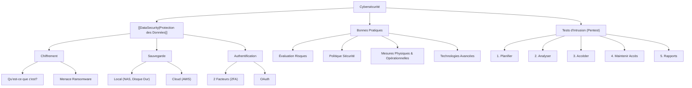

---
aliases:
  - "Cybersécurité - Protéger vos Données Numériques"
  - "03-02 | Cybersécurité - Protéger vos Données Numériques"
archetype: cour
module: "IIC (Introduction à l'informatique et cybersécurité)"
cssclasses:
  - max
tags:
  - cybersécurité
  - protection-des-donnees
  - securite/information
  - cryptographie/chiffrement
  - encryption
  - malware/ransomware
  - backup
  - cloud/stockage
  - authentification/mfa
  - pentest
  - securite/principes
  - evaluation_des_risques
  - politique/securite
  - phishing
  - malware
  - ingenierie-sociale
  - protocole/oauth
---

# 03-02 | Cybersécurité - Protéger vos Données Numériques

> [!goal] Objectifs Pédagogiques
> À la fin de cette fiche, je dois être capable de :
> 1. Expliquer le rôle du chiffrement dans la protection des données et identifier les menaces associées, comme le *ransomware*.
> 2. Décrire et mettre en œuvre différentes stratégies de sauvegarde des données, incluant les solutions locales et le *cloud*.
> 3. Comprendre le principe et les méthodes de l'[[TwoFactorAuthentication|authentification à deux facteurs (2FA)]] et ses limites.
> 4. Appliquer les bonnes pratiques de sécurité recommandées par les organisations reconnues.
> 5. Définir et identifier les phases d'un [[PenetrationTest|test d'intrusion (pentest)]].

## 📝 Synthèse du Cours

### 1. Le Chiffrement : Votre Première Ligne De Défense

Dans un monde de plus en plus connecté, la protection des informations numériques est cruciale. Le chiffrement est une technique fondamentale de la [[Cybersecurity|cybersécurité]].

#### Qu'est-ce Que Le Chiffrement ?
Le chiffrement est un processus qui convertit les informations en un format illisible pour toute partie non autorisée. Seule une personne disposant de la clé de chiffrement (code secret ou [[Password|mot de passe]]) peut déchiffrer les données et accéder à leur contenu original.

> [!important] Note Importante sur le Chiffrement
> Le chiffrement n'empêche pas l'interception des données. Il assure que, même si les données sont interceptées, elles restent inintelligibles pour une personne non autorisée.

#### Menaces Du Chiffrement Malveillant : Le [[Ransomware]]
Les cybercriminels peuvent exploiter le principe du chiffrement de manière malveillante.
> [!note] Définition Clé
> Le Ransomware est un type de [[Malware|logiciel malveillant]] qui chiffre les données de la victime, les rendant inutilisables, puis exige une rançon pour les déchiffrer.
Cette menace souligne l'importance vitale d'avoir des sauvegardes régulières et sécurisées de vos données.

### 2. Stratégies De Sauvegarde Des Données

Avoir une sauvegarde permet d'empêcher la perte de données irremplaçables. Une stratégie efficace implique de copier régulièrement et automatiquement vos données sur un support de stockage supplémentaire.

#### Emplacements de Stockage des Sauvegardes
*   Réseau Domestique / Stockage Local :
    *   Vous conservez un contrôle total sur vos données.
    *   Vous êtes responsable de la maintenance et des coûts des équipements.
    *   Exemples : Serveurs NAS (Network Attached Storage), disques durs externes.
*   Périphériques de Stockage Secondaires :
    *   Disques durs externes, clés USB, CD/DVD, bandes magnétiques.
*   Cloud :
    *   Services de stockage en ligne (ex: Amazon Web Services (AWS)).
    *   Coût généralement basé sur l'espace de stockage nécessaire.
    *   Offre une protection contre les pannes matérielles, les incendies, les vols et autres situations extrêmes.

#### Avantages Du Stockage Cloud
*   Protection Maximale : Vos données sont protégées contre les pannes locales et les catastrophes.
*   [[Redundancy|Redondance Automatique]] : Les fournisseurs de Cloud gèrent la duplication des données sur plusieurs sites.
*   Accès Universel : Accédez à vos données depuis n'importe où, avec n'importe quel appareil connecté.
*   Maintenance Professionnelle : La maintenance de l'infrastructure est gérée par le fournisseur.

### 3. Authentification à Deux Facteurs (2FA)

L'authentification à deux facteurs (2FA) ajoute une couche de sécurité supplémentaire en demandant un second élément de vérification au-delà du simple nom d'utilisateur et mot de passe (ou PIN/modèle).

#### Types de Second Facteur
*   Objet Physique : Carte bancaire, téléphone portable (via une [[Application|application]]), porte-clés de sécurité (token physique).
*   Balayage Biométrique : Empreinte digitale, reconnaissance palmaire, vocale ou faciale.
*   Code De Vérification : Code temporaire envoyé par SMS, e-mail ou généré par une application d'authentification.

#### Limites De l'Authentification
> [!caution] Vulnérabilités de la 2FA
> Même avec une authentification à deux facteurs, les pirates peuvent toujours obtenir l'accès à vos comptes en ligne, notamment par le biais d'*[[PhishingAttack|attaques d'hameçonnage]]* (phishing), de *programmes malveillants* (malware) et de *piratage psychologique* ([[SocialEngineering|ingénierie sociale]]).

> [!note] Définition Clé
> OAuth (Open Authorization) : Protocole ouvert et normalisé qui permet à un utilisateur identifié d'accéder à des applications tierces sans avoir à exposer son mot de passe utilisateur.

### 4. Bonnes Pratiques De Sécurité

De nombreuses organisations comme l'Institut national des normes et de la technologie (NIST) ou le SANS Institute publient des listes de bonnes pratiques de sécurité.

#### Principes Fondamentaux
1.  [[RiskAssessmentMethodology|Évaluation Des Risques]] : Comprendre la valeur de ce que vous protégez permet de justifier les investissements en sécurité.
2.  Politique De Sécurité : Établir des règles claires, définir les rôles et responsabilités, et fixer les attentes pour les collaborateurs.
3.  Mesures Physiques : Restreindre l'accès aux salles de [[Server|serveurs]] et aux équipements réseau, inclure des systèmes d'extinction d'incendie.

#### Mesures De Sécurité Opérationnelles
*   Ressources Humaines : Effectuer des vérifications d'antécédents pour tous les employés.
*   Sauvegardes Et Tests : Effectuer régulièrement des sauvegardes et tester la récupération des données.
*   Mises à Jour : Mettre à jour fréquemment les [[OperatingSystem|systèmes d'exploitation]], les applications, les serveurs et les [[ComputerPeripheral|périphériques]] réseau.
*   [[AccessControl|Contrôle d'Accès]] : Configurer les rôles et niveaux de privilège des utilisateurs, et mettre en place un système d'authentification rigoureux.

#### Technologies De Sécurité Avancées
*   Solutions Intégrées : [[Router|Routeurs]] de nouvelle génération, [[Firewall|pare-feu]] avancés, appliances de sécurité.
*   Logiciels Spécifiques : [[Antivirus|Antimalware]] et antivirus adaptés aux besoins des entreprises.

> [!important] Chiffrement des [[SensitiveData|Données Sensibles]]
> Chiffrez toutes les données sensibles de l'entreprise, y compris les e-mails.

### 5. Tests d'Intrusion (Pentest) : Évaluer Les Vulnérabilités

> [!note] Définition Clé
> Un test d'intrusion (pentest) est une évaluation des vulnérabilités d'un système informatique, d'un réseau, d'une application ou d'une organisation en simulant une attaque réelle. L'objectif est de découvrir les faiblesses qui pourraient être exploitées.

#### Phases des Tests d'Intrusion
1.  Planifier (Reconnaissance Passive) : Collecter des informations publiques sur le système cible, ses vulnérabilités potentielles et les exploits connus.
2.  Analyser (Reconnaissance Active) : Identifier activement les faiblesses via l'analyse des ports, la détection de vulnérabilités et l'énumération des comptes.
3.  Accéder (Exploitation) : Tenter d'obtenir un accès via l'exploitation de failles, l'*ingénierie sociale*, les vulnérabilités web ou le déchiffrement [[WiFi|Wi-Fi]].
4.  Maintenir l'Accès (Post-Exploitation) : Le testeur maintient un accès persistant pour identifier des données et systèmes critiques. Il peut utiliser des *[[Backdoor|portes dérobées]]*, des *[[Trojan|chevaux de Troie]]* ou des *rootkits* pour masquer sa présence et collecter des données.
5.  Analyse et Rapports : Le testeur fournit un rapport détaillé avec des recommandations pour améliorer la sécurité (mises à jour, politiques, formations). Ces informations sont utilisées pour renforcer les défenses contre de futures cyberattaques.

## 🧠 Carte Mentale / Schéma

## ❓ Quiz de Révision (Active Recall)
> [!question] Question 1
> Expliquez le concept de chiffrement et comment il se distingue des menaces comme le *ransomware*.
> > [!success]- Réponse
> > Le chiffrement est le processus de conversion des données en un format illisible (chiffré) pour les parties non autorisées, ne permettant l'accès qu'avec une clé secrète. Il vise à protéger la [[Confidentiality|confidentialité]] des données. Le ransomware, en revanche, est un logiciel malveillant qui *chiffre* les données de la victime (les rendant inutilisables) et exige une rançon pour les restaurer. Le chiffrement est un outil de sécurité, tandis que le ransomware utilise ce même principe pour une extorsion malveillante.

> [!question] Question 2
> Quelles sont les trois principales stratégies de sauvegarde des données mentionnées dans le cours, et quels sont les avantages du stockage *cloud* ?
> > [!success]- Réponse
> > Les trois principales stratégies sont : le stockage sur un réseau domestique (local), sur des périphériques de stockage secondaires (disques durs externes, clés USB) et le Cloud. Les avantages du stockage Cloud incluent une protection maximale contre les pannes et catastrophes locales, la redondance automatique des données, l'accès depuis n'importe où et une maintenance professionnelle de l'infrastructure.

> [!question] Question 3
> Décrivez les cinq phases principales d'un test d'intrusion (pentest).
> > [!success]- Réponse
> > Les cinq phases d'un test d'intrusion sont :
> > 1.  Planifier : Recueillir des informations et définir la portée du test.
> > 2.  Analyser : Effectuer une reconnaissance active pour identifier les vulnérabilités.
> > 3.  Accéder : Tenter d'exploiter les vulnérabilités pour obtenir un accès.
> > 4.  Maintenir l'Accès : Conserver l'accès pour identifier d'autres systèmes et données critiques.
> > 5.  Analyse et Rapports : Fournir un feedback détaillé et des recommandations pour améliorer la sécurité.

## 🔗 Liens du Module
*   **Précédent** : [[IIC03-01_LaCybersecuriteProtegerNotreMondeNumerique|03-01 | La Cybersécurité - Protéger Notre Monde Numérique]]
*   **Suivant** : [[IIC03-03_VulnerabilitesEtSecuriteInformatique|03-03 | Vulnérabilités et Sécurité Informatique]]
*   **Ressource Externe** : [National Institute of Standards and Technology (NIST)](https://www.nist.gov/cybersecurity)
*   **Ressource Externe** : [SANS Institute](https://www.sans.org/)
