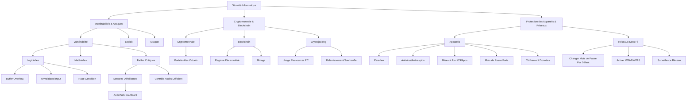

---
aliases:
  - Vulnérabilités et Sécurité Informatique
  - 03-03 | Vulnérabilités et Sécurité Informatique
  - Vulnerabilities and Computer Security
archetype: cour
module: IIC (Introduction à l'informatique et cybersécurité)
cssclasses:
  - max
tags:
  - vulnerabilite
  - exploitation
  - attaque
  - concept/definition
  - vulnerabilite/buffer-overflow
  - vulnerabilite/entree-non-validee
  - vulnerabilite/race-condition
  - vulnerabilite/mauvaise-configuration
  - vulnerabilite/acces/controle
  - privileges/elevation
  - cryptomonnaie
  - blockchain
  - cryptojacking
  - securite/protection-donnees
  - securite/sans-fil
  - endpoint-security
---

# 03-03 | Vulnérabilités et Sécurité Informatique

> [!goal] Objectifs Pédagogiques
> À la fin de cette fiche, je dois être capable de :
> 1. Comprendre la nature des vulnérabilités logicielles et matérielles, et la différence entre une **[[SecurityVulnerabilities|vulnérabilité]]**, un **exploit** et une **attaque**.
> 2. Identifier les mesures de protection essentielles pour les appareils et les réseaux sans fil.
> 3. Saisir les principes fondamentaux de la **cryptomonnaie**, de la **blockchain** et la menace du **cryptojacking**.

## 📝 Synthèse du Cours

### 1. Comprendre les Vulnérabilités et les Attaques

Les **vulnérabilités de sécurité** sont des faiblesses inhérentes aux systèmes matériels ou logiciels, que les cybercriminels peuvent exploiter.

*   **Relation entre Vulnérabilité, Exploit et Attaque :**
    *   Une **Vulnérabilité** est un défaut ou une faille dans un système (logiciel, matériel, humain).
    *   Un **Exploit** est un programme ou un code spécifiquement conçu pour tirer parti d'une vulnérabilité connue.
    *   Une **Attaque** est l'action malveillante utilisant un exploit pour accéder illégalement aux systèmes, aux données ou aux ressources, ou pour les perturber.

> [!note] Définition Clé
> **Exploit** : Code ou programme écrit pour profiter d'une vulnérabilité connue dans un logiciel ou un matériel, dans le but de causer un comportement imprévu ou de prendre le contrôle.

#### 1.1 Types de Vulnérabilités Logicielles courantes

*   **[[BufferOverflow|Dépassement de Tampon]] (*Buffer Overflow*)** :
    *   Se produit lorsque des données sont écrites au-delà des limites allouées à un tampon mémoire.
    *   Peut entraîner des pannes de système ou une compromission en permettant l'accès à la mémoire d'autres processus ou l'exécution de code arbitraire.
*   **Entrée Non Validée (*Unvalidated Input*)** :
    *   Survient lorsque les données saisies par l'utilisateur ne sont pas correctement vérifiées, filtrées ou nettoyées.
    *   Des données malveillantes peuvent alors manipuler le programme, par exemple en forçant des allocations mémoire incorrectes, des injections SQL ou des attaques XSS.
*   **Situation de Compétition (*Race Condition*)** :
    *   Vulnérabilité où le résultat d'une opération dépend de l'ordre ou du timing d'événements concurrents, et que cet ordonnancement peut être influencé par un [[ThreatActor|attaquant]].
    *   Peut ouvrir une fenêtre d'exploitation si un attaquant peut influencer la séquence des opérations pour obtenir un avantage.

#### 1.2 Failles de Sécurité Critiques

*   **Mesures de Sécurité Défaillantes** :
    *   L'utilisation de bibliothèques de sécurité non testées, d'implémentations cryptographiques faibles ou d'algorithmes de chiffrement maison peut introduire de nouvelles vulnérabilités.
    *   Exemples incluent une *[[TwoFactorAuthentication|authentification]] faible*, une *autorisation insuffisante* ou un *chiffrement inadéquat*.
*   **[[AccessControl|Contrôle d'Accès]] Déficient** :
    *   Le **Contrôle d'Accès** gère qui peut interagir avec les ressources système et quelles permissions sont accordées.
    *   Une mauvaise configuration ou implémentation du contrôle d'accès est une source majeure de vulnérabilités, pouvant mener à une élévation de privilèges ou un accès non autorisé à des [[SensitiveData|données sensibles]].
    *   L'accès physique direct à un appareil peut potentiellement contourner les contrôles logiciels. Le chiffrement des données et la limitation de l'accès physique sont donc cruciaux.

### 2. La Cryptomonnaie et la Blockchain

La **cryptomonnaie** est une forme de monnaie numérique qui utilise des techniques de chiffrement avancées pour sécuriser et vérifier les transactions, et contrôler la création de nouvelles unités.

*   **Éléments Clés de la Cryptomonnaie :**
    *   **Portefeuilles Virtuels (*Wallets*)** : Les utilisateurs stockent leurs cryptomonnaies dans des portefeuilles chiffrés, qui contiennent des clés publiques et privées.
    *   **Registre Décentralisé (Blockchain)** : Toutes les transactions sont enregistrées dans une blockchain, qui est un registre anonyme et autogéré, distribué sur un réseau pair-à-pair.
    *   **Vérification par Minage (*Mining*)** : Des "mineurs" utilisent la puissance de calcul pour résoudre des énigmes mathématiques complexes. La résolution valide les transactions et les ajoute à la blockchain, ce qui est souvent récompensé par de nouvelles unités de cryptomonnaie.

> [!note] Définition Clé
> **Blockchain** : Registre numérique décentralisé et distribué qui enregistre de manière sécurisée et immuable l'ensemble des transactions de cryptomonnaie, garantissant leur intégrité et leur transparence.

#### 2.1 Le Processus de Transaction Blockchain

1.  **Collecte des Données** : Toutes les quelques minutes, des ordinateurs spécialisés (appelés *nœuds* du réseau) regroupent les dernières transactions non encore validées. Ils les transforment en un "bloc" et les chiffrent sous forme de puzzle cryptographique.
2.  **Processus de Minage** : Des "mineurs", dotés de PC puissants, s'affrontent pour être les premiers à résoudre ce puzzle cryptographique. Le premier à trouver la solution valide le bloc de transactions.
3.  **Mise à Jour Globale** : Une fois vérifié et validé par le réseau, le nouveau bloc est ajouté à la chaîne de blocs (*blockchain*). Il est ensuite copié et distribué à tous les membres du réseau blockchain mondial, garantissant l'intégrité et la [[Redundancy|redondance]] du registre.

#### 2.2 Cryptojacking : La Menace Invisible

Le **cryptojacking** est une [[Cybersecurity|cyberattaque]] où un attaquant utilise secrètement les ressources informatiques d'une victime (à son insu et sans son consentement) pour miner de la cryptomonnaie à son propre profit.

*   **Modes d'Exploitation :**
    *   **Infection Silencieuse** : Le [[Malware|logiciel malveillant]] de cryptojacking peut être installé par le biais de liens piégés, de logiciels infectés ou de scripts malveillants intégrés à des sites web. Il peut se cacher sur divers appareils (ordinateurs, téléphones, tablettes, [[Server|serveurs]]).
    *   **Exploitation des Ressources** : Il consomme la puissance de calcul (CPU, GPU) de l'appareil infecté, entraînant une diminution significative des performances, un ralentissement du système, une consommation excessive d'énergie et une surchauffe du matériel.
    *   **Victimes Inconscientes** : La plupart des victimes ne réalisent pas que leurs appareils sont compromis car l'attaque est conçue pour être discrète et opérer en arrière-plan sans notifications évidentes.

### 3. Protection des Appareils et Sécurité Sans Fil

La sécurité de vos appareils est primordiale car ils stockent vos [[PersonalData|données personnelles]] et sont votre porte d'entrée vers les services en ligne et d'autres réseaux.

*   **Mesures de Protection Essentielles :**
    1.  **Activer le [[Firewall|Pare-feu]]** : Utilisez un pare-feu logiciel ou matériel, maintenu à jour, pour contrôler le trafic réseau entrant et sortant, et empêcher les accès non autorisés à votre appareil ou réseau.
    2.  **[[Antivirus|Antivirus]] et [[Spyware|Anti-espion]]** : Installez des logiciels antivirus et anti-espions réputés et maintenez-les à jour pour détecter et neutraliser les [[Virus|virus]], [[Trojan|chevaux de Troie]], logiciels espions, [[Ransomware|ransomwares]] et autres programmes malveillants.
    3.  **Mises à Jour Système** : Maintenez votre [[OperatingSystem|système d'exploitation]] (OS), vos [[Browser|navigateurs web]] et toutes vos [[Application|applications]] à jour avec les derniers correctifs de sécurité. Ces mises à jour corrigent les vulnérabilités connues que les attaquants pourraient exploiter.

#### 3.1 Sécurité des Mots de Passe et Chiffrement

*   **[[StrongPasswordManagement|Protection par Mot de Passe Fort]]** :
    *   Tous vos appareils ([[Router|routeurs]], PC, portables, tablettes, smartphones) doivent être protégés par un mot de passe fort, unique et complexe pour empêcher tout accès non autorisé. L'utilisation d'un gestionnaire de mots de passe est fortement recommandée.
*   **[[DataSecurity|Chiffrement des Données]]** :
    *   Les informations stockées sur vos appareils, surtout les données sensibles (documents personnels, informations financières), doivent être chiffrées à l'aide de fonctionnalités intégrées à l'OS (ex: BitLocker, FileVault) ou de logiciels tiers.
    *   Minimisez la quantité de données sensibles stockées sur les terminaux mobiles, car ils sont plus susceptibles d'être perdus ou volés.

> [!caution] Risque des Services Cloud
> Si un [[ComputerPeripheral|périphérique]] est compromis, les cybercriminels peuvent potentiellement accéder à toutes vos données synchronisées via des services cloud comme iCloud, Google Drive ou Dropbox, si les mesures de sécurité appropriées (comme l'authentification multifacteur) ne sont pas activées.

#### 3.2 [[WirelessLocalAreaNetwork|Sécurité du Réseau Sans Fil]]

Les [[WiFi|réseaux Wi-Fi]] permettent la connectivité sans fil des appareils via le [[ServiceSetIdentifier|SSID]] (Service Set Identifier). Une configuration sécurisée est essentielle pour protéger votre réseau domestique ou professionnel.

*   **Bonnes Pratiques de Configuration :**
    *   **Modifier les Paramètres par Défaut** : Les hackers connaissent les SSID et [[Password|mots de passe]] par défaut des routeurs. Changez-les immédiatement après l'installation pour prévenir les intrusions faciles.
    *   **Activer le Chiffrement WPA2 (ou WPA3)** : Activez le WPA2 (Wi-Fi Protected Access II) ou, idéalement, le WPA3 sur votre routeur sans fil. Ces protocoles chiffrent les communications sans fil, rendant l'interception de données beaucoup plus difficile.
    *   **Surveillance Continue** : Vérifiez régulièrement votre réseau sans fil pour détecter toute connexion non autorisée ou activité suspecte. Utilisez les journaux de votre routeur ou des outils d'analyse réseau.

## 🧠 Carte Mentale / Schéma

## ❓ Quiz de Révision (Active Recall)
> [!question] Question 1
> Expliquez la différence fondamentale entre une **vulnérabilité**, un **exploit** et une **attaque**.
> > [!success]- Réponse
> > *   Une **vulnérabilité** est une faille ou une faiblesse dans un système.
> > *   Un **exploit** est un code ou un programme conçu pour cibler et tirer parti de cette vulnérabilité spécifique.
> > *   Une **attaque** est l'action malveillante utilisant l'exploit pour compromettre le système ou les données.

> [!question] Question 2
> Qu'est-ce que le **cryptojacking** et quels sont ses principaux symptômes pour la victime ?
> > [!success]- Réponse
> > Le **cryptojacking** est une cyberattaque où un attaquant utilise secrètement les ressources informatiques d'une victime (CPU/GPU) pour miner de la cryptomonnaie à son insu. Les symptômes pour la victime incluent un ralentissement notable de l'appareil, une consommation excessive d'énergie et une surchauffe du matériel.

> [!question] Question 3
> Citez au moins trois mesures essentielles pour protéger vos appareils et votre réseau Wi-Fi.
> > [!success]- Réponse
> > Pour les appareils :
> > 1.  Activer et maintenir à jour un pare-feu.
> > 2.  Installer et mettre à jour un logiciel antivirus/anti-espion.
> > 3.  Maintenir le système d'exploitation et les applications à jour.
> > 4.  Utiliser des mots de passe forts et uniques.
> > 5.  Chiffrer les données sensibles.
> >
> > Pour le réseau Wi-Fi :
> > 1.  Modifier les SSID et mots de passe par défaut du routeur.
> > 2.  Activer le chiffrement WPA2 ou WPA3.
> > 3.  Surveiller régulièrement le réseau pour détecter les connexions non autorisées.

## 🔗 Liens du Module
*   **Précédent** : [[IIC03-02_CybersecuriteProtegerVosDonneesNumeriques|03-02 | Cybersécurité - Protéger vos Données Numériques]]
*   **Suivant** : [[IIC03-04_TypesDeMalwareEtMethodesDinfiltration|03-04 | Types de Malware et Méthodes d'Infiltration]]