---
aliases:
  - Types de Malware et Méthodes d'Infiltration
  - 03-04 | Types de Malware et Méthodes d'Infiltration
archetype: cour
module: "IIC (Introduction à l'informatique et cybersécurité)"
cssclasses:
  - max
tags:
  - malware
  - malware/spyware
  - malware/keylogger
  - malware/adware
  - backdoor
  - malware/ransomware
  - cryptomonnaie
  - phishing
  - malware/scareware
  - rootkit
  - noyau/kernel
  - virus
  - malware/trojan
  - worm
  - ingenierie-sociale
  - ingenierie-sociale/pretexting
  - attaque/force-brute
  - vecteur-attaque/ingenierie-sociale
  - attaque/installation
---

# 03-04 | Types de Malware et Méthodes d'Infiltration

> [!goal] Objectifs Pédagogiques
> À la fin de cette fiche, je dois être capable de :
> 1. Identifier et distinguer les principaux types de [[Malware|logiciels malveillants]], leurs caractéristiques et leurs modes de fonctionnement.
> 2. Décrire les différentes méthodes d'infiltration utilisées par les cybercriminels, incluant l'[[SocialEngineering|ingénierie sociale]] et les [[Password|attaques de mots de passe]].
> 3. Expliquer les symptômes courants d'une infection par un Malware et lister les mesures préventives essentielles.

## 📝 Synthèse du Cours

Cette leçon explore les diverses catégories de logiciels malveillants et les techniques d'infiltration employées par les cybercriminels pour compromettre les systèmes et les données. Comprendre ces menaces est fondamental pour une protection efficace.

> [!note] Définition Clé
> **Malware** : Contraction de "malicious software", un logiciel conçu pour causer des dommages, infiltrer ou accéder à un système sans le consentement de l'utilisateur.

### 1. Types de Logiciels Malveillants

#### Logiciels Espions et Publicitaires
*   **[[Spyware|Logiciel Espion]] (*Spyware*)** : Conçu pour surveiller l'activité en ligne, enregistrer les frappes au clavier (*keylogging*) et capturer les [[SensitiveData|données sensibles]] (ex: coordonnées bancaires) en modifiant les paramètres de sécurité du système.
*   **Logiciel Publicitaire (*Adware*)** : S'installe souvent avec d'autres logiciels et distribue automatiquement des publicités intrusives dans le navigateur, qui sont difficiles à ignorer ou fermer.

#### Porte Dérobée et Ransomware
*   **[[Backdoor|Porte Dérobée]] (*Backdoor*)** : Permet de contourner les procédures d'authentification normales pour un accès distant non autorisé. Elles sont difficiles à détecter car elles opèrent en arrière-plan et peuvent être implantées de diverses manières.
*   **[[Ransomware]]** : Chiffre les données de l'utilisateur ou bloque l'accès au système, exigeant une rançon (généralement en cryptomonnaie) pour la restauration. Se propage fréquemment via des e-mails de *[[PhishingAttack|phishing]]* contenant des pièces jointes malveillantes ou des liens infectés.

#### Scareware et Rootkit
*   **[[Scareware]]** : Utilise des tactiques de peur (fausses alertes de sécurité, messages d'infection) pour inciter l'utilisateur à installer un programme malveillant qui infectera réellement le système ou à payer pour une "solution" inexistante.
*   **[[Rootkit]]** : Modifie le [[OperatingSystem|système d'exploitation]] au niveau du *noyau* pour créer une porte dérobée, élever les privilèges et masquer sa présence, ainsi que celle d'autres logiciels malveillants, rendant sa détection et son éradication très difficiles.

#### Virus Informatiques
*   Un **[[Virus]]** est un programme qui se réplique et s'attache à d'autres fichiers exécutables après son exécution. La plupart nécessitent une interaction utilisateur (ex: ouvrir un fichier) pour s'activer.
*   **Activation** : Généralement par une action de l'utilisateur, comme l'ouverture d'un fichier infecté.
*   **Réplication** : Se copie et s'attache à d'autres fichiers exécutables sur le système hôte.
*   **Propagation** : Se répand via des supports amovibles (USB, disques optiques), des partages réseau ou des pièces jointes d'e-mails.

#### Chevaux de Troie et Vers
*   **[[Trojan|Cheval de Troie]] (*Trojan*)** : Masque ses intentions malveillantes derrière une apparence légitime (ex: fichiers multimédias, jeux, utilitaires). Contrairement aux virus, il ne se reproduit pas automatiquement, mais peut être utilisé pour installer d'autres malwares ou créer une porte dérobée.
*   **[[ComputerWorm|Ver Informatique]] (*Worm*)** : Se réplique de manière autonome et se propage d'ordinateur en ordinateur sans nécessiter de programme hôte ou d'interaction utilisateur. Les vers peuvent infecter rapidement un réseau en exploitant des [[SecurityVulnerabilities|vulnérabilités]] logicielles.

### 2. Symptômes d'Infection par Malware
Les signes d'une infection par un Malware peuvent varier, mais incluent souvent :
*   **Performance Dégradée** : Augmentation inexpliquée de l'utilisation du CPU, blocages fréquents, pannes système, lenteur de navigation [[Internet]].
*   **Problèmes Réseau** : Connexions réseau inexplicables, processus inconnus consommant de la bande passante, envoi d'e-mails ou de requêtes sans l'autorisation de l'utilisateur.
*   **Fichiers Compromis** : Fichiers modifiés, supprimés, ou présence de fichiers/programmes inconnus sur le système.
*   **Activité Suspecte** : e-mails envoyés à l'insu de l'utilisateur, apparition d'icônes inconnues sur le bureau ou dans la barre des tâches, changements non autorisés dans les paramètres du navigateur ou du système.

### 3. Méthodes d'Infiltration
Les cybercriminels exploitent diverses techniques pour infiltrer les systèmes et réseaux :

#### Ingénierie Sociale
La *manipulation psychologique* d'individus pour qu'ils divulguent des informations confidentielles ou exécutent des actions qui compromettent leur sécurité.
*   **Pretexting** : L'attaquant invente un scénario plausible (un prétexte) pour obtenir des informations sensibles.
*   **Talonage (*Tailgating*)** : Suivre une personne autorisée pour accéder physiquement à une zone sécurisée, souvent en prétendant l'avoir oubliée ou en portant un objet lourd.
*   **Quid Pro Quo** : Offrir un "cadeau" ou un "service" (ex: "support technique" gratuit) en échange d'informations personnelles ou d'un accès au système.

#### Attaques par Déni de Service (DoS/DDoS)
Visent à rendre un service ou une ressource indisponible pour ses utilisateurs légitimes en saturant ses capacités.
*   **[[DenialOfService|DoS Simple]] (*Denial of Service*)** : Surcharge le système cible avec un volume de trafic qu'il ne peut gérer, provenant d'une seule source.
*   **[[DistributedDenialOfServiceAttack|DDoS]] (*Distributed Denial of Service*)** : Attaque similaire mais provenant de multiples sources coordonnées (souvent un *[[Botnet]]*), rendant la mitigation plus complexe.

#### Botnet
*   Un **Botnet** est un réseau d'ordinateurs infectés (appelés *bots* ou *zombies*) contrôlés à distance par un attaquant via un serveur de commande et contrôle (C2). Il est utilisé pour distribuer des Malwares, lancer des attaques DDoS massives, envoyer du *spam* ou héberger du contenu malveillant.

#### Attaques Sur Le Chemin (*Man-in-the-Middle - [[ManInTheMiddleAttack|MitM]]*)
*   Les attaques *Man-in-the-Middle* interceptent, écoutent ou modifient les communications entre deux entités (ex: un utilisateur et un site web) à leur insu, pour collecter des informations sensibles ou usurper une [[IdentityTheft|identité]].

#### Attaques de Mots de Passe
Tentatives de dérober ou de deviner des mots de passe pour obtenir un accès non autorisé.
*   **[[PasswordSpraying|Diffusion de Mot de Passe]] (*Password Spraying*)** : Tente quelques mots de passe courants (ex: "Password123", "Été2024") sur un grand nombre de comptes, pour éviter les blocages de compte individuels.
*   **[[DictionaryAttack|Attaque par dictionnaire]] (*Dictionary Attack*)** : Essaie des mots de passe à partir d'une liste prédéfinie de mots courants, noms, dates, etc.
*   **[[BruteForceAttack|Attaque par force brute]] (*Brute-Force Attack*)** : Tente systématiquement toutes les combinaisons possibles de caractères jusqu'à trouver le bon mot de passe, ce qui peut être très long.
*   **[[RainbowTableAttack|Attaque par table arc-en-ciel]] (*Rainbow Table Attack*)** : Compare le *hash* d'un mot de passe (une empreinte numérique unique) avec ceux d'une table précalculée pour trouver la correspondance du mot de passe en clair, plus rapide que la force brute pour les hashes connus.

### 4. Protection et Vigilance
La [[Cybersecurity|cybersécurité]] exige une approche multicouche, combinant technologies (comme le chiffrement) et sensibilisation des utilisateurs.
*   **Chiffrement (*Encryption*)** : Protéger les communications et les données sensibles en les rendant illisibles sans la clé appropriée.
*   **[[StrongPasswordManagement|Mots de Passe Forts]]** : Utiliser des mots de passe complexes, longs, uniques et difficiles à deviner, idéalement avec une [[TwoFactorAuthentication|authentification multi-facteurs]].
*   **Mises à jour Régulières** : Maintenir les systèmes d'exploitation et les [[Application|applications]] à jour pour corriger les vulnérabilités.
*   **[[Antivirus]] et [[Firewall|Pare-feu]]** : Utiliser des logiciels de sécurité fiables pour détecter et bloquer les menaces.
*   **Vigilance et Formation** : Être alerte aux tentatives d'ingénierie sociale, aux e-mails de *phishing* suspects et aux comportements anormaux du système.

## 🧠 Carte Mentale / Schéma

```mermaid
graph TD
    Start["Types de Malware & Méthodes d'Infiltration"] --> Malware["1. Types de Malware"]
    Malware --> Spyware["Logiciel Espion (Spyware)"]
    Malware --> Adware["Logiciel Publicitaire (Adware)"]
    Malware --> Backdoor["Porte Dérobée (Backdoor)"]
    Malware --> Ransomware["Ransomware"]
    Malware --> Scareware["Scareware"]
    Malware --> Rootkit["Rootkit"]
    Malware --> Virus["Virus Informatique"]
    Malware --> Trojan["Cheval de Troie (Trojan)"]
    Malware --> Worm["Ver Informatique (Worm)"]

    Start --> Symptoms["2. Symptômes d'Infection"]
    Symptoms --> Performance_Degradee["Performance Dégradée"]
    Symptoms --> Reseau_Problemes["Problèmes Réseau"]
    Symptoms --> Fichiers_Compromis["Fichiers Compromis"]
    Symptoms --> Activite_Suspecte["Activité Suspecte"]

    Start --> Infiltration["3. Méthodes d'Infiltration"]
    Infiltration --> SocialEng["Ingénierie Sociale"]
    SocialEng --> Pretexting["Pretexting"]
    SocialEng --> Tailgating["Talonage (Tailgating)"]
    SocialEng --> QuidProQuo["Quid Pro Quo"]

    Infiltration --> DoS_DDoS["Attaques DoS/DDoS"]
    DoS_DDoS --> DoS_Simple["DoS Simple"]
    DoS_DDoS --> DDoS_Distribute["DDoS Distribué"]

    Infiltration --> Botnet["Botnet"]
    Infiltration --> MitM["Attaques Man-in-the-Middle"]

    Infiltration --> PasswordAttacks["Attaques de Mots de Passe"]
    PasswordAttacks --> Spraying["Password Spraying"]
    PasswordAttacks --> Dictionary["Attaque par Dictionnaire"]
    PasswordAttacks --> BruteForce["Attaque par Force Brute"]
    PasswordAttacks --> RainbowTable["Attaque par Table Arc-en-ciel"]

    Start --> Protection["4. Protection & Vigilance"]
    Protection --> Chiffrement["Chiffrement"]
    Protection --> MotsDePasseForts["Mots de Passe Forts"]
    Protection --> Vigilance["Vigilance & Formation"]
```

## ❓ Quiz de Révision (Active Recall)
> [!question] Question 1
> Quelle est la principale différence entre un virus informatique et un ver informatique concernant leur mode de propagation ?
> > [!success]- Réponse
> > Un **Virus** nécessite une interaction utilisateur (ex: ouvrir un fichier) pour s'activer et se répliquer en s'attachant à d'autres programmes hôtes. Un **ver** se réplique de manière autonome et se propage de lui-même sur un réseau sans nécessiter de programme hôte ou d'interaction humaine.

> [!question] Question 2
> Citez et décrivez brièvement trois tactiques courantes d'ingénierie sociale.
> > [!success]- Réponse
> > 1. **Pretexting** : Inventer un scénario plausible pour manipuler une victime afin qu'elle révèle des informations sensibles.
> > 2. **Talonage (Tailgating)** : Suivre physiquement une personne autorisée pour accéder à une zone sécurisée.
> > 3. **Quid Pro Quo** : Offrir un "service" ou un "cadeau" en échange d'informations personnelles ou d'un accès.

> [!question] Question 3
> Votre ordinateur est soudainement très lent, affiche des publicités intempestives et des fichiers ont disparu. Quel type de Malware ou d'infection potentielle cela pourrait-il indiquer ?
> > [!success]- Réponse
> > Ces symptômes peuvent indiquer une infection par divers types de malwares, notamment :
> > *   **Adware** pour les publicités intempestives.
> > *   **Spyware** pour la lenteur et la possible exfiltration de données.
> > *   **Virus, Cheval de Troie ou Ver** pour la lenteur et la modification/suppression de fichiers.
> > *   Potentiellement un **Ransomware** si les fichiers sont chiffrés et inaccessibles.

## 🔗 Liens du Module
*   **Précédent** : [[IIC03-03_VulnerabilitesEtSecuriteInformatique|03-03 | Vulnérabilités et Sécurité Informatique]]
*   **Ressource Externe** : [OWASP Top 10](https://owasp.org/www-project-top-ten/) (en anglais)
