---
aliases:
  - Module 1
  - 01-01 | Introduction au Réseau
archetype: cour
module: "RIB (Introduction au réseau)"
cssclasses:
  - max
tags:
  - reseau
  - internet
  - internet/concept
  - reseau/types-de-reseaux
  - soho
  - reseau/lan
  - reseau/wan
  - communication/reseau
  - communication/sans-fil
  - reseau/sans-fil
  - materiel/reseau
  - materiel/reseau/fibre-optique
  - cable
  - reseau/sans-fil/wi-fi
  - connectivite/bluetooth
  - technologie/bluetooth
  - reseau/transmission/satellite
  - iot
  - iot/objets-connectes
  - appareil/smartphone
  - appareil/tablette
  - domotique
  - bande-passante
  - debit
  - latence
  - codage/donnees
  - code-binaire
  - definition
  - informatique/fondamentaux
  - architecture/reseau
---

# 01-01 | Introduction au Réseau

> [!goal] Objectifs Pédagogiques
> À la fin de cette fiche, je dois être capable de :
> 1. Comprendre la nature omniprésente d'Internet dans la vie quotidienne et ses méthodes de transmission.
> 2. Identifier les différents types de réseaux et les avantages qu'ils procurent aux entreprises.
> 3. Distinguer les divers appareils connectés et leurs applications dans le concept d'Internet des Objets (IoT).
> 4. Expliquer les concepts fondamentaux du langage binaire des ordinateurs et du Code ASCII.
> 5. Différencier la bande passante, le débit réel et la latence dans la transmission des données.

## 📝 Synthèse du Cours

### 1. L'omniprésence d'Internet

[[Internet]] est aujourd'hui une partie tellement intégrante de nos vies qu'il est souvent considéré comme acquis. Nous attendons de nos appareils une connectivité permanente pour communiquer, acheter, partager et apprendre. Cette omniprésence est la fondation de notre ère numérique.

### 2. Qu'est-ce qu'Internet et ses Supports de Transmission

Internet est un ensemble mondial de réseaux interconnectés qui [[Cooperation|coopèrent]] pour échanger des informations en utilisant des normes communes. Il n'est la propriété d'aucun individu ou groupe. La transmission des données sur Internet s'appuie sur diverses méthodes et supports :
*   **Signaux électriques** : Utilisés par les fils téléphoniques (câbles cuivre) pour les connexions traditionnelles, notamment pour les réseaux locaux.
*   **Signaux optiques** : Transmis par les [[FiberOpticCable|câbles à fibre optique]] sous forme d'impulsions lumineuses, offrant une transmission à haute vitesse sur de longues distances.
*   **Signaux sans fil** : Incluent les ondes infrarouges, les micro-ondes et les ondes radio (comme le [[WiFi|Wi-Fi]] et [[Bluetooth]]), permettant une grande flexibilité de connexion à travers l'air.
*   **Liaisons satellites** : Essentielles pour les communications couvrant les zones isolées où les infrastructures terrestres sont limitées.

> [!note] Définition Clé
> Internet : Un ensemble mondial de réseaux interconnectés qui coopèrent pour échanger des informations sous toutes ses formes, n'appartenant à aucun individu ou groupe.

### 3. Types de Réseaux et leurs Avantages

Les réseaux peuvent varier considérablement en taille et complexité, allant des connexions basiques aux infrastructures d'entreprise sophistiquées :
*   **Petits réseaux domestiques** : Connectent quelques ordinateurs entre eux et à Internet dans un foyer.
*   **[[SOHONetwork|Réseaux SOHO]]** (*Small Office/Home Office*) : Conçus pour les petits bureaux ou bureaux à domicile, ils facilitent le partage de ressources (imprimantes, fichiers, Internet).
*   **Réseaux d'entreprise** : De grande taille, ils connectent des centaines, voire des milliers d'appareils, et transforment les opérations commerciales grâce à des communications plus efficaces et économiques.
*   **Réseaux mondiaux** : L'Internet lui-même est le plus grand réseau mondial, connectant des centaines de millions d'ordinateurs.

Les réseaux d'entreprise offrent des avantages significatifs :
*   **Vente et Marketing** : Permettent d'annoncer et de vendre des produits efficacement via les plateformes numériques.
*   **Approvisionnement** : Facilitent la gestion et l'exécution des achats auprès des fournisseurs de manière rationalisée.
*   **Communication Client** : Maintiennent des relations client robustes via emails et messagerie instantanée.
*   **Gestion des Données** : Assurent la consolidation et l'accès sécurisé aux informations stockées sur des serveurs réseau.

### 4. Dispositifs Connectés et l'Internet des Objets (IoT)

L'Internet connecte bien plus que les ordinateurs traditionnels. Une multitude d'appareils mobiles et d'objets du quotidien enrichissent notre environnement grâce à leur connectivité permanente, formant l'**[[InternetOfThings|Internet des Objets (IoT)]]**.

*   **Appareils Mobiles Connectés** :
    *   **Smartphone** : Combine téléphone, appareil photo, GPS, lecteur multimédia et ordinateur tactile, offrant une connexion Internet presque partout.
    *   **Tablette** : Parfaite pour le divertissement (vidéos, lecture) et les tâches informatiques de base grâce à des claviers virtuels.
    *   **Montre connectée** : Fournit des alertes et messages, surveille le pouls et compte les pas pour contrôler la santé.
    *   **Lunettes connectées** : Représentent un ordinateur portable avec écran miniature et pavé tactile pour une navigation mains libres.

*   **La Maison Connectée (*Internet of Things*)** : De nombreux éléments domestiques peuvent être connectés à Internet pour surveillance et configuration à distance, transformant nos habitations en environnements intelligents.
    *   **Gestion Domestique** : Systèmes de sécurité, éclairage intelligent, climatisation automatisée.
    *   **Divertissement** : Télévisions intelligentes, consoles de jeux en ligne, systèmes audio connectés.
    *   **Électroménager** : Réfrigérateurs connectés, fours programmables, lave-vaisselle intelligents.
    *   **Contrôle Mobile** : Surveillance et configuration via smartphone ou tablette, avec alertes automatiques.

*   **Autres Dispositifs Connectés** : Au-delà du domicile, de nombreux appareils connectés fournissent des informations utiles, voire vitales.
    *   **Voitures intelligentes** : Accès aux cartes, contenu multimédia, alertes de vol et appels d'urgence automatiques.
    *   **Étiquettes RFID** : Identification par radiofréquence pour suivre et surveiller des objets dans diverses conditions.
    *   **Capteurs et Actionneurs** : Surveillance automatique de température, humidité, pression et déclenchement d'actions (ex: arrosage).
    *   **Appareillages médicaux** : Pacemakers, pompes à insuline et systèmes hospitaliers alertent patients et personnel médical.

### 5. Le Langage des Ordinateurs : Binaire et ASCII

Les ordinateurs et les réseaux n'utilisent que des [[BinaryDigit|chiffres binaires]] : des zéros et des uns. Ce langage est la base de toute programmation et traitement de données.

*   **Définition du Bit** : Abréviation de "*binary digit*", le **bit** est la plus petite unité de données et ne peut avoir que deux valeurs distinctes possibles : 0 ou 1.
*   **États Physiques** : Les 0 et 1 sont représentés physiquement par des directions magnétiques, des tensions électriques, des intensités lumineuses ou des positions d'interrupteur.
*   **Traduction des Données** :
    *   Chaque périphérique d'entrée (souris, clavier, commande vocale) traduit l'interaction humaine en code binaire.
    *   Le *CPU* traite ces données en binaire.
    *   Les données sont stockées en binaire.
    *   Les périphériques de sortie (écrans, imprimantes, haut-parleurs) reconvertissent les données binaires en un format reconnaissable par l'humain.
*   **Le Code ASCII** : Le format [[ASCII|ASCII]] (*Code américain normalisé*) est l'un des plus utilisés par les ordinateurs pour représenter lettres, nombres et caractères spéciaux en codes binaires.
    *   Exemples : Lettre majuscule A = 01000001, Nombre 9 = 00111001, Caractère spécial # = 00100011. Chaque lettre, chiffre ou symbole a sa représentation binaire unique sur 8 bits.

> [!note] Définition Clé
> **Bit** : Abréviation de "*binary digit*", la plus petite unité de données, ne pouvant avoir que deux valeurs distinctes : 0 ou 1.
> [[Byte|Octet]] : Chaque groupe de huit bits représentant des lettres et des chiffres est appelé un **octet**.

### 6. Bande Passante et Débit Réel

Pour comprendre les performances d'un réseau, il est crucial de distinguer la [[Bandwidth|bande passante]] du [[Throughput|débit réel]].
*   **Bande Passante** : Mesure la capacité théorique d'un support à transporter des données, mesurée en bits par seconde (*KilobitsPerSecond* pour milliers, *Mbps* pour millions, *Gbps* pour milliards). C'est la capacité maximale.

*   **Débit Réel** : Représente la vitesse réelle de transfert des données. Il ne correspond généralement pas à la bande passante théorique spécifiée en raison de divers facteurs techniques.
    *   [[Latency|Latence]] : Le temps nécessaire aux données pour voyager d'un point A à un point B, incluant tous les délais de traitement et de transmission.
    *   **Facteurs influençant le débit** : La quantité de données transmises, leurs types, la latence des périphériques réseau et la liaison la plus lente du chemin ("*bottleneck*") affectent directement le débit réel.

> [!note] Définition Clé
> **Bande Passante** : La capacité théorique maximale d'un support à transporter des données, mesurée en bits par seconde.
> **Débit Réel** : La vitesse effective de transfert des données sur un réseau, souvent inférieure à la bande passante théorique en raison de divers facteurs.
> **Latence** : Le temps total nécessaire pour qu'un paquet de données voyage d'un point à un autre sur un réseau, incluant les délais de traitement.

### 7. Internet : Un Réseau Mondial et ses Usages

L'Internet est l'interconnexion mondiale de milliers de réseaux locaux, permettant l'échange d'informations sous toutes ses formes : texte, images, vidéo, musique et données. C'est cette infrastructure globale interconnectée qui définit notre ère numérique.
*   [[SocialNetworks|Médias sociaux]] : Plateformes de partage et communication.
*   **Jeux multijoueurs** : Divertissement interactif en ligne.
*   **Messagerie** : Communication électronique instantanée.
*   **Commerce électronique** : Achats et ventes numériques.
*   **Cours en ligne** : Formation et apprentissage à distance.

## 🧠 Carte Mentale / Schéma

```mermaid
graph TD
    A["01-01 | Module 1: Introduction au Réseau"] --> B["1. Omniprésence d'Internet"]
    B --> B1["Internet comme acquis"]

    A --> C["2. Qu'est-ce qu'Internet & Supports"]
    C --> C1["Réseau mondial interconnecté"]
    C --> C2["Supports de Transmission"]
    C2 --> C2a["Signaux Électriques (Cuivre)"]
    C2 --> C2b["Signaux Optiques (Fibre Optique)"]
    C2 --> C2c["Signaux Sans Fil (Wi-Fi, Bluetooth)"]
    C2 --> C2d["Liaisons Satellites"]

    A --> D["3. Types de Réseaux & Avantages"]
    D --> D1["Types de Réseaux"]
    D1 --> D1a["Petits Réseaux Domestiques"]
    D1 --> D1b["Réseaux SOHO"]
    D1 --> D1c["Réseaux d'Entreprise"]
    D1 --> D1d["Réseaux Mondiaux"]
    D --> D2["Avantages pour Entreprises"]
    D2 --> D2a["Vente & Marketing"]
    D2 --> D2b["Approvisionnement"]
    D2 --> D2c["Communication Client"]
    D2 --> D2d["Gestion des Données"]

    A --> E["4. IoT & Dispositifs Connectés"]
    E --> E1["Appareils Mobiles"]
    E1 --> E1a["Smartphone"]
    E1 --> E1b["Tablette"]
    E1 --> E1c["Montre Connectée"]
    E1 --> E1d["Lunettes Connectées"]
    E --> E2["Maison Connectée"]
    E2 --> E2a["Gestion Domestique"]
    E2 --> E2b["Divertissement"]
    E2 --> E2c["Électroménager"]
    E2 --> E2d["Contrôle Mobile"]
    E --> E3["Autres Dispositifs"]
    E3 --> E3a["Voitures Intelligentes"]
    E3 --> E3b["Étiquettes RFID"]
    E3 --> E3c["Capteurs & Actionneurs"]
    E3 --> E3d["Appareillages Médicaux"]

    A --> F["5. Langage Ordinateurs"]
    F --> F1["Binaire (0 et 1)"]
    F1 --> F1a["Bit: plus petite unité"]
    F1 --> F1b["Octet: groupe de 8 bits"]
    F --> F2["Code ASCII: Représentation Caractères"]

    A --> G["6. Bande Passante & Débit Réel"]
    G --> G1["Bande Passante (Capacité théorique)"]
    G --> G2["Débit Réel (Vitesse effective)"]
    G --> G3["Latence (Délai de transmission)"]
    G --> G4["Facteurs Influencant Débit"]

    A --> H["7. Usages d'Internet"]
    H --> H1["Médias Sociaux"]
    H --> H2["Jeux Multijoueurs"]
    H --> H3["Messagerie"]
    H --> H4["Commerce Électronique"]
    H --> H5["Cours en Ligne"]
```

## ❓ Quiz de Révision (Active Recall)
> [!question] Question 1
> Quels sont les quatre principaux supports de transmission de données utilisés par Internet mentionnés dans le cours ?
> > [!success]- Réponse
> > Les principaux supports sont les signaux électriques (câbles cuivre), les signaux optiques (fibres optiques), les signaux sans fil (ondes radio, Wi-Fi) et les liaisons satellites.

> [!question] Question 2
> Expliquez la différence entre la **bande passante** et le **débit réel** d'une connexion réseau.
> > [!success]- Réponse
> > La **bande passante** est la capacité *théorique maximale* d'un support à transporter des données (mesurée en bits/seconde). Le **débit réel** est la *vitesse effective* de transfert des données, qui est souvent inférieure à la bande passante en raison de facteurs comme la latence et les congestions.

> [!question] Question 3
> Comment les ordinateurs représentent-ils les informations et quel est le rôle du **Code ASCII** ?
> > [!success]- Réponse
> > Les ordinateurs représentent toutes les informations sous forme de **chiffres binaires** (0 et 1), appelés *bits*. Chaque groupe de huit bits forme un *octet*. Le **Code ASCII** est un standard qui attribue une séquence binaire unique à chaque lettre, chiffre et caractère spécial, permettant aux ordinateurs de traduire et de comprendre les données textuelles.

## 🔗 Notes Connexes
*   **Cours précédent**: 
*   **Cours suivant**: 
