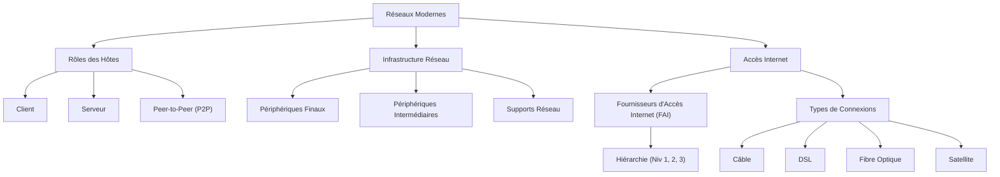

---
aliases:
  - Module 2
  - 01-02 | Module 2
archetype: cour
module: "RIB (Introduction au réseau)"
cssclasses:
  - max
tags:
  - reseau
  - infrastructure/reseau
  - modele/client-serveur
  - reseau/p2p
  - internet/fai
  - materiel/reseau
  - role
  - definition
  - serveur
  - client
---

# 01-02 | Module 2

> [!goal] Objectifs Pédagogiques
> À la fin de cette fiche, je dois être capable de :
> 1. Comprendre les rôles des [[Client|clients]] et [[Server|serveurs]] dans les réseaux modernes.
> 2. Identifier les différents types de serveurs et clients, ainsi que les services réseau associés.
> 3. Distinguer les caractéristiques, avantages et inconvénients des [[PeerToPeer|réseaux Peer-to-Peer]].
> 4. Décrire les composants fondamentaux de l'infrastructure réseau.
> 5. Expliquer le rôle des [[InternetServiceProvider|fournisseurs d'accès Internet]] et les différents types de connexions [[Internet]] domestiques.
> 6. Reconnaître les facteurs influençant le choix d'une connexion Internet.

## 📝 Synthèse du Cours

### 1. Rôles dans les Réseaux Modernes et Types de Serveurs/Clients
Dans un [[RIB00-00_Introduction|réseau]], un ordinateur peut agir comme un Client, un Server, ou les deux simultanément. Le rôle est principalement déterminé par le logiciel installé sur l'ordinateur.

> [!note] Définition Clé
> **Client** : Un hôte informatique qui exécute un logiciel permettant de demander et d'afficher des informations obtenues d'un serveur.
> **Server** : Un hôte informatique qui exécute un logiciel permettant de fournir des informations ou des services à d'autres hôtes du réseau.

*   **Types de Serveurs :**
    *   **[[WebServer|Serveur Web]]** : Fournit des pages web aux [[Browser|navigateurs clients]] (ex: Apache, Nginx).
    *   **[[EmailServer|Serveur Email]]** : Gère l'envoi et la réception de courriels (ex: Postfix, Exchange).
    *   **[[FileServer|Serveur de Fichiers]]** : Stocke et partage les fichiers centralisés pour les clients.
*   **Types de Clients :**
    *   **Navigateurs Web** (ex: Chrome, Edge) : Demandent et affichent des pages web des serveurs web.
    *   **Clients Email** (ex: Microsoft Outlook, Thunderbird) : Permettent d'accéder, d'envoyer et de recevoir des courriels via un serveur email.
*   **Communication Client-Serveur :** Le Client initie une demande d'informations ou de services, et le serveur répond en les fournissant. Tous les ordinateurs connectés participant à ces [[Communication|communications]] sont appelés des **hôtes**.

### 2. Réseaux Peer-to-Peer ([[PeerToPeer|P2P]])
Un réseau P2P est un modèle où un ordinateur peut fonctionner simultanément comme Client et comme serveur. Ce modèle est très courant dans les [[SOHONetwork|réseaux domestiques]] et les petites entreprises où un serveur dédié n'est pas nécessaire.

*   **Avantages des Réseaux P2P :**
    *   **Facile à configurer** et à utiliser.
    *   **Moins complexe** car il n'y a pas de hiérarchie serveur/Client stricte.
    *   **Coût réduit** car il ne nécessite pas de serveurs dédiés coûteux.
    *   Idéal pour les **tâches simples** comme le partage de fichiers ou d'imprimantes.
*   **Inconvénients des Réseaux P2P :**
    *   **Pas d'administration centralisée**, ce qui peut rendre la gestion des ressources et de la [[DataSecurity|sécurité]] difficile.
    *   **Moins sécurisé** car chaque machine doit gérer sa propre sécurité.
    *   **Non évolutif** pour de grands volumes de trafic ou un grand nombre d'utilisateurs.
    *   Les **performances peuvent être ralenties** si un hôte gère les deux rôles (Client et serveur) intensivement.

### 3. Infrastructure de Réseau
L'infrastructure réseau est l'ensemble des plateformes physiques et logiques qui supportent le réseau. Elle fournit des canaux stables et fiables pour toutes les communications.

*   **Composants clés de l'infrastructure :**
    *   **Périphériques Finaux** (*[[EndDevices|End Devices]]*) : Ce sont les points de départ et d'arrivée des messages sur le réseau. Ils sont identifiés par des adresses uniques (ex: ordinateurs, smartphones, imprimantes, caméras IP).
    *   **Périphériques Intermédiaires** (*[[IntermediateDevices|Intermediate Devices]]*) : Ces dispositifs connectent les hôtes et assurent le cheminement des messages à travers le réseau. Ils dirigent les données et peuvent gérer la sécurité (ex: [[Router|routeurs]], [[Switch|commutateurs]], points d'accès sans fil, [[Firewall|pare-feu]]).
    *   **Supports Réseau** (*[[NetworkMedia|Network Media]]*) : Ce sont les canaux physiques de transmission des données. Ils peuvent être des câbles en cuivre ([[EthernetCable|Ethernet]]), des [[FiberOpticCable|fibres optiques]] ou des connexions sans fil ([[WiFi|Wi-Fi]]).

### 4. Fournisseurs d'Accès Internet (FAI) et Types de Connexions
Un Fournisseur d'Accès Internet ([[InternetServiceProvider|FAI]]), ou *Internet Service Provider ([[InternetServiceProvider|ISP]])*, est une entreprise qui fournit la liaison entre un réseau domestique (ou d'entreprise) et l'Internet mondial. 
Les FAI proposent souvent des services supplémentaires comme des comptes de messagerie, du stockage réseau ou des services de [[Cybersecurity|sécurité]].

*   **Interconnexion des FAI :**
    *   Les FAI sont interconnectés de manière hiérarchique pour former l'Internet.
    *   **Niveau 1** : Constitue le [[InternetBackbone|Réseau fédérateur mondial]] (*Internet backbone*), principalement composé de câbles en fibre optique sous terre et sous la mer.
    *   **Niveau 2** : FAI régionaux qui se connectent aux FAI de niveau 1.
    *   **Niveau 3** : FAI locaux qui connectent les utilisateurs finaux aux FAI de niveau 2.
*   **Connexions FAI Domestiques :**
    *   **Connexion Simple** (non recommandée) : Un [[Modem|modem]] connecte directement un ordinateur au FAI, offrant peu de sécurité.
    *   **Connexion Sécurisée** (recommandée) : Utilisation d'un [[Router|routeur]] intégré (souvent avec Wi-Fi et un commutateur) qui fournit l'adressage IP local ([[NetworkAddressTranslation|NAT]]) et assure la sécurité du réseau domestique.
*   **Types de Connexions Internet (Technologies) :**
    *   **Connexion Câble** : Utilise le [[CoaxialCable|câble coaxial]] existant des fournisseurs de télévision par câble.
    *   **Connexion [[DigitalSubscriberLine|DSL]]** (*Digital Subscriber Line*) : Utilise les lignes téléphoniques en cuivre. La qualité et la vitesse dépendent fortement de la distance au central téléphonique.
    *   **Fibre Optique** (*Fiber Optic*) : Offre la plus haute [[Bandwidth|bande passante]] et les vitesses les plus élevées. Prédominante dans les zones métropolitaines.
    *   **Connexion [[SatelliteCommunication|Satellite]]** : Souvent la seule option disponible dans les zones rurales ou très isolées, mais avec une [[Latency|latence]] plus élevée.
*   **Choix de la Connexion :** Le choix de la technologie de connexion Internet dépend principalement de l'emplacement géographique et de la disponibilité des FAI. Les zones métropolitaines bénéficient généralement de la fibre optique directe, tandis que les zones urbaines ont accès au câble et au DSL, et les zones rurales aux liaisons satellitaires.

## 🧠 Carte Mentale / Schéma

## ❓ Quiz de Révision (Active Recall)
> [!question] Question 1
> Expliquez la différence fondamentale entre un rôle de **Client** et un rôle de **serveur** dans un réseau.
> > [!success]- Réponse
> > Un **Client** est un hôte qui *demande* des informations ou des services, tandis qu'un **serveur** est un hôte qui les *fournit* en réponse aux demandes des clients.

> [!question] Question 2
> Citez au moins trois avantages et trois inconvénients des réseaux **Peer-to-Peer**.
> > [!success]- Réponse
> > **Avantages :** Facile à configurer, moins complexe, coût réduit, idéal pour les tâches simples. **Inconvénients :** Pas d'administration centralisée, moins sécurisé, non évolutif, performances ralenties en cas d'utilisation intensive.

> [!question] Question 3
> Quels sont les trois composants fondamentaux de l'**infrastructure réseau** ?
> > [!success]- Réponse
> > Les trois composants sont les **périphériques finaux**, les **périphériques intermédiaires** et les **supports réseau**.

## 🔗 Liens du Module
*   **Précédent** : [[RIB01-01_Module1|01-01 | Introduction au Réseau]]
*   **Suivant** : [[RIB01-03_Module3|01-03 | Module 3]]
*   **Ressource Externe** : [Cisco Networking Academy - Introduction to Networks](https://www.netacad.com/courses/networking/introduction-networks)
* **Lien** : [[NetworkTopologies]]

