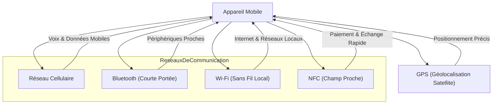

---
aliases:
  - Module 3
  - 01-03 | Module 3
archetype: cour
module: "RIB (Introduction au réseau)"
cssclasses:
  - max
tags:
  - reseau
  - reseau/mobile
  - reseau/communication
  - reseau/types-de-reseaux
  - reseau/sans-fil
  - reseau/cellulaire
  - reseau/bluetooth
  - reseau/sans-fil/wi-fi
  - protocole/ieee-802.11
  - nfc
  - gps
  - geolocalisation
  - paiement-sans-contact
  - appareil/smartphone
  - securite/reseau
---

# 01-03 | Module 3

> [!goal] Objectifs Pédagogiques
> À la fin de cette fiche, je dois être capable de :
> 1. Expliquer le fonctionnement général des réseaux de [[Communication|communication]] mobile.
> 2. Identifier et décrire les quatre principaux types de réseaux mobiles (Cellulaire, [[Bluetooth]], [[WiFi|Wi-Fi]], [[NearFieldCommunication|NFC]]).
> 3. Comprendre le rôle du GPS dans la géolocalisation des appareils mobiles.
> 4. Énumérer les cinq principales utilisations des appareils mobiles en termes de communication.
> 5. Appliquer les bonnes pratiques de sécurité Wi-Fi.

## 📝 Synthèse du Cours

### 1. Les Réseaux de Communication Mobile

Les appareils mobiles sont des systèmes complexes capables de gérer simultanément plusieurs types de communications. Ils exploitent divers réseaux, chacun doté de ses propres **protocoles**, **règles** et **fréquences** spécifiques. Cette capacité de gestion multi-réseaux est un pilier fondamental de leur fonctionnement, permettant une [[Connectivity|connectivité]] et une polyvalence inégalées.

### 2. Les Principaux Types de Réseaux Mobiles
Les appareils mobiles intègrent plusieurs technologies de réseau sans fil, chacune adaptée à des fonctions de communication spécifiques :

*   **Réseau Cellulaire**
    *   **Fonction** : Gère les communications vocales et les données cellulaires via les infrastructures des fournisseurs de téléphonie mobile.
    *   **Usage** : Essentiel pour les appels téléphoniques (vers mobiles et fixes) et l'accès à [[Internet]] mobile sans dépendre du Wi-Fi, via un forfait de données.

*   **[[Bluetooth]]**
    *   **Fonction** : Réseau sans fil à courte portée et faible consommation d'énergie.
    *   **Usage** : Permet de connecter des [[ComputerPeripheral|périphériques]] proches tels que des *haut-parleurs*, *écouteurs*, *microphones* et [[WearableTechnology|montres intelligentes]]. Il est idéal pour remplacer les connexions filaires sur de petites distances et créer de petits réseaux personnels.

*   **[[WiFi|Wi-Fi]]**
    *   **Fonction** : Technologie de réseau sans fil largement répandue, basée sur la norme *IEEE 802.11*.
    *   **Usage** : Principalement utilisée pour la communication sur Internet via des **hotspots publics** ou des **réseaux domestiques**. Elle offre généralement une consommation d'énergie inférieure à celle des données cellulaires.

*   **Communication [[NearFieldCommunication|NFC]] (Near Field Communication)**
    *   **Fonction** : Communication en champ proche qui opère sur une distance extrêmement courte (quelques centimètres) en utilisant des champs électromagnétiques.
    *   **Usage** : Idéale pour les systèmes de **paiement mobile sans contact** en magasin et l'échange rapide de données entre appareils très rapprochés.

### 3. Le GPS : Votre Position Depuis l'Espace
Le **GPS (Global Positioning System)** est une technologie de **géolocalisation** cruciale pour les appareils mobiles :
*   **Fonctionnement** : L'appareil mobile reçoit des signaux émis par un réseau de [[SatelliteCommunication|satellites]] en orbite autour de la Terre.
*   **Précision** : Grâce à ces signaux, l'appareil peut déterminer sa position géographique avec une précision de quelques mètres.
*   **Intégration** : Le GPS fonctionne en parallèle avec les autres fonctions de communication de l'appareil, offrant une géolocalisation en temps réel.

> [!note] Définition Clé
> **GPS (Global Positioning System)** : Système de positionnement global qui permet à un récepteur électronique (comme un [[EndDevices|téléphone portable]]) de déterminer sa position exacte sur Terre en recevant des signaux de satellites en orbite.

### 4. Les Cinq Utilisations Principales des Appareils Mobiles
Les appareils mobiles sont au centre de nombreuses interactions quotidiennes et servent à :
1.  **Communications Vocales** : La fonction première, utilisant les radios du téléphone pour des appels vers des particuliers et des entreprises sur les réseaux fixes et mobiles.
2.  **Données Cellulaires** : Accès à Internet via le forfait de données fourni par l'infrastructure cellulaire, indépendant du Wi-Fi.
3.  **Connexions Wi-Fi** : Utilisation des hotspots publics et des réseaux domestiques pour accéder à Internet, souvent avec une consommation d'énergie et de données réduite.
4.  **Services de Localisation** : Exploitation du GPS, des applications de cartes et de la recherche de lieux à proximité pour la navigation et la découverte.
5.  **Services de Paiement** : Effectuer des paiements mobiles sans contact en approchant le téléphone des terminaux de paiement compatibles.

### 5. L'Évolution des Appareils Mobiles
L'évolution constante des appareils mobiles a profondément transformé notre quotidien :
*   **Liberté** : Ils offrent une **liberté** sans précédent pour travailler, se divertir, communiquer et étudier partout.
*   **Révolution** : Cette *mobilité* a révolutionné nos modes de vie et de travail, en intégrant des fonctionnalités auparavant exclusives aux ordinateurs de bureau.
*   **Ubiquité** : La présence de points d'accès sans fil est désormais omniprésente, facilitant l'accès à l'information et aux services en tout lieu.

### 6. Sécurité Wi-Fi : Bonnes Pratiques
Bien que le Wi-Fi soit avantageux pour économiser la batterie et le forfait cellulaire, des mesures de sécurité sont indispensables :
*   **Chiffrement des Données** : Ne jamais transmettre d'[[SensitiveData|informations sensibles]] (identifiants, [[Password|mots de passe]]) en *texte clair non chiffré*, surtout sur les réseaux publics.
*   **Connexion VPN** : Utiliser un **[[VirtualPrivateNetwork|VPN]] (Virtual Private Network)** pour chiffrer votre trafic lors de l'envoi de données sensibles, particulièrement sur les réseaux Wi-Fi publics.
*   **Sécurité Domestique** : Activer et configurer le chiffrement (au minimum **[[WPA2]]**, idéalement **[[Wpa3|WPA3]]**) sur vos réseaux Wi-Fi domestiques pour protéger vos communications.

## 🧠 Carte Mentale / Schéma

## ❓ Quiz de Révision (Active Recall)
> [!question] Question 1
> Quels sont les quatre principaux types de réseaux mobiles intégrés dans les appareils, et quelle est la fonction principale de chacun ?
> > [!success]- Réponse
> > 1.  **Réseau Cellulaire** : Communications vocales et données cellulaires via les fournisseurs de téléphonie mobile.
> > 2.  **Bluetooth** : Connexion de périphériques à courte portée (écouteurs, montres connectées).
> > 3.  **Wi-Fi** : Accès à Internet via des hotspots ou réseaux domestiques, souvent avec une meilleure efficacité énergétique.
> > 4.  **NFC (Near Field Communication)** : Communication à très courte portée pour les paiements mobiles et l'échange rapide de données.

> [!question] Question 2
> Comment le GPS permet-il à un appareil mobile de déterminer sa position géographique ?
> > [!success]- Réponse
> > Le GPS fonctionne en recevant des signaux de satellites en orbite autour de la Terre. En analysant ces signaux, l'appareil peut calculer sa position exacte avec une précision de quelques mètres.

> [!question] Question 3
> Quelles sont trois bonnes pratiques de sécurité essentielles lors de l'utilisation du Wi-Fi, en particulier sur les réseaux publics ?
> > [!success]- Réponse
> > 1.  **Chiffrement des Données** : Ne jamais envoyer d'informations sensibles en texte clair non chiffré.
> > 2.  **Utilisation d'un VPN** : Toujours utiliser une connexion VPN pour chiffrer le trafic, surtout sur les réseaux publics.
> > 3.  **Sécurité Domestique** : Activer et maintenir à jour le chiffrement (WPA2 ou WPA3) sur les réseaux Wi-Fi domestiques.

## 🔗 Liens du Module
*   **Précédent** : [[RIB01-02_Module2|01-02 | Module 2]]
*   **Suivant** : [[RIB01-04_Module4|01-04 | Module 4]]
*   **Ressource Externe** : [Comprendre le fonctionnement des réseaux mobiles](https://www.commentcamarche.net/telecoms/mobile/19324-reseaux-mobiles-definition-et-fonctionnement/)
