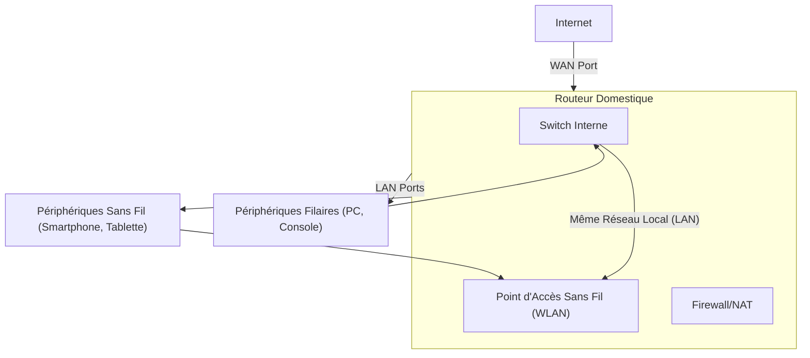

---
aliases:
  - Module 4
  - 01-04 | Module 4
archetype: cour
module: RIB (Introduction au réseau)
cssclasses:
  - max
tags:
  - architecture
  - reseau
  - reseau/domestique
  - reseau/lan
  - reseau/wan
  - reseau/wlan
  - reseau/sans-fil
  - reseau/ethernet
  - materiel/routeur
  - peripherique
  - cable/ethernet
  - materiel/cable/fibre-optique
  - cable/coaxial
  - identifiant/ssid
  - norme/standard
  - connectivite/bluetooth
  - gestion-configuration
  - certification/wi-fi
  - connectivite/physique
---

# 01-04 | Module 4

> [!goal] Objectifs Pédagogiques
> À la fin de cette fiche, je dois être capable de :
> 1. Comprendre les **composants d'un réseau domestique moderne**.
> 2. Distinguer les fonctions des **ports [[LocalAreaNetwork|LAN]] et [[WideAreaNetwork|WAN]]** d'un [[Router|routeur]].
> 3. Décrire le fonctionnement et les caractéristiques d'un **[[WirelessLocalAreaNetwork|réseau local sans fil (WLAN)]]**.
> 4. Identifier les **technologies réseau filaires** et leurs applications.
> 5. Expliquer les **normes [[WiFi|Wi-Fi]] ([[IEEE]] [[IEEE80211Standard|802.11]])** et la **certification Wi-Fi**.
> 6. Configurer les **paramètres essentiels d'un réseau sans fil** (SSID, mode réseau, canal).
> 7. Comprendre le rôle et les implications du **[[ServiceSetIdentifier|SSID]]** pour l'identification et la sécurité.

## 📝 Synthèse du Cours

### 1. Composants et Périphériques d'un Réseau Domestique
Un réseau domestique moderne intègre une multitude de **[[EndDevices|périphériques connectés]]** qui dépendent de la [[Connectivity|connectivité]] pour leur fonctionnement, le contrôle et la communication.
*   **Périphériques connectés courants** :
    *   Ordinateurs de bureau (*stations de travail*).
    *   Systèmes de jeu (*consoles* nécessitant une connexion Internet).
    *   Télévisions intelligentes (*écrans connectés* pour le streaming et les services en ligne).
    *   Imprimantes et scanners (*périphériques d'impression et de numérisation* partagés).
    *   [[Surveillance|Caméras de Surveillance]] (*systèmes de sécurité* connectées).
    *   Contrôle climatique (*thermostats intelligents* et systèmes de climatisation).

### 2. Architecture du Routeur Domestique
Les routeurs domestiques standard comportent deux types de ports principaux qui définissent l'architecture du réseau local.
*   **Ports Ethernet ([[LocalAreaNetwork|LAN]])** :
    *   Généralement 1 à 4 ports qui se connectent au **[[Switch|commutateur]] interne du routeur**.
    *   Tous les périphériques connectés à ces ports appartiennent au **même réseau local** et peuvent communiquer entre eux directement.
*   **Port Internet ([[WideAreaNetwork|WAN]])** :
    *   Port unique qui connecte le routeur à un **réseau externe**, généralement [[Internet]] via un [[Modem|modem]] câble ou [[DigitalSubscriberLine|DSL]].
    *   Ce port se trouve sur un **réseau différent** des ports [[Ethernet]].

> [!note] Définition Clé
> **LAN (Local Area Network)** : Réseau local qui interconnecte des périphériques au sein d'une zone géographique limitée (maison, bureau). Les appareils sur le même LAN peuvent communiquer directement.
> **WAN (Wide Area Network)** : Réseau étendu qui interconnecte des réseaux locaux sur de grandes distances, comme Internet. Le port WAN d'un routeur connecte le réseau local à un réseau externe.

### 3. Réseau Local Sans Fil (WLAN)
La plupart des routeurs domestiques intègrent une antenne sans fil et un point d'accès.
*   **Intégration transparente** : Les périphériques sans fil et filaires coexistent sur le **même réseau local**, créant un environnement réseau unifié.
*   **[[WirelessAccessPoint|Point d'accès]] intégré** : Antenne et fonctionnalités Wi-Fi directement dans le routeur.
*   **Configuration par défaut** : Seul le port Internet (WAN) reste sur un réseau séparé.

> [!note] Définition Clé
> **WLAN (Wireless Local Area Network)** : Réseau local utilisant des ondes radio pour connecter les périphériques sans fil à un point d'accès, lui-même généralement connecté au réseau filaire.

### 4. Fréquences du LAN Sans Fil
Les technologies sans fil domestiques utilisent principalement les [[WiFiFrequencyBands|bandes de fréquence]] non licenciées de **2,4 GHz** et **5 GHz**, chacune avec ses caractéristiques spécifiques.
*   **[[Bluetooth]] - 2,4 GHz** :
    *   Communications *courte distance* et *basse vitesse*.
    *   Idéal pour souris, claviers, imprimantes et audio.
    *   Permet la connexion simultanée de nombreux périphériques.
*   **[[IEEE80211Standard|IEEE 802.11]] - 2,4 et 5 GHz** :
    *   Technologies **Wi-Fi haute puissance** offrant *grande portée* et *débit élevé*.
    *   Normes modernes pour réseaux locaux sans fil performants.

### 5. Technologies Réseau Filaires
Malgré l'essor du sans-fil, les connexions filaires restent essentielles pour certaines applications nécessitant une **[[Bandwidth|bande passante]] dédiée non partagée**.
*   **[[Category5eCable|Câblage Catégorie 5e]]** :
    *   Câblage le plus courant composé de 4 paires de **[[TwistedPairCable|fils torsadés]]** pour réduire les interférences électriques.
*   **[[CoaxialCable|Câble Coaxial]]** :
    *   Fil intérieur entouré d'isolant tubulaire et d'écran conducteur, recouvert d'une gaine externe.
*   **[[FiberOpticCable|Fibre Optique]]** :
    *   Câbles en verre ou plastique, diamètre d'un cheveu, transmission très haute vitesse sur **longues distances** via des impulsions lumineuses.

> [!note] Définition Clé
> **Câble Catégorie 5e (Cat 5e)** : [[Category5eCable|Câble Ethernet]] en paires torsadées, couramment utilisé pour les réseaux locaux, supportant jusqu'à 1 Gbit/s.
> **Câble Coaxial** : Type de câble électrique avec un conducteur interne entouré d'un isolant, d'un écran métallique et d'une gaine externe, utilisé historiquement pour les réseaux et encore pour la télévision ou l'accès internet.
> **Fibre Optique** : Technologie de transmission de données utilisant la lumière à travers des fils de verre ou de plastique, offrant des débits très élevés sur de longues distances.

### 6. Normes Wi-Fi et Certification
L'[[IEEE]] (Institute of Electrical and Electronic Engineers) développe les normes techniques sans fil, tandis que la Wi-Fi Alliance certifie la compatibilité des périphériques.
*   **IEEE 802.11** :
    *   Norme principale régissant les **réseaux locaux sans fil**.
    *   Quatre amendements définissent les caractéristiques des différentes technologies de communication sans fil utilisant les bandes 2,4 GHz et 5 GHz.
*   **Certification Wi-Fi** :
    *   Le **logo Wi-Fi** garantit la **conformité aux normes** et l'**interopérabilité** avec d'autres périphériques certifiés.
    *   Les fabricants implémentent rapidement les nouvelles normes dans leurs produits.

> [!note] Définition Clé
> **IEEE 802.11** : Ensemble de normes techniques pour l'implémentation des réseaux locaux sans fil (WLAN) en bandes de fréquences de 2,4, 5 et 6 GHz. C'est la base du Wi-Fi.
> **Wi-Fi Alliance** : [[WiFiAlliance|Organisation]] qui promeut la technologie Wi-Fi et certifie l'interopérabilité des produits WLAN basés sur les normes IEEE 802.11.

### 7. Paramètres Sans Fil Essentiels
Ces paramètres sont cruciaux pour la configuration et le bon fonctionnement d'un réseau sans fil.
*   **Mode Réseau** :
    *   Détermine la technologie supportée : 802.11b, 802.11g, 802.11n ou mode mixte pour la compatibilité avec différents périphériques.
*   **Nom du Réseau ([[ServiceSetIdentifier|SSID]])** :
    *   Identifie le réseau local sans fil.
    *   Tous les périphériques doivent avoir le **même SSID** pour appartenir au réseau.
*   **Canal Standard** :
    *   Spécifie le [[WiFiChannel|canal de communication]].
    *   Configuration automatique par défaut pour optimiser les performances.
*   **[[SSIDBroadcast|Diffusion SSID]]** :
    *   Détermine si le nom du réseau est **visible par tous les périphériques à portée**.
    *   Activé par défaut.

> [!note] Définition Clé
> **[[ServiceSetIdentifier|SSID]] (Service Set Identifier)** : Nom unique d'un réseau Wi-Fi, utilisé par les clients pour se connecter au réseau correct.
> **Mode Réseau** : [[WiFiNetworkModes|Paramètre]] définissant les normes Wi-Fi (ex: 802.11b/g/n/ac/ax) que le point d'accès prend en charge, influençant la vitesse et la compatibilité.
> **[[WiFiChannel|Canal Wi-Fi]]** : Fréquence spécifique dans une bande (2.4 GHz ou 5 GHz) utilisée pour la communication sans fil. Le choix d'un canal non encombré améliore les performances.

### 8. Mode Réseau et Compatibilité
Le choix du mode réseau influence directement les performances et la compatibilité du réseau sans fil.
*   **Mode Standard Unique** :
    *   Vitesses maximales si tous les périphériques utilisent la **même norme [[IEEE80211Standard|IEEE 802.11]]**.
    *   Les appareils incompatibles ne peuvent pas se connecter.
*   **Mode Mixte** :
    *   Environnement inclusif acceptant **toutes les normes Wi-Fi existantes**.
    *   Facilite l'accès aux périphériques anciens nécessitant une connexion sans fil.

### 9. SSID: Identification et Sécurité
Le Service Set Identifier ([[ServiceSetIdentifier|SSID]]) est crucial pour l'identification du réseau et la sécurité de base.
*   **Caractéristiques Techniques** :
    *   Chaîne alphanumérique sensible à la casse, jusqu'à 32 caractères.
    *   Transmis dans l'en-tête de toutes les trames du réseau local sans fil.
*   **Fonction d'Identification** :
    *   Indique aux stations sans fil (STA) leur appartenance réseau et définit les périphériques avec lesquels elles peuvent communiquer.
*   **Diffusion et Sécurité** :
    *   La [[SSIDBroadcast|diffusion SSID]] facilite la découverte automatique.
    *   Sa désactivation complique l'accès légitime sans empêcher les intrusions.
    *   Le **chiffrement fort** reste indispensable.

> [!important]
> La désactivation de la diffusion SSID ne constitue pas une mesure de sécurité suffisante. Tous les réseaux sans fil doivent utiliser le **chiffrement le plus fort disponible** (comme [[WPA2]]/[[Wpa3]]) pour limiter l'accès non autorisé.

## 🧠 Carte Mentale / Schéma

## ❓ Quiz de Révision (Active Recall)
> [!question] Question 1
> Quelle est la principale différence fonctionnelle entre les ports LAN et le port WAN d'un routeur domestique ?
> > [!success]- Réponse
> > Les ports **LAN** (Local Area Network) connectent les périphériques au réseau interne local, leur permettant de communiquer entre eux directement. Le port **WAN** (Wide Area Network) connecte le routeur au réseau externe (généralement Internet), séparant ainsi le réseau local du monde extérieur.

> [!question] Question 2
> Pourquoi la désactivation de la diffusion du SSID n'est-elle pas une mesure de sécurité suffisante pour un réseau sans fil ?
> > [!success]- Réponse
> > La désactivation de la diffusion du SSID rend simplement le réseau moins visible aux périphériques à portée, mais elle ne l'empêche pas d'être détecté par des outils d'analyse de réseau spécialisés. Le **chiffrement fort** (comme WPA2/Wpa3) reste la mesure de sécurité essentielle pour protéger un réseau sans fil contre les accès non autorisés.

> [!question] Question 3
> Citez trois technologies réseau filaires et indiquez une caractéristique clé pour chacune.
> > [!success]- Réponse
> > 1.  **Câblage Catégorie 5e** : Utilise des paires de fils torsadés pour réduire les interférences et supporte des débits jusqu'à 1 Gbit/s.
> > 2.  **Câble Coaxial** : Possède un conducteur interne entouré d'isolant et d'un écran, utilisé pour la télévision par câble et l'accès Internet.
> > 3.  **Fibre Optique** : Transmet des données via des impulsions lumineuses sur des brins de verre ou de plastique, offrant des débits très élevés sur de longues distances.

## 🔗 Liens du Module
*  **Précédent** : [[RIB01-03_Module3|01-03 | Module 3]]
*  **Suivant** : [[RIB01-05_Module5|01-05 | Module 5]]
*  **Lien** : [[NetworkMedia]]