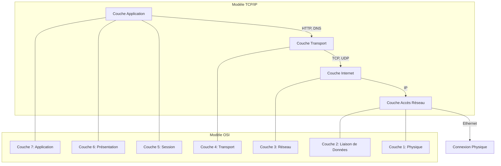

---
aliases:
  - Module 5
  - 01-05 | Module 5
archetype: cour
module: "RIB (Introduction au réseau)"
cssclasses:
  - max
tags:
  - protocole/reseau
  - modele/osi
  - modele/tcp-ip
  - norme/rfc
  - organisation/ietf
  - interoperabilite
  - mecanisme/encapsulation
  - reseau/paquet
  - protocole/ethernet
  - protocole/ip
  - protocole/tcp
  - protocole/dns
  - protocole/dhcp
  - communication/reseau
  - codage/donnees
  - definition/informatique
---

# 01-05 | Module 5

> [!goal] Objectifs Pédagogiques
> À la fin de cette fiche, je dois être capable de :
> 1. Expliquer le rôle et l'importance des **protocoles de communication** dans les réseaux informatiques.
> 2. Décrire les **éléments clés** qui composent un protocole réseau.
> 3. Comparer et mettre en correspondance les **[[TcpIpModel|modèles TCP/IP]] et [[OsiModel|OSI]]**, en identifiant les fonctions de chaque couche.

## 📝 Synthèse du Cours

### 1. Introduction aux Protocoles de Communication Réseau

Dans notre vie quotidienne, la [[Communication|communication]] s'appuie sur des règles et des conventions. Les réseaux informatiques fonctionnent de manière similaire, en utilisant des **protocoles** pour permettre aux appareils de communiquer efficacement. Avant toute communication, des règles fondamentales sont établies, qu'il s'agisse d'interactions humaines ou de communications réseau. Ces règles incluent :
*   L'**identification** de l'expéditeur et du destinataire.
*   La **méthode** de communication convenue.
*   Le **langage** et la syntaxe communs.
*   La **vitesse** et les délais de livraison.
*   La **confirmation** ou l'accusé de réception.

> [!note] Définition Clé
> **Protocole** : Un ensemble de règles formelles qui régissent la manière dont les données sont formatées, transmises et reçues entre les dispositifs d'un réseau.

### 2. Importance et Éléments des Protocoles Réseau

Les protocoles sont essentiels pour une communication *efficace* et *cohérente* sur un réseau. Ils agissent comme un **langage commun**, garantissant l'**interopérabilité** entre tous les appareils, qu'ils soient câblés ou sans fil.

Les protocoles réseau sont composés de plusieurs éléments fondamentaux qui définissent les règles de communication :
*   **Format du Message** : La structure spécifique que le message doit suivre.
*   **Taille du Message** : Règles régissant la taille des données, pouvant entraîner la fragmentation des messages longs.
*   **Heure et Date** : Définissent le débit de transmission et le moment d'envoi des données.
*   **Codage** : Conversion des messages en bits, puis en diverses formes physiques (sons, ondes lumineuses, impulsions électriques).
*   **Encapsulation** : Processus d'ajout d'informations d'adressage (en-têtes) aux données pour leur acheminement.
*   **Modèle de Message** : Détermine si un accusé de réception est nécessaire ou si le message est diffusé.

### 3. La Vision du Réseau par les Appareils et les Protocoles en Action

Notre perception d'un réseau, via des diagrammes de topologie et des informations comme les [[MacAddress|adresses MAC]] ou [[InternetProtocol|IP]], diffère de celle des appareils. Chaque appareil opère dans sa "propre bulle", connaissant uniquement ses propres informations d'adressage. C'est le **protocole** qui fournit les règles permettant à un appareil de savoir à quel réseau il appartient et où envoyer les informations.

Les communications réseau sont décomposées en petites unités appelées paquets. De nombreux protocoles interagissent pour acheminer ces paquets :
*   [[EthernetCable|Ethernet]] / *Sans fil* : Connectent physiquement l'appareil au réseau.
*   [[DHCP]] / *ICMPv6* : Fournissent les informations d'adressage IP.
*   [[DomainNameSystem|DNS]] : Convertit les noms de domaine en adresses IP.
*   IP : Délivre le paquet de la source à la destination finale.
*   [[TransmissionControlProtocol|TCP]] : Garantit la fiabilité de la livraison des données et renvoie les paquets perdus.

### 4. Les Normes Internet et l'Interopérabilité

Les **normes [[Internet]]** sont cruciales pour gérer la croissance rapide des technologies et maintenir des services fiables. Une norme est un ensemble de règles déterminant une manière de procéder, garantissant que tous les appareils appliquent le même ensemble de règles pour une **interopérabilité** maximale.

> [!note] Définition Clé
> **[[InternetEngineeringTaskForce|RFC - Request for Comments]]** : Chaque étape du processus de développement et d'approbation d'une norme est enregistrée dans un document RFC numéroté, publié et géré par l'IETF (Internet Engineering Task Force).

Les protocoles réseau reflètent souvent les **protocoles de communication humaine**, impliquant un langage commun, des règles de comportement et des mécanismes de confirmation. L'étude de protocoles comme Ethernet, IP, TCP et [[HttpProtocol|HTTP]] est fondamentale pour comprendre le fonctionnement, la configuration et le dépannage des réseaux.

### 5. Introduction aux Modèles en Couches

Les **modèles en couches** sont des structures conceptuelles qui permettent de visualiser l'interaction des protocoles pour assurer la communication réseau. Ils décomposent la complexité des réseaux en éléments gérables, ce qui simplifie la conception, l'implémentation et le dépannage.

> [!note] Avantages Clés des Architectures en Couches
> *   **Conception Simplifiée** : Chaque couche gère des informations spécifiques avec des interfaces claires.
> *   **Interopérabilité** : Favorise la collaboration entre produits de différents fournisseurs.
>   **Évolution Technologique** : Permet des modifications à un niveau sans affecter les autres couches.
>   **Langage Commun** : Offre un vocabulaire partagé pour les professionnels du réseau.

### 6. Le Modèle TCP/IP

Le modèle TCP/IP (Transmission Control Protocol/Internet Protocol) est l'architecture fondamentale de l'Internet, développée au début des années 70. Il définit quatre catégories de fonctions essentielles pour la communication.

> [!note] Les Quatre Couches du Modèle TCP/IP
> 1.  **[[ApplicationLayer|Application]]** : Représente les données pour l'utilisateur, inclut le codage et le contrôle du dialogue. C'est l'interface directe avec les logiciels (ex: navigateurs web, clients email).
> 2.  **[[TransportLayer|Transport]]** : Prend en charge la communication entre plusieurs périphériques à travers divers réseaux. Assure la livraison fiable des données.
> 3.  **[[NetworkLayerOSI|Internet]]** : Détermine le meilleur chemin à travers le réseau. Responsable de l'adressage logique et du routage des paquets de données.
> 4.  **Accès Réseau** : Contrôle les périphériques matériels et les supports du réseau. Gère la transmission physique des données.

### 7. Le Modèle OSI : Une Référence Universelle

Le modèle de référence OSI (Open Systems Interconnection Model), développé par l'ISO (International Organization for Standardization), est la référence la plus connue pour la conception, les opérations et la résolution de problèmes des réseaux de données. Il comprend sept couches distinctes.

> [!note] Les Sept Couches du Modèle OSI (de la couche supérieure à la couche inférieure)
> 1.  **Application (Couche 7)** : Protocoles pour les communications de processus à processus. Interface directe avec les applications utilisateur.
> 2.  **[[PresentationLayer|Présentation (Couche 6)]]** : Assure la représentation commune des données transférées (chiffrement, compression, conversion).
> 3.  **[[OsiSessionLayer|Session (Couche 5)]]** : Organise le dialogue et gère l'échange de données entre applications (établissement, maintien, terminaison des connexions).
> 4.  **Transport (Couche 4)** : Définit les services pour segmenter, transférer et réassembler les données entre périphériques finaux (fiabilité, contrôle de flux).
> 5.  **Réseau (Couche 3)** : Fournit des services pour échanger des parties de données sur le réseau entre périphériques finaux (adressage logique, routage).
> 6.  **[[DataLinkLayer|Liaison de Données (Couche 2)]]** : Décrit les méthodes d'échange de trames de données entre périphériques sur un support commun (adressage physique, détection d'erreurs).
> 7.  **[[PhysicalLayer|Physique (Couche 1)]]** : Décrit les moyens mécaniques, électriques, fonctionnels et méthodologiques pour activer, gérer et désactiver les connexions physiques pour la transmission de bits.

### 8. Comparaison des Modèles TCP/IP et OSI

Un **modèle de protocole** (comme TCP/IP) suit la structure d'une suite de protocoles donnée, décrivant les fonctions à chaque couche de ces protocoles. Un **modèle de référence** (comme OSI) décrit les fonctions qui doivent être exécutées à chaque couche, sans spécifier comment les mettre en œuvre.

Bien que différents, les modèles TCP/IP et OSI partagent des concepts clés et peuvent être mis en correspondance :
*   La **couche Application TCP/IP** englobe les couches Application (7), Présentation (6) et Session (5) du modèle OSI.
*   La **couche Transport TCP/IP** correspond à la couche Transport (4) du modèle OSI.
*   La **couche Internet TCP/IP** correspond à la couche Réseau (3) du modèle OSI.
*   La **couche Accès Réseau TCP/IP** regroupe les couches Liaison de Données (2) et Physique (1) du modèle OSI.

Connaître les deux modèles est essentiel : TCP/IP est utilisé pour les communications Internet, tandis qu'OSI offre une référence plus détaillée et complète, particulièrement utile pour la conception et la résolution de problèmes réseau.

### 9. Points Clés à Retenir

*   Les **protocoles** sont indispensables pour la communication réseau, établissant les règles de format, de taille, de synchronisation et de codage des messages.
*   Une seule communication utilise souvent **plusieurs protocoles** organisés en couches (ex: Ethernet, IP, TCP et HTTP travaillent ensemble).
*   Les **normes Internet** (développées par des organismes comme l'IETF et documentées dans les RFC) garantissent l'**interopérabilité** entre différents types d'appareils.
*   Les modèles TCP/IP (4 couches) et OSI (7 couches) sont des architectures fondamentales pour comprendre les réseaux, le modèle OSI étant une référence plus détaillée.

## 🧠 Carte Mentale / Schéma

## ❓ Quiz de Révision (Active Recall)
> [!question] Question 1
> Quel est le rôle principal d'un protocole réseau et pourquoi est-il essentiel pour la communication entre les appareils ?
> > [!success]- Réponse
> > Un protocole réseau est un ensemble de règles formelles qui régissent la manière dont les données sont formatées, transmises et reçues. Il est essentiel car il fournit un "langage commun" et des conventions pour que différents appareils puissent communiquer et interopérer efficacement sur un réseau.

> [!question] Question 2
> Citez les quatre couches du modèle TCP/IP et décrivez brièvement la fonction de chacune.
> > [!success]- Réponse
> > Les quatre couches du modèle TCP/IP sont :
> > 1.  **Application** : Interface avec les logiciels utilisateurs et représente les données.
> > 2.  **Transport** : Assure la communication de bout en bout et la livraison fiable des données.
> > 3.  **Internet** : Détermine le meilleur chemin et gère l'adressage logique et le routage des paquets.
> > 4.  **Accès Réseau** : Contrôle les périphériques matériels et la transmission physique des données sur le support.

> [!question] Question 3
> Quelles couches du modèle OSI sont englobées par la couche Application du modèle TCP/IP ?
> > [!success]- Réponse
> > La couche Application du modèle TCP/IP englobe les couches Application (7), Présentation (6) et Session (5) du modèle OSI.

## 🔗 Liens du Module
*   **Précédent** :  [[RIB01-04_Module4|01-04 | Module 4]]
*   **Suivant** : [[RIB01-06_Module6|01-06 | Module 6]]