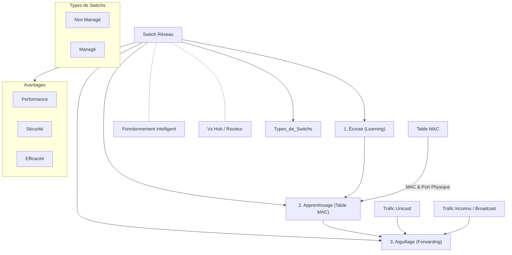

---
cssclasses:
  - max
aliases:
  - Module 6
  - 01-06 | Module 6
archetype: cour
module: "RIB (Introduction au réseau)"
tags:
  - materiel/reseau/switch
  - reseau/local
  - reseau/fonctionnement
  - reseau/commutation
  - mac-address-table
  - table-arp
  - reseau/flooding
  - reseau/trame
  - modele-osi/couche-2
  - materiel/reseau/hub
  - router
  - switch/types
---

# 01-06 | Module 6

> [!goal] Objectifs Pédagogiques
> À la fin de cette fiche, je dois être capable de :
> 1. Expliquer ce qu'est un **[[Switch|Switch réseau]]**, son rôle et ses fonctions principales.
> 2. Décrire les trois principes fondamentaux du fonctionnement d'un [[Switch]] (écoute, apprentissage, aiguillage).
> 3. Comprendre la différence entre une **[[MacAddressTable|table d'adresses MAC]]** et une **[[AddressResolutionProtocol|table ARP]]**.
> 4. Expliquer le processus par lequel un Switch remplit sa table d'adresses [[AccessControl|MAC]] et gère le [[MACAddressFloodingAttack|MAC Flooding]].
> 5. Différencier un Switch d'un **[[Router|routeur]]** et connaître les types de Switches (non managé, managé).

## 📝 Synthèse du Cours

### 1. Le Switch Réseau : Le Standardiste Intelligent de Votre LAN

Le Switch réseau est un équipement réseau essentiel pour les **[[LocalAreaNetwork|réseaux locaux]]** (*LAN*). Il agit comme un "standardiste intelligent" qui organise et optimise la communication entre les appareils connectés.

*   **Description** : C'est un boîtier muni de plusieurs prises, appelées *ports*, où se connectent les **[[EthernetCable|câbles Ethernet]]** de vos ordinateurs, imprimantes, **[[Server|serveurs]]** et autres périphériques réseau.
*   **Rôle essentiel** :
    *   Recevoir les messages numériques, nommés **[[EthernetFrame|trames]]**, d'un appareil.
    *   Les rediriger intelligemment et *uniquement* vers le périphérique destinataire.
    *   Assurer une communication efficace et sécurisée au sein de votre infrastructure.

> [!note] Définition Clé
> **Trame** : Unité de données de la **[[DataLinkLayer|couche de liaison de données]]** (couche 2 OSI du **[[OsiModel|modèle OSI]]**) qui transporte l'information entre deux nœuds d'un même **[[NetworkSegment|segment réseau]]**, incluant les **[[MacAddress|adresses MAC]]** source et destination.

### 2. Comment Fonctionne un Switch ? Les Trois Principes Fondamentaux

Un [[Switch]] réseau opère selon trois principes fondamentaux, ce qui le rend bien plus intelligent qu'un simple **[[NetworkHub|hub]]** traditionnel :

1.  **Il écoute en permanence (*Learning*)** :
    *   Dès qu'un appareil est branché et allumé, le switch "écoute" activement les messages qui transitent sur chaque port.
    *   Cela lui permet d'apprendre la topologie du réseau et de savoir quels appareils sont connectés à quels ports.
2.  **Il apprend par cœur (*Building [[MacAddressTable|MAC Table]]*)** :
    *   Le switch construit et maintient automatiquement une **[[MacAddressTable|Table d'Adresses MAC]]** (parfois appelée table de commutation).
    *   Cette table est un annuaire qui cartographie chaque adresse MAC d'un appareil avec le **[[PhysicalLayer|port physique]]** du switch auquel il est connecté.
3.  **Il aiguille intelligemment (*Forwarding*)** :
    *   Lorsqu'il reçoit une trame, le switch consulte sa table d'adresses MAC.
    *   Il identifie le destinataire et envoie la trame *uniquement* par le port où se trouve le périphérique destinataire, optimisant ainsi la **[[Bandwidth|bande passante]]**.

> [!note] Switch vs Hub
> Un *hub* transmet toutes les données à tous les ports, générant du trafic inutile et des collisions. Un *switch*, grâce à son intelligence, permet une communication un à un, optimisant la bande passante et la performance du réseau.

### 3. Le Cœur de l'Intelligence : La Table d'Adresses MAC et son Remplissage

Une confusion courante est de confondre la **[[MacAddressTable|Table d'Adresses MAC]]** du switch avec la **table ARP** ([[AddressResolutionProtocol|Address Resolution Protocol]]). Elles sont différentes :

*   **Table ARP** :
    *   Gérée par les *ordinateurs* eux-mêmes.
    *   Fait le lien entre une **[[InternetProtocol|adresse IP]]** (logique, **[[NetworkLayerOSI|couche 3]]** du modèle OSI) et une **adresse MAC** (physique, [[DataLinkLayer|Couche 2]] OSI).
*   **Table d'adresses MAC du Switch** :
    *   Sa propre carte interne gérée par le *switch*.
    *   Fait le lien entre une **adresse MAC** (physique) et un **port physique** du switch. C'est son annuaire personnel.

#### Comment le Switch Remplit-il sa Table ? Un Processus Automatique

Le switch apprend dynamiquement les adresses MAC et leurs ports associés via trois étapes clés :

1.  **Apprentissage (*Learning*)**
    *   Lorsqu'un appareil (ex: Ordinateur A avec MAC `AA-AA-AA-AA-AA-AA`) est connecté au Port 1 du switch et envoie sa première trame.
    *   Le switch reçoit cette trame sur le Port 1 et enregistre : "L'adresse MAC `AA-AA-AA-AA-AA-AA` est sur le Port 1".
    *   Cette entrée est ajoutée à la table d'adresses MAC.

2.  **Filtrage et Aiguillage (*Forwarding*)**
    *   Si un appareil B (connecté au Port 2) envoie une trame destinée à l'Ordinateur A (`AA-AA-AA-AA-AA-AA`).
    *   Le switch reçoit la trame sur le Port 2.
    *   Il consulte sa table et découvre que l'adresse MAC `AA-AA-AA-AA-AA-AA` est associée au Port 1.
    *   Le switch envoie alors la trame *uniquement* par le Port 1. Les autres ports (3, 4, 5, etc.) ne reçoivent rien, économisant ainsi la bande passante.

3.  **Gestion de l'Inconnu (*Flooding*)**
    *   Si le switch reçoit une trame destinée à une adresse MAC qu'il ne connaît pas (absente de sa table).
    *   Il se comporte temporairement comme un hub : il envoie la trame par *tous* les ports sauf celui d'origine. C'est le **flooding** (inondation).
    *   Si le destinataire existe sur le segment, il répondra, permettant au switch d'apprendre son emplacement et de mettre à jour sa table.

**Exemple de Table MAC**

| Adresse MAC       | Port du Switch |
| :---------------- | :------------- |
| `AA-AA-AA-AA-AA-AA` | 1              |
| `BB-BB-BB-BB-BB-BB` | 2              |
| `CC-CC-CC-CC-CC-CC` | 3              |
| `DD-DD-DD-DD-DD-DD` | 5              |

### 4. Compléments sur le Switch

#### Différence Fondamentale : Switch vs Routeur

*   **Le [[Switch]]** :
    *   Travaille au **niveau 2** ([[DataLinkLayer|couche de liaison de données]]) du modèle OSI.
    *   Gère les communications *à l'intérieur* d'un même réseau local (ex: entre les ordinateurs de votre bureau).
    *   Utilise les adresses MAC pour l'aiguillage.
*   **Le [[Router|Routeur]]** :
    *   Travaille au **niveau 3** ([[NetworkLayerOSI|Couche Réseau]]) du modèle OSI.
    *   Sert de passerelle entre différents réseaux (ex: entre votre réseau domestique et l'**[[Internet|Internet]]**).
    *   Utilise les adresses IP pour le **[[RoutingConcepts|routage]]**.

#### Les Types de Switches

1.  **Non Managé (*Unmanaged*)** :
    *   "Branchez et ça marche" : aucune configuration possible ou nécessaire.
    *   Idéal pour les petites installations domestiques ou les bureaux simples.
    *   Économique et facile d'utilisation.

2.  **Managé (*Managed*)** :
    *   Offre un contrôle avancé sur le réseau via une interface de gestion (CLI, Web).
    *   Permet de créer des *VLANs* (réseaux virtuels séparés), de configurer la *Qualité de Service* (QoS) pour prioriser certains trafics.
    *   Permet de **surveiller** les performances en temps réel et d'appliquer des politiques de sécurité sophistiquées (ex: *Port Security*).
    *   Utilisé principalement en environnement professionnel et d'entreprise.

#### Avantages Clés d'un Switch

*   **Performance** : Le trafic est isolé entre les ports, ce qui réduit drastiquement les collisions de données et améliore significativement la vitesse de transmission sur le réseau.
*   **Sécurité** : Les appareils ne "voient" que le trafic qui leur est destiné ou le trafic broadcast. Ceci rend l'écoute passive du réseau (*sniffing*) beaucoup plus difficile.
*   **Efficacité** : La bande passante est optimisée car elle n'est pas gaspillée à diffuser des données à tous les appareils. Chaque communication utilise uniquement les ressources nécessaires.

## 🧠 Carte Mentale / Schéma

## ❓ Quiz de Révision (Active Recall)
> [!question] Question 1
> Quel est le rôle principal d'un switch réseau et comment se différencie-t-il d'un hub traditionnel ?
> > [!success]- Réponse
> > Le rôle principal d'un switch est de recevoir des trames et de les rediriger intelligemment et *uniquement* vers le périphérique destinataire au sein d'un même réseau local (LAN). Contrairement à un hub qui diffuse toutes les données à tous les ports sans distinction, un switch utilise une table d'adresses MAC pour acheminer les trames de manière ciblée, optimisant ainsi la bande passante et réduisant les collisions.

> [!question] Question 2
> Expliquez la différence entre une table ARP et la table d'adresses MAC d'un switch.
> > [!success]- Réponse
> > La **table ARP** est gérée par les ordinateurs et routeurs ; elle fait le lien entre une adresse IP (logique, couche 3) et une adresse MAC (physique, couche 2). La **table d'adresses MAC** est gérée par le switch lui-même et fait le lien entre une adresse MAC et le port physique du switch auquel l'appareil est connecté.

> [!question] Question 3
> Décrivez le mécanisme de "flooding" par un switch. Quand se produit-il et quel est son but ?
> > [!success]- Réponse
> > Le **flooding** se produit lorsqu'un switch reçoit une trame destinée à une adresse MAC qu'il n'a pas encore enregistrée dans sa table d'adresses MAC. Dans ce cas, le switch envoie la trame par *tous* ses ports, à l'exception du port d'où elle provient. Son but est de s'assurer que le destinataire reçoive la trame afin qu'il puisse y répondre, permettant ainsi au switch d'apprendre l'adresse MAC du destinataire et de mettre à jour sa table pour les communications futures.

## 🔗 Liens du Module
*   **Précédent** :  [[RIB01-05_Module5|01-05 | Module 5]]
*   **Suivant** : [[RIB01-07_Module7|01-07 | Module 7]]
* **Lien** : [[DestinationMACAddress|Adresse MAC de Destination]]
* **Lien** : [[SourceMacAddress|Adresse MAC Source]]