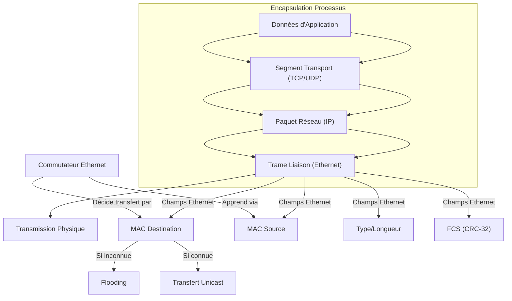

---
aliases:
  - Module 7
  - 01-07 | Module 7
archetype: cour
module: "RIB (Introduction au réseau)"
cssclasses:
  - max
tags:
  - protocole/ethernet
  - protocole/ethernet/preamble
  - protocole/ethernet/sfd
  - reseau/adressage/mac
  - reseau/unicast
  - reseau/multicast
  - reseau/broadcast
  - mecanisme/encapsulation
  - reseau/commutateur
  - reseau/apprentissage-mac
  - mac-address-table
  - reseau/flooding
  - reseau/trame
  - protocole/ip/ipv4
  - protocole/ip/ipv6
  - protocole/arp
  - protocole/http
  - protocole/ftp
  - protocole/tcp
  - protocole/udp
  - reseau/lan
  - checksum
  - integrite
  - modele-osi/couche-2
  - materiel/reseau/switch
---

# 01-07 | Module 7

> [!goal] Objectifs Pédagogiques
> À la fin de cette fiche, je dois être capable de :
> 1. Comprendre la structure et les champs fondamentaux d'une [[EthernetFrame|trame Ethernet]].
> 2. Expliquer le rôle et la nature des [[SourceMacAddress|adresses MAC source]] et [[DestinationMACAddress|destination]] dans la communication réseau.
> 3. Décrire le mécanisme d'encapsulation des données d'application jusqu'à la trame de liaison.
> 4. Détailler le fonctionnement des [[Switch|commutateurs Ethernet]] en [[DataLinkLayer|couche 2]], y compris l'apprentissage dynamique de la [[MacAddressTable|table d'adresses MAC]].
> 5. Distinguer les comportements de transfert ciblé et de diffusion (flooding) des commutateurs face aux différents types d'adresses MAC de destination.

## 📝 Synthèse du Cours

### 1. Fondement des Réseaux Locaux et Rôle des Adresses MAC

**Ethernet** est la technologie standard universellement adoptée pour les [[LocalAreaNetwork|réseaux locaux]] (*LAN*). Chaque appareil accède au réseau via une [[NetworkInterfaceCard|carte réseau]] munie d'une [[MacAddress|adresse MAC]] unique.

> [!note] Définition Clé
> **Adresse MAC (Media Access Control)** : Un identifiant unique de 48 [[BinaryDigit|bits]] (6 [[Byte|octets]]), gravé de manière permanente dans la carte réseau par le fabricant. Elle garantit l'unicité de chaque interface réseau sur le [[Internet|réseau mondial]].

Les adresses MAC de source et de destination sont des champs essentiels dans chaque trame Ethernet. Elles permettent l'identification précise de l'émetteur et du destinataire au niveau de la couche liaison de données, formant le fondement de la communication au sein d'un réseau local.

### 2. Anatomie Complète d'une Trame Ethernet

Une trame Ethernet est composée de plusieurs champs structurés, chacun ayant un rôle spécifique dans la transmission des données. Les valeurs indiquées représentent le nombre d'octets (pour obtenir la taille en bits, multipliez par 8).

*   **Champs de Synchronisation (8 octets)**
    *   **Préambule (7 octets)** : Séquence alternée de 0 et 1 (10101010...) permettant à la carte réseau réceptrice de se synchroniser avec le flux de bits et d'établir le timing pour la réception des données.
    *   **[[StartFrameDelimiter|Délimiteur de Trame de Début]] (SFD) (1 octet)** : Séquence 10101011 qui signale la fin du préambule et le début de l'information réelle de la trame.

*   **Adresses de Communication (12 octets)**
    *   **Adresse MAC de Destination (6 octets)** : Identifie le destinataire final de la trame sur le réseau local. Elle peut être :
        *   *Unicast* : Pour un destinataire unique.
        *   *Multicast* : Pour un groupe de hôtes.
        *   *Broadcast* : Pour tous les hôtes du réseau (FF:FF:FF:FF:FF:FF).
    *   **Adresse MAC Source (6 octets)** : Identifie l'appareil émetteur de la trame. Essentiel pour la construction des tables d'adresses MAC des commutateurs.

*   **Longueur/Type et Données Encapsulées (48-1502 octets)**
    *   **Champ Longueur/Type (2 octets)** : Polyvalent, indique soit la taille du *payload* (Longueur) en octets, soit le protocole de couche supérieure encapsulé (Type). Ex: 0x0800 pour [[InternetProtocol|IPv4]], 0x86DD pour IPv6, 0x0806 pour [[AddressResolutionProtocol|ARP]].
    *   **Données Encapsulées (46-1500 octets)** : Contient les informations transportées, comme un paquet IPv4 ou IPv6 avec des protocoles de couches supérieures (*[[HttpProtocol|HTTP]]*, *[[FileTransferProtocol|FTP]]*, etc.). Le rôle d'Ethernet est simplement de transporter ces données de manière fiable.

*   **Contrôle d'Intégrité (4 octets)**
    *   **FCS (Frame Check Sequence) (4 octets)** : Le dernier champ de la trame. Il contient une valeur de *contrôle de redondance cyclique* (*CRC-32*) calculée sur l'ensemble des champs de la trame. Le dispositif récepteur recalcule le CRC et le compare au FCS reçu. Si les valeurs ne correspondent pas, la trame est considérée comme corrompue et rejetée, garantissant l'intégrité des données.

### 3. Le Concept d'Encapsulation Réseau

L'**encapsulation** est le processus de placement d'un format de message dans un autre, comme une lettre dans une enveloppe. Chaque message informatique est encapsulé dans une trame spécifique avant d'être transmis sur le réseau.

1.  **Données d'[[Application|Application]]** : Le message original créé par l'application (*HTTP*, *FTP*, etc.).
2.  **[[TransportLayer|Segment Transport]]** : Ajout de l'en-tête [[TransmissionControlProtocol|TCP]] ou [[UserDatagramProtocol|UDP]] avec les ports.
3.  **Paquet Réseau** : Encapsulation dans un paquet IP avec les adresses IP source et destination.
4.  **Trame Liaison** : Encapsulation finale dans la trame Ethernet avec les adresses MAC source et destination.

La trame agit comme une enveloppe, fournissant l'adresse de destination et celle de la source. Les messages mal formatés sont rejetés.

### 4. Le Paquet IPv6 : Vue Détaillée

Le protocole Internet (**IP**) agit comme une enveloppe postale. Les champs du paquet IPv6 identifient la source et la destination, et IP est responsable de l'acheminement du message à travers plusieurs réseaux intermédiaires.

1.  **En-tête Fixe (40 octets)** : Contient la version, la classe de trafic, l'étiquette de flux, la longueur des données utiles, l'en-tête suivant, et la limite du nombre de tronçons.
2.  **Adresse IP Source (16 octets)** : Identifie l'appareil émetteur du paquet au niveau réseau.
3.  **Adresse IP Destination (16 octets)** : Identifie l'appareil destinataire final du paquet.
4.  **Données Encapsulées** : Contient le segment de couche transport (TCP/UDP) et les données d'application.

### 5. Les Commutateurs Ethernet : Fonctionnement en Couche 2

Les commutateurs Ethernet opèrent au niveau de la couche 2 (liaison de données) du [[OsiModel|modèle OSI]]. Contrairement aux [[Router|routeurs]] qui utilisent les adresses IP, les commutateurs prennent leurs décisions de transfert en se basant exclusivement sur les informations de l'en-tête Ethernet, notamment les adresses MAC.

> [!note] Définition Clé
> **Table d'adresses MAC** : Une table maintenue par chaque commutateur qui associe les adresses MAC des appareils connectés à ses ports physiques. Elle est construite dynamiquement par un processus d'apprentissage intelligent.

**Processus d'Apprentissage et de Transfert d'une Trame :**

1.  **Apprentissage par la Source** : Lorsqu'un commutateur reçoit une trame sur un port (ex: FA 0/1) avec une MAC source (ex: AAAA), il enregistre dans sa table MAC que "AAAA est accessible via le port FA 0/1".
2.  **Unicast Inconnu (*Flooding*)** : Si la MAC de destination (ex: DDDD) n'est pas encore dans la table MAC du commutateur, celui-ci effectue un "*flooding*" : il envoie la trame sur tous les ports sauf le port d'entrée.
3.  **Filtrage par les Hôtes** : Tous les hôtes connectés aux ports de sortie reçoivent la trame. Seul l'hôte dont la MAC correspond à la MAC de destination accepte et traite la trame. Les autres hôtes l'ignorent.
4.  **Apprentissage Bidirectionnel** : Lorsque l'hôte destinataire (ex: H4 avec MAC DDDD) répond à l'hôte source, sa MAC source (DDDD) est apprise par le commutateur sur le port où la réponse est reçue (ex: FA 0/4). Le commutateur peut alors effectuer un transfert ciblé vers DDDD via FA 0/4 pour les communications futures.

Ce processus de commutation évite les collisions et optimise l'utilisation de la [[Bandwidth|bande passante]] en n'envoyant les trames que vers leur destination réelle.

### 6. Gestion Dynamique de la Table MAC

*   **Durée de Vie des Entrées (*Aging Time*)** : Les commutateurs conservent les entrées MAC pendant environ **5 minutes (300 secondes)** par défaut. Ce minuteur est réinitialisé à chaque fois qu'une trame est reçue avec la MAC source correspondante. Si aucune trame n'est reçue pendant ce délai, l'entrée est supprimée pour libérer de la mémoire et s'adapter aux changements de topologie.

*   **Capacité de la Table** : Les commutateurs modernes peuvent stocker de milliers à des dizaines de milliers d'adresses MAC simultanément, selon leur modèle. Lorsque la table est pleine, certains commutateurs peuvent basculer vers un comportement de *flooding* pour les nouvelles adresses jusqu'à ce que de l'espace soit libéré.

*   **Comportements de Transfert (`Unicast`, `Multicast`, `Broadcast` )** :
    *   **Unicast connu** : Transfert ciblé vers un seul port.
    *   **Unicast inconnu** : *Flooding* sur tous les ports sauf le port d'entrée.
    *   **Broadcast** ((FF:FF:FF:FF:FF:FF)) : Toujours envoyé sur tous les ports.
    *   **Multicast** : Selon la configuration (par exemple, IGMP *snooping* pour diriger le multidiffusion uniquement vers les hôtes membres, ou *flooding* par défaut).

## 🧠 Carte Mentale / Schéma

## ❓ Quiz de Révision (Active Recall)
> [!question] Question 1
> Quel est le rôle principal d'une adresse MAC dans un réseau local et comment est-elle représentée ?
> > [!success]- Réponse
> > Une adresse MAC est un identifiant unique de 48 bits (6 octets) gravé sur la carte réseau. Son rôle principal est d'identifier de manière unique un appareil sur le segment de réseau local pour permettre la communication au niveau de la couche liaison de données. Elle est représentée sous forme hexadécimale, souvent séparée par des deux-points ou des tirets (ex: 00:1A:2B:3C:4D:5E).

> [!question] Question 2
> Décrivez brièvement le processus d'encapsulation tel qu'il se déroule depuis les données d'application jusqu'à la trame liaison.
> > [!success]- Réponse
> > Le processus d'encapsulation implique l'ajout d'en-têtes spécifiques à chaque couche du modèle. Il commence par les données d'application, puis un en-tête TCP/UDP est ajouté pour former un segment transport. Ce segment est ensuite encapsulé dans un en-tête IP pour créer un paquet réseau. Enfin, le paquet est encapsulé dans un en-tête et un *trailer* Ethernet pour former la trame liaison, prête à être transmise physiquement.

> [!question] Question 3
> Expliquez le mécanisme par lequel un commutateur Ethernet apprend les adresses MAC et comment il gère une trame dont l'adresse MAC de destination est inconnue.
> > [!success]- Réponse
> > Un commutateur apprend les adresses MAC en examinant les adresses MAC source des trames qu'il reçoit. Il enregistre l'adresse MAC source et le port d'entrée correspondant dans sa table d'adresses MAC. Lorsque la MAC de destination d'une trame est inconnue (non présente dans sa table), le commutateur effectue un *flooding* : il envoie la trame sur tous ses ports, à l'exception du port par lequel la trame a été reçue. Seul l'appareil destinataire avec la MAC correspondante acceptera la trame.

## 🔗 Liens du Module
*   **Précédent** :  [[RIB01-06_Module6|01-06 | Module 6]]
*   **Suivant** : [[RIB01-08_Module8|01-08 | Module 8]]
