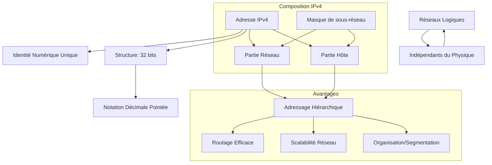

---
aliases:
  - Module 8
  - 01-08 | Module 8
archetype: cour
module: "RIB (Introduction au réseau)"
cssclasses:
  - max
tags:
  - protocole/ip/ipv4
  - reseau/adressage/ip
  - reseau/lan
  - internet
  - routage-reseau
  - definition/informatique
  - reseau/masque-de-sous-reseau
  - reseau/scalabilite
  - reseau/logique
  - reseau/physique
---

# 01-08 | Module 8

> [!goal] Objectifs Pédagogiques
> À la fin de cette fiche, je dois être capable de :
> 1. Expliquer l'importance fondamentale de l'**Adressage IPv4** dans la communication réseau.
> 2. Décrire la structure hiérarchique d'une **[[IPv4|Adresse IPv4]]**, distinguant la partie réseau de la partie hôte.
> 3. Comprendre le rôle du *SubnetMask* dans la détermination de ces parties.
> 4. Expliquer pourquoi l'adressage hiérarchique est essentiel pour l'efficacité du *[[RoutingConcepts|Routage]]* et la *scalabilité* des réseaux.
> 5. Différencier les *réseaux logiques* des *réseaux physiques* et leurs implications.

## 📝 Synthèse du Cours

### 1. L'Adresse IPv4 : Une Identité Numérique Essentielle
Dans un monde hyperconnecté, chaque appareil a besoin d'une identité numérique unique pour communiquer. L'**Adresse IPv4** est cette identité fondamentale qui permet aux ordinateurs, smartphones ou [[Server|serveurs]] d'interagir sur [[Internet]] et les [[LocalAreaNetwork|réseaux locaux]].

*   Elle agit comme une *adresse postale* pour les données, assurant leur livraison de la source à la destination correcte.
*   Sans une adresse IPv4 unique et configurée correctement, un appareil reste isolé.

> [!note] Définition Clé
> **Adresse IPv4** : Une étiquette numérique unique de 32 bits attribuée à chaque appareil participant à un réseau informatique basé sur le [[InternetProtocol|protocole Internet]] pour l'identification et la localisation.

### 2. IPv4 en Action

*   **Sur le Réseau Local ([[LocalAreaNetwork|LAN]])** : L'adresse IPv4 doit être *unique* parmi tous les appareils connectés au même LAN pour éviter les collisions et assurer des communications locales claires.
*   **Sur Internet** : L'adresse IPv4 doit être *unique au niveau mondial* pour permettre les communications à distance (ex. : un serveur en France et un utilisateur au Japon).

### 3. Où Trouve-t-on les Adresses IPv4 ?
Les adresses IPv4 sont attribuées à de nombreux types de périphériques réseau :

*   **Stations de Travail** : Chaque ordinateur possède une carte réseau (*[[NetworkInterfaceCard|NIC]]*) avec une adresse IPv4, servant de point de connexion au réseau.
*   **Serveurs** : Les serveurs peuvent avoir plusieurs cartes réseau, chacune avec sa propre adresse IPv4 pour des connexions multiples et la redondance.
*   **Périphériques Réseau** : Imprimantes réseau, téléphones IP et autres équipements connectés utilisent des adresses IPv4 pour communiquer.
*   **Routeurs** : Chaque interface d'un [[Router|routeur]] connectant différents réseaux IP possède sa propre adresse IPv4, agissant comme *passerelle* entre les réseaux.

### 4. Anatomie d'un Paquet IPv4
Chaque paquet circulant sur Internet contient des informations critiques :

*   **Adresse Source** : Identifie l'appareil qui envoie les données.
*   **Données du Paquet** : Le contenu réel transporté à travers le réseau.
*   **Adresse de Destination** : Indique où les données doivent arriver.

Ces adresses permettent aux équipements réseau d'acheminer les données et de garantir que les réponses reviennent à l'expéditeur.

### 5. Du Binaire au Décimal : La Structure IPv4

*   Les adresses IPv4 sont composées de **32 [[BinaryDigit|bits]]**.
*   Une séquence de 32 bits est difficile à mémoriser et sujette aux erreurs pour les humains (ex: `11010001101001011100100000000001`).
*   Pour faciliter la lecture et la manipulation, la *notation décimale pointée* a été créée.

### 6. La Notation Décimale Pointée
Le format binaire complet est regroupé et converti :

1.  **Format Binaire Complet** (32 bits) : Ex. `11010001101001011100100000000001`. Difficile à lire.
2.  **Regroupement en Octets** (4 x 8 bits) : Ex. `11010001.10100101.11001000.00000001`. Organisation en quatre groupes de 8 bits.
3.  **Conversion en Décimal** : Chaque [[Byte|octet]] est converti en valeur décimale de 0 à 255. Ex. `209.165.200.1`. Format final lisible.

*   Cette **notation décimale pointée** est le format standard utilisé pour configurer et identifier les appareils réseau.

### 7. Communication Multi-Réseaux et Structure Hiérarchique
Pour la communication entre différents réseaux, l'adresse IPv4 est divisée en deux composants essentiels :

*   **Partie Réseau** : Identifie le segment de réseau auquel l'appareil appartient. Tous les appareils d'un même réseau partagent cette partie.
    *   Ex: Dans `192.168.3.X`, `192.168.3` est la partie réseau.
*   **Partie Hôte** : Identifie l'appareil individuel sur le réseau spécifique. Cette valeur doit être *unique* pour chaque hôte du même réseau.
    *   Ex: Dans `192.168.3.X`, `X` est la partie hôte.

> [!note] Règle d'Or de l'Adressage IPv4
> Sur un réseau local, la **partie réseau** doit être identique pour tous les appareils, tandis que la **partie hôte** doit être unique pour chacun.

### 8. Exemple : Départements sur Réseaux Séparés
Des départements (Management, Comptabilité, Ventes) peuvent être configurés sur des *réseaux logiques* distincts :

*   Management : `192.168.1.X`
*   Comptabilité : `192.168.2.X`
*   Ventes : `192.168.3.X`

Si un appareil du département Ventes (`192.168.3.X`) veut communiquer avec un appareil de la Comptabilité (`192.168.2.X`), la communication doit passer par un *routeur*, car ils sont sur des parties réseau différentes.

### 9. Le Rôle du Subnet Mask
Le **masque de sous-réseau** (*Subnet Mask*) est l'outil qui permet à un appareil de déterminer quelle partie d'une adresse IPv4 représente le réseau et quelle partie représente l'hôte.

*   **Exemple** :
    *   Adresse : `192.168.5.11`
    *   Masque : `255.255.255.0`
    *   Les trois premiers octets du masque (`255.255.255`) identifient la partie réseau (`192.168.5`).
    *   Le dernier octet du masque (`0`) identifie la partie hôte (`11`).

> [!note] Définition Clé
> **Masque de sous-réseau (Subnet Mask)** : Une valeur de 32 bits utilisée en conjonction avec une adresse IPv4 pour séparer la partie réseau de la partie hôte de l'adresse.

### 10. Pourquoi l'Adressage Hiérarchique ?
L'adressage hiérarchique est crucial pour :

*   **Efficacité du Routage** : Les routeurs n'ont besoin de connaître que les chemins vers les réseaux, pas l'emplacement de chaque hôte individuel. Cela réduit la taille des tables de routage.
*   **Scalabilité** : Permet à Internet de croître en organisant des millions d'appareils en réseaux logiques gérables.
*   **Organisation** : Facilite la gestion et la segmentation des réseaux par département, fonction ou localisation.

### 11. Réseaux Logiques vs Réseaux Physiques
Un concept puissant de l'adressage IPv4 est la possibilité de créer plusieurs *réseaux logiques* sur une même *infrastructure physique*.

*   **Scénario** : Six ordinateurs connectés au même [[Switch|commutateur]] physique, mais configurés sur deux réseaux logiques différents (ex. : `192.168.18.X` et `192.168.5.X`).
*   **Résultat** : Les hôtes du réseau `192.168.18` peuvent communiquer entre eux, et ceux du réseau `192.168.5` peuvent communiquer entre eux. Cependant, les deux groupes **ne peuvent pas** communiquer directement sans un routeur.

> [!IMPORTANT]
> Un seul réseau physique peut héberger plusieurs réseaux IPv4 logiques, offrant flexibilité et segmentation pour des raisons de sécurité ou d'organisation.

### 12. Analogie : Le Système Téléphonique
L'adressage IPv4 peut être comparé au système téléphonique :

*   **Indicatif de Pays** (+33 pour la France) : Équivalent à l'identifiant de réseau principal.
*   **Indicatif Régional** (01 pour Paris) : Affine la localisation du réseau.
*   **Central Téléphonique** (XX XX) : Identifie le réseau local spécifique.
*   **Numéro Local** (XX XX) : Correspond à l'hôte individuel sur le réseau.

Cette structure hiérarchique permet d'acheminer efficacement les données à travers Internet.

## 🧠 Carte Mentale / Schéma

## ❓ Quiz de Révision (Active Recall)
> [!question] Question 1
> Quel est le rôle principal de l'Adresse IPv4 dans un réseau informatique ?
> > [!success]- Réponse
> > L'Adresse IPv4 est une identité numérique unique qui permet à chaque appareil de communiquer, agissant comme une "adresse postale" pour acheminer les données de la source à la destination.

> [!question] Question 2
> Une adresse IPv4 est composée de combien de bits, et quel est le format le plus couramment utilisé pour sa représentation ?
> > [!success]- Réponse
> > Une adresse IPv4 est composée de **32 bits**. Le format le plus couramment utilisé est la **notation décimale pointée** (ex: 192.168.1.1).

> [!question] Question 3
> Quelle est la différence fondamentale entre la "partie réseau" et la "partie hôte" d'une adresse IPv4, et quelle est la règle d'or les concernant sur un même réseau local ?
> > [!success]- Réponse
> > La **partie réseau** identifie le segment de réseau auquel l'appareil appartient. La **partie hôte** identifie l'appareil individuel sur ce réseau. La règle d'or est que tous les appareils d'un même réseau local doivent avoir la **même partie réseau** et une **partie hôte unique**.

> [!question] Question 4
> Expliquez le rôle du masque de sous-réseau (Subnet Mask).
> > [!success]- Réponse
> > Le **masque de sous-réseau** est une valeur de 32 bits qui permet à un appareil de déterminer quelle portion de l'adresse IPv4 correspond à la partie réseau et quelle portion correspond à la partie hôte.

> [!question] Question 5
> Citez deux raisons pour lesquelles l'adressage hiérarchique est essentiel pour l'efficacité et la scalabilité des réseaux.
> > [!success]- Réponse
> > L'adressage hiérarchique est crucial pour :
> > 1.  L'**efficacité du routage** : Les routeurs n'ont qu'à connaître les chemins vers les réseaux, pas vers chaque hôte individuel, ce qui réduit la taille des tables de routage.
> > 2.  La **scalabilité** : Il permet d'organiser des millions d'appareils en réseaux logiques gérables, facilitant ainsi la croissance d'Internet et des grands réseaux d'entreprise.

## 🔗 Notes Connexes
* **Lien** : [[RIB01-07_Module7|01-07 | Module 7]]
* **Lien** : [[RIB01-09_Module9|01-09 | Module 9]]
* **Lien** : [[IpSubnetting|Sous-Réseautage IP]]
* **Lien** : [[IpSubnettingFundamentals|IP Subnetting]]
