---
cssclasses:
  - max
aliases:
  - Module 9
  - 01-09 | Module 9
archetype: cour
module: "RIB (Introduction au réseau)"
tags:
  - reseau
  - protocole/ip
  - protocole/ip/ipv4
  - protocole/ip/unicast
  - protocole/ip/broadcast
  - protocole/ip/multicast
  - protocole/ip/private-address
  - protocole/ip/adresse-publique
  - protocole/ip/loopback
  - reseau/adressage/ip
  - nat
  - routeur
  - reseau/segmentation
  - reseau/sous-reseautage
  - organisation/iana
  - organisation/rir
---

# 01-09 | Module 9

> [!goal] Objectifs Pédagogiques
> À la fin de cette fiche, je dois être capable de :
> 1. Expliquer les mécanismes fondamentaux de la transmission [[InternetProtocol|IP]] [[UnicastCommunication|unicast]], [[BroadcastDomain|broadcast]] et [[MulticastCommunication|multicast]].
> 2. Identifier et décrire les différents types d'adressage [[IPv4]], y compris les adresses [[PublicIPAddress|publiques]], [[PrivateIPAddressRanges|privées]] et à usage spécial.
> 3. Comprendre la structure hiérarchique de l'attribution mondiale des adresses IP par l'[[InternetAssignedNumbersAuthority|IANA]] et les RIR.
> 4. Expliquer le rôle des [[Router|routeurs]] dans la [[NetworkSegment|segmentation réseau]] et la gestion des domaines de diffusion.
> 5. Expliquer la problématique des grands domaines de diffusion et les avantages du [[Subnetting|sous-réseautage (subnetting)]].

## 📝 Synthèse du Cours

### 1. Types de Transmission IP

Les paquets IP peuvent être transmis selon trois modes principaux.

#### A. Transmission Unicast
- C'est une communication **un-à-un**, où un périphérique envoie un message à un seul autre périphérique spécifique.
- Un paquet unicast possède une adresse IP de destination unique. Seul le destinataire ciblé reçoit et traite le paquet.
- L'adresse IP source d'un paquet est **toujours** *unicast*, car un paquet ne peut provenir que d'une seule source.
- *Exemple* : Un ordinateur 172.16.4.1 envoie un paquet à une imprimante 172.16.4.253. Seule l'imprimante reçoit le paquet.

> [!note] Définition Clé
> **Transmission Unicast** : Mode de communication IP où un périphérique envoie un message à un seul autre périphérique spécifique, identifié par une adresse IP de destination unique.

#### B. [[BroadcastCommunication|Diffusion IPv4 (Broadcast)]]
- C'est une communication **un-à-tous**, où un périphérique envoie un message simultanément à **tous** les autres appareils au sein du même *domaine de diffusion* (segment réseau local).
- Elle utilise l'adresse de diffusion spéciale **255.255.255.255** (tous les bits à 1).
- Les [[Switch|commutateurs]] [[Ethernet]] propagent le paquet sur tous les ports (sauf celui d'entrée), inondant le [[LocalAreaNetwork|réseau local]].
- Les routeurs ne transmettent pas les paquets de diffusion au-delà du domaine local, ce qui limite leur portée.
- **Types de Diffusion** :
    - **Diffusion dirigée** : Envoyée à tous les hôtes d'un réseau spécifique (ex: 172.16.4.255 pour le réseau 172.16.4.0/24).
    - **Diffusion limitée** : Envoyée à 255.255.255.255, elle est confinée au réseau local immédiat et ne traverse pas les routeurs.
- *Important* : IPv4 utilise la diffusion, mais [[IPv6]] n'a pas de paquets de diffusion traditionnels (il utilise la *multidiffusion* à la place).

> [!note] Définition Clé
> **[[BroadcastCommunication|Diffusion IPv4 (Broadcast)]]** : Mode de communication IP un-à-tous, où un message est envoyé simultanément à tous les appareils d'un même *domaine de diffusion* en utilisant une adresse de diffusion spécifique.

#### C. Multidiffusion IPv4 ([[MulticastCommunication|Multicast]])
- C'est une approche optimisée **un-à-groupe**, où un hôte envoie un seul paquet à un groupe spécifique d'hôtes qui se sont abonnés à ce groupe.
- IPv4 réserve la plage d'adresses de **224.0.0.0 à 239.255.255.255** pour la multidiffusion.
- Chaque groupe de multidiffusion est représenté par une adresse de destination multicast unique.
- Les hôtes deviennent *clients de multidiffusion* en s'abonnant à un groupe spécifique.
- Seuls les membres du groupe traitent les paquets, les autres périphériques les ignorent, optimisant l'utilisation des ressources réseau.
- *Applications* : Essentielle pour les protocoles de routage comme [[OspfProtocol|OSPF]] (ex: 224.0.0.5) pour communiquer efficacement entre routeurs, ou pour le streaming vidéo.

> [!note] Définition Clé
> **Multidiffusion IPv4 (Multicast)** : Mode de communication IP optimisé un-à-groupe, où un hôte envoie un seul paquet à un ensemble d'hôtes ayant spécifiquement rejoint un groupe de multidiffusion.

### 2. Adressage IPv4

#### A. Adresses IPv4 Publiques et Privées
- **Adresses Publiques** :
    - Sont routables sur l'[[Internet]] et globalement uniques.
    - Acheminées par les [[InternetServiceProvider|fournisseurs d'accès à Internet (FAI)]] entre les routeurs.
    - Permettent la communication mondiale directe.
- **Adresses Privées** :
    - Définies dans la [[RFC1918|RFC 1918]].
    - Non routables sur l'Internet, utilisées pour les réseaux internes des entreprises ou domestiques.
    - Peuvent être réutilisées par différentes organisations car elles ne sont pas vues de l'extérieur.
    - **Plages d'adresses privées (RFC 1918)** :
        - **Classe A** : 10.0.0.0/8 (de 10.0.0.0 à 10.255.255.255) - Plus de 16 millions d'adresses.
        - **Classe B** : 172.16.0.0/12 (de 172.16.0.0 à 172.31.255.255) - Environ 1 million d'adresses.
        - **Classe C** : 192.168.0.0/16 (de 192.168.0.0 à 192.168.255.255) - Environ 65 000 adresses.
- **[[NetworkAddressTranslation|Traduction d'Adresses Réseau (NAT)]]** :
    - Permet aux appareils avec des adresses privées de communiquer avec l'extérieur (Internet).
    - Le routeur NAT traduit l'adresse source privée en une adresse publique routable avant la transmission du paquet.

#### B. Adresses IPv4 à Usage Spécial
- **[[LoopbackAddress|Adresses de Bouclage (Loopback)]]** :
    - Plage : **127.0.0.0/8** (de 127.0.0.1 à 127.255.255.254).
    - L'adresse **127.0.0.1** est utilisée par un hôte pour diriger le trafic vers lui-même.
    - Sert à tester la configuration IP locale d'une machine sans envoyer de paquets sur le réseau physique.
- **[[AutomaticPrivateIPAddressing|Adresses Link-Local (APIPA - Automatic Private IP Addressing)]]** :
    - Plage : **169.254.0.0/16** (de 169.254.0.1 à 169.254.255.254).
    - Permettent l'auto-configuration d'un client Windows lorsqu'aucun serveur [[DHCP]] n'est disponible.
    - Utilisables pour des connexions [[PeerToPeer|peer-to-peer]] simples au sein du même segment local.
- **Adresses Réseau et Broadcast** :
    - L'adresse réseau (tous les bits hôtes à 0) identifie le réseau lui-même.
    - L'adresse de diffusion (tous les bits hôtes à 1) permet la diffusion à tous les hôtes du segment.
    - Ces adresses ne peuvent **jamais** être attribuées à des hôtes individuels.

#### C. Évolution de l'Adressage : Du Classful au Classless
- **[[ClassfulAddressing|Adressage Traditionnel par Classe (Classful)]]** :
    - Défini par la RFC 790 (années 1981-1990s), divisait les adresses en classes A, B et C avec des préfixes fixes (/8, /16, /24).
    - A conduit à un gaspillage massif d'adresses IPv4, notamment avec la classe A.
- **[[ClasslessInterDomainRouting|Adressage Sans Classe (CIDR - Classless Inter-Domain Routing)]]** :
    - Introduit au milieu des années 1990 pour remplacer l'adressage *classful*.
    - Ignore les règles de classes et alloue les adresses selon les besoins réels grâce à des *masques de sous-réseau de longueur variable* (VLSM).
    - A permis une utilisation beaucoup plus efficace de l'espace d'adressage IPv4 limité.
    - La solution à long terme pour l'épuisement des adresses IPv4 est l'adoption d'IPv6.

### 3. Architecture Mondiale de Distribution des Adresses IP

- L'[[InternetAssignedNumbersAuthority|IANA]] (Internet Assigned Numbers Authority) est l'autorité suprême en matière d'attribution d'adresses IP.
- L'IANA attribue de grands blocs d'adresses IP aux cinq **[[RegionalInternetRegistries|Registres Internet Régionaux (RIR)]]** :
    - **ARIN** (Amérique du Nord)
    - **RIPE NCC** (Europe, Moyen-Orient, Asie centrale)
    - **APNIC** (Asie-Pacifique)
    - **LACNIC** (Amérique Latine et Caraïbes)
    - **AFRINIC** (Afrique)
- Les RIR redistribuent ensuite ces blocs aux fournisseurs d'accès Internet ([[InternetServiceProvider|FAI]]) et aux organisations de leur région géographique respective.

### 4. Segmentation du Réseau et Domaines de Diffusion

- **Principe de la Diffusion Ethernet** : Dans un réseau local Ethernet, les appareils utilisent la diffusion pour des protocoles essentiels comme [[AddressResolutionProtocol|ARP]] (Address Resolution Protocol) et DHCP (Dynamic Host Configuration Protocol).
- **Domaine de Diffusion** : Représente l'ensemble des périphériques qui reçoivent les trames de diffusion émises par n'importe quel appareil du groupe.

> [!note] Définition Clé
> **Domaine de Diffusion** : Zone logique d'un réseau où tous les périphériques reçoivent les trames de diffusion émises par l'un des membres de ce groupe.

- **Rôle des Routeurs** :
    - Les routeurs sont cruciaux pour la segmentation réseau car ils ne propagent pas les messages de diffusion d'une interface à une autre.
    - Chaque interface d'un routeur délimite un domaine de diffusion distinct, empêchant ainsi la propagation excessive des *broadcasts*.

#### A. Problématiques des Grands Domaines de Diffusion
- **Impact sur les Performances Réseau** : Un volume excessif de trafic de diffusion ralentit les opérations réseau en saturant la [[Bandwidth|bande passante]].
- **Charge de Traitement des Périphériques** : Chaque appareil doit traiter tous les paquets de diffusion, même s'ils ne lui sont pas destinés, consommant ainsi CPU et mémoire inutilement.
- **Dégradation de l'Expérience Utilisateur** : Congestion du réseau entraînant des lenteurs, des délais de réponse accrus et une perte de productivité.

#### B. Solution : La Création de Sous-Réseaux
- **Sous-réseautage ([[IpSubnetting|Subnetting]])** : Technique consistant à diviser un grand réseau logique en plusieurs sous-réseaux plus petits et gérables.

> [!note] Définition Clé
> **Sous-réseautage (Subnetting)** : Processus de division d'un grand réseau IP en plusieurs sous-réseaux logiques plus petits, afin d'améliorer la gestion, la [[Cybersecurity|sécurité]] et l'efficacité du trafic.

- **Avantages de la Segmentation en Sous-Réseaux** :
    - **Amélioration des Performances** : Réduit le trafic global et limite la propagation des diffusions au sein de chaque sous-réseau.
    - **Politiques de Sécurité** : Permet de définir des politiques granulaires de sécurité (ACLs) et de contrôler la communication entre les segments.
    - **Isolation des Problèmes** : Limite l'impact du trafic anormal, des pannes ou des activités malveillantes à un seul sous-réseau.
    - **Optimisation de l'Adressage IP** : Permet une utilisation plus efficace de l'espace d'adresses IP disponibles.
- **Stratégies de Découpage** :
    - Par emplacement géographique (bâtiments, étages).
    - Par groupe ou fonction (départements, services).
    - Par type de périphérique (serveurs, imprimantes, [[InternetOfThings|IoT]]).
    - Par niveau de sécurité (réseau invité, zone DMZ).

> [!note] Définition Clé
> **[[NetworkAddressTranslation|NAT]] (Network Address Translation)** : Processus par lequel une passerelle (généralement un routeur) modifie l'information d'adressage IP dans l'en-tête d'un paquet pendant qu'il transite un trafic d'un segment réseau à un autre, généralement pour permettre à plusieurs appareils sur un réseau privé de partager une seule adresse IP publique pour accéder à l'Internet.

## 🧠 Carte Mentale / Schéma

```mermaid
graph TD
    A["01-09 | Module 9: Introduction au Réseau"] --> B["1. Types de Transmission IP"]
    B --> B1["Unicast"]
    B --> B2["Broadcast IPv4"]
    B --> B3["Multicast IPv4"]

    A --> C["2. Adressage IPv4"]
    C --> C1["Adresses Publiques & Privées"]
    C1 --> C1a["Plages Privées RFC 1918"]
    C1 --> C1b["NAT (Network Address Translation)"]
    C --> C2["Adresses Usage Spécial"]
    C2 --> C2a["Loopback (127.0.0.0/8)"]
    C2 --> C2b["Link-Local (169.254.0.0/16)"]
    C2 --> C2c["Réseau & Broadcast"]
    C --> C3["Evolution Adressage"]
    C3 --> C3a["Classful (Ancien)"]
    C3 --> C3b["Classless (CIDR)"]

    A --> D["3. Architecture Distribution IP"]
    D --> D1["IANA (Autorité Suprême)"]
    D1 --> D2["RIRs (Régionaux)"]
    D2 --> D2a["ARIN"]
    D2 --> D2b["RIPE NCC"]
    D2 --> D2c["APNIC"]
    D2 --> D2d["LACNIC"]
    D2 --> D2e["AFRINIC"]
    D2 --> D3["FAIs / Organisations"]

    A --> E["4. Segmentation Réseau"]
    E --> E1["Domaines de Diffusion"]
    E1 --> E1a["Propriétés Ethernet"]
    E1 --> E1b["Rôle des Routeurs"]
    E --> E2["Problèmes Grands Domaines"]
    E2 --> E2a["Perf. Réseau Impactées"]
    E2 --> E2b["Charge Périphériques"]
    E2 --> E2c["Dégradation Exp. Utilisateur"]
    E --> E3["Solution: Sous-Réseautage"]
    E3 --> E3a["Avantages"]
    E3a --> E3a1["Perf. Améliorées"]
    E3a --> E3a2["Sécurité"]
    E3a --> E3a3["Isolation Problèmes"]
    E3 --> E3b["Stratégies Découpage"]
```

## ❓ Quiz de Révision (Active Recall)
> [!question] Question 1
> Décrivez la différence fondamentale entre la transmission Unicast, Broadcast et Multicast en termes de destinataires.
> > [!success]- Réponse
> > - **Unicast** : Un expéditeur vers un seul destinataire spécifique.
> > - **Broadcast** : Un expéditeur vers tous les destinataires au sein du même domaine de diffusion.
> > - **Multicast** : Un expéditeur vers un groupe spécifique de destinataires qui se sont abonnés au groupe.

> [!question] Question 2
> Quelles sont les trois plages d'adresses IPv4 privées définies par la RFC 1918 ?
> > [!success]- Réponse
> > - Classe A : 10.0.0.0/8 (10.0.0.0 à 10.255.255.255)
> > - Classe B : 172.16.0.0/12 (172.16.0.0 à 172.31.255.255)
> > - Classe C : 192.168.0.0/16 (192.168.0.0 à 192.168.255.255)

> [!question] Question 3
> Quel est le rôle principal des routeurs en ce qui concerne les domaines de diffusion IPv4 ?
> > [!success]- Réponse
> > Les routeurs segmentent les réseaux en arrêtant la propagation des paquets de diffusion entre leurs interfaces. Chaque interface d'un routeur définit un domaine de diffusion distinct.

> [!question] Question 4
> Expliquez pourquoi l'adressage *Classless Inter-Domain Routing* (CIDR) a été introduit pour remplacer l'adressage *classful*.
> > [!success]- Réponse
> > L'adressage CIDR a été introduit pour remplacer l'adressage *classful* afin de remédier au gaspillage massif des adresses IPv4. CIDR permet une allocation plus flexible et efficace des adresses IP grâce à l'utilisation de masques de sous-réseau de longueur variable, ignorant les limites rigides des classes A, B et C.

> [!question] Question 5
> Citez l'autorité mondiale suprême et au moins deux Registres Internet Régionaux (RIR) responsables de la distribution des adresses IP.
> > [!success]- Réponse
> > L'autorité mondiale suprême est l'**IANA** (Internet Assigned Numbers Authority). Les RIR incluent : **ARIN**, **RIPE NCC**, **APNIC**, **LACNIC**, **AFRINIC**.

## 🔗 Notes Connexes
* **Lien** : [[RIB01-08_Module8|01-08 | Module 8]]
* **Lien** : [[RIB01-10_Module10|01-10 | Module 10]]