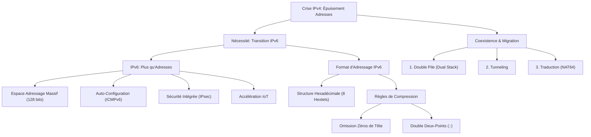

---
aliases:
  - Module 10
  - 01-10 | Module 10
archetype: cour
module: "RIB (Introduction au réseau)"

cssclasses:
  - max
tags:
  - protocole/ip/ipv6
  - protocole/ip/ipv4
  - nat
  - organisation/rir
  - organisation/ietf
  - protocole/icmpv6
  - protocole/ipv6/slaac
  - protocole/dhcp
  - protocole/arp
  - protocole/vpn/ipsec
  - iot
  - protocole/ipv6/dual-stack
  - protocole/ip/epuisement-adresses
  - protocole/ipv6/migration
  - protocole/ipv6/adressage
---

# 01-10 | Module 10

> [!goal] Objectifs Pédagogiques
> À la fin de cette fiche, je dois être capable de :
> 1. Expliquer pourquoi la transition vers **IPv6** est une nécessité incontournable.
> 2. Décrire l'ampleur de la crise d'épuisement des adresses **IPv4**.
> 3. Identifier les fonctionnalités clés d'**IPv6** au-delà de l'extension de l'espace d'adressage.
> 4. Comprendre les différentes stratégies de coexistence et de migration entre **IPv4** et **IPv6**.
> 5. Expliquer le format d'adressage **IPv6** et ses règles de compression.

## 📝 Synthèse du Cours

### 1. La Transition vers IPv6 : Une Nécessité Incontournable
L'épuisement des adresses **IPv4** n'est plus une menace lointaine, mais une réalité pressante qui contraint l'évolution de l'[[Internet]]. **IPv6** est la solution conçue pour soutenir la croissance exponentielle des communications réseau et transformer l'infrastructure mondiale en offrant un espace d'adressage virtuellement illimité.

### 2. L'Épuisement des Adresses IPv4 : Une Crise Mondiale
Le protocole **IPv4** est théoriquement limité à environ 4,3 milliards d'adresses, un nombre largement insuffisant pour la croissance actuelle d'Internet, en particulier dans les régions émergentes.
*   **Limite IPv4** : Environ 4,3 milliards d'adresses uniques.
*   **Solutions temporaires** : L'utilisation d'adresses privées combinées à la *[[NetworkAddressTranslation|Traduction d'Adresses Réseau]]* (**NAT**) a ralenti la pénurie. Cependant, cette approche présente des limitations majeures, notamment pour les communications [[PeerToPeer|peer-to-peer]] et de nombreuses applications critiques nécessitant une connectivité de bout en bout.
*   **Contraste avec IPv6** : **IPv6** offre un espace d'adressage de 340 undécillions (340 suivi de 36 zéros), garantissant une expansion quasi illimitée pour les décennies à venir.

> [!note] Définition Clé
> **NAT (Network Address Translation)** : Mécanisme permettant à plusieurs appareils d'un réseau privé de partager une seule adresse IP publique pour accéder à Internet, retardant l'épuisement d'IPv4 mais introduisant des complexités.

#### Dates d'Épuisement par Région (RIR)
Quatre des cinq registres Internet régionaux (**RIR**) ont déjà épuisé leurs réserves d'adresses **IPv4**, soulignant l'urgence de la transition :
1.  **APNIC (Asie-Pacifique)** : Le premier **RIR** à épuiser ses adresses face à une demande massive.
2.  **RIPE NCC (Europe)** : Réserves épuisées, un système de liste d'attente est en place.
3.  **ARIN (Amérique du Nord)** : Stock épuisé, la redistribution est désormais limitée.
4.  **LACNIC (Amérique Latine)** : Le dernier bloc a été alloué, la région est en phase finale de distribution.

### 3. IPv6 : Bien Plus Que des Adresses Supplémentaires
Lors de son développement par l'**[[InternetEngineeringTaskForce|IETF]]**, **IPv6** n'a pas seulement étendu l'espace d'adressage, mais a aussi corrigé les limitations fondamentales d'**IPv4** et amélioré le protocole pour les besoins futurs de l'Internet.
*   **Espace d'Adressage Massif** : 128 bits permettent 340 undécillions d'adresses, assurant une expansion future illimitée et une allocation granulaire.
*   **Configuration Automatique** : **ICMPv6** intègre des fonctionnalités d'auto-configuration d'adresse (comme le SLAAC) et de résolution d'adresse, des fonctions qui étaient absentes dans **IPv4** et gérées par d'autres protocoles (comme [[DHCP]] et [[AddressResolutionProtocol|ARP]]).
*   **Sécurité Intégrée** : *IPsec* est incorporé nativement dans la pile de protocoles **IPv6** pour des communications sécurisées de bout en bout, contrairement à **IPv4** où il est un ajout optionnel.

### 4. L'Internet des Objets Accélère la Transition
L'Internet s'étend bien au-delà des ordinateurs et des smartphones pour inclure l'*[[InternetOfThings|Internet des Objets]]* (**IoT**), où chaque appareil du quotidien devient connecté et équipé de capteurs.
*   **Rôle des Opérateurs Mobiles** : Les principaux opérateurs rapportent déjà que plus de 90% de leur trafic transite par **IPv6**.
*   **Impact sur divers domaines** :
    *   *Automobiles Connectées* : Véhicules intelligents nécessitant des adresses IP permanentes.
    *   *Équipement Biomédical* : Dispositifs de santé surveillés en temps réel.
    *   *Électroménager Intelligent* : Appareils domestiques interconnectés.
    *   *Écosystèmes Naturels* : Capteurs environnementaux distribués.
Cette prolifération de dispositifs exige un espace d'adressage beaucoup plus grand que ce que **IPv4** peut offrir, faisant d'**IPv6** la pierre angulaire de l'**IoT**.

### 5. Coexistence IPv4 et IPv6 : Les Trois Stratégies de Migration
La transition vers **IPv6** est progressive et les deux protocoles coexisteront pendant des années. L'**IETF** a développé trois approches principales pour faciliter cette migration :
1.  **Double Pile (Dual Stack)** : Les périphériques exécutent simultanément les piles de protocoles **IPv4** et **IPv6** sur le même segment réseau. C'est la méthode privilégiée pour une **IPv6** native, permettant un accès direct au contenu Internet via **IPv6** ou **IPv4** selon la ressource.
2.  **Tunneling** : Cette méthode transporte les paquets **IPv6** sur un réseau **IPv4**. Les paquets **IPv6** sont encapsulés dans des paquets **IPv4** pour traverser des infrastructures qui ne supportent pas encore **IPv6**.
3.  **Traduction (NAT64)** : Permet aux périphériques **IPv6** de communiquer avec des périphériques **IPv4** via une technique analogue à la **NAT**. Un paquet **IPv6** est traduit en paquet **IPv4**, et inversement, par un dispositif de traduction.

> [!IMPORTANT]
> Les techniques de *tunneling* et de *traduction* sont des solutions temporaires pour faciliter la transition. L'objectif ultime est d'atteindre une communication native **IPv6** de bout en bout, de la source à la destination, pour exploiter pleinement les avantages du protocole.

### 6. Comprendre le Format d'Adressage IPv6
Les adresses **IPv6** utilisent un système hexadécimal (base 16, chiffres 0-9 et lettres A-F) pour représenter efficacement leurs 128 bits.
*   **Structure des Adresses IPv6** :
    *   **128 bits** de longueur totale.
    *   Composée de **8 hextets**, chacun de 16 bits.
    *   Représentée par **32 valeurs hexadécimales** au total.
    *   La notation est **non sensible à la casse**.
*   **Format privilégié** : `x:x:x:x:x:x:x:x`, où chaque `x` représente un hextet de 16 bits (quatre caractères hexadécimaux).

#### Règles de Compression des Adresses IPv6
Deux règles essentielles simplifient l'écriture des adresses **IPv6** et les rendent plus gérables :
1.  **Omission des Zéros de Tête** : Dans chaque hextet, les zéros de début peuvent être omis. Les zéros de fin ne sont jamais supprimés pour éviter l'ambiguïté.
    *   *Exemple* : `2001:0DB8:0000:0001:0000:0000:0000:0001` devient `2001:DB8:0:1:0:0:0:1`
2.  **Double Deux-Points pour Zéros Contigus** : Une chaîne contiguë unique d'un ou plusieurs hextets composés uniquement de zéros peut être remplacée par un double deux-points (`::`). Cette règle ne peut être appliquée qu'une seule fois par adresse pour éviter toute ambiguïté sur la longueur de la chaîne de zéros omise.
    *   *Exemple* : `2001:0DB8:0000:0000:0000:0000:0000:0001` devient `2001:DB8::1`

> [!NOTE] Bonne pratique
> Si plusieurs chaînes de zéros contigus existent, appliquez le double deux-points à la chaîne la plus longue. Si les longueurs sont égales, privilégiez la première occurrence.

## 🧠 Carte Mentale / Schéma

## ❓ Quiz de Révision (Active Recall)
> [!question] Question 1
> Quelles sont les deux principales raisons qui font de la transition vers **IPv6** une nécessité incontournable pour l'évolution d'Internet ?
> > [!success]- Réponse
> > 1.  L'épuisement des adresses **IPv4**, qui limite la croissance de l'Internet, surtout dans les régions émergentes.
> > 2.  Les limitations inhérentes à **IPv4** (comme la complexité introduite par **NAT**), qui ne sont pas adaptées aux besoins futurs de l'Internet, notamment pour l'**IoT**.

> [!question] Question 2
> Outre l'extension de l'espace d'adressage, nommez au moins trois fonctionnalités clés qu'**IPv6** apporte par rapport à **IPv4**.
> > [!success]- Réponse
> > **IPv6** apporte :
> > 1.  Une **configuration automatique** des adresses grâce à **ICMPv6** (SLAAC), réduisant la dépendance à DHCP.
> > 2.  La **sécurité intégrée** avec *IPsec* faisant partie intégrante du protocole.
> > 3.  Une gestion plus efficace du trafic grâce à des champs simplifiés dans l'en-tête et un meilleur support du *multicast*.

> [!question] Question 3
> Expliquez la différence entre les règles de compression "Omission des Zéros de Tête" et "Double Deux-Points" pour les adresses **IPv6**.
> > [!success]- Réponse
> > 1.  **Omission des Zéros de Tête** : Permet de supprimer les zéros qui apparaissent au début de chaque hextet (ex: `0DB8` devient `DB8`).
> > 2.  **Double Deux-Points (::)** : Permet de remplacer une seule chaîne contiguë de plusieurs hextets composés uniquement de zéros (ex: `0000:0000:0000` devient `::`). Cette règle ne peut être appliquée qu'une seule fois par adresse.

## 🔗 Liens du Module
*   **Précédent** :  [[RIB01-09_Module9|01-09 | Module 9]]
*   **Suivant** :  [[RIB01-11_Module11|01-11 | Module 11]]