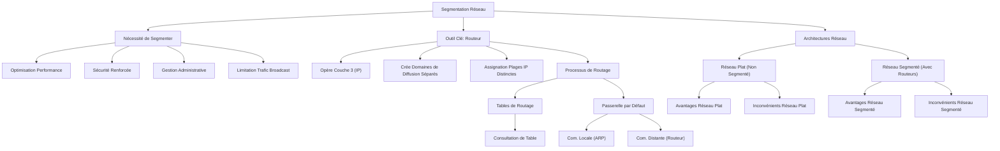

---
aliases:
  - Module 11
  - 01-11 | Module 11
archetype: cour
module: "RIB (Introduction au réseau)"
cssclasses:
  - max
tags:
  - reseau/segmentation
  - segmentation
  - routeur
  - routage-reseau
  - routage/table
  - routage/dynamique
  - routage/statique
  - modele-osi/couche-3
  - protocole/ip
  - reseau/adressage/ip
  - reseau/adressage/mac
  - protocole/arp
  - modele/tcp-ip
  - protocole/ospf
  - protocole/eigrp
  - reseau/passerelle-par-defaut
  - reseau/domaine-de-diffusion
  - reseau/trafic-de-diffusion
  - reseau/securite
  - reseau/performance
---

# 01-11 | Module 11

> [!goal] Objectifs Pédagogiques
> À la fin de cette fiche, je dois être capable de :
> 1. Comprendre la nécessité et les avantages de la [[NetworkSegment|segmentation réseau]] pour optimiser les performances, la [[Cybersecurity|sécurité]] et la gestion.
> 2. Identifier le rôle du [[Router|routeur]] en tant qu'outil principal de segmentation et de [[RoutingConcepts|routage]] au niveau de la [[NetworkLayerOSI|couche 3]].
> 3. Décrire le processus de routage détaillé, l'importance des tables de routage et la fonction de la [[DefaultGateway|passerelle par défaut]].

## 📝 Synthèse du Cours

### 1. Introduction à la Segmentation des Réseaux

Lorsque les réseaux s'étendent, il devient crucial de les diviser en segments plus petits. Cette *segmentation* répond à des besoins essentiels pour l'infrastructure réseau moderne :
*   **Optimisation des performances** : En réduisant le volume de [[BroadcastCommunication|trafic de diffusion]].
*   **Renforcement de la sécurité** : En isolant les différentes parties du réseau.
*   **Facilitation de la gestion administrative** : En créant des zones logiques distinctes.

#### Quatre Raisons Majeures de Segmenter :
*   **Limitation du Trafic de Diffusion** : Réduit le nombre de messages inutiles que chaque appareil doit traiter et rejeter, économisant des ressources CPU et de la [[Bandwidth|bande passante]].
*   **Domaines de Diffusion Plus Petits** : Crée des zones de [[BroadcastDomain|diffusion]] restreintes, garantissant que seuls les appareils pertinents reçoivent les messages.
*   **Sécurité Renforcée** : Empêche l'accès non autorisé entre les départements et protège les ressources sensibles, comme les [[Server|serveurs]] de comptabilité ou les [[SensitiveData|données]] financières.
*   **Séparation Géographique** : Permet de connecter et d'isoler des équipements situés dans différents bâtiments ou étages.

> [!note] Définition Clé
> **[[BroadcastDomain|Domaine de Diffusion]]** : Désigne la zone du réseau dans laquelle un message de diffusion peut être entendu. Dans un réseau non segmenté (utilisant uniquement des [[Switch|commutateurs]]), le domaine de diffusion englobe l'ensemble du réseau.

### 2. Le Routeur : Outil Principal de Segmentation

Le [[Router|Routeur]] est l'équipement clé pour diviser un réseau en segments plus petits. Il agit comme une frontière entre différents [[InternetProtocol|réseaux IP]] et est indispensable pour contrôler le flux de données.

#### Architecture de Segmentation avec des Routeurs :
*   Lorsqu'un routeur est inséré dans l'architecture réseau, chaque interface du routeur définit un réseau séparé. Un routeur avec trois interfaces crée ainsi trois réseaux distincts.
*   Chaque segment possède son propre *domaine de diffusion*.
*   Chaque réseau dispose d'une plage d'adresses IP distincte.
*   Le trafic entre segments doit obligatoirement passer par le routeur.

### 3. Le Routage : Acheminer les Paquets IP

Le routage est le processus de détermination du meilleur chemin pour acheminer un paquet IP vers sa destination finale. Les routeurs opèrent au niveau de la couche 3 (la couche Internet du [[TcpIpModel|modèle TCP/IP]]), en utilisant les adresses IP, contrairement aux commutateurs qui fonctionnent au niveau de la [[DataLinkLayer|couche 2]] (en utilisant les [[MacAddress|adresses MAC]]).

#### Processus de Routage Détaillé :
1.  **Réception du Paquet** : Le routeur reçoit une [[EthernetFrame|trame Ethernet]] contenant un paquet IP destiné à un réseau distant.
2.  **[[ApplicationDataEncapsulation|Désencapsulation]]** : Le routeur retire l'en-tête Ethernet et extrait le paquet IP pour examiner son adresse IP de destination.
3.  **Consultation de la Table** : Il consulte sa *table de routage* pour déterminer quelle interface mène au réseau de destination.
4.  **Réencapsulation** : Le routeur encapsule le paquet dans une nouvelle trame Ethernet avec de nouvelles adresses MAC (celles de l'interface de sortie du routeur et de l'appareil suivant sur le chemin).
5.  **Transmission** : La nouvelle trame est transmise via l'interface appropriée vers le réseau de destination.

#### Les Tables de Routage : Le GPS du Réseau
Les *tables de routage* sont des bases de données essentielles qui permettent aux routeurs de diriger le trafic. Elles stockent les adresses des réseaux entiers et les meilleurs chemins pour les atteindre, et non les adresses individuelles des hôtes.
*   **Méthodes de Remplissage** :
    *   **Dynamique** : Mise à jour automatique des tables de routage via des protocoles de routage (ex: [[OspfProtocol|OSPF]], [[EIGRPProtocol|EIGRP]]).
    *   **[[StaticRouting|Statique]]** : Configuration manuelle des entrées par l'administrateur réseau.
*   Si un routeur ne trouve pas de correspondance pour une destination dans sa table de routage, il supprime le paquet. Pour éviter cela, une *route par défaut* est configurée.

#### La Passerelle Par Défaut
La *passerelle par défaut* est l'adresse IP du routeur local qu'un hôte utilise pour envoyer des paquets vers des réseaux distants. Elle doit être configurée dans les paramètres TCP/IP de chaque appareil du réseau.
*   **Communication Locale** : Pour envoyer un message à un hôte sur le même réseau, l'appareil utilise le [[AddressResolutionProtocol|protocole ARP]] pour obtenir l'[[DestinationMACAddress|adresse MAC de destination]] et transmet directement la trame.
*   **Communication Distante** : Pour atteindre un réseau distant, l'hôte encapsule le paquet avec l'[[MacAddress|Adresse MAC]] du [[Router|Routeur]] (sa passerelle par défaut) plutôt que celle de la destination finale.
*   **Rôle du Routeur** : Le routeur reçoit la trame, extrait le paquet IP, détermine le chemin approprié via sa table de routage et le réencapsule pour la transmission vers le réseau de destination.

### 4. Avantages et Inconvénients des Architectures Réseau

#### Segment Unique (Réseau Plat) : Avantages et Inconvénients
*   **Avantages** :
    *   Convient aux réseaux simples et de petite taille.
    *   Complexité réduite, moins d'équipements et de coûts.
    *   Découverte automatique des appareils facilitée.
    *   Transfert de données plus rapide grâce à la communication directe.
    *   Accès simplifié aux ressources partagées.
*   **Inconvénients** :
    *   Tous les hôtes partagent un seul domaine de diffusion.
    *   Ralentissement des performances avec l'augmentation du nombre d'hôtes.
    *   Difficile de mettre en œuvre la [[QualityOfService|qualité de service (QoS)]].
    *   Implémentation de la sécurité plus complexe.
    *   Pas de séparation fonctionnelle ou organisationnelle.

#### Segmentation Multiple : Une Architecture Évolutive
*   **Avantages de la Segmentation** :
    *   **Adaptation à la Croissance** : Parfaitement adapté aux réseaux vastes et complexes nécessitant une organisation structurée.
    *   **Performance Optimisée** : Division des domaines de diffusion réduisant le trafic sur chaque segment.
    *   **Sécurité Renforcée** : Isolation des équipements entre segments empêchant la découverte non autorisée et les mouvements latéraux.
    *   **Organisation Améliorée** : Structure logique reflétant l'organisation fonctionnelle de l'entreprise.
*   **Compromis à Considérer** :
    *   La segmentation nécessite du routage (couche de distribution), ce qui peut introduire une [[Latency|latence]] sur le trafic inter-segments.
    *   L'infrastructure devient plus complexe et coûteuse, nécessitant l'acquisition et la configuration de routeurs supplémentaires.

> [!note] Points Clés à Retenir
> *   La croissance des réseaux impose une division en segments pour optimiser les performances, la sécurité et la gestion.
> *   Les routeurs sont essentiels pour la segmentation, ils fonctionnent au niveau de la couche 3 et créent des frontières entre réseaux IP distincts.
> *   Les *tables de routage* contiennent les chemins vers les réseaux de destination, et non les adresses individuelles des hôtes.
> *   La *passerelle par défaut* est une configuration obligatoire sur chaque hôte pour communiquer avec les réseaux distants.

## 🧠 Carte Mentale / Schéma

## ❓ Quiz de Révision (Active Recall)
> [!question] Question 1
> Quelles sont les quatre raisons principales de segmenter un réseau ?
> > [!success]- Réponse
> > Les quatre raisons principales sont :
> > 1.  **Limitation du Trafic de Diffusion** : Réduit le nombre de messages inutiles.
> > 2.  **Domaines de Diffusion Plus Petits** : Crée des zones de diffusion restreintes.
> > 3.  **Sécurité Renforcée** : Isole et protège les différentes parties du réseau.
> > 4.  **Séparation Géographique** : Permet de connecter et d'isoler des équipements sur des sites différents.

> [!question] Question 2
> Quel est le rôle principal d'un routeur dans une architecture réseau en termes de segmentation et de routage ?
> > [!success]- Réponse
> > Le routeur est l'équipement clé pour diviser un réseau en segments plus petits. Il agit comme une frontière entre différents réseaux IP, créant ainsi des domaines de diffusion séparés et des adresses IP distinctes pour chaque segment. En termes de routage, il détermine le meilleur chemin pour acheminer les paquets IP vers leur destination finale en consultant sa *table de routage*, opérant ainsi au niveau de la couche 3.

> [!question] Question 3
> Expliquez l'importance de la *passerelle par défaut* dans la communication réseau.
> > [!success]- Réponse
> > La *passerelle par défaut* est l'adresse IP du routeur local configurée sur chaque hôte. Elle est cruciale pour la communication avec des réseaux distants. Lorsqu'un hôte doit envoyer un paquet à une destination qui ne se trouve pas sur son réseau local, il encapsule le paquet avec l'adresse MAC de sa passerelle par défaut (le routeur) et envoie la trame au routeur. Le routeur prend ensuite le relais pour acheminer le paquet IP vers le réseau de destination. Sans une passerelle par défaut correctement configurée, un appareil ne peut communiquer qu'avec des hôtes sur son propre réseau local.

## 🔗 Notes Connexes
* **Lien** : [[RIB01-10_Module10]]
* **Lien** : [[RIB01-12_Module12]]