---
aliases:
  - Introduction Windows 10
  - 01-01 | Introduction Windows 10
archetype: cour
module: "OLB (Introduction Logiciel et OS)"
cssclasses:
  - max
tags:
  - os/windows/windows-10
  - systeme-exploitation/windows
  - logiciel/systeme-exploitation
  - licence/logiciel
  - installation-logiciel
  - virtualisation
  - securite/vie-privee
  - systeme-exploitation/windows/registre
  - chiffrement
  - commande/reseau
---

# 01-01 | Introduction Windows 10

> [!goal] Objectifs Pédagogiques
> À la fin de cette fiche, je dois être capable de :
> 1. Expliquer les différentes versions, éditions et types de licences de Windows.
> 2. Décrire les étapes clés de l'installation et de la configuration de Windows 10 sur une machine virtuelle.
> 3. Comprendre les options de configuration de la vie privée et de sécurité dans Windows 10.
> 4. Identifier les commandes réseau de base et le rôle de la base de registre Windows.
> 5. Expliquer l'utilité et le fonctionnement de BitLocker.

## 📝 Synthèse du Cours

### 1. Vue d'Ensemble de Windows 10

[[WindowsOperatingSystem|Windows]] 10 est un [[OperatingSystem|Système d'Exploitation]] développé par Microsoft, sorti en 2015. Il fait suite à plusieurs générations de systèmes d'exploitation Windows, chacune apportant son lot d'améliorations et de nouvelles fonctionnalités. Comprendre son écosystème implique de connaître ses versions, éditions et les types de licences associées.

#### 1.1 Versions Historiques de Windows

Le tableau suivant présente une chronologie des principales versions de Windows :

| Version       | Année |
| :------------ | :---- |
| Windows XP    | 2001  |
| Windows Vista | 2007  |
| Windows 7     | 2009  |
| Windows 8     | 2012  |
| Windows 10    | 2015  |
| Windows 11    | 2021  |

#### 1.2 Éditions de Windows 10

Windows 10 est disponible en plusieurs éditions, chacune ciblant des besoins spécifiques :

| Famille        | Description                                                                                             |
| :------------- | :------------------------------------------------------------------------------------------------------ |
| Base           | L'édition standard pour les utilisateurs domestiques.                                                   |
| Professionnel  | Inclut toutes les fonctionnalités de l'édition *Famille*, plus des outils de gestion d'entreprise comme BitLocker et la jonction à un domaine. |
| Entreprise     | Basée sur l'édition *Pro*, elle ajoute des fonctionnalités avancées de sécurité et de gestion pour les grandes organisations, comme AppLocker. |

#### 1.3 Types de Licences Windows

Les licences Windows déterminent les droits d'utilisation et de transfert du système d'exploitation.

*   **Retail** :
    *   C'est la licence la plus chère mais la plus *polyvalente*.
    *   Elle permet une activation à la fois et peut généralement être transférée d'une machine à une autre (après désactivation sur l'ancienne).

*   **Mise à jour** :
    *   Légèrement moins chère que la licence *Retail*.
    *   Elle nécessite qu'un Windows *préalablement activé* soit déjà présent sur la machine pour pouvoir être installée.

*   **OEM (Original Equipment Manufacturer)** :
    *   La licence la *moins chère* mais aussi la plus *restrictive*.
    *   Elle est liée de manière permanente à la machine sur laquelle elle a été activée initialement et n'est pas transférable.

### 2. Installation de Windows 10 sur une Machine Virtuelle

L'installation de Windows 10 sur une machine virtuelle est un excellent moyen de s'exercer sans impacter votre système d'exploitation principal.

#### 2.1 Création et Configuration de la Machine Virtuelle

Les étapes génériques pour créer une [[VirtualMachine|VM]] sont les suivantes :
*   Sélectionner l'option « Nouvelle » dans votre logiciel de virtualisation.
*   Choisir un nom pour votre machine virtuelle.
*   Indiquer l'emplacement de stockage des fichiers de la machine virtuelle.
*   Spécifier le chemin de votre fichier `.ISO` d'installation de Windows.
*   Sélectionner la case « Skip Unattended Installation » si vous ne souhaitez pas une installation automatisée.

Pour la configuration de la VM :
*   Allouer la quantité de *mémoire vive* (RAM) nécessaire.
*   Indiquer le *nombre de CPU* à attribuer.
*   Les exigences minimales du système pour Windows 10 peuvent être consultées sur le site de Microsoft.
*   Procéder à la création du *disque virtuel*.
*   Vérifier et confirmer tous les paramètres avant de lancer la VM.

> [!note] Définition Clé
> **Fichier .ISO** : Une image de disque optique qui contient une copie exacte d'un système de fichiers d'un CD ou DVD, souvent utilisée pour l'installation de systèmes d'exploitation.

#### 2.2 Lancement et Installation Initiale

Après la configuration, démarrez la machine virtuelle en sélectionnant « Démarrer ».
Le processus d'installation de Windows comprend les étapes suivantes :
*   Choix de la langue et de la région.
*   Sélectionner « Installer maintenant ».
*   Accepter les termes du contrat de licence Microsoft. La dernière mise à jour des termes date de juin 2021.
*   Pour une nouvelle installation, choisissez l'option « Personnalisé : installer uniquement Windows ».
*   Sélectionnez le disque virtuel pour l'installation. Il est possible de créer plusieurs *partitions*.

> [!note] Définition Clé
> **Partition** : Un sous-ensemble d'un disque dur découpé virtuellement en unités logiques. Un disque dur peut être divisé en plusieurs partitions, qui sont traitées comme des disques séparés.

*   Suivez la progression de l'installation : copie des fichiers, préparation des fichiers, installation des fonctionnalités et mises à jour.
*   Après l'installation, la machine virtuelle redémarre. Il est crucial de *ne toucher à aucune touche* pour éviter de relancer le processus d'installation à partir de l'ISO.
*   Éjectez le fichier `.ISO` une fois l'installation terminée pour ne plus avoir le message au démarrage.

### 3. Configuration de Base de Windows 10

Après l'installation, vous devrez configurer les paramètres initiaux de Windows 10.

#### 3.1 Paramètres Régionaux et Compte Utilisateur

*   Confirmez votre région et la disposition de votre clavier. Soyez attentif aux caractères spéciaux (`@`, `?`, etc.).
*   Pour une installation sans compte Microsoft, sélectionnez « Joindre le domaine à la place ».
*   Indiquez votre nom d'utilisateur et un mot de passe robuste.
    *   Les recommandations de la CNIL concernant les mots de passe sont disponibles en ligne et suggèrent des critères de complexité (longueur minimale, types de caractères) ou l'utilisation de phrases de passe.
*   Répondez aux questions de sécurité avec des informations non publiques.

#### 3.2 Paramètres de Confidentialité

Windows 10 propose plusieurs options de confidentialité que vous pouvez restreindre ou autoriser :
*   **Localisation** : Permet à Microsoft et aux applications d'utiliser votre emplacement pour des expériences personnalisées (ex: météo).
*   **Localiser mon appareil** : Aide à retrouver un appareil perdu ou volé.
*   **Données de diagnostic** : Envoi d'informations sur votre appareil à Microsoft (facultatif ou nécessaire).
*   **Améliorer l'écriture manuscrite et la saisie** : Envoi de données pour améliorer les fonctionnalités de reconnaissance.
*   **Expériences personnalisées** : Utilisation des données de diagnostic pour proposer des publicités et recommandations ciblées.
*   **Identifiant de publicité** : Permet aux applications d'utiliser un identifiant pour des publicités plus pertinentes.

#### 3.3 Configuration Réseau

Vous pouvez configurer votre carte réseau pour utiliser une adresse IP *statique* (manuellement définie) ou obtenir une adresse distribuée par un serveur *DHCP*.
*   Pour afficher votre adresse IP actuelle, utilisez la commande `ipconfig` dans l'invite de commande ou PowerShell.
    *   Exemple de sortie `ipconfig` :
        ```
        Configuration IP de Windows

        Carte réseau sans fil Wi-Fi :
           Suffixe DNS propre à la connexion. . :
           Adresse IPv4. . . . . . . . . . . . . : 192.168.1.184
           Masque de sous-réseau. . . . . . . : 255.255.255.0
           Passerelle par défaut. . . . . . . : 192.168.1.25
        ```
*   `ipconfig /release` : Libère l'adresse IP actuelle de toutes les connexions.
*   `ipconfig /renew` : Renouvelle l'adresse IP pour toutes les cartes réseau.

### 4. Gestion et Fonctionnalités Avancées

Windows 10 intègre de nombreuses fonctionnalités pour la gestion du système, la sécurité et la sauvegarde.

#### 4.1 Gestion des Périphériques

> [!note] Définition Clé
> **Pilote** : Un composant logiciel qui permet au système d'exploitation de communiquer et d'interagir avec un périphérique matériel spécifique (ex: carte graphique, imprimante).

#### 4.2 Sauvegarde

Windows offre des outils de sauvegarde pour protéger vos données :
*   L'*Historique des fichiers* permet de conserver des versions antérieures de vos documents.
*   Le *Centre de sauvegarde et de restauration* permet de gérer des sauvegardes complètes du système ou de fichiers spécifiques. Des problèmes peuvent survenir, comme un échec de sauvegarde dû au verrouillage par BitLocker.
*   Les options de sauvegarde incluent la sélection des fichiers à copier (bibliothèques, bureau, contacts, favoris) et la destination (disque local, externe).

#### 4.3 Le Registre Windows

> [!note] Définition Clé
> **Registre Windows** : Une base de données hiérarchique qui stocke les informations de configuration de bas niveau pour le système d'exploitation Windows et pour les applications installées.

On y accède via l'« Éditeur de registre » (`regedit.exe`) en tapant `regedit` dans la boîte de dialogue Exécuter (Windows + R).
Les clés de registre principales (ruches) incluent :

| Clé de registre            | Description                                                                                                                                                                                               |
| :------------------------- | :-------------------------------------------------------------------------------------------------------------------------------------------------------------------------------------------------------- |
| `HKEY_CLASSES_ROOT` (HKCR) | Contient des informations sur les associations de fichiers et les objets OLE (Object Linking and Embedding).                                                                                                |
| `HKEY_CURRENT_USER` (HKCU) | Contient la configuration spécifique de l'utilisateur actuellement connecté (dossiers, couleurs d'écran, paramètres du Panneau de configuration).                                                           |
| `HKEY_LOCAL_MACHINE` (HKLM) | Contient des informations de configuration spécifiques à l'ordinateur, s'appliquant à tous les utilisateurs.                                                                                              |
| `HKEY_USERS` (HKU)         | Contient tous les profils utilisateur actifs chargés sur l'ordinateur.                                                                                                                                      |
| `HKEY_CURRENT_CONFIG` (HKCC) | Contient des informations sur le profil matériel utilisé par l'ordinateur local au démarrage du système.                                                                                                 |

#### 4.4 BitLocker

> [!note] Définition Clé
> **BitLocker** : Une fonctionnalité de chiffrement de disque complet intégrée à certaines éditions de Windows, conçue pour protéger les données contre l'accès non autorisé en cas de perte, de vol ou de mise hors service inappropriée de l'ordinateur.

BitLocker permet de chiffrer des lecteurs entiers.
*   **Lecteur du système d'exploitation (C:)** : Peut être activé pour protéger le lecteur principal. Des options comme suspendre la protection, sauvegarder la clé de récupération ou désactiver BitLocker sont disponibles.
*   **Lecteurs de données fixes (D:)** : Les lecteurs internes secondaires peuvent également être chiffrés.
*   **Lecteurs de données amovibles - BitLocker To Go** : Permet de chiffrer des périphériques de stockage amovibles (clés USB, disques externes).

## 🧠 Carte Mentale / Schéma

```mermaid
graph TD
    A["Windows 10: Introduction et Gestion"] --> B["Installation & Configuration"]
    A --> C["Fonctionnalités Clés"]

    B --> B1["Préparation VM"]
    B --> B2["Processus d'Installation"]
    B --> B3["Paramètres Initiaux"]

    C --> C1["Versions & Éditions"]
    C --> C2["Types de Licences"]
    C --> C3["Réseau"]
    C --> C4["Registre"]
    C --> C5["Sécurité (BitLocker)"]

    B1 --> B1_1["RAM/CPU"]
    B1 --> B1_2["Disque Virtuel"]
    B1 --> B1_3["Fichier ISO"]

    B2 --> B2_1["Acceptation Licence"]
    B2 --> B2_2["Partitionnement"]

    B3 --> B3_1["Compte Utilisateur"]
    B3 --> B3_2["Confidentialité"]

    C3 --> C3_1["IP Statique/DHCP"]
    C3 --> C3_2["Commandes ipconfig"]

    C4 --> C4_1["HKEY_CLASSES_ROOT"]
    C4 --> C4_2["HKEY_CURRENT_USER"]
    C4 --> C4_3["HKEY_LOCAL_MACHINE"]
    C4 --> C4_4["HKEY_USERS"]
    C4 --> C4_5["HKEY_CURRENT_CONFIG"]

    C5 --> C5_1["Chiffrement Lecteur OS"]
    C5 --> C5_2["Chiffrement Lecteurs Données"]
    C5 --> C5_3["BitLocker To Go"]
```


## ❓ Quiz de Révision (Active Recall)
> [!question] Question 1
> Quelles sont les principales différences entre les licences Windows *Retail*, *Mise à jour* et *OEM* ?
> > [!success]- Réponse
> > - **Retail** : La plus chère et polyvalente, activable sur une seule machine à la fois mais transférable.
> > - **Mise à jour** : Nécessite une version de Windows déjà activée, un peu moins chère que la Retail.
> > - **OEM** : La moins chère et la plus restrictive, liée de manière permanente à la machine sur laquelle elle est activée.

> [!question] Question 2
> Comment accéder à l'Éditeur de registre Windows et quelle clé de registre contient les informations de configuration spécifiques à l'utilisateur actuellement connecté ?
> > [!success]- Réponse
> > On y accède en tapant `regedit` dans la boîte de dialogue Exécuter (touche Windows + R). La clé `HKEY_CURRENT_USER` (HKCU) contient les informations de configuration spécifiques à l'utilisateur actuellement connecté.

> [!question] Question 3
> Quel est l'objectif principal de la fonctionnalité BitLocker et quelle est la différence entre le chiffrement d'un lecteur de système d'exploitation et *BitLocker To Go* ?
> > [!success]- Réponse
> > L'objectif principal de BitLocker est de protéger les données contre l'accès non autorisé via le chiffrement de disque complet. Le chiffrement d'un lecteur de système d'exploitation protège le disque principal de l'ordinateur, tandis que *BitLocker To Go* est spécifiquement conçu pour chiffrer les périphériques de stockage *amovibles* (clés USB, disques externes).

> [!question] Question 4
> Quelles sont les deux commandes `ipconfig` utilisées pour gérer l'attribution d'adresses IP sur une carte réseau ?
> > [!success]- Réponse
> > - `ipconfig /release` : Permet de libérer l'adresse IP actuelle de toutes les connexions.
> > - `ipconfig /renew` : Permet de renouveler l'adresse IP pour toutes les cartes réseau.

> [!question] Question 5
> Qu'est-ce qu'un pilote dans le contexte de la gestion des périphériques Windows ?
> > [!success]- Réponse
> > Un pilote est un composant logiciel qui permet au système d'exploitation (Windows) de communiquer et d'interagir correctement avec un périphérique matériel spécifique (comme une imprimante, une carte graphique ou un contrôleur réseau).