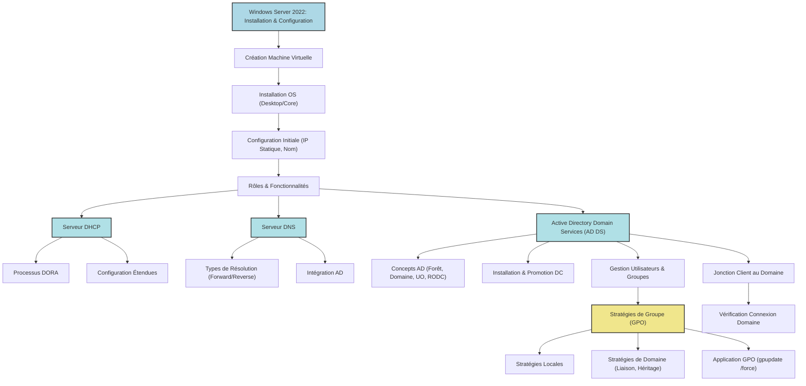

---
cssclasses:
  - max
archetype: cour
module: "OLB (Introduction Logiciel et OS)"
aliases:
  - "Cours 2 - Windows Server 2022"
  - "01-02 | Cours 2 - Windows Server 2022"
tags:
  - cours
  - os/windows/windows-server-2022
  - virtualisation/machine-virtuelle
  - installation-logiciel
  - systeme/configuration
  - reseau/adressage/ip
  - protocole/dhcp
  - protocole/dns
  - microsoft/active-directory
  - gpo
  - gestion/utilisateurs
  - gestion-groupes
  - interface/gui
  - interface/cli
  - infrastructure/data-center
  - protocole/dhcp/dora
  - architecture/reseau
  - authentification
---

# 01-02 | Cours 2 - Windows Server 2022

> [!goal] Objectifs Pédagogiques
> À la fin de cette fiche, je dois être capable de :
> 1.  Distinguer les différentes versions et éditions de Windows Server 2022.
> 2.  Maîtriser les étapes de création d'une machine virtuelle et d'installation de Windows Server 2022.
> 3.  Effectuer la configuration initiale d'un serveur Windows, y compris l'attribution d'une adresse IP statique.
> 4.  Installer et configurer les rôles *Serveur DHCP* et *Serveur DNS*.
> 5.  Déployer et administrer les *Services de domaine Active Directory (AD DS)*, y compris la création d'utilisateurs et la gestion des groupes.
> 6.  Joindre une machine cliente à un domaine Active Directory.
> 7.  Comprendre, créer et appliquer des *Stratégies de Groupe (GPO)* pour sécuriser et uniformiser l'environnement utilisateur et machine.

## 📝 Synthèse du Cours

Ce cours aborde l'installation, la configuration et la gestion des principaux rôles d'un environnement *Windows Server 2022*. Il couvre la mise en place d'une infrastructure réseau et d'authentification essentielle pour toute entreprise.

### 1. Introduction à Windows Server 2022

*   **Versions Windows** :
    *   Windows Server 2008 R2 (client : Windows 7)
    *   Windows Server 2012 R2 (client : Windows 8)
    *   Windows Server 2016 (client : Windows 10)
    *   Windows Server 2019 (client : Windows 10)
    *   Windows Server 2022 (client : Windows 10 + Cloud)
*   **Éditions Windows Server** :
    *   **Standard** : Idéale pour les environnements physiques ou *faiblement virtualisés*.
    *   **DataCenter** : Conçue pour les *datacenters* et les environnements *Cloud hautement virtualisés*, offrant des fonctionnalités avancées de virtualisation.

### 2. Création et Installation d'une Machine Virtuelle (VM)

L'installation de Windows Server 2022 débute par la création d'une machine virtuelle.

*   **Étapes de Création de la VM** :
    *   Sélectionner "Nouvelle" pour créer une VM.
    *   Définir le nom de la machine virtuelle et son emplacement de stockage.
    *   Indiquer le chemin du fichier *.ISO* d'installation et cocher "Skip Unattended Installation".
    *   Allouer la mémoire vive (RAM) et le nombre de CPU nécessaires (consulter les *prérequis matériels* de Microsoft pour les minimums requis).
    *   Créer le disque virtuel.
    *   Vérifier et confirmer la configuration avant de démarrer la VM.
*   **Installation de Windows Server 2022** :
    *   Choisir la langue et la région.
    *   Sélectionner "Installer maintenant".
    *   Choisir le type d'expérience :
        *   ***Expérience de bureau*** : Interface utilisateur graphique standard.
        *   ***Expérience Core*** : Environnement minimal, piloté par ligne de commande, plus sécurisé et moins gourmand en ressources.
    *   Accepter les termes du contrat de licence.
    *   Sélectionner l'installation "Personnalisé: installer uniquement le système d'exploitation Microsoft Server".
    *   Sélectionner le disque de destination. Il est possible de *partitionner* le disque pour organiser les données (une partition est un sous-ensemble logique d'un disque physique).
    *   Après l'installation, la VM redémarre. Il est crucial de ne pas appuyer sur une touche pour ne pas relancer l'installation et d'éjecter le fichier .ISO.

### 3. Configuration Initiale de Windows Server 2022

Une fois installé, le serveur nécessite une configuration de base.

*   **Définition du mot de passe** : Respecter les recommandations de complexité (longueur, types de caractères).
*   **Attribution d'un nom au serveur** : Renommer l'ordinateur (ex: "SRV01").
*   **Configuration d'une adresse IP statique** : Indispensable pour un serveur afin d'assurer une connectivité stable et prédictible sur le réseau.
*   **Mise à jour du système** : Assurer que le serveur dispose des dernières mises à jour de sécurité et de fonctionnalités.

### 4. Rôles et Fonctionnalités de Windows Server

*   **Rôles** : Un rôle est une application ou un outil qui permet à un serveur de fournir un service spécifique aux utilisateurs ou à d'autres ordinateurs sur un réseau (ex: *Annuaire Centralisé*, *DNS*, *DHCP*, *partage de fichiers*). Les rôles décrivent la fonction principale d'un ordinateur.
*   **Fonctionnalités** : Les fonctionnalités sont des programmes qui supportent ou augmentent la fonctionnalité d'un ou plusieurs rôles, ou améliorent la fonctionnalité globale du serveur (ex: *Clustering avec basculement*).

### 5. Serveur DHCP (Dynamic Host Configuration Protocol)

Le *DHCP* est essentiel pour l'automatisation de la configuration réseau.

*   **Explication du DHCP** : Protocole permettant à un ordinateur sur un réseau local d'obtenir dynamiquement et automatiquement sa configuration IP (adresse IP, masque de sous-réseau, passerelle, serveurs DNS). Son objectif principal est la *simplification de l'administration réseau*.
*   **Processus DORA (Découverte, Offre, Requête, Acquittement)** :
    1.  **DHCP DISCOVER** : Le client envoie un message de découverte pour trouver un serveur DHCP.
    2.  **DHCP OFFER** : Le serveur DHCP répond en proposant une adresse IP et d'autres paramètres de configuration.
    3.  **DHCP REQUEST / DECLINE** : Le client accepte l'offre (REQUEST) ou la refuse (DECLINE).
    4.  **DHCP ACK (Acknowledgement)** : Le serveur confirme l'attribution de l'adresse IP.
*   **Installation et Configuration** :
    *   Installer le rôle "Serveur DHCP" via le Gestionnaire de serveur.
    *   Lancer la console DHCP (Outils > DHCP).
    *   Créer une *nouvelle étendue* :
        *   Nom et description.
        *   Plage d'adresses IP (début, fin, masque de sous-réseau).
        *   Adresses à exclure (pour les équipements avec IP statique, ex: caméras, imprimantes).
        *   Durée du bail (temps d'attribution de l'IP).
        *   Configurer les options DHCP (passerelle par défaut, serveurs DNS).
        *   Ne rien renseigner pour le serveur WINS.
        *   Activer l'étendue.
*   **Vérification** : Une machine cliente configurée en DHCP doit recevoir une adresse IP et les informations de configuration du serveur.

### 6. Serveur DNS (Domain Name System)

Le *DNS* est la pierre angulaire de la résolution de noms sur les réseaux IP.

*   **Définitions Clés** :
    *   ***Domain Name System*** : L'ensemble des organismes qui gèrent les noms de domaine.
    *   ***Domain Name Service*** : Le protocole permettant d'échanger des informations sur les domaines.
    *   ***Domain Name Server*** : L'ordinateur qui exécute le logiciel serveur DNS et répond aux requêtes.
*   **Résolution de noms** :
    *   ***Résolution normale (Forward Lookup / DNS Lookup)*** : Trouve une adresse IP à partir d'un nom de domaine (ex: `www.google.com` -> `142.250.187.164`).
    *   ***Résolution inverse (Reverse Lookup)*** : Trouve un nom de domaine à partir d'une adresse IP (ex: `142.250.187.164` -> `www.google.com`).
*   **Interaction avec Active Directory** : Le DNS est *indispensable* au bon fonctionnement d'Active Directory, les zones DNS étant souvent intégrées à l'AD.

### 7. Active Directory (AD DS - Active Directory Domain Services)

L'***Active Directory*** est un service d'annuaire centralisé pour la gestion des ressources et des utilisateurs.

*   **Rôle de l'Active Directory** :
    *   Centralisation du contrôle des ressources du réseau.
    *   Stockage sécurisé des objets (utilisateurs, ordinateurs, groupes, etc.) dans une structure logique.
    *   Optimisation du trafic réseau.
    *   *Interaction forte avec le DNS*.
    *   Facilité d'administration grâce à un point central.
*   **Concepts Clés d'Active Directory** :
    *   ***Forêt*** : Le conteneur de niveau supérieur, composé d'un ou plusieurs domaines partageant un schéma et un catalogue global. C'est une limite de sécurité et d'administration.
    *   ***Domaine*** : Un regroupement logique d'ordinateurs en réseau partageant une même base d'annuaire centrale (AD). Administration et sécurité centralisées. Chaque *Contrôleur de domaine* (DC) stocke une copie de l'annuaire.
    *   ***Serveur membre*** : Un serveur intégré au domaine Windows mais qui n'est pas un contrôleur de domaine.
    *   ***Unité Organisationnelle (UO)*** : Un objet conteneur utilisé pour organiser logiquement d'autres objets (utilisateurs, groupes, ordinateurs, etc.) au sein du domaine. Les UO facilitent la *délégation de pouvoir* et l'*application de Stratégies de Groupe (GPO)*.
*   **Installation et Promotion en Contrôleur de Domaine** :
    *   Installer le rôle "Services de domaine Active Directory" (AD DS).
    *   Après l'installation, *promouvoir ce serveur en contrôleur de domaine*.
    *   Choisir "Ajouter une nouvelle forêt" et définir un nom de domaine (ex: "formation.lan").
    *   Vérifier que le Serveur DNS est sélectionné.
    *   Définir un mot de passe pour le *DSRM* (Directory Services Restore Mode).
    *   ***Niveau Fonctionnel*** : Détermine les fonctionnalités AD DS disponibles. Un niveau plus élevé offre plus de fonctionnalités mais limite la compatibilité avec d'anciennes versions de contrôleurs de domaine.
    *   ***RODC (Read-Only Domain Controller)*** : Une copie en lecture seule de l'annuaire, utilisée dans des emplacements sensibles (filiales sans IT, extranets) pour améliorer la sécurité en cas de compromission physique. Il ne stocke pas les mots de passe utilisateurs et transfère les requêtes d'écriture à un DC en écriture.
    *   Finaliser l'installation et redémarrer le serveur.
*   **Configuration de l'Active Directory** :
    *   Accéder à "Utilisateurs et ordinateurs Active Directory" via les Outils du Gestionnaire de serveur.
    *   Créer de nouveaux utilisateurs (ex: "Eleve 1").
    *   ***Gestion des Groupes*** :
        *   **Groupe Global** : Contient des utilisateurs de son domaine, peut être placé sur des ressources du même domaine.
        *   **Groupe Local** : Utile pour affecter des droits à des ressources dans un domaine. Peut contenir utilisateurs, groupes globaux ou universels de tous les domaines de l'annuaire.
        *   **Groupe Universel** : Disponible depuis Windows 2000, peut inclure groupes et utilisateurs d'autres domaines de la forêt.

### 8. Intégration d'un Client au Domaine

*   Modifier la configuration DHCP pour que le serveur DNS soit l'adresse IP du contrôleur de domaine nouvellement installé.
*   Sur une machine cliente (ex: Windows 10), vérifier la réception des informations DHCP (`ipconfig /all`).
*   Ajouter l'ordinateur au domaine via les propriétés système, en utilisant les identifiants d'un administrateur de domaine.
*   Une fois joint, l'utilisateur du domaine peut se connecter à la machine cliente.

### 9. Stratégies de Groupe (GPO - Group Policy Object)

Les *GPO* permettent une gestion centralisée et non modifiable des configurations.

*   **Définition** : Un objet de stratégie de groupe (GPO) déploie des paramètres de configuration qui s'appliquent à l'environnement d'un utilisateur ou d'un ordinateur. Une fois liée, cette configuration n'est pas modifiable par l'utilisateur.
*   **Applicabilité et Héritage** :
    *   Applicables à différents conteneurs : *Domaines*, *Sites*, *Unités Organisationnelles (UO)*, ou à la *machine locale*.
    *   Peuvent cibler les *utilisateurs* et/ou les *ordinateurs*.
    *   Sont *héritables* dans la hiérarchie des conteneurs AD.
*   **Types de Stratégies** :
    *   ***Stratégies Locales*** : Configurent les paramètres directement sur une machine locale via `gpedit.msc`. Non centralisées.
    *   ***Stratégies de Domaine*** : Gérées via la console "Gestion des stratégies de groupe" sur le contrôleur de domaine. Elles sont appliquées de manière centralisée à l'échelle du domaine ou des UO.
*   **Exemples de Paramètres GPO** :
    *   Modèles d'administration (accès au bureau, barre des tâches, panneau de configuration, Windows Update).
    *   Sécurité (mots de passe, audits).
    *   Installation automatique de logiciels (via fichiers MSI).
    *   Scripts (ouverture/fermeture de session, démarrage/arrêt).
    *   Redirection de dossiers (Mes documents, Bureau).
*   **Application et Dépannage des GPO** :
    *   Créer une GPO et la lier au domaine ou à une UO spécifique.
    *   Pour forcer l'application immédiate des GPO sur une machine cliente, utiliser la commande `gpupdate /force`.
    *   Si une GPO ne s'applique pas, vérifier son lien à l'emplacement correct (domaine ou UO contenant les objets cibles).

> [!note] Définition Clé
> **GPO (Group Policy Object)** : Un objet de stratégie de groupe est un ensemble de configurations qui permet de gérer de manière centralisée et non modifiable l'environnement de travail des utilisateurs et des ordinateurs au sein d'un domaine Active Directory.

## 🧠 Carte Mentale / Schéma

## ❓ Quiz de Révision (Active Recall)
> [!question] Question 1
> Quelle est la principale différence entre l'édition *Standard* et *DataCenter* de Windows Server 2022, et pour quels environnements sont-elles respectivement optimisées ?
> > [!success]- Réponse
> > L'édition **Standard** est optimisée pour les environnements physiques ou *faiblement virtualisés*. L'édition **DataCenter** est conçue pour les *datacenters* et les environnements *Cloud hautement virtualisés*.

> [!question] Question 2
> Décrivez les quatre étapes du processus DORA, qui représente le cycle de base d'attribution d'une adresse IP par un serveur DHCP.
> > [!success]- Réponse
> > Les quatre étapes du processus DORA sont :
> > 1.  **DHCP DISCOVER** : Le client envoie un message pour trouver un serveur DHCP.
> > 2.  **DHCP OFFER** : Le serveur DHCP répond avec une proposition d'adresse IP.
> > 3.  **DHCP REQUEST** : Le client accepte l'offre du serveur.
> > 4.  **DHCP ACK (Acknowledgement)** : Le serveur confirme l'attribution de l'adresse IP au client.

> [!question] Question 3
> Qu'est-ce qu'une *Forêt* dans le contexte d'Active Directory, et quel est son rôle principal ?
> > [!success]- Réponse
> > Une **Forêt** est le conteneur de niveau supérieur dans Active Directory, composé d'un ou plusieurs domaines partageant un schéma et un catalogue global. Son rôle principal est de servir de *limite de sécurité et d'administration* pour tous les objets qu'elle contient.

> [!question] Question 4
> Expliquez l'utilité d'un *RODC (Read-Only Domain Controller)* et dans quel type de situation son déploiement est recommandé.
> > [!success]- Réponse
> > Un **RODC** est une copie en lecture seule de l'annuaire Active Directory. Il est utile pour améliorer la sécurité dans des emplacements considérés comme *sensibles* (ex: filiales sans personnel informatique local, extranets) car il ne stocke pas les mots de passe utilisateurs et transfère les requêtes d'écriture à un contrôleur de domaine en écriture, réduisant ainsi le risque en cas de compromission physique du serveur.

> [!question] Question 5
> Quelle commande doit être exécutée sur une machine cliente pour forcer l'application immédiate des Stratégies de Groupe (GPO) mises à jour par l'administrateur ?
> > [!success]- Réponse
> > La commande à exécuter est `gpupdate /force`.

## 🔗 Notes Connexes
*   **Module parent**: [[OLB00-00_Introduction|OLB : Introduction Logiciel et OS]]
*   **Cours précédent**: [[OLB01-01_IntroductionWindows10|01-01 | Introduction Windows 10]]
*   **Cours suivant**: [[OLB01-03_Vsphere|01-03 | vSphere]]