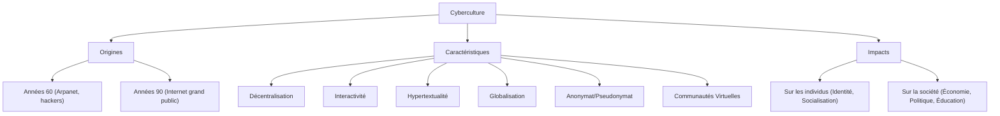

---
aliases:
  - Introduction Cyberculture
  - 01-01 | Introduction Cyberculture
  - Cyberculture Introduction
archetype: cour
module: "GEN (Culture Générale & Hors Cursus)"
cssclasses:
  - max
tags:
  - concept
  - definition
  - cybersecurite/concept-fondamental
  - numerique
  - technologie/tic
  - internet
  - histoire/internet
  - reseau/social
  - community/virtuelle
  - anonymat
  - globalisation
  - decentralisation
  - interactivite
  - hypertextualite
  - commerce-electronique
  - social
---

# 01-01 | Introduction Cyberculture

> [!goal] Objectifs Pédagogiques
> À la fin de cette fiche, je dois être capable de :
> 1. Définir le concept de *cyberculture* et comprendre ses origines.
> 2. Identifier les principales caractéristiques et manifestations de la cyberculture.
> 3. Discerner l'impact de la cyberculture sur les individus et la société.

## 📝 Synthèse du Cours

### 1. Qu'est-ce que la Cyberculture ?
La *cyberculture* est un terme qui désigne l'ensemble des techniques, des pratiques, des attitudes, des modes de pensée et des valeurs qui se développent avec l'expansion du *cyberespace*. Elle représente la culture émergente de l'ère numérique, façonnée par l'utilisation massive des **[[IIC02-07_LesReseauxInformatiquesComprendreLesConnexionsNumeriques|réseaux informatiques]]** et d'**[[Internet]]**.

Ses origines remontent aux années 1960 avec l'émergence des premiers réseaux informatiques et des communautés de hackers, puis s'est accélérée avec l'avènement d'Internet pour le grand public dans les années 1990.

> [!note] Définition Clé
> **Cyberculture** : La cyberculture est l'ensemble des phénomènes sociaux et culturels liés à l'utilisation du *cyberespace* et des *technologies de l'information et de la communication* (TIC). Elle englobe les interactions, les productions et les formes d'organisation qui naissent de ces **[[DigitalEnvironmentsEssentials|environnements numériques]]**.

### 2. Caractéristiques et Manifestations de la Cyberculture
La cyberculture se caractérise par plusieurs aspects clés :
-   **Décentralisation** : L'information et le pouvoir ne sont plus concentrés, mais distribués à travers le réseau.
-   **Interactivité** : Les utilisateurs ne sont plus de simples consommateurs mais des acteurs actifs, producteurs et diffuseurs de contenu.
-   **Hypertextualité** : La navigation non linéaire à travers des liens interconnectés est une modalité centrale d'accès à l'information.
-   **Globalisation** : Les frontières géographiques s'estompent, favorisant les échanges et les communautés mondiales.
-   **Anonymat et Pseudonymat** : La possibilité d'interagir sous des identités variées, offrant liberté d'expression mais aussi des défis **[[Ethics|éthiques]]**.
-   **Émergence de nouvelles communautés** : Des *communautés virtuelles* se forment autour d'intérêts communs, transcendant les barrières physiques.

Les manifestations de la cyberculture sont diverses, incluant les **[[SocialNetworks|réseaux sociaux]]**, les jeux en ligne, les blogs, les wikis, le *commerce électronique*, et les diverses formes d'expression artistique numérique.

## 🧠 Carte Mentale / Schéma

## ❓ Quiz de Révision (Active Recall)
> [!question] Question 1
> Quelles sont deux des principales caractéristiques de la cyberculture que l'on retrouve dans le cyberespace ?
> > [!success]- Réponse
> > La *décentralisation*, l'*interactivité*, l'*hypertextualité*, et la *globalisation* sont des caractéristiques clés de la cyberculture. (Deux suffisent).

> [!question] Question 2
> Définissez brièvement le terme "Cyberculture".
> > [!success]- Réponse
> > La **Cyberculture** est l'ensemble des phénomènes sociaux et culturels liés à l'utilisation du *cyberespace* et des *technologies de l'information et de la communication* (TIC).

## 🔗 Notes Connexes
*   **Module parent**: [[GEN00-00_Introduction]]
*   **Cours suivant**: [[GEN01-02_EthiqueEtLegaliteDansLeNumerique]]