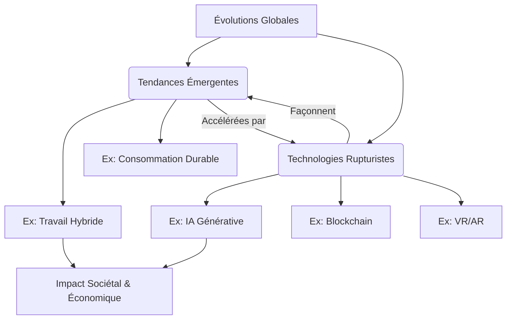

---
aliases:
  - Tendances Emergentes Et Technologies Rupturistes
  - 01-04 | Tendances Emergentes Et Technologies Rupturistes
archetype: cour
module: "GEN (Culture Générale & Hors Cursus)"
cssclasses:
  - max
tags:
  - tendance-emergente
  - technologie-rupturiste
  - innovation
  - evolution
  - ia/generative
  - blockchain
  - vr
  - ar
  - biotechnologie
  - travail-hybride
  - e-sante
  - apprentissage-en-ligne
  - concept/impact
  - transformation-digitale
  - transformation-numerique
---

# 01-04 | Tendances Emergentes Et Technologies Rupturistes

> [!goal] Objectifs Pédagogiques
> À la fin de cette fiche, je dois être capable de :
> 1. Identifier et distinguer les *tendances émergentes* des *technologies rupturistes*.
> 2. Comprendre l'impact potentiel de ces évolutions sur la société et les entreprises.
> 3. Citer des exemples concrets de ces phénomènes dans divers domaines.

## 📝 Synthèse du Cours

### 1. Comprendre les Tendances Émergentes
Les **tendances émergentes** sont des mouvements ou des évolutions qui commencent à se manifester dans la société, l'économie ou la technologie, et qui sont susceptibles de prendre de l'ampleur. Elles représentent des changements progressifs mais significatifs dans les comportements, les attentes ou les méthodes. Une tendance émergente n'implique pas nécessairement une nouvelle invention technologique, mais peut être l'adoption à grande échelle d'une pratique existante ou l'interconnexion de plusieurs concepts.

*   **Caractéristiques** :
    *   Évolution progressive, souvent prévisible à moyen terme.
    *   Peut résulter de l'adoption de technologies existantes ou de changements sociétaux.
    *   Impact souvent large et diffus, modifiant des secteurs entiers.
    *   Exemples : Le travail hybride, la consommation durable, l'e-santé, l'apprentissage en ligne personnalisé.

### 2. Les Technologies Rupturistes (Disruptives)
Une **technologie rupturiste** (ou *disruptive*) est une innovation qui bouleverse un marché existant ou en crée un nouveau en supplantant une technologie précédente. Elle offre généralement une proposition de valeur radicalement différente, souvent plus simple, plus accessible ou plus efficace, qui peut au départ sembler moins performante pour les clients traditionnels, mais qui finit par dominer le marché. L'idée de *disruption* a été popularisée par Clayton Christensen.

> [!note] Définition Clé
> **Technologie Rupturiste (Disruptive Technology)** : Une innovation qui change radicalement la façon dont un marché fonctionne, souvent en introduisant de nouvelles valeurs et en rendant les solutions existantes obsolètes.
> **Tendance Émergente (Emerging Trend)** : Une orientation ou un mouvement qui se développe progressivement dans la société, les comportements ou les marchés, et qui signale des changements futurs potentiels.

*   **Caractéristiques** :
    *   Souvent issue de recherches et développements intensifs.
    *   Crée de nouveaux marchés ou reconfigure profondément les marchés existants.
    *   Initialement, elle peut être de moindre qualité ou moins chère que les solutions existantes pour les utilisateurs courants.
    *   Peut rendre obsolètes des technologies ou des modèles d'affaires établis.
    *   Exemples : L'[[ArtificialIntelligence|intelligence artificielle]] (IA) générative, la blockchain, la réalité virtuelle/augmentée (VR/AR), la biotechnologie (édition génomique).

### 3. Interconnexion et Impact
Les tendances émergentes et les technologies rupturistes sont souvent étroitement liées. Une technologie rupturiste peut alimenter ou accélérer une tendance émergente (ex: l'IA générative alimente la tendance de la personnalisation de contenu). Inversement, une tendance émergente (ex: besoin de flexibilité) peut créer un terrain fertile pour l'adoption d'une technologie rupturiste (ex: outils de collaboration basés sur le cloud). Leur synergie transforme les industries, redéfinit les modèles économiques et modifie la société dans son ensemble.

## 🧠 Carte Mentale / Schéma

## ❓ Quiz de Révision (Active Recall)
> [!question] Question 1
> Quelle est la principale différence entre une "tendance émergente" et une "technologie rupturiste" ? Donnez un exemple pour chacune.
> > [!success]- Réponse
> > Une **tendance émergente** est un mouvement ou une évolution progressive dans les comportements ou la société (ex: le télétravail généralisé). Une **technologie rupturiste** est une innovation qui bouleverse un marché existant ou en crée un nouveau (ex: l'intelligence artificielle générative).

> [!question] Question 2
> Citez deux caractéristiques majeures d'une technologie rupturiste.
> > [!success]- Réponse
> > 1. Elle crée de nouveaux marchés ou reconfigure profondément les marchés existants.
> > 2. Elle peut rendre obsolètes des technologies ou des modèles d'affaires établis.

## 🔗 Notes Connexes
*   **Module parent**: [[GEN00-00_Introduction]]
*   **Cours précédent**: [[GEN01-03_HistoireEtEvolutionsDeLaCybersecurite]]
*   **Cours suivant**: [[GEN01-05_SoftSkillsPourProfessionnelsDeLaTech]]