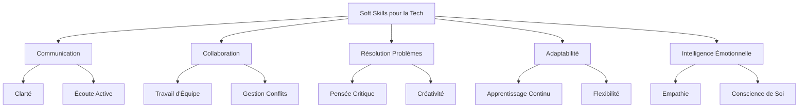

---
aliases:
  - Soft Skills Pour Professionnels De La Tech
  - 01-05 | Soft Skills Pour Professionnels De La Tech
archetype: cour
module: "GEN (Culture Générale & Hors Cursus)"
cssclasses:
  - max
tags:
  - soft-skills
  - carriere
  - role/professionnel
  - communication
  - travail-equipe
  - collaboration
  - resolution-problemes
  - adaptabilite
  - gestion-temps
  - intelligence-emotionnelle
  - leadership
---

# 01-05 | Soft Skills Pour Professionnels De La Tech

> [!goal] Objectifs Pédagogiques
> À la fin de cette fiche, je dois être capable de :
> 1. Expliquer l'importance des *soft skills* pour la réussite professionnelle dans le domaine de la technologie.
> 2. Identifier les principales *soft skills* essentielles pour les professionnels de la technologie et décrire leur application.
> 3. Comprendre comment développer et améliorer ces compétences non techniques.

## 📝 Synthèse du Cours

### 1. L'Importance Cruciale des *Soft Skills* dans la Tech

Les *soft skills*, ou compétences non techniques, sont de plus en plus reconnues comme des atouts indispensables pour les professionnels de la [[DigitalTechnology|technologie]], au-delà de leurs compétences techniques (hard skills). Elles déterminent la manière dont une personne interagit avec les autres et gère son travail. Dans un [[DigitalEnvironmentsEssentials|environnement technologique]] en constante évolution, où la [[Cooperation|collaboration]] et l'innovation sont clés, les *soft skills* permettent aux individus et aux équipes de performer plus efficacement et de s'adapter aux changements.

Les *soft skills* contribuent à plusieurs aspects :
*   **Amélioration de la collaboration** : Elles facilitent le travail d'équipe, la [[Communication|communication]] et la résolution de conflits.
*   **Leadership et gestion de projet** : Des compétences comme la communication, la prise de décision et la capacité à motiver sont essentielles pour encadrer des équipes et mener des projets à bien.
*   **Innovation et résolution de problèmes** : La pensée critique, la créativité et l'adaptabilité aident à trouver des solutions novatrices.
*   **Progression de carrière** : Les employeurs valorisent grandement les *soft skills*, considérant qu'elles sont souvent plus difficiles à enseigner que les compétences techniques et qu'elles sont cruciales pour les rôles de leadership et de gestion.

> [!note] Définition Clé
> **Soft Skills** : Compétences interpersonnelles et intrapersonnelles qui déterminent la façon dont une personne interagit efficacement avec son environnement de travail, gère ses émotions, et résout les problèmes, par opposition aux *hard skills* qui sont des compétences techniques mesurables.

### 2. Les *Soft Skills* Essentielles pour les Professionnels de la Tech

Plusieurs *soft skills* sont particulièrement valorisées dans le secteur technologique :

*   **Communication** :
    *   **Clarté et concision** : Capacité à expliquer des concepts techniques complexes à des publics non techniques (clients, managers) et à des collègues.
    *   **Écoute active** : Comprendre les besoins des utilisateurs et les retours des parties prenantes.
    *   **Communication écrite** : Rédaction de documentation, d'e-mails et de rapports clairs.
*   **Travail d'Équipe et Collaboration** :
    *   **Coopération** : Contribuer positivement à un environnement d'équipe.
    *   **Flexibilité** : S'adapter aux différentes méthodes de travail et personnalités au sein d'une équipe.
    *   **Gestion des conflits** : Résoudre les désaccords de manière constructive.
*   **Résolution de Problèmes** :
    *   **Pensée critique** : Analyser des situations complexes pour identifier la cause première d'un problème.
    *   **Créativité** : Développer des solutions innovantes.
    *   **Approche systématique** : Décomposer les problèmes en étapes gérables.
*   **Adaptabilité** :
    *   **Apprentissage continu** : Volonté d'acquérir de nouvelles compétences et de s'adapter aux nouvelles technologies et méthodologies.
    *   **Flexibilité** : Réagir efficacement aux changements de priorités ou de projets.
*   **Gestion du Temps et Organisation** :
    *   **Priorisation** : Déterminer les tâches les plus importantes.
    *   **Autonomie** : Travailler de manière indépendante tout en respectant les délais.
*   **Intelligence Émotionnelle** :
    *   **Conscience de soi** : Comprendre ses propres émotions et leur impact.
    *   **Empathie** : Comprendre et partager les sentiments des autres, essentiel pour le design centré sur l'utilisateur et le travail d'équipe.

## 🧠 Carte Mentale / Schéma

## ❓ Quiz de Révision (Active Recall)
> [!question] Question 1
> Pourquoi les *soft skills* sont-elles considérées comme cruciales pour la progression de carrière des professionnels de la tech ?
> > [!success]- Réponse
> > Les *soft skills* sont cruciales car elles facilitent l'accès aux rôles de leadership et de gestion, sont souvent plus difficiles à enseigner que les compétences techniques et sont très valorisées par les employeurs pour la réussite à long terme dans un environnement collaboratif et en évolution.

> [!question] Question 2
> Citez au moins trois *soft skills* essentielles pour un développeur et expliquez brièvement pourquoi chacune est importante.
> > [!success]- Réponse
> > 1.  **Communication** : Pour expliquer des problèmes techniques à des non-techniciens ou collaborer efficacement avec l'équipe.
> > 2.  **Résolution de problèmes** : Pour diagnostiquer et corriger les bugs, concevoir des solutions élégantes et innovantes.
> > 3.  **Adaptabilité** : Pour se tenir à jour avec les nouvelles technologies, les frameworks et les méthodologies agiles.

## 🔗 Notes Connexes
*   **Module parent**: [[GEN00-00_Introduction]]
*   **Cours précédent**: [[GEN01-04_TendancesEmergentesEtTechnologiesRupturistes]]
*   **Cours suivant**: [[GEN01-06_ParcoursDeCarriereEnCybersecurite]]