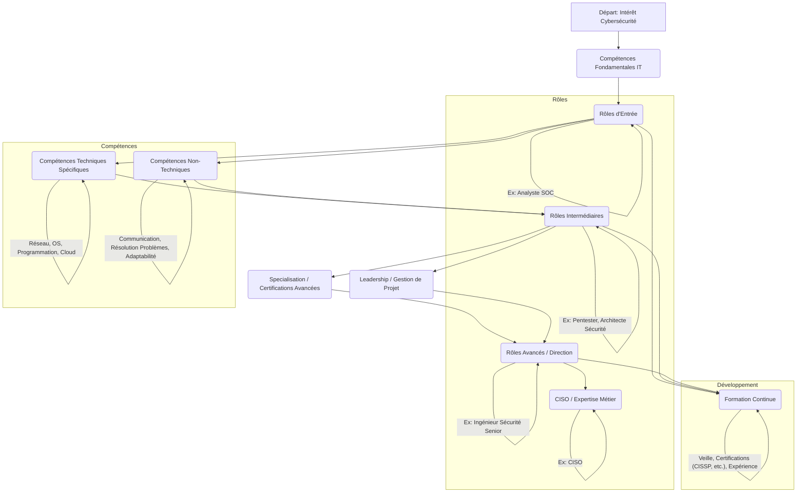

---
aliases:
  - Parcours De Carriere En Cybersecurite
  - 01-06 | Parcours De Carriere En Cybersecurite
  - Cybersecurity Career Path
  - Cybersecurity Career Journey
archetype: cour
module: "GEN (Culture Générale & Hors Cursus)"
cssclasses:
  - max
tags:
  - carriere
  - cybersecurite
  - role
  - formation
  - certification
  - competences
  - soft-skills
  - gestion-des-risques
  - leadership
  - carriere/niveau/entree
  - carriere/niveau/intermediaire
  - carriere/niveau/avance
  - carriere/niveau/direction
  - role/analyste-soc
  - role/analyste-cybersecurite
  - role/analyste-risque
  - role/pentester
  - role/ingenieur-securite-applicative
  - role/consultant-cybersecurite
  - role/ingenieur-securite-reseau
  - role/analyste-forensique
  - role/architecte-securite
  - role/threat-hunter
  - role/responsable-conformite
  - role/manager-cybersecurite
  - role/ingenieur-cybersecurite-senior
  - role/ciso
  - competences/techniques
  - securite/reseau
  - systeme-exploitation
  - programmation
  - programmation/scripting
  - cloud_security
  - reponse-incident
  - analyse/forensique
  - vulnerabilite
  - pentest
  - soft-skills/pensee-critique
  - soft-skills/resolution-problemes
  - soft-skills/communication
  - soft-skills/travail-equipe
  - soft-skills/apprentissage-continu
  - soft-skills/leadership
  - soft-skills/gestion-risques
  - certification/ccgp
  - certification/cissp
  - certification/cgrc
  - certification/csslp
  - labo
  - exercice/ctf
  - informatique
---

# 01-06 | Parcours De Carriere En Cybersecurite

> [!goal] Objectifs Pédagogiques
> À la fin de cette fiche, je dois être capable de :
> 1. Identifier les principaux rôles et les niveaux de carrière existants en **[[Cybersecurity|cybersécurité]]**.
> 2. Comprendre les compétences techniques et non techniques essentielles requises pour progresser dans ce domaine.
> 3. Décrire les parcours de progression possibles et l'importance de la **formation continue**.

## 📝 Synthèse du Cours

### 1. La Diversité des Rôles en Cybersécurité
Le domaine de la cybersécurité est vaste et dynamique, offrant une multitude de rôles adaptés à divers profils et niveaux d'expérience. Il n'existe pas de voie unique, mais plutôt une progression à travers différentes spécialisations. Les parcours peuvent souvent commencer par des rôles en **[[IIC02-01_LesFondamentauxDeLinformatique|informatique]]** générale avant de se spécialiser en cybersécurité.

*   **Niveaux de Carrière**:
    *   **Niveau d'Entrée (1-3 ans)** : Ces rôles sont axés sur l'acquisition de connaissances techniques fondamentales, la détection des menaces et les opérations de sécurité.
        *   Exemples : *[[SOCAnalyst|Analyste SOC]]* (Security Operations Center), *Analyste en Cybersécurité*, *Analyste en Risque Cybersécurité*.
    *   **Niveau Intermédiaire (3-5 ans)** : Les professionnels à ce niveau gèrent des missions plus techniques et se spécialisent.
        *   Exemples : *Pentester* (Testeur d'intrusion), *Ingénieur en Sécurité Applicative*, *Consultant en Cybersécurité*, *Ingénieur en Sécurité Réseau*, *Analyste Forensics*.
    *   **Niveau Avancé (5-8 ans et plus)** : Les rôles avancés impliquent souvent la direction d'équipes techniques, la gestion des risques et la conception de stratégies de sécurité.
        *   Exemples : *Architecte de Sécurité*, *Chasseur de Menaces* (Threat Hunter), *Responsable de la Conformité* (Compliance Officer), *Manager Cybersécurité*, *Ingénieur Cybersécurité Senior*.
    *   **Direction Exécutive (8+ ans)** : Ces postes se concentrent sur la stratégie de sécurité au niveau de l'entreprise, souvent avec un rôle d'influence dans le développement de l'alignement de la sécurité.
        *   Exemple : *CISO* (Chief Information Security Officer).

> [!note] Définition Clé
> **Parcours de Carrière en Cybersécurité** : Une progression structurée à travers divers rôles et responsabilités au sein du domaine de la cybersécurité, nécessitant le développement continu de compétences techniques et non techniques, ainsi qu'une formation adaptée.

### 2. Compétences Clés et Progression
Pour réussir et progresser dans le domaine de la cybersécurité, il est crucial de développer un ensemble de compétences variées, allant des connaissances techniques pointues aux aptitudes interpersonnelles.

*   **Compétences Techniques Essentielles**:
    *   **Sécurité Réseau** : Connaissance des protocoles, des pare-feu, des systèmes de détection et prévention d'intrusion.
    *   **[[OperatingSystem|Systèmes d'Exploitation]]** : Maîtrise de **[[Linux]]**, **[[WindowsOperatingSystem|Windows]]**, **[[MacOS|macOS]]** pour la configuration sécurisée et l'analyse.
    *   **Programmation et Scripting** : Python, **[[PowerShell]]**, Bash sont souvent requis pour l'automatisation et l'analyse de données.
    *   **Sécurité Cloud** : Compréhension des architectures de sécurité dans les environnements cloud (AWS, Azure, GCP).
    *   **Réponse aux Incidents et Criminalistique Numérique** : Compétences en détection, analyse et gestion des incidents de sécurité.
    *   **Évaluation des [[Vulnerabilities|Vulnérabilités]] et [[PenetrationTest|Tests d'intrusion]]** : Capacité à identifier les failles de sécurité.
*   **[[GEN01-05_SoftSkillsPourProfessionnelsDeLaTech|Compétences Non Techniques (Soft Skills)]]**:
    *   **Pensée Critique et Résolution de Problèmes** : Analyser des situations complexes et trouver des solutions efficaces.
    *   **[[Communication]]** : Expliquer des concepts techniques à un public non technique, rédiger des rapports clairs.
    *   **Travail d'Équipe et Collaboration** : Collaborer avec d'autres équipes IT et métiers.
    *   **Apprentissage Continu** : Le paysage des menaces évolue constamment, nécessitant une mise à jour régulière des connaissances.
    *   **Leadership et Gestion des Risques** : Essentiels pour les rôles avancés et exécutifs.

La progression de carrière est souvent jalonnée par la **formation** et les **certifications**. Un diplôme en informatique ou dans un domaine connexe est un bon point de départ, mais les certifications professionnelles (comme le Certified Cybersecurity General Practitioner - CCGP™, CISSP, CGRC, CSSLP) sont essentielles pour valider les compétences et se spécialiser. L'expérience pratique, souvent acquise via des stages, des labs ou des événements de type Capture the Flag, est également fondamentale.

## 🧠 Carte Mentale / Schéma

## ❓ Quiz de Révision (Active Recall)
> [!question] Question 1
> Citez deux rôles d'entrée typiques dans le domaine de la cybersécurité.
> > [!success]- Réponse
> > Deux rôles d'entrée courants sont l'*Analyste SOC* et l'*Analyste en Cybersécurité*.

> [!question] Question 2
> Outre les compétences techniques, quelles sont deux compétences non techniques essentielles pour progresser dans une carrière en cybersécurité ?
> > [!success]- Réponse
> > La *résolution de problèmes*, la *communication* et la *pensée critique* sont des compétences non techniques cruciales pour progresser en cybersécurité.

## 🔗 Notes Connexes
*   **Module parent**: [[GEN00-00_Introduction]]
*   **Cours précédent**: [[GEN01-05_SoftSkillsPourProfessionnelsDeLaTech]]
*   **Cours suivant**: [[GEN01-07_FondamentauxDuChiffrement]]