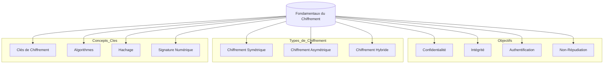

---
aliases:
  - Fondamentaux du Chiffrement
  - 01-07 | Fondamentaux du Chiffrement
archetype: cour
module: GEN (Culture Générale & Hors Cursus)
cssclasses:
  - max
---

# 01-07 | Fondamentaux du Chiffrement

> [!goal] Objectifs Pédagogiques
> À la fin de cette fiche, je dois être capable de :
> 1. Expliquer ce qu'est le chiffrement et identifier ses principaux objectifs.
> 2. Distinguer les différents types de chiffrement (symétrique, asymétrique, hybride) et leurs principes de fonctionnement.
> 3. Définir les concepts clés associés au chiffrement, tels que les clés, les algorithmes, le hachage et la signature numérique.
> 4. Citer des cas d'utilisation courants du chiffrement et discuter de ses avantages et inconvénients.

## 📝 Synthèse du Cours

### 1. Introduction au Chiffrement

Le **chiffrement**, ou cryptographie, est une technique fondamentale en sécurité de l'information qui vise à protéger les données en les transformant de manière à les rendre illisibles pour quiconque n'est pas autorisé à les consulter. C'est un processus qui convertit des informations (le *texte clair*) en un format codé (le *texte chiffré*), et vice-versa, à l'aide d'un algorithme et d'une clé.

> [!note] Définition Clé
> **Chiffrement** : Procédé de transformation d'informations afin de les rendre incompréhensibles à toute personne non autorisée, tout en permettant aux personnes autorisées de retrouver l'information originale (déchiffrement).

### 2. Objectifs du Chiffrement

Le chiffrement sert à atteindre plusieurs objectifs de sécurité essentiels, souvent résumés par l'acronyme CIAN (Confidentialité, Intégrité, Authentification, Non-répudiation) :

*   **Confidentialité** : Assurer que seules les personnes autorisées peuvent accéder aux informations. Le chiffrement empêche les tiers non autorisés de lire les données, même s'ils y ont accès.
*   **Intégrité** : Garantir que les informations n'ont pas été modifiées ou altérées de manière non autorisée pendant leur stockage ou leur transmission. Les fonctions de hachage et les signatures numériques sont souvent utilisées à cette fin.
*   **Authentification** : Vérifier l'identité de l'expéditeur ou de l'entité qui accède ou transmet les données. Le chiffrement asymétrique et les certificats numériques jouent un rôle clé dans l'authentification.
*   **Non-répudiation** : Empêcher un expéditeur de nier avoir envoyé un message ou d'avoir effectué une action. Une signature numérique, par exemple, prouve l'origine d'un message et l'acceptation de son contenu.

### 3. Types de Chiffrement

Il existe principalement trois catégories de chiffrement, chacune avec ses propres mécanismes et cas d'utilisation :

#### 3.1. Chiffrement Symétrique (ou à clé secrète)
*   **Principe** : Utilise la *même clé* secrète pour chiffrer et déchiffrer les données. Cette clé doit être connue de l'expéditeur et du destinataire.
*   **Avantages** : Très rapide et efficace pour chiffrer de grandes quantités de données.
*   **Inconvénients** : Le partage sécurisé de la clé est un défi majeur (problème d'échange de clés).
*   **Exemples d'algorithmes** : AES (Advanced Encryption Standard), DES (Data Encryption Standard - obsolète), 3DES.

#### 3.2. Chiffrement Asymétrique (ou à clé publique)
*   **Principe** : Utilise une paire de clés liée mathématiquement : une *clé publique* et une *clé privée*.
    *   La clé publique peut être partagée et utilisée par quiconque pour chiffrer un message destiné au propriétaire de la clé ou pour vérifier sa signature.
    *   La clé privée doit rester secrète et est utilisée par le propriétaire pour déchiffrer les messages ou pour signer des documents.
*   **Avantages** : Résout le problème de l'échange de clés et permet la signature numérique.
*   **Inconvénients** : Beaucoup plus lent que le chiffrement symétrique, ce qui le rend moins adapté au chiffrement de gros volumes de données.
*   **Exemples d'algorithmes** : RSA, Diffie-Hellman, ECC (Elliptic Curve Cryptography).

#### 3.3. Chiffrement Hybride
*   **Principe** : Combine les avantages du chiffrement symétrique et asymétrique.
    *   Le chiffrement asymétrique est utilisé pour échanger de manière sécurisée une clé symétrique.
    *   Le chiffrement symétrique est ensuite utilisé pour chiffrer et déchiffrer les données réelles en raison de sa rapidité.
*   **Cas d'utilisation** : C'est la méthode la plus courante pour sécuriser les communications sur Internet (ex: TLS/SSL pour HTTPS).

### 4. Concepts Clés Associés

*   **Clés de Chiffrement** : Séquences de bits utilisées avec un algorithme pour chiffrer et déchiffrer les données. Leur longueur et leur caractère aléatoire sont cruciaux pour la sécurité.
*   **Algorithmes de Chiffrement** : Les règles mathématiques ou les procédures utilisées pour transformer le texte clair en texte chiffré, et inversement. La robustesse d'un algorithme est essentielle.
*   **Fonctions de Hachage** : Algorithmes qui prennent une entrée (message) de taille arbitraire et produisent une sortie (valeur de hachage ou empreinte numérique) de taille fixe. Elles sont *irréversibles* (on ne peut pas retrouver l'entrée à partir du hachage) et *déterministes* (la même entrée produit toujours le même hachage). Utilisées pour l'intégrité et le stockage sécurisé de mots de passe.
    *   **Exemples** : SHA-256, SHA-3.
*   **Signature Numérique** : Mécanisme qui utilise le chiffrement asymétrique pour garantir l'authenticité, l'intégrité et la non-répudiation d'un document électronique. L'expéditeur signe un hachage du document avec sa clé privée, et le destinataire vérifie cette signature avec la clé publique de l'expéditeur.

### 5. Cas d'Utilisation, Avantages et Inconvénients

*   **Cas d'utilisation courants** :
    *   Sécurisation des communications web (HTTPS, VPN).
    *   Protection des emails (PGP/GPG, S/MIME).
    *   Chiffrement de disques durs (BitLocker, VeraCrypt).
    *   Protection des bases de données et des fichiers sensibles.
    *   Authentification forte et gestion des identités.
*   **Avantages** :
    *   Protection des données contre les accès non autorisés.
    *   Maintien de la vie privée.
    *   Respect des réglementations sur la protection des données (RGPD).
    *   Renforcement de la confiance dans les transactions numériques.
*   **Inconvénients** :
    *   Complexité de la gestion des clés (partage, stockage, révocation).
    *   Coût en ressources de calcul (performance).
    *   Risque de perte de données irréversible si les clés sont perdues ou compromises.
    *   Vulnérabilités potentielles dans les algorithmes ou leurs implémentations.

## 🧠 Carte Mentale / Schéma

## ❓ Quiz de Révision (Active Recall)
> [!question] Question 1
> Quel est l'objectif principal du chiffrement symétrique et quelle est sa principale faiblesse ?
> > [!success]- Réponse
> > L'objectif principal du chiffrement symétrique est la **confidentialité** des données. Sa principale faiblesse réside dans le **partage sécurisé de la clé** unique entre l'expéditeur et le destinataire.

> [!question] Question 2
> Citez les quatre principaux objectifs de sécurité que le chiffrement aide à atteindre.
> > [!success]- Réponse
> > Les quatre principaux objectifs sont : la **Confidentialité**, l'**Intégrité**, l'**Authentification** et la **Non-répudiation**.

> [!question] Question 3
> Quelle est la différence fondamentale entre une fonction de hachage et le chiffrement asymétrique en termes de réversibilité ?
> > [!success]- Réponse
> > Une fonction de hachage est **irréversible** ; il est impossible de retrouver le message original à partir de son empreinte numérique. Le chiffrement asymétrique est **réversible** ; le texte chiffré peut être déchiffré pour retrouver le texte clair à l'aide de la clé appropriée (privée pour le déchiffrement, publique pour la vérification de signature).
## 🔗 Notes Connexes
*   **Module parent**: [[GEN00-00_Introduction]]
*   **Cours précédent**: [[GEN01-06_ParcoursDeCarriereEnCybersecurite]]
*   **Cours suivant**: [[GEN01-08_VmwareFundamentals]]

