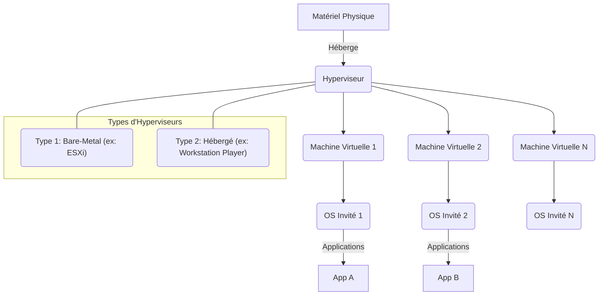

---
cssclasses:
  - max
aliases:
  - "VMware Fundamentals"
  - "01-08 | VMware Fundamentals"
  - "Fondamentaux VMware"
archetype: cour
module: "GEN (Culture Générale & Hors Cursus)"
tags:
  - virtualisation
  - logiciel/vmware
  - hyperviseur
  - hyperviseur/type-1
  - hyperviseur/type-2
  - virtualisation/machine-virtuelle
  - logiciel/vmware/workstation-player
  - logiciel/vmware/esxi
  - installation-logiciel
  - gestion/logiciel
  - systeme-exploitation
  - concept/definition
---

# 01-08 | Fondamentaux VMware

> [!goal] Objectifs Pédagogiques
> À la fin de cette fiche, je dois être capable de :
> 1. Expliquer le concept de **virtualisation** et le rôle de **[[VMware]]**.
> 2. Décrire les étapes clés de l'installation d'un hyperviseur client comme **VMware Workstation Player**.
> 3. Créer et gérer une **machine virtuelle (VM)** de base en utilisant un logiciel VMware.
> 4. Comprendre les avantages et les cas d'utilisation de la virtualisation.

## 📝 Synthèse du Cours

### 1. Introduction à la Virtualisation et VMware

La **[[Virtualization|Virtualisation]]** est une technologie qui permet de créer des versions virtuelles de ressources informatiques, telles que des [[Server|serveurs]], des stockages, des réseaux ou des systèmes d'exploitation. Au lieu d'utiliser directement le matériel physique, la virtualisation crée une couche d'abstraction qui permet à plusieurs environnements virtuels, appelés **[[VirtualMachine|machines virtuelles (VMs)]]**, de s'exécuter simultanément sur un seul système physique. Chaque VM se comporte comme un ordinateur complet avec son propre [[OperatingSystem|système d'exploitation]] et ses applications, mais elle partage les ressources matérielles sous-jacentes.

**[[VMware]]** est une entreprise pionnière et leader dans le domaine de la virtualisation. Elle propose une suite de produits logiciels qui permettent d'implémenter la virtualisation à différents niveaux, du poste de travail (avec des produits comme Workstation ou Player) aux centres de données (avec vSphere et ESXi). Le principe fondamental est d'utiliser un logiciel appelé **[[Hypervisor|Hyperviseur]]** qui s'exécute directement sur le matériel (type 1) ou en tant qu'[[Application|application]] sur un système d'exploitation hôte (type 2), pour gérer et allouer les ressources matérielles aux machines virtuelles.

*   **Hyperviseur de Type 1 (Bare-Metal)** : S'installe directement sur le matériel physique et gère les ressources matérielles. Des exemples incluent VMware ESXi. Il offre de meilleures performances et une plus grande sécurité.
*   **Hyperviseur de Type 2 (Hébergé)** : S'exécute comme une application sur un système d'exploitation hôte existant (par exemple, [[WindowsOperatingSystem|Windows]], [[MacOS|macOS]], [[Linux]]). Des exemples incluent VMware Workstation Pro et VMware Workstation Player. Il est plus simple à installer et idéal pour les utilisateurs finaux ou les développeurs.

> [!note] Définition Clé
> **Hyperviseur** : Logiciel ou micrologiciel qui crée et exécute des machines virtuelles. Il est également appelé moniteur de machine virtuelle (VMM). L'hyperviseur présente le système d'exploitation invité à un matériel virtuel et gère l'exécution des systèmes d'exploitation invités.

### 2. Installation et Utilisation de VMware Workstation Player (Exemple)

**VMware Workstation Player** est une solution gratuite pour un usage personnel, permettant de créer et d'exécuter des machines virtuelles sur un ordinateur de bureau.

#### 2.1. Installation de VMware Workstation Player

1.  **Téléchargement** : Rendez-vous sur le site officiel de VMware et téléchargez la dernière version de VMware Workstation Player compatible avec votre système d'exploitation hôte (Windows ou Linux).
2.  **Exécution de l'installeur** : Lancez le fichier d'installation téléchargé. Suivez les invites, acceptez les termes du contrat de licence.
3.  **Options d'installation** : Choisissez un répertoire d'installation. Vous pouvez généralement laisser les options par défaut, comme l'ajout de raccourcis au bureau ou au menu Démarrer.
4.  **Redémarrage** : Un redémarrage de votre système hôte peut être nécessaire pour finaliser l'installation.

#### 2.2. Création d'une Machine Virtuelle (VM)

1.  **Lancement de VMware Workstation Player** : Ouvrez l'application.
2.  **Créer une nouvelle machine virtuelle** : Cliquez sur "Create a New Virtual Machine".
3.  **Choix de la source d'installation** :
    *   **Installer disc image file (iso)** : Recommandé. Indiquez le chemin vers un fichier ISO de l'image disque de votre système d'exploitation invité (par exemple, un ISO de Windows ou Linux).
    *   **Installer disc** : Si vous avez un DVD d'installation physique.
    *   **I will install the operating system later** : Pour configurer la VM vide et installer le système d'exploitation plus tard.
4.  **Sélection du système d'exploitation invité** : Choisissez le type de système d'exploitation (Microsoft Windows, Linux, etc.) et la version spécifique. VMware Player peut automatiquement configurer les paramètres optimaux.
5.  **Nom et Emplacement de la VM** : Donnez un nom à votre machine virtuelle (ex: "MyWindows10VM") et choisissez un emplacement sur votre disque dur pour stocker ses fichiers.
6.  **Taille du disque virtuel** : Allouez une taille maximale pour le disque dur virtuel. Il est souvent recommandé de choisir "Store virtual disk as a single file" pour de meilleures performances dans la plupart des cas, mais "Split virtual disk into multiple files" peut être utile pour faciliter le déplacement de la VM.
7.  **Personnalisation du matériel** : Avant de terminer, vous pouvez cliquer sur "Customize Hardware" pour ajuster la mémoire [[RAM]], le nombre de processeurs, la [[NetworkInterfaceCard|carte réseau]], etc., alloués à la VM.
8.  **Finalisation** : Cliquez sur "Finish". La VM est prête à être démarrée.

#### 2.3. Utilisation de la Machine Virtuelle

1.  **Démarrage de la VM** : Sélectionnez votre VM dans la liste et cliquez sur "Play virtual machine".
2.  **Installation du système d'exploitation** : Suivez le processus d'installation standard du système d'exploitation invité (comme si vous installiez Windows ou Linux sur un ordinateur physique).
3.  **Installation des VMware Tools** : Une fois le système d'exploitation invité installé, il est crucial d'installer les **VMware Tools**. Ces outils améliorent les performances de la VM, permettent des fonctionnalités comme le copier-coller entre l'hôte et l'invité, le glisser-déposer de fichiers, et une meilleure intégration de l'affichage. Pour les installer, démarrez la VM, puis dans le menu de VMware Player, allez dans `Player > Manage > Install VMware Tools...` et suivez les instructions à l'intérieur de la VM.
4.  **Gestion** : Vous pouvez suspendre, éteindre ou redémarrer la VM depuis les options de l'application.

## 🧠 Carte Mentale / Schéma

## ❓ Quiz de Révision (Active Recall)
> [!question] Question 1
> Quelle est la principale différence entre un hyperviseur de Type 1 et un hyperviseur de Type 2, et citez un exemple de produit VMware pour chaque type ?
> > [!success]- Réponse
> > Un hyperviseur de Type 1 (bare-metal) s'installe directement sur le matériel physique et gère directement les ressources (ex: VMware ESXi). Un hyperviseur de Type 2 (hébergé) s'exécute comme une application sur un système d'exploitation hôte existant (ex: VMware Workstation Player).

> [!question] Question 2
> Pourquoi est-il recommandé d'installer les "VMware Tools" après l'installation d'un système d'exploitation invité dans une machine virtuelle VMware ?
> > [!success]- Réponse
> > Les VMware Tools sont essentiels pour améliorer les performances de la machine virtuelle et activer des fonctionnalités clés telles que le copier-coller bidirectionnel entre l'hôte et l'invité, le glisser-déposer de fichiers, une meilleure résolution d'affichage et une meilleure gestion des [[ComputerPeripheral|périphériques]] virtuels.

## 🔗 Notes Connexes
*   **Module parent**: [[GEN00-00_Introduction]]
*   **Cours précédent**: [[GEN01-07_FondamentauxDuChiffrement]]
*   **Cours suivant**: 
