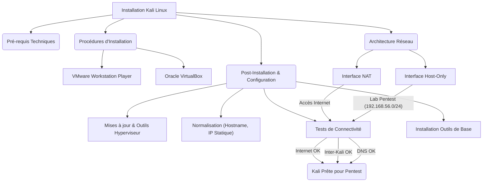

# 01-09 | INSTALLATION & PRÉPARATION KALI (VMWARE / VIRTUALBOX)

> [!goal] Objectifs Pédagogiques
> À la fin de cette fiche, chaque participant doit être capable de :
> 1.  Installer Kali Linux dans une machine virtuelle (VMware ou VirtualBox).
> 2.  Configurer un **double réseau** (NAT + Host-Only) pour une flexibilité et une isolation optimales.
> 3.  Mettre à jour le système Kali et installer les outils spécifiques à l'hyperviseur (VMware Tools / Guest Additions).
> 4.  Vérifier la connectivité réseau, y compris l'accès à Internet et la communication inter-VM.
> 5.  Préparer une base **standardisée et fonctionnelle** de machines Kali pour les modules pratiques ultérieurs.

## 📝 Synthèse du Cours

Ce module a pour objectif de guider les participants à travers les étapes d'installation et de configuration de **six machines Kali Linux** parfaitement identiques, stables et prêtes pour des scénarios de pentesting réels. Une attention particulière est portée à la mise en place d'une architecture réseau sécurisée et à l'installation des outils essentiels.

### 1. Pré-requis Techniques

Pour garantir une installation fluide et des performances adéquates, le matériel suivant est *minimalement recommandé* par participant :
*   **RAM** : 8 Go (minimum), idéalement 16 Go pour une meilleure fluidité.
*   **CPU** : 4 cœurs.
*   **Stockage** : 40 Go d'espace libre sur le disque dur.
*   **Connectivité** : Une connexion Internet stable est indispensable pour les téléchargements et mises à jour.

Concernant les logiciels, les éléments suivants sont nécessaires :
*   **ISO Kali Linux** : La version recommandée est Kali 2024.4 64-bit Installer. L'image "Installer" est généralement plus stable que la version "Live".
*   **Hyperviseur** : Deux options gratuites et largement utilisées sont proposées :
    *   VMware Workstation Player : Souvent privilégié pour ses meilleures performances.
    *   Oracle VirtualBox : Connu pour sa polyvalence et sa compatibilité universelle.

### 2. Architecture Réseau Optimale

Chaque machine virtuelle Kali sera configurée avec **deux interfaces réseau** distinctes pour des raisons de fonctionnalité et de sécurité :

*   **Interface 1 – NAT (Network Address Translation)**
    *   **Utilité** : Cette interface permet à la machine Kali d'accéder à Internet. Elle est utilisée pour les mises à jour logicielles (`apt update`, `apt full-upgrade`), les téléchargements de ressources, et la consultation de documentation en ligne.
    *   **Rôle** : Elle ne fait *pas partie* du laboratoire d'attaque ; aucune activité de pentesting ne doit transiter par ce réseau.
    *   **Isolation** : Le trafic sur cette interface est géré par l'hyperviseur et est isolé du réseau hôte par NAT.

*   **Interface 2 – Host-Only**
    *   **Sous-réseau dédié** : Un sous-réseau spécifique est attribué pour ce réseau interne : **192.168.56.0/24**.
    *   **Fonctionnalités clés** :
        *   **Communication inter-Kali** : Permet aux différentes machines Kali de communiquer entre elles.
        *   **Communication avec les cibles** : C'est le canal principal pour interagir avec toutes les machines cibles du laboratoire.
        *   **Isolation totale** : Ce réseau est *complètement isolé* du réseau physique réel de l'hôte, garantissant un environnement de pentesting sécurisé et cloisonné.
    *   **Rôle** : C'est le **réseau d'attaque principal** pour toutes les activités pratiques.

> [!note] Définition Clé
> **Mode NAT (Network Address Translation)** : Une configuration réseau pour machines virtuelles qui permet à la VM d'accéder au réseau externe (Internet) en partageant l'adresse IP de la machine hôte. Le trafic de la VM est traduit et semble provenir de l'hôte.
> **Mode Host-Only** : Une configuration réseau qui crée un réseau virtuel privé et isolé entre l'hôte et les machines virtuelles. Les VM sur ce réseau peuvent communiquer entre elles et avec l'hôte, mais pas directement avec le réseau externe.

### 3. Procédure d'Installation

L'installation de Kali Linux sera détaillée pour les deux hyperviseurs.

#### 3.1. Installation Kali sur VMware

1.  Lancez VMware Workstation Player et sélectionnez "Create a New Virtual Machine".
2.  Choisissez "Installer disc image (ISO)" et naviguez pour sélectionner votre fichier ISO de Kali Linux.
3.  Sélectionnez le système d'exploitation invité comme « Linux » puis « Debian 64-bit ».
4.  Configurez les paramètres de la machine virtuelle :
    *   RAM : Allouez entre 4 Go et 8 Go.
    *   **Processeurs** : 2 vCPU (ou 4 si la machine hôte est très performante).
    *   **Disque Dur** : 40 Go de stockage (le format dynamique est acceptable).
5.  Configurez le premier adaptateur réseau en mode NAT.
6.  Ajoutez un **deuxième adaptateur réseau** en allant dans "Add" → "Network Adapter" et choisissez le mode Host Only.
7.  Démarrez la VM et suivez l'installation de Kali :
    *   Optez pour l'installation graphique (*Graphical install*).
    *   Choisissez la langue (*French* ou *EN*).
    *   Pour le partitionnement, sélectionnez "Guided – Use entire disk".
    *   Créez un compte utilisateur standard avec un mot de passe.
    *   Installez le chargeur de démarrage GRUB sur le disque principal.
    *   Redémarrez la machine virtuelle une fois l'installation terminée.

#### 3.2. Installation Kali sur VirtualBox

1.  Lancez Oracle VirtualBox et cliquez sur "Nouveau".
2.  Donnez un nom à la VM, par exemple "Kali-Attacker-01".
3.  Sélectionnez "Linux" comme type et "Debian (64-bit)" comme version.
4.  Allouez la mémoire RAM : 4096 Mo (4 Go) ou 8192 Mo (8 Go).
5.  Créez un disque dur virtuel : 40 Go au format VDI (dynamiquement alloué).
6.  Lancez la VM, montez l'ISO de Kali et procédez à l'installation.
7.  Une fois l'installation de base terminée, configurez les réseaux :
    *   **Adaptateur 1** : Mettez-le en mode NAT.
    *   **Adaptateur 2** : Configurez-le en mode Réseau hôte seulement (*Host-Only*).
        *   Assurez-vous de sélectionner l'adaptateur "VirtualBox Host-Only Ethernet Adapter" (vous devrez peut-être le créer via les préférences globales de VirtualBox si ce n'est pas déjà fait).
        *   Dans les paramètres globaux de VirtualBox (Fichier → Préférences → Réseau → Réseaux hôte seulement), configurez l'adresse IP de l'hôte pour ce réseau sur **192.168.56.1** et assurez-vous que le serveur DHCP est désactivé pour ce réseau (très important pour le contrôle manuel des IPs).

### 4. Mise à Jour Initiale et Outils Essentiels

Après l'installation, il est crucial de mettre à jour le système et d'installer les outils de l'hyperviseur.

#### 4.1. Mises à jour obligatoires

Ouvrez un terminal et exécutez les commandes suivantes :
```bash
sudo apt update
```
Cette commande met à jour la liste des paquets disponibles.
```bash
sudo apt full-upgrade -y
```
Cette commande met à niveau tous les paquets installés vers leurs dernières versions, en résolvant les dépendances. Le commutateur `-y` confirme automatiquement les invites.

#### 4.2. Installation des outils de l'hyperviseur

*   **Pour VMware (VMware Tools)** :
    ```bash
    sudo apt install open-vm-tools open-vm-tools-desktop -y
    ```
    Ces paquets améliorent l'intégration entre Kali et VMware, offrant des fonctionnalités comme le copier-coller bidirectionnel, l'ajustement automatique de la résolution d'écran, et de meilleures performances.

*   **Pour VirtualBox (Guest Additions)** :
    ```bash
    sudo apt install virtualbox-guest-utils virtualbox-guest-x11 -y
    ```
    Ces paquets fournissent des fonctionnalités similaires aux VMware Tools pour VirtualBox.

#### 4.3. Redémarrage

Après ces installations, un redémarrage est nécessaire pour que tous les changements prennent effet :
```bash
sudo reboot
```

### 5. Normalisation des Configurations

Pour que les six machines Kali soient parfaitement identiques et gérables, une normalisation des configurations est requise.

#### 5.1. Définir le Hostname de chaque Kali

Chaque machine Kali doit avoir un nom d'hôte unique pour faciliter son identification dans le laboratoire.
Exemple pour les six machines :
```bash
sudo hostnamectl set-hostname kali01
sudo hostnamectl set-hostname kali02
sudo hostnamectl set-hostname kali03
sudo hostnamectl set-hostname kali04
sudo hostnamectl set-hostname kali05
sudo hostnamectl set-hostname kali06
```

#### 5.2. Vérifier les Interfaces Réseau

Pour visualiser l'état actuel des interfaces réseau, utilisez la commande `ip a` (ou `ip addr`) :
```bash
ip a
```
Vous devriez typiquement voir :
*   `eth0` : Attribué à l'interface NAT.
*   `eth1` : Attribué à l'interface Host-Only, avec une adresse IP (par exemple, 192.168.56.x) assignée automatiquement via DHCP ou en attente d'une configuration statique.

#### 5.3. Rendre l'IP Host-Only Statique (Recommandé)

Afin d'assurer une topologie réseau prévisible et stable, il est recommandé d'assigner une adresse IP statique à l'interface Host-Only de chaque Kali.

Exemple pour `kali01` (IP 192.168.56.101) :
1.  Éditez le fichier de configuration de l'interface `eth1` :
    ```bash
    sudo nano /etc/network/interfaces.d/eth1
    ```
2.  Ajoutez les lignes suivantes au fichier :
    ```
    auto eth1
    iface eth1 inet static
    address 192.168.56.101
    netmask 255.255.255.0
    ```
3.  Pour les autres machines Kali, adaptez l'adresse IP (`address`) de la manière suivante :
    *   `kali02` → `192.168.56.102`
    *   `kali03` → `192.168.56.103`
    *   `kali04` → `192.168.56.104`
    *   `kali05` → `192.168.56.105`
    *   `kali06` → `192.168.56.106`

4.  Après avoir sauvegardé les modifications, redémarrez le service réseau pour appliquer les nouvelles configurations :
    ```bash
    sudo systemctl restart networking
    ```

### 6. Tests de Connectivité Obligatoires

Des tests de connectivité rigoureux sont essentiels pour valider la configuration réseau.

*   **Test de connectivité Internet (NAT)** :
    ```bash
    ping -c 3 8.8.8.8
    ```
    Cette commande envoie trois paquets ICMP à un serveur DNS public de Google. Un succès indique que l'interface NAT fonctionne correctement.

*   **Test de communication inter-Kali (Host-Only)** :
    Pour vérifier la connectivité entre les machines Kali sur le réseau Host-Only (par exemple, de `kali01` vers `kali02`) :
    ```bash
    ping -c 3 192.168.56.102
    ```
    Effectuez ce test entre plusieurs paires de machines pour confirmer que le réseau Host-Only est pleinement fonctionnel.

*   **Test de résolution DNS** :
    ```bash
    nslookup google.com
    ```
    Cette commande vérifie si le système peut résoudre les noms de domaine en adresses IP via le serveur DNS configuré (généralement via l'interface NAT).

**Critère de validation** : Si les trois types de tests (Internet, inter-Kali, DNS) sont concluants, la machine virtuelle est considérée comme validée et prête pour le pentest.

### 7. Préparation des Outils de Base

Les outils de base nécessaires pour le premier module et les suivants doivent être installés ou vérifiés.

*   **Outils de reconnaissance et de scan** :
    ```bash
    sudo apt install -y nmap gobuster ffuf seclists
    ```
    *   Nmap : Scanner de ports et d'hôtes.
    *   **Gobuster** et **Ffuf** : Outils de *fuzzing* pour la découverte de répertoires/fichiers web, de sous-domaines, etc.
    *   **Seclists** : Collection complète de *wordlists* pour diverses attaques.

*   **Outils d'exploitation et d'énumération Windows** :
    ```bash
    sudo apt install -y responder crackmapexec enum4linux
    ```
    *   **Responder** : Outil d'empoisonnement LLMNR/NBT-NS/mDNS et serveur d'authentification.
    *   **CrackMapExec (CME)** : Outil pour tester la sécurité des réseaux Windows.
    *   **Enum4linux** : Outil pour énumérer les données des systèmes Windows via le protocole SMB.

*   **Outils Active Directory** :
    ```bash
    sudo apt install -y bloodhound python3-impacket
    ```
    *   **Bloodhound** : Outil de visualisation des chemins d'attaque dans un environnement Active Directory.
    *   **Python3-impacket** : Suite d'outils Python pour interagir avec les protocoles réseau (SMB, Kerberos, etc.).

*   **Analyse de trafic** :
    ```bash
    sudo apt install -y wireshark
    ```
    *   **Wireshark** : Analyseur de protocole réseau pour capturer et examiner le trafic.

*   **Cassage de mots de passe** :
    ```bash
    sudo apt install -y john hashcat hydra
    ```
    *   **John the Ripper** et **Hashcat** : Outils de *password cracking*.
    *   **Hydra** : Outil d'attaque par *brute force* pour divers services réseau.

*   **Framework d'exploitation** :
    ```bash
    sudo apt install -y metasploit-framework
    ```
    *   **Metasploit Framework** : Plateforme open-source pour développer, tester et exécuter des exploits.

*   **Importation des wordlists** :
    ```bash
    sudo gunzip /usr/share/wordlists/rockyou.txt.gz
    ```
    Décompresse la célèbre *wordlist* `rockyou.txt` pour les attaques par dictionnaire.

## 🧠 Carte Mentale / Schéma


## ❓ Quiz de Révision (Active Recall)

> [!question] Question 1
> Quels sont les deux modes réseau principaux à configurer sur une VM Kali pour un laboratoire de pentesting, et quel est le rôle de chacun ?
> > [!success]- Réponse
> > Les deux modes sont NAT (pour l'accès Internet, mises à jour et documentation) et Host-Only (pour la communication interne au laboratoire avec les autres Kali et les machines cibles, isolé du réseau réel).

> [!question] Question 2
> Pourquoi est-il recommandé d'assigner une adresse IP statique à l'interface Host-Only de chaque Kali ?
> > [!success]- Réponse
> > L'adresse IP statique assure une **stabilité et une prévisibilité** du réseau du laboratoire. Cela facilite la gestion, le diagnostic et l'exécution des attaques en sachant toujours quelle machine a quelle adresse IP.

> [!question] Question 3
> Citez au moins trois commandes essentielles à exécuter après l'installation de Kali Linux pour sa première configuration.
> > [!success]- Réponse
> > 1. `sudo apt update` (Mise à jour des listes de paquets).
> > 2. `sudo apt full-upgrade -y` (Mise à jour complète du système).
> > 3. `sudo apt install open-vm-tools open-vm-tools-desktop -y` (pour VMware) ou `sudo apt install virtualbox-guest-utils virtualbox-guest-x11 -y` (pour VirtualBox) (Installation des outils d'intégration de l'hyperviseur).
> > 4. `sudo reboot` (Redémarrage du système).

> [!question] Question 4
> Un participant a réussi le module 1 si trois tests de connectivité sont OK. Quels sont ces trois tests ?
> > [!success]- Réponse
> > 1.  Le **ping vers Internet** (ex: `ping -c 3 8.8.8.8`) est OK.
> > 2.  Le **ping vers une autre machine Kali** sur le réseau Host-Only (ex: `ping -c 3 192.168.56.102`) est OK.
> > 3.  La **résolution DNS** (ex: `nslookup google.com`) est OK.

> [!question] Question 5
> Proposez un script Bash simple qui affiche l'adresse IP, l'adresse MAC, les interfaces réseau et les ports ouverts d'une machine Kali.
> > [!success]- Réponse
> > ```bash
> > #!/bin/bash
> > 
> > echo "--- Informations Réseau ---"
> > echo "Interfaces et Adresses IP/MAC :"
> > ip a | awk '/^[0-9]:/ {print $2} /inet / {print "  IP: " $2} /link/ {print "  MAC: " $2}'
> > 
> > echo -e "\n--- Ports Ouverts (via netstat) ---"
> > sudo netstat -tulnp | grep LISTEN
> > 
> > echo -e "\n--- Ports Ouverts (via ss) ---"
> > sudo ss -tuln
> > ```