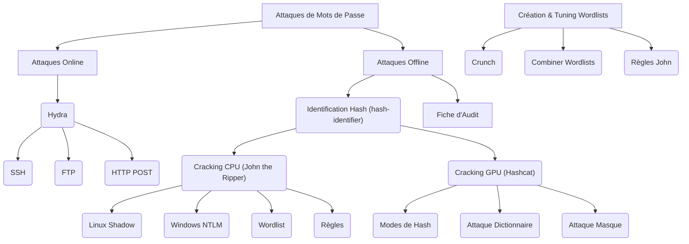

---
cssclasses:
  - max
aliases:
  - ATTAQUES DE MOTS DE PASSE (ONLINE + OFFLINE)
  - 01-14 | ATTAQUES DE MOTS DE PASSE (ONLINE + OFFLINE)
archetype: cour
module: "GEN (Culture Générale & Hors Cursus)"
tags:
  - attaque/force-brute
  - attaque/mots-de-passe/online
  - attaque/mots-de-passe/offline
  - outil/hydra
  - outil/hashcat
  - outil/john-the-ripper
  - outil/hash-identifier
  - hachage
  - wordlist
  - protocole/ssh
  - protocole/ftp
  - protocole/http
  - securite/mot-de-passe
  - motdepasse
---

# 01-14 | ATTAQUES DE MOTS DE PASSE (ONLINE + OFFLINE)

> [!goal] Objectifs Pédagogiques
> À la fin de cette fiche, je dois être capable de :
> 1.  Identifier le type d'attaque nécessaire (*online* vs *offline*).
> 2.  Utiliser *Hydra* pour tester des services comme SSH/FTP/HTTP.
> 3.  Craquer des **hashes** Linux (shadow) et Windows (NTLM).
> 4.  Utiliser *Hashcat* avec ou sans GPU.
> 5.  Choisir une **wordlist**, ou créer sa propre wordlist.
> 6.  Évaluer la robustesse d'un mot de passe.

## 📝 Synthèse du Cours

Ce module couvre les techniques d'attaques de mots de passe, segmentées en deux catégories principales : les attaques **online** et les attaques **offline**. Le niveau de difficulté est considéré comme Débutant → Intermédiaire → Avancé, abordant des outils spécifiques et des méthodes d'audit complètes. Les pré-requis incluent la validation des modules 1 à 5, des services réseau actifs sur les cibles et la disponibilité de **hashes** pour les exercices.

### 1. Attaques Online avec Hydra

Les attaques *online* consistent à tester des identifiants directement sur un service réseau exposé. L'outil principal pour ce type d'opération est **Hydra**, un utilitaire de *bruteforce* polyvalent. Il permet de tenter des combinaisons de noms d'utilisateur et de mots de passe contre une variété de protocoles et services.

> [!note] Définition Clé
> **Attaque Online** : Tentative de deviner des identifiants de connexion en interagissant directement avec un service réseau (ex: SSH, FTP, HTTP) et en testant des combinaisons de mots de passe.

#### Utilisation de Hydra

*   **SSH (Secure Shell)** : Pour attaquer un service SSH, Hydra peut être utilisé avec un login fixe et une liste de mots de passe.
    ```bash
    hydra -l admin -P /usr/share/wordlists/rockyou.txt 192.168.56.20 ssh
    ```
*   **FTP (File Transfer Protocol)** : Similaire à SSH, mais en spécifiant le protocole FTP.
    ```bash
    hydra -l user -P rockyou.txt ftp://192.168.56.20
    ```
*   **HTTP POST Login (Formulaire Web)** : Cette méthode est plus complexe car elle simule l'envoi d'un formulaire web. Il est nécessaire de spécifier l'URL du formulaire, les noms des champs utilisateur et mot de passe, et une chaîne de caractères indiquant un échec de connexion.
    ```bash
    hydra -l admin -P rockyou.txt 192.168.56.20 http-post-form "/login.php:user=^USER^&pass=^PASS^:F=Invalid"
    ```
    Les paramètres `^USER^` et `^PASS^` sont automatiquement remplacés par Hydra. Le critère `F=Invalid` indique le texte à rechercher dans la réponse pour déterminer un échec.

#### Options importantes de Hydra
*   `-l` ou `-L` : Spécifie un login fixe ou un fichier contenant une liste de logins.
*   `-p` ou `-P` : Spécifie un mot de passe fixe ou un fichier de **wordlist**.
*   `-t` : Définit le nombre de *threads* concurrents.
*   `-V` : Active le mode *verbose* pour afficher toutes les tentatives.

### 2. Identification des Hashes (hash-identifier)

Avant de tenter de casser un mot de passe hors ligne, il est crucial d'identifier le type de **hash** avec lequel on travaille. L'outil **hash-identifier** est conçu pour cette tâche, permettant de déterminer le format du hash, ce qui est essentiel pour choisir l'outil de *cracking* et le mode appropriés.

> [!note] Définition Clé
> **Hash** : Résultat d'une fonction de hachage cryptographique qui transforme une donnée (ici, un mot de passe) en une chaîne de caractères de taille fixe, généralement non réversible.

#### Exemples de formats de Hash typiques
*   `$1$xxxx` : Indique un **MD5 crypt**.
*   `$6$xxxx` : Indique un **SHA512 crypt**.
*   `5f4dcc3b5aa765d61d8327deb882cf99` : Exemple d'un **MD5**.
*   `aad3b435b51404eeaad3b435b51404ee` : Exemple d'un **NTLM**.

### 3. Cracking Offline avec John the Ripper

Le *cracking offline* est la méthode de récupération de mots de passe à partir de **hashes** stockés, sans interagir directement avec le service. **John the Ripper** (souvent appelé *John*) est un outil puissant, principalement optimisé pour l'utilisation CPU.

> [!note] Définition Clé
> **Attaque Offline** : Tentative de récupérer un mot de passe en cassant son **hash** à partir d'une copie locale, sans interaction directe avec le service authentifiant.

#### Utilisation de John the Ripper
*   **Format Linux (shadow)** : John peut automatiquement détecter et casser les hashes du fichier `/etc/shadow` sous Linux.
    ```bash
    john hashes.txt
    ```
*   **Format Windows (NTLM)** : Pour les hashes NTLM (souvent trouvés dans les systèmes Windows), il faut spécifier le format.
    ```bash
    john --format=nt hashes.txt
    ```
*   **Avec une Wordlist** : L'attaque par **dictionnaire** est une méthode courante qui consiste à tester une liste préétablie de mots de passe.
    ```bash
    john --wordlist=/usr/share/wordlists/rockyou.txt hashes.txt
    ```
*   **Règles Avancées** : John supporte l'application de règles pour modifier les mots d'une wordlist (ajout de chiffres, symboles, permutations, etc.), augmentant ainsi les chances de succès.
    ```bash
    john --wordlist=rockyou.txt --rules hashes.txt
    ```
*   **Voir les résultats** : Après le *cracking*, les mots de passe trouvés peuvent être affichés.
    ```bash
    john --show hashes.txt
    ```

### 4. Cracking Rapide avec Hashcat

**Hashcat** est l'outil de *cracking* de mots de passe le plus rapide, conçu pour tirer parti de la puissance des GPU (cartes graphiques) pour des performances nettement supérieures à celles des CPU. Il peut également fonctionner en mode CPU si un GPU n'est pas disponible.

#### Identifier le mode de Hashcat
Chaque type de **hash** est associé à un mode numérique spécifique dans Hashcat. La liste complète peut être consultée avec `hashcat --help | grep "m"`.
*   NTLM = `-m 1000`
*   MD5 = `-m 0`
*   SHA1 = `-m 100`
*   bcrypt = `-m 3200`

#### Commande générale de Hashcat
La commande typique spécifie le mode du hash et le type d'attaque.
```bash
hashcat -m 1000 -a 0 hashes.txt rockyou.txt
```*   `-m` : Spécifie le type de hash.
*   `-a` : Spécifie le type d'attaque (0 = **dictionnaire**, 3 = **masque**/**bruteforce ciblé**, 6/7 = hybride).

#### Attaque par Masque (Bruteforce ciblé)
L'attaque par **masque** permet de définir des motifs de caractères pour le *bruteforce*, par exemple, pour des mots de passe d'une certaine longueur et composition (ex: `?l?l?l?l?l?l` pour 6 lettres minuscules).
```bash
hashcat -m 1000 -a 3 hashes.txt '?l?l?l?l?l?l'
```
#### Voir les résultats
Comme pour John, Hashcat permet de visualiser les mots de passe crackés.
```bash
hashcat --show hashes.txt
```

### 5. Création et Tuning de Wordlists

Les **wordlists** sont des éléments fondamentaux des attaques par **dictionnaire**. La capacité à créer et à personnaliser ces listes est essentielle pour des attaques efficaces.

> [!note] Définition Clé
> **Wordlist** : Un fichier texte contenant une liste de mots, de phrases ou de combinaisons de caractères couramment utilisés comme mots de passe.

#### Générer une Wordlist avec Crunch
**Crunch** est un générateur de wordlists qui permet de créer des listes de mots de passe basées sur des ensembles de caractères et des longueurs spécifiques.
```bash
crunch 6 6 abcdef1234 -o custom.txt
```
Ceci générera tous les mots de 6 caractères composés uniquement des lettres `abcdef` et des chiffres `1234`.

#### Mélanger plusieurs Wordlists
Il est souvent utile de combiner plusieurs **wordlists** pour augmenter la couverture et la probabilité de succès.
```bash
cat list1.txt list2.txt | sort -u > combined.txt
```
Cette commande concatène deux listes, les trie et supprime les doublons.

#### Ajouter des Règles John
Les règles permettent de modifier dynamiquement les mots d'une **wordlist** pendant le *cracking*. Elles peuvent être personnalisées dans un fichier de configuration.
Exemple de règles (`myrules.conf`):
```
Az"[0-9]1" # Ajouter 1 chiffre à la fin
cA`z"[@!]" # Ajouter un symbole
```
Utilisation avec John :
```bash
john --wordlist=rockyou.txt --rules=myrules.conf hashes.txt
```

### 6. Fiche d'Audit des Mots de Passe

Une fois les mots de passe crackés ou analysés, il est important de documenter les résultats dans une fiche d'audit. Cela permet d'évaluer la robustesse des mots de passe, d'identifier les vulnérabilités et de recommander des améliorations.

| Hash      | Format  | Méthode         | Wordlist    | Temps   | Résultat  | Impact |
| :-------- | :------ | :-------------- | :---------- | :------ | :-------- | :----- |
| NTLM 1000 | Hashcat | Attaque Dictionnaire | rockyou.txt | 2 sec       | azerty123 | High      |

## 🧠 Carte Mentale / Schéma


## ❓ Quiz de Révision (Active Recall)

> [!question] Question 1
> Quel outil est principalement utilisé pour les attaques de mots de passe *online* sur des services réseau comme SSH ou FTP ?
> > [!success]- Réponse
> > **Hydra**.

> [!question] Question 2
> Pourquoi est-il crucial d'utiliser *hash-identifier* avant de commencer une attaque de *cracking* *offline* ?
> > [!success]- Réponse
> > Pour identifier le type de **hash** et ainsi choisir l'outil de *cracking* (John the Ripper ou Hashcat) et le mode approprié.

> [!question] Question 3
> Quelle est la principale différence entre **John the Ripper** et **Hashcat** en termes de performance et de ressources utilisées ?
> > [!success]- Réponse
> > **John the Ripper** est principalement optimisé pour le *cracking* basé sur le CPU, tandis que **Hashcat** est optimisé pour tirer parti de la puissance des GPU, offrant des performances nettement supérieures.

> [!question] Question 4
> Citez deux méthodes pour créer ou améliorer une **wordlist** pour des attaques de mots de passe.
> > [!success]- Réponse
> > 1.  Utiliser **Crunch** pour générer une **wordlist** basée sur des caractères et des longueurs spécifiques.
> > 2.  Mélanger plusieurs **wordlists** existantes et supprimer les doublons (`cat ... | sort -u`).
> > 3.  Appliquer des règles avancées (par exemple, des règles John) pour modifier les mots d'une **wordlist**.