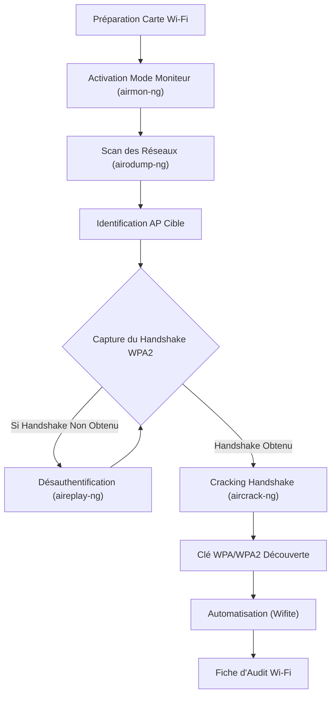

---
aliases:
  - "ATTAQUES WI-FI (WEP/WPA/WPA2) • AIRCRACK-NG & WIFITE"
  - "01-15 | ATTAQUES WI-FI (WEP/WPA/WPA2) • AIRCRACK-NG & WIFITE"
archetype: cour
module: "GEN (Culture Générale & Hors Cursus)"
cssclasses:
  - max
tags:
  - wifi
  - reseau/sans-fil
  - attaque/reseau/sans-fil
  - protocole/wep
  - protocole/wpa
  - protocole/wpa2
  - outil/aircrack-ng
  - outil/wifite
  - commande/airmon-ng
  - commande/airodump-ng
  - commande/aireplay-ng
  - commande/iwconfig
  - wifi/mode-moniteur
  - attaque/desauthentification
  - wifi/handshake
  - labo/environnement-vulnerable
  - distribution/kali-linux
  - materiel/carte-reseau
  - materiel/reseau/point-acces-sans-fil
---

# 01-15 | ATTAQUES WI-FI (WEP/WPA/WPA2) • AIRCRACK-NG & WIFITE

> [!goal] Objectifs Pédagogiques
> À la fin de cette fiche, je dois être capable de :
> 1. Mettre une interface Wi-Fi en mode moniteur.
> 2. Scanner les réseaux Wi-Fi et identifier les AP cibles.
> 3. Capturer un handshake WPA2.
> 4. Désauthentifier un client de manière contrôlée.
> 5. Cracker un handshake avec Aircrack-ng.
> 6. Automatiser les attaques avec Wifite.

## 📝 Synthèse du Cours

Ce module s'adresse aux niveaux *Débutant* à *Intermédiaire* et *Avancé* pour la partie exercices. Il est crucial d'opérer dans un *environnement de laboratoire* strict pour ces procédures.

### Contexte et Pré-requis

Pour réaliser les attaques Wi-Fi, un environnement spécifique est requis :
*   Une **carte Wi-Fi USB compatible monitor mode** est essentielle (ex: Alfa AWUS036ACH / AWUS036NHA).
*   Un **point d'accès (AP) dédié au LAB uniquement** doit être utilisé.
*   Il est strictement interdit de tester ces techniques sur un réseau réel sans autorisation écrite préalable.

Les pré-requis techniques incluent :
*   La validation des modules 1 à 6.
*   Une carte Wi-Fi compatible monitor mode fonctionnelle.
*   Un AP de LAB configuré en **WPA2** avec un mot de passe faible ou moyen.
*   Une machine **Kali Linux** entièrement à jour.

### 1. Outils Essentiels pour les Attaques Wi-Fi

Plusieurs outils de la suite **Aircrack-ng** et **Wifite** sont utilisés pour ces attaques :

| Outil       | Rôle                                        |
| :---------- | :------------------------------------------ |
| **airmon-ng** | Activer/stopper le *mode moniteur*          |
| **airodump-ng** | Scanner les réseaux / capturer les paquets  |
| **aireplay-ng** | Effectuer des attaques (désauthentification, rejeu) |
| **aircrack-ng** | Cracker les handshakes (clés WPA/WPA2)      |
| **Wifite**  | Automatisation complète du processus d'attaque Wi-Fi |

### 2. Procédures Détaillées d'Attaque Wi-Fi

La structure du module suit une série d'étapes logiques pour mener une attaque Wi-Fi réussie :

1.  **Préparation de la carte Wi-Fi** : Mise en *mode moniteur*.
2.  **Scan des réseaux** : Identification des points d'accès cibles avec **airodump-ng**.
3.  **Capture du handshake WPA2**.
4.  **Désauthentification** : Pour forcer la reconnexion et la capture immédiate du handshake.
5.  **Cracking du handshake** : Récupération du mot de passe avec **aircrack-ng**.
6.  **Automatisation** : Utilisation de **Wifite** pour simplifier le processus.
7.  **Fiche d'audit Wi-Fi** : Documentation des résultats.

#### Étape 1 — Mise en Mode Moniteur (airmon-ng)

Le *mode moniteur* est essentiel pour capturer le trafic Wi-Fi ambiant.

> [!note] Définition Clé
> **Mode Moniteur** : Un mode de fonctionnement d'une carte réseau sans fil qui lui permet de capturer tous les paquets de données Wi-Fi à portée, même ceux non destinés à cette carte, sans être connectée à un point d'accès.

1.  **Vérifier l'interface Wi-Fi** : Utilisez `iwconfig` pour identifier votre interface (ex: `wlan0`).
    ```bash
    iwconfig
    ```
2.  **Activer le mode moniteur** :
    ```bash
    sudo airmon-ng check kill
    sudo airmon-ng start wlan0
    ```
    Un nouveau nom d'interface comme `wlan0mon` devrait apparaître.

#### Étape 2 — Scan des Points d'Accès avec airodump-ng

Une fois en mode moniteur, **airodump-ng** permet de lister les réseaux Wi-Fi disponibles et leurs caractéristiques.

1.  **Scanner tous les réseaux** :
    ```bash
    sudo airodump-ng wlan0mon
    ```
    Observez des informations clés telles que le *BSSID*, le *canal*, la *puissance* du signal, les *clients associés* et le type de chiffrement (*Encryption*, WPA2, WPA3). Le but est d'identifier l'AP de test, son canal et ses clients.

#### Étape 3 — Cibler un AP Spécifique et Capturer le Handshake

Pour capturer un handshake WPA2, il faut cibler un AP et attendre qu'un client s'y connecte ou se reconnecte.

1.  **Lancer la capture ciblée** :
    ```bash
    sudo airodump-ng -c 6 --bssid AA:BB:CC:DD:EE:FF -w capture wlan0mon
    ```
    *   `-c 6` spécifie le canal de l'AP cible.
    *   `--bssid AA:BB:CC:DD:EE:FF` est l'adresse MAC du point d'accès cible.
    *   `-w capture` indique de sauvegarder les paquets dans un fichier nommé `capture-01.cap`.

    Attendez qu'un client s'authentifie. Le "WPA handshake" apparaîtra dans la colonne dédiée.

#### Étape 4 — Désauthentification Contrôlée (aireplay-ng)

La *désauthentification* est une technique qui force un client à se déconnecter puis à se reconnecter à l'AP, ce qui permet de capturer rapidement le *handshake* si aucun client n'est actif.

> [!note] Définition Clé
> **Désauthentification (Deauth)** : Une attaque consistant à envoyer des paquets de désauthentification à un client Wi-Fi, le forçant à se déconnecter du point d'accès. Lors de sa reconnexion, un nouveau handshake peut être capturé.

1.  **Désauthentifier tous les clients (ou un client spécifique)** :
    ```bash
    sudo aireplay-ng --deauth 10 -a AA:BB:CC:DD:EE:FF wlan0mon
    ```
    Cette commande envoie 10 paquets de désauthentification à tous les clients connectés à l'AP avec le BSSID `AA:BB:CC:DD:EE:FF`.
    Pour cibler un client précis :
    ```bash
    sudo aireplay-ng --deauth 5 -a AA:BB:CC:DD:EE:FF -c 11:22:33:44:55:66 wlan0mon
    ```
    Le critère de succès est l'apparition de "WPA Handshake: XX:XX:XX..." dans la fenêtre `airodump-ng`.

#### Étape 5 — Cracking du Handshake (aircrack-ng)

Le fichier `.cap` contenant le handshake WPA2 peut maintenant être cracké avec **aircrack-ng** et une *wordlist*.

1.  **Préparer la wordlist** : La *wordlist* `rockyou.txt` est souvent utilisée. Elle est compressée, il faut la décompresser :
    ```bash
    sudo gunzip /usr/share/wordlists/rockyou.txt.gz
    ```
2.  **Lancer le cracking** :
    ```bash
    aircrack-ng capture-01.cap -w /usr/share/wordlists/rockyou.txt
    ```
    Le but est de voir "KEY FOUND" et le mot de passe WPA. Pour le LAB, un mot de passe faible est recommandé.

#### Étape 6 — Automatisation Complète avec Wifite

**Wifite** est un outil puissant qui automatise la plupart des étapes précédentes, de la détection du réseau au cracking.

1.  **Lancer Wifite en mode interactif** :
    ```bash
    sudo wifite
    ```
    Cela permet de choisir l'AP cible parmi une liste.
2.  **Lancer Wifite en mode automatisé** :
    ```bash
    sudo wifite --kill --dict /usr/share/wordlists/rockyou.txt
    ```
    `--kill` désactive les processus conflictuels et `--dict` spécifie la wordlist à utiliser. Le critère est l'obtention d'un handshake et le lancement correct du processus de cracking.

#### Étape 7 — Fiche d'Audit Wi-Fi

Il est essentiel de documenter les résultats de l'audit Wi-Fi dans une fiche récapitulative.

| SSID          | BSSID              | Canal | Encryption | Handshake obtenu ? | Méthode                  | Mot de passe  | Impact |
| :------------ | :----------------- | :---- | :--------- | :----------------- | :----------------------- | :------------ | :----- |
| LAB-WIFI      | AA:BB:CC:DD:EE:FF  | 6     | WPA2       | Oui                | Deauth + Aircrack        | azerty123     | High   |

### 3. Commandes Essentielles du Module

Voici un récapitulatif des commandes clés pour ce module :

*   **Mode Moniteur** :
    ```bash
    airmon-ng check kill
    airmon-ng start wlan0
    ```
*   **Scan des AP** :
    ```bash
    airodump-ng wlan0mon
    ```
*   **Capture Ciblée** :
    ```bash
    airodump-ng -c CH --bssid BSSID -w file wlan0mon
    ```
*   **Désauthentification** :
    ```bash
    aireplay-ng --deauth 10 -a BSSID wlan0mon
    ```
*   **Cracking du Handshake** :
    ```bash
    aircrack-ng file.cap -w rockyou.txt
    ```
*   **Automatisation Wifite** :
    ```bash
    wifite
    ```

### 4. Critères de Validation et Exercices Pratiques

#### Critères de Validation du Module

Un participant valide le module s'il est capable de :
1.  Activer le *monitor mode* correctement.
2.  Identifier l'AP, son canal et ses clients.
3.  Capturer un handshake WPA2 valide.
4.  Réaliser une désauthentification contrôlée.
5.  Cracker au moins un mot de passe LAB.
6.  Remplir une fiche d'audit Wi-Fi.

#### Exercices

*   **Débutant** :
    *   Scanner les réseaux Wi-Fi et identifier un AP cible.
    *   Capturer un handshake passif (sans désauthentification).
*   **Intermédiaire** :
    *   Effectuer une désauthentification ciblée sur un client précis.
    *   Réaliser le cracking du handshake avec la wordlist `rockyou.txt`.
*   **Avancé** :
    *   Créer un AP factice (*rogue AP*).
    *   Forcer la connexion d'un poste client à ce *fake AP*.
    *   Capturer des données non chiffrées (dans un environnement de LAB strict uniquement).

## 🧠 Carte Mentale / Schéma


## ❓ Quiz de Révision (Active Recall)
> [!question] Question 1
> Quel est l'outil principal utilisé pour activer le mode moniteur sur une interface Wi-Fi ?
> > [!success]- Réponse
> > **airmon-ng**.

> [!question] Question 2
> Pourquoi la désauthentification est-elle une étape importante lors de la tentative de capture d'un handshake WPA2 ?
> > [!success]- Réponse
> > Elle force un client connecté à l'AP à se déconnecter et à se reconnecter, générant ainsi un nouveau handshake qui peut être capturé.

> [!question] Question 3
> Quelle commande est utilisée pour lancer le processus de cracking d'un handshake capturé avec une wordlist spécifique ?
> > [!success]- Réponse
> > `aircrack-ng [nom_du_fichier_capture.cap] -w [chemin_vers_la_wordlist]`.

> [!question] Question 4
> Nommez un avantage majeur de l'utilisation de **Wifite** par rapport à l'exécution manuelle des commandes de la suite Aircrack-ng.
> > [!success]- Réponse
> > **Wifite** automatise l'ensemble du processus, de l'identification du réseau au cracking, ce qui simplifie et accélère l'opération.