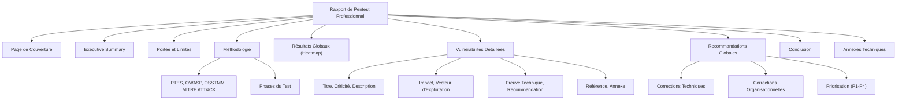

# 01-21 | Rapport de Pentest Professionnel

> [!goal] Objectifs Pédagogiques
> À la fin de cette fiche, chaque participant doit être capable de :
> 1. Rédiger un **Executive Summary clair** et non technique.
> 2. Décrire la **portée**, le périmètre et les limites d'un test d'intrusion.
> 3. Structurer la partie **méthodologie** en utilisant des standards reconnus (OSSTMM, PTES, OWASP, MITRE ATT&CK).
> 4. Documenter les vulnérabilités avec une **fiche standard et complète**.
> 5. Évaluer le risque (CVSS / Impact métier) et prioriser les corrections.
> 6. Fournir des recommandations exploitables par les équipes IT et la direction.
> 7. Structurer les annexes techniques (preuves, commandes, logs).
> 8. Créer une version "client" et une version "technique" du rapport.

## 📝 Synthèse du Cours

Le **Rapport de Pentest Professionnel** est le livrable final crucial de toute mission de test d'intrusion. Il synthétise les découvertes, évalue les risques et propose des actions correctives. Ce module vise à établir une **méthodologie standard** et un modèle complet pour garantir une qualité homogène des rapports, compréhensibles tant par le management que par les équipes techniques.

### 1. Pré-requis Essentiels

Avant la rédaction du rapport, il est impératif d'avoir mené à bien les phases techniques du pentest et de disposer de toutes les informations collectées, notamment les fiches d'exposition des modules précédents :
*   Réseau
*   Système
*   Web
*   SQLi
*   Password
*   Wi-Fi
*   Exploitation
*   AD Attacks
*   Post-exploitation
*   Pivoting
*   Red Team

L'objectif est de transformer toutes ces données brutes en un **rapport unique, cohérent et professionnel**.

### 2. Structure Standard d'un Rapport de Pentest

Un rapport de pentest professionnel suit généralement une structure harmonisée, inspirée des standards internationaux comme PTES, OSSTMM et ISSAF.

#### A. Page de Couverture
La page de couverture doit inclure les informations clés pour identifier le rapport :
*   Nom de l'entreprise auditée
*   Nom du consultant / de l'équipe d'audit
*   Type de test (Pentest Interne / Externe / Web / AD / Red Team)
*   Dates de réalisation du test
*   Numéro de version du rapport
*   Mention de confidentialité (ex: STRICTEMENT CONFIDENTIEL — DIFFUSION LIMITÉE)

#### B. Executive Summary (Synthèse Exécutive)
Destiné à la direction et au management, ce résumé doit être **non technique** et ne pas dépasser **10 lignes**. Il doit répondre aux questions suivantes :
*   Quel a été l'objet du test ?
*   Quel est le niveau de risque global identifié ?
*   Quelles sont les vulnérabilités critiques majeures ?
*   Une compromission complète a-t-elle été démontrée ou est-elle possible ?
*   Quelles sont les recommandations globales prioritaires ?

> [!note] Exemple d'Executive Summary
> "Le test d'intrusion interne a révélé plusieurs vulnérabilités critiques permettant à un attaquant interne d'obtenir un accès complet aux données sensibles en moins de 2 heures. Les mécanismes de segmentation, d'authentification et de patching présentent des faiblesses majeures. Une compromission totale du domaine Active Directory a été démontrée. Des recommandations prioritaires ont été formulées pour réduire le risque global de compromission."

#### C. Portée et Limites du Test
Cette section définit précisément le cadre de l'audit.
*   **Portée :**
    *   Systèmes, réseaux, applications inclus dans le périmètre.
    *   Comptes fournis ou non (type d'accès initial).
    *   Type de test (interne / externe, Grey box / Black box / White box).
*   **Limites :**
    *   Exclusion explicite de certains types d'attaques (ex: DoS, exploitation destructrice, altération de données).
    *   Précisions sur les conditions de test (ex: réalisées en conditions normales, sans impact sur la production).

#### D. Méthodologie
Présenter les standards et l'approche utilisés pour le pentest :
*   **Standards :** PTES (Penetration Testing Execution Standard), OWASP Web / API Security Testing Guide, OSSTMM (Open Source Security Testing Methodology Manual), MITRE ATT&CK (pour les missions Red Team).
*   **Phases du test :**
    1.  Reconnaissance passive & active
    2.  Scan réseau
    3.  Énumération des services
    4.  Tests Web (selon l'OWASP Top 10)
    5.  Tests d'authentification et d'autorisation
    6.  Exploitation des vulnérabilités
    7.  Mouvement latéral et persistance
    8.  Escalade de privilèges
    9.  Exfiltration simulée de données (si autorisée)

#### E. Résultats Globaux (Heatmap)
Une **matrice visuelle du risque** est essentielle pour une compréhension rapide. Elle combine l'impact de la vulnérabilité et sa criticité.

| Criticité / Impact | Critique | Élevé | Moyen | Faible |
| :----------------- | :------- | :---- | :---- | :----- |
| **Critique**       | 4        | 3     | 2     | 1      |
| **Élevé**          | 3        | 2     | 1     |        |
| **Moyen**          | 2        | 1     |       |        |
| **Faible**         | 1        |       |       |        |

Exemple de tableau récapitulatif des vulnérabilités principales :

| Vulnérabilité      | Criticité Impact       | Facilité d'exploitation |
| :----------------- | :--------------------- | :---------------------- |
| Kerberoasting      | Critique AD compromise | Élevée                  |
| SQL Injection      | Critique Dump DB       | Moyenne                 |
| SMB Signing Off    | Élevé Cred Harvesting  | Élevée                  |
| Password faibles   | Élevé Mvt latéral      | Très élevée             |
| Services obsolètes | Moyen Post-exploitation| Moyenne                 |
| Headers Web        | Faible Info leak       | Faible                  |

#### F. Vulnérabilités Détaillées
Chaque vulnérabilité découverte doit être documentée de manière exhaustive dans une **fiche complète** :
1.  **Titre**
2.  **Criticité** (Critique / Élevée / Moyenne / Faible)
3.  **Description** détaillée de la vulnérabilité
4.  **Impact** (technique et métier)
5.  **Vecteur d'exploitation** (comment elle a été exploitée)
6.  **Preuve technique** (captures d'écran, commandes exécutées, extraits de code)
7.  **Recommandation** spécifique et concrète pour la correction
8.  **Référence** (CVE, CWE, OWASP Top 10)
9.  **Annexe** (logs, scripts, etc., si pertinent)

> [!note] Exemple de fiche de vulnérabilité : Kerberoasting
> *   **Criticité :** Critique
> *   **Description :** Le domaine Active Directory autorise la récupération des tickets TGS (Service Ticket Granting Service) de comptes de service ayant des noms de principal de service (SPN) non protégés, exposant leurs hachages de mots de passe.
> *   **Preuve :**
>     `GetUserSPNs.py domain.local/user:pass -request`
>     `hashcat -m 13100 hash rockyou.txt`
> *   **Impact :** Compromission de comptes de service potentiellement privilégiés, pouvant mener à une escalade de privilèges et à une compromission complète du domaine Active Directory en moins de 30 minutes.
> *   **Recommandation :** Imposer des mots de passe robustes (> 25 caractères) pour les comptes de service et protéger ces comptes avec l'attribut `msDS-SupportedEncryptionTypes` ou migrer vers des comptes de service gérés (gMSA).
> *   **Référence :** CWE-522, MITRE ATT&CK T1558.003

#### G. Recommandations Globales
Cette section regroupe l'ensemble des mesures correctives, classées par type et par priorité.

##### 1. Corrections techniques
*   Mise en place de l'authentification multi-facteurs (MFA).
*   Politique stricte de rotation des mots de passe.
*   Application régulière et complète des patchs OS et applicatifs.
*   Activation obligatoire du SMB Signing.
*   Désactivation des protocoles obsolètes (ex: NTLM v1).
*   Implémentation de la segmentation réseau.
*   Durcissement de l'Active Directory (LAPS, modèle de tiering, gMSA).

##### 2. Corrections organisationnelles
*   Développement d'une politique de gestion des vulnérabilités.
*   Tests réguliers et validés des procédures de sauvegarde et de restauration.
*   Maintien d'un inventaire précis et à jour des actifs.
*   Programmes de formation et de sensibilisation des utilisateurs à la cybersécurité.

##### 3. Priorisation des Actions (P1 -> P4)
*   **P1 :** À corriger immédiatement (vulnérabilités critiques avec impact élevé).
*   **P2 :** < 30 jours (vulnérabilités élevées avec impact significatif).
*   **P3 :** < 90 jours (vulnérabilités moyennes).
*   **P4 :** Planification à long terme (vulnérabilités faibles ou améliorations de la posture de sécurité).

#### H. Conclusion
La conclusion doit synthétiser les principaux constats et fournir une vision d'ensemble de la posture de sécurité :
*   Le réseau est-il compromis et à quel degré ?
*   L'organisation est-elle globalement à risque ?
*   Quelles sont les actions prioritaires à entreprendre pour améliorer la sécurité ?

#### I. Annexes Techniques
Cette section contient toutes les preuves brutes et les détails techniques qui soutiennent les découvertes du rapport principal.
*   Rapports Nmap complets.
*   Captures d'outils (WhatWeb, ffuf, Gobuster).
*   Fiches détaillées des modules techniques (Système, Web, AD, etc.).
*   Hashes de mots de passe (sans les mots de passe en clair).
*   Scripts et exploits utilisés.
*   Logs des activités Red Team.
*   Chemins de pivoting documentés.
*   Arborescence Active Directory (si BloodHound a été utilisé).

### 3. Commandes Essentielles pour la Documentation

Quelques commandes utiles pour exporter les résultats :
*   **Export Nmap complet :** `nmap -A -oA report_full 192.168.0.0/24`
*   **Export SQLMap :** `sqlmap -r login.req --batch --dump --output-dir=report/`
*   **Export BloodHound (exemple pour CME) :** `cme smb 192.168.0.0/24 -u user -p pass > cme_results.txt`

### 4. Critères de Validation d'un Rapport de Pentest

Un rapport est considéré comme validé si le participant :
1.  Produit un rapport complet, bien structuré et professionnel.
2.  Rédige un Executive Summary clair et concis.
3.  Documente un minimum de **8 vulnérabilités** détaillées.
4.  Fournit des preuves techniques claires et pertinentes.
5.  Établit un plan d'action priorisé et exploitable.
6.  Livre à la fois une version "client" et une version "technique" du rapport.

## 🧠 Carte Mentale / Schéma

## ❓ Quiz de Révision (Active Recall)
> [!question] Question 1
> Quelle est l'audience principale de l'Executive Summary et pourquoi est-il important qu'il soit non technique ?
> > [!success]- Réponse
> > L'audience principale de l'Executive Summary est la direction et le management. Il est important qu'il soit non technique afin d'être directement compréhensible par des décideurs qui n'ont pas forcément une expertise technique approfondie en cybersécurité, leur permettant ainsi de saisir rapidement les risques et les actions prioritaires.

> [!question] Question 2
> Citez au moins trois standards de méthodologie de pentest qui peuvent être mentionnés dans un rapport professionnel.
> > [!success]- Réponse
> > Trois standards de méthodologie de pentest incluent le PTES (Penetration Testing Execution Standard), l'OWASP (pour les tests Web/API), l'OSSTMM (Open Source Security Testing Methodology Manual) et MITRE ATT&CK (souvent pour la Red Team).

> [!question] Question 3
> Quelles informations essentielles doivent figurer dans une fiche de vulnérabilité détaillée ?
> > [!success]- Réponse
> > Une fiche de vulnérabilité détaillée doit inclure le titre, la criticité, une description, l'impact (technique et métier), le vecteur d'exploitation, la preuve technique, une recommandation, et les références (CVE/CWE/OWASP).