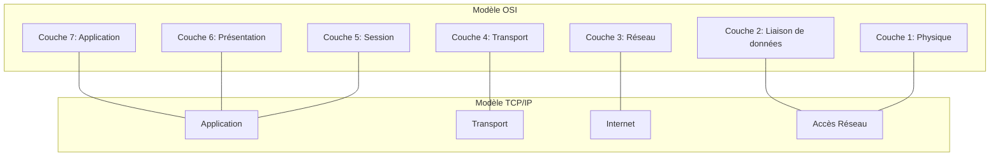

---
cssclasses:
  - max
title: Comparaison modele osi et modele TCP/ip
module: RIB
aliases:
  - Comparaison modele osi et modele TCP/ip
---

# Comparaison modele osi et modele TCP/ip

- [[OpenSystemsInterconnectionModel]]
- [[InternetProtocolSuite|TCP/IP Model]]