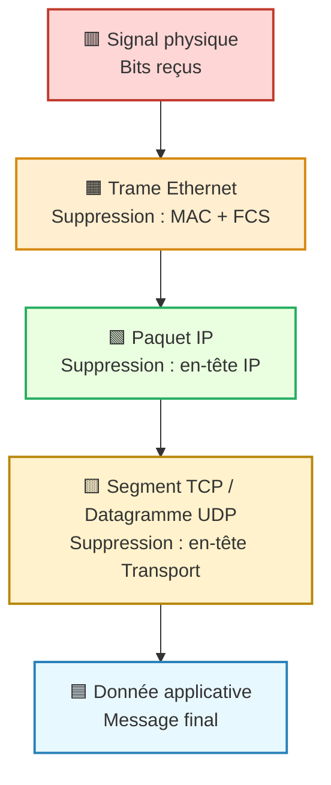

---
tags:
  - reseau
  - donnees
  - modele/osi
  - modele/tcp-ip
  - protocole
  - encapsulation
  - couche
  - communication/reseau
aliases:
  - Décapsulation
  - Decapsulation
archetype: concept-general
source:
  - 
cssclasses:
  - max
---

# Décapsulation

## 📥 Définition en une phrase
> La décapsulation est le processus par lequel un [[Computer|ordinateur]] ou un [[NetworkDevice|périphérique réseau]] retire les [[Header|en-têtes]] (et éventuellement les [[Payload|pieds de page]]) des [[Packet|paquets]] de [[Data|données]] à mesure qu'ils remontent la [[ProtocolStack|pile de protocoles]], révélant la [[Payload|charge utile]] de la couche inférieure pour la couche supérieure.

## 🧠 Concepts Clés / Piliers
*   **[[Layer|Architecture en Couches]]**: Les [[NetworkProtocol|protocoles réseau]] fonctionnent selon une [[Layer|architecture en couches]], comme illustré par le [[OpenSystemsInterconnectionModel|modèle OSI]] ou la [[InternetProtocolSuite|suite de protocoles TCP/IP]]. Chaque couche est responsable d'une fonction spécifique et ajoute ses propres informations de contrôle (en-têtes/pieds de page) aux [[Data|données]].
*   **Processus Inverse de l'[[Encapsulation|Encapsulation]]**: La décapsulation est l'exact opposé de l'[[Encapsulation|encapsulation]]. Alors que l'encapsulation ajoute des informations de contrôle à chaque couche lors de la transmission, la décapsulation les retire dans l'ordre inverse à la réception.
*   **Extraction de [[Data|Données]] et Interprétation**: À chaque couche de la pile de protocoles, le [[System|système]] récepteur examine l'[[Header|en-tête]] de sa couche, interprète les informations qu'il contient (par exemple, adresses de destination, contrôle de [[FlowControl|flux]], détection d'[[ErrorDetectionAndCorrection|erreurs]]), puis retire cet [[Header|en-tête]] avant de transmettre la [[Payload|charge utile]] (les [[Data|données]] de la couche supérieure) à la couche suivante.
*   **Vérification de l'[[Integrity|Intégrité]]**: Souvent, lors de la décapsulation, une [[Checksum|somme de contrôle]] ou une [[FrameCheckSequence|séquence de vérification de trame]] est utilisée pour vérifier l'[[Integrity|intégrité]] des [[Data|données]] et s'assurer qu'aucune [[DataCorruption|corruption de données]] n'est survenue pendant la [[DataTransmission|transmission]].

## 💡 Importance en Cybersécurité
> La compréhension de la décapsulation est fondamentale en [[Cybersecurity|cybersécurité]] pour plusieurs raisons cruciales. Elle permet aux [[SecurityResearcher|chercheurs en sécurité]] et aux [[BlueTeam|équipes bleues]] d'analyser le [[NetworkTraffic|trafic réseau]] en profondeur, en utilisant des [[Tool|outils]] comme [[Wireshark]], pour identifier les [[Malware|logiciels malveillants]], les [[Attack|attaques]] et les [[Vulnerability|vulnérabilités]]. Les [[Firewall|pare-feu]] et les [[IntrusionDetectionSystem|IDS]]/[[IntrusionPreventionSystem|IPS]] s'appuient sur la décapsulation pour inspecter le contenu des [[Packet|paquets]] à différents niveaux de la [[ProtocolStack|pile de protocoles]], ce qui est essentiel pour détecter les [[Threat|menaces]] et appliquer les [[SecurityPolicy|politiques de sécurité]]. Sans une connaissance approfondie de ce processus, l'identification et la mitigation efficaces des [[DigitalAttack|attaques numériques]] seraient considérablement entravées, rendant la [[NetworkSecurity|sécurité réseau]] beaucoup plus difficile à maintenir.

## 🔗 Notes Connexes
*   **Concept opposé**: [[Encapsulation]]
*   **Modèle de référence**: [[OpenSystemsInterconnectionModel|Modèle OSI]]
*   **Outil d'analyse**: [[Wireshark]]
*   **Composant de données**: [[Header]]
*   **Domaine d'application**: [[NetworkTrafficAnalysis|Analyse du trafic réseau]]

