---
tags:
  - reseau
  - donnees
  - modele/osi
  - modele/tcp-ip
  - protocole
  - encapsulation
  - couche
  - communication/reseau
aliases:
  - Décapsulation
  - Decapsulation
archetype: concept-general
source:
  - 
cssclasses:
  - max
---

# Décapsulation

## 📥 Définition en une phrase
> La décapsulation est le processus par lequel un ordinateur ou un périphérique réseau retire les en-têtes (et éventuellement les pieds de page) des paquets de données à mesure qu'ils remontent la pile de protocoles, révélant la charge utile de la couche inférieure pour la couche supérieure.

## 🧠 Concepts Clés / Piliers
*   **Architecture en Couches**: Les protocoles réseau fonctionnent selon une architecture en couches, comme illustré par le modèle OSI ou la suite de protocoles TCP/IP. Chaque couche est responsable d'une fonction spécifique et ajoute ses propres informations de contrôle (en-têtes/pieds de page) aux données.
*   **Processus Inverse de l'Encapsulation**: La décapsulation est l'exact opposé de l'encapsulation. Alors que l'encapsulation ajoute des informations de contrôle à chaque couche lors de la transmission, la décapsulation les retire dans l'ordre inverse à la réception.
*   **Extraction de Données et Interprétation**: À chaque couche de la pile de protocoles, le système récepteur examine l'en-tête de sa couche, interprète les informations qu'il contient (par exemple, adresses de destination, contrôle de flux, détection d'erreurs), puis retire cet en-tête avant de transmettre la charge utile (les données de la couche supérieure) à la couche suivante.
*   **Vérification de l'Intégrité**: Souvent, lors de la décapsulation, une somme de contrôle ou une séquence de vérification de trame est utilisée pour vérifier l'intégrité des données et s'assurer qu'aucune corruption de données n'est survenue pendant la transmission.

## 💡 Importance en Cybersécurité
> La compréhension de la décapsulation est fondamentale en cybersécurité pour plusieurs raisons cruciales. Elle permet aux chercheurs en sécurité et aux équipes bleues d'analyser le trafic réseau en profondeur, en utilisant des outils comme Wireshark, pour identifier les logiciels malveillants, les attaques et les vulnérabilités. Les pare-feu et les IDS/IPS s'appuient sur la décapsulation pour inspecter le contenu des paquets à différents niveaux de la pile de protocoles, ce qui est essentiel pour détecter les menaces et appliquer les politiques de sécurité. Sans une connaissance approfondie de ce processus, l'identification et la mitigation efficaces des attaques numériques seraient considérablement entravées, rendant la sécurité réseau beaucoup plus difficile à maintenir.

## 🔗 Notes Connexes
*   **Concept opposé**: Encapsulation
*   **Modèle de référence**: Modèle OSI
*   **Outil d'analyse**: Wireshark
*   **Composant de données**: Header
*   **Domaine d'application**: Analyse du trafic réseau

```mermaid
graph TD
    classDef phys fill:#ffd6d6,stroke:#c0392b,stroke-width:2px;
    classDef link fill:#ffeecf,stroke:#d68910,stroke-width:2px;
    classDef net fill:#e9ffe0,stroke:#27ae60,stroke-width:2px;
    classDef trans fill:#fff2cc,stroke:#b8860b,stroke-width:2px;
    classDef app fill:#e8f8ff,stroke:#2980b9,stroke-width:2px;

    A["🟥 Signal physique<br/>Bits reçus"]:::phys
    B["🟧 Trame Ethernet<br/>Suppression : MAC + FCS"]:::link
    C["🟩 Paquet IP<br/>Suppression : en-tête IP"]:::net
    D["🟨 Segment TCP / Datagramme UDP<br/>Suppression : en-tête Transport"]:::trans
    E["🟦 Donnée applicative<br/>Message final"]:::app

    A --> B --> C --> D --> E

```

