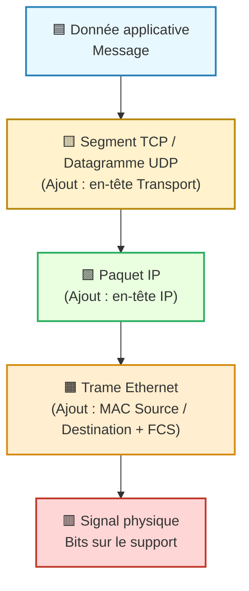

---
tags:
  - encapsulation
  - reseau
  - modele/osi
  - modele/tcp-ip
  - protocole
  - couche
  - data/transmission
aliases:
  - Encapsulation
  - Encapsulation de données
  - Data Encapsulation
archetype: concept-general
source:
  - 
cssclasses:
  - max
---

# Encapsulation de Données

## 📥 Définition en une phrase
> L'[[Encapsulation|encapsulation]] est le processus par lequel les [[Data|données]] d'un [[Protocol|protocole]] de [[Layer|couche]] supérieure sont insérées dans la [[Payload|charge utile]] d'un [[Protocol|protocole]] de couche inférieure à des fins de [[DataTransmission|transmission]].

## 🧠 Concepts Clés / Piliers
*   **Processus par Couches**: L'[[Encapsulation|encapsulation]] se produit séquentiellement à travers les différentes [[Layer|couches]] d'un [[ProtocolStack|modèle de protocoles]] (comme le [[OpenSystemsInterconnectionModel|modèle OSI]] ou la [[InternetProtocolSuite|suite TCP/IP]]). Chaque couche ajoute ses propres informations de contrôle avant de passer les données à la couche suivante.
*   **Ajout d'En-têtes et Pieds de Trame**: À chaque couche, des [[Header|en-têtes]] spécifiques au [[NetworkProtocol|protocole]] de la couche sont ajoutés au début du [[Message|message]]. Certaines couches (notamment la [[DataLinkLayer|couche liaison de données]]) peuvent également ajouter un pied de trame (trailer) à la fin, contenant des informations comme le [[FrameCheckSequence|FCS]] pour la [[ErrorDetectionAndCorrection|détection et correction d'erreurs]].
*   **Unités de Données de Protocole (PDU)**: Les [[Data|données]] encapsulées à chaque [[Layer|couche]] sont appelées Unités de Données de Protocole (PDU) ou [[Packet|paquet]] (terme générique). Leur nom varie selon la couche : segment ([[TransportLayer|couche transport]]), paquet ([[NetworkLayer|couche réseau]]), [[Frame|trame]] ([[DataLinkLayer|couche liaison de données]]) ou bits ([[PhysicalLayer|couche physique]]).
*   **[[Decapsulation|Décapsulation]]**: C'est le processus inverse de l'[[Encapsulation|encapsulation]], où chaque couche du destinataire retire l'[[Header|en-tête]] (et le pied de trame) de sa couche respective pour accéder aux [[Data|données]] de la couche supérieure, jusqu'à atteindre les [[Data|données]] originales de l'[[ApplicationLayer|application]].

## 💡 Importance en Cybersécurité
> L'[[Encapsulation|encapsulation]] est fondamentale pour la [[NetworkCommunication|communication réseau]] et a des implications directes en [[NetworkSecurity|cybersécurité]]. Elle permet une [[Modularity|modularité]] qui simplifie la conception et le [[Maintenance|développement des protocoles]]. Cependant, elle peut aussi être exploitée : l'analyse des en-têtes (lors du [[PacketSniffing|sniffing de paquets]]) est cruciale pour la [[SecurityMonitoring|surveillance de sécurité]] et la [[NetworkTrafficAnalysis|détection d'anomalies]]. Des informations malveillantes peuvent être cachées dans les champs d'[[Header|en-tête]] ou de [[Payload|charge utile]] pour contourner les [[Firewall|pare-feux]] et autres [[SecurityControl|contrôles de sécurité]], rendant la [[Decapsulation|décapsulation]] et l'inspection profonde des paquets essentielles pour identifier les [[Threat|menaces]].

## 🔗 Notes Connexes
*   **Modèle de référence**: [[OpenSystemsInterconnectionModel|Modèle OSI]]
*   **Modèle de référence**: [[InternetProtocolSuite|Suite de Protocoles Internet (TCP/IP)]]
*   **Processus inverse**: [[Decapsulation|Décapsulation]]
*   **Composante**: [[Header|En-tête]]
*   **Concept de structure**: [[ProtocolStack|Pile de Protocoles]]

