---
tags:
  - encapsulation
  - reseau
  - modele/osi
  - modele/tcp-ip
  - protocole
  - couche
  - data/transmission
aliases:
  - Encapsulation
  - Encapsulation de données
  - Data Encapsulation
archetype: concept-general
source:
  - 
cssclasses:
  - max
---

# Encapsulation de Données

## 📥 Définition en une phrase
> L'encapsulation est le processus par lequel les données d'un protocole de couche supérieure sont insérées dans la charge utile d'un protocole de couche inférieure à des fins de transmission.

## 🧠 Concepts Clés / Piliers
*   **Processus par Couches**: L'encapsulation se produit séquentiellement à travers les différentes couches d'un modèle de protocoles (comme le modèle OSI ou la suite TCP/IP). Chaque couche ajoute ses propres informations de contrôle avant de passer les données à la couche suivante.
*   **Ajout d'En-têtes et Pieds de Trame**: À chaque couche, des en-têtes spécifiques au protocole de la couche sont ajoutés au début du message. Certaines couches (notamment la couche liaison de données) peuvent également ajouter un pied de trame (trailer) à la fin, contenant des informations comme le FCS pour la détection et correction d'erreurs.
*   **Unités de Données de Protocole (PDU)**: Les données encapsulées à chaque couche sont appelées Unités de Données de Protocole (PDU) ou paquet (terme générique). Leur nom varie selon la couche : segment (couche transport), paquet (couche réseau), trame (couche liaison de données) ou bits (couche physique).
*   **Décapsulation**: C'est le processus inverse de l'encapsulation, où chaque couche du destinataire retire l'en-tête (et le pied de trame) de sa couche respective pour accéder aux données de la couche supérieure, jusqu'à atteindre les données originales de l'application.

## 💡 Importance en Cybersécurité
> L'encapsulation est fondamentale pour la communication réseau et a des implications directes en cybersécurité. Elle permet une modularité qui simplifie la conception et le développement des protocoles. Cependant, elle peut aussi être exploitée : l'analyse des en-têtes (lors du sniffing de paquets) est cruciale pour la surveillance de sécurité et la détection d'anomalies. Des informations malveillantes peuvent être cachées dans les champs d'en-tête ou de charge utile pour contourner les pare-feux et autres contrôles de sécurité, rendant la décapsulation et l'inspection profonde des paquets essentielles pour identifier les menaces.

## 🔗 Notes Connexes
*   **Modèle de référence**: Modèle OSI
*   **Modèle de référence**: Suite de Protocoles Internet (TCP/IP)
*   **Processus inverse**: Décapsulation
*   **Composante**: En-tête
*   **Concept de structure**: Pile de Protocoles

```mermaid
graph TD
    classDef app fill:#e8f8ff,stroke:#2980b9,stroke-width:2px;
    classDef trans fill:#fff2cc,stroke:#b8860b,stroke-width:2px;
    classDef net fill:#e9ffe0,stroke:#27ae60,stroke-width:2px;
    classDef link fill:#ffeecf,stroke:#d68910,stroke-width:2px;
    classDef phys fill:#ffd6d6,stroke:#c0392b,stroke-width:2px;

    A["🟦 Donnée applicative<br/>Message"]:::app
    B["🟨 Segment TCP / Datagramme UDP<br/>(Ajout : en-tête Transport)"]:::trans
    C["🟩 Paquet IP<br/>(Ajout : en-tête IP)"]:::net
    D["🟧 Trame Ethernet<br/>(Ajout : MAC Source / Destination + FCS)"]:::link
    E["🟥 Signal physique<br/>Bits sur le support"]:::phys

    A --> B --> C --> D --> E

```

